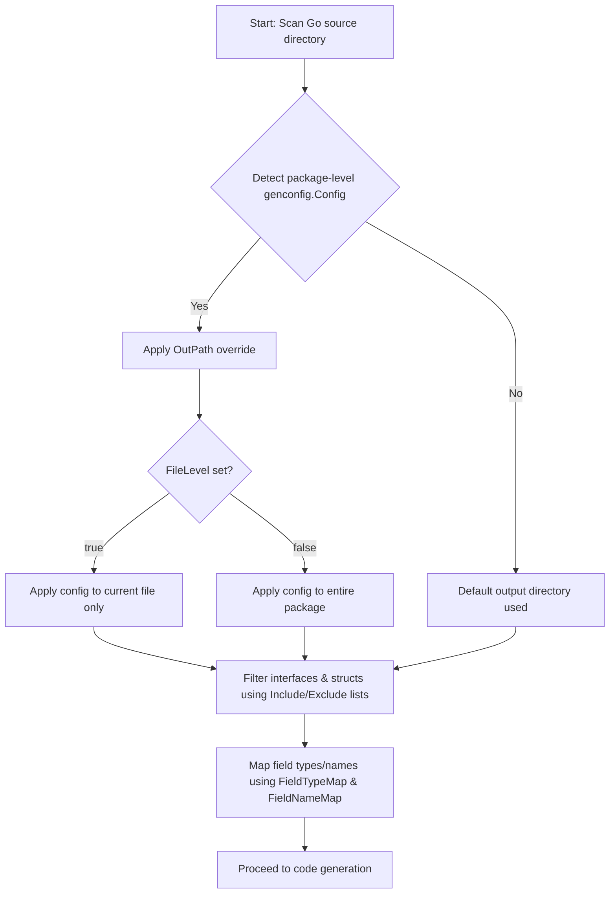

# Customization and Configuration in GORM CLI

GORM CLI empowers you to master the code generation process through flexible and powerful configuration options. This page guides you through configuring GORM CLI to tailor output paths, selectively include or exclude interfaces and structs, and apply precise field helper mappings. Whether you want to generate code only for specific interfaces or structs, or customize how particular Go types or struct tags map to generated helpers, this guide will help you optimize generation for your project's needs.

---

## Why Customize Generation?

By default, GORM CLI scans Go packages or files to generate type-safe query APIs from interfaces and model-driven helpers from structs. However, real-world projects often have multiple query interfaces, legacy code, or specialized field types requiring fine-grained control. Customization lets you:

- Restrict generation to only relevant interfaces or structs.
- Define output directories per package or file scope.
- Map custom or third-party Go types to specialized field helpers.
- Control generation scope down to file-level granularity for multi-package or nested projects.

Mastering configuration reduces noise, avoids generating unused code, and integrates seamlessly with your domain-specific models and queries.

---

## Understanding genconfig.Config

At the core of GORM CLI customization lies the `genconfig.Config` struct which you declare as a package-level variable in your Go source files. The generator automatically detects these per-package configurations and applies them during code generation.

Here is a distilled overview of the main configuration options:

| Configuration Option      | Purpose |
|--------------------------|---------|
| `OutPath`                | Override the output directory for generated code in the current package or file scope.
| `FieldTypeMap`           | Map a raw Go type (e.g., `sql.NullTime{}`) to a specialized field helper type (e.g., `field.Time{}`).
| `FieldNameMap`           | Map struct tag names (`gen:"json"`) to custom field helper instances.
| `FileLevel`              | When `true`, apply configuration only to the current file; otherwise apply to the entire package.
| `IncludeInterfaces`      | Whitelist of interfaces (by pattern or type literal) to generate; excludes all others.
| `ExcludeInterfaces`      | Blacklist of interfaces to skip after applying includes.
| `IncludeStructs`         | Whitelist of structs to generate; excludes all others.
| `ExcludeStructs`         | Blacklist of structs to skip after applying includes.

### Basic Example

```go
package examples

import (
    "database/sql"
    "gorm.io/cli/gorm/field"
    "gorm.io/cli/gorm/genconfig"
)

var _ = genconfig.Config{
    OutPath: "examples/output",
    FieldTypeMap: map[any]any{
        sql.NullTime{}: field.Time{},
    },
    FieldNameMap: map[string]any{
        "date": field.Time{},
        "json": JSON{},  // A custom JSON field helper defined in your project
    },
    IncludeInterfaces: []any{"Query*"},  // Generate only interfaces starting with "Query"
}
```

This example demonstrates overriding the output directory, mapping types and tags to helpers, and generating only interfaces matching the `Query*` pattern.

---

## Detailed Configuration Options

### Output Path Override (`OutPath`)

Use `OutPath` to direct generated files for the package (or file if `FileLevel` is true) to a specific directory.

- Helpful for organizing generated code separately from your source files.
- Can be set per package or per file for nested project directories.

Example:

```go
var _ = genconfig.Config{
    OutPath: "internal/generated", // generates output under internal/generated
}
```

### Field Type Mapping (`FieldTypeMap`)

Map raw Go types to specialized field helpers for filters, setters, and expression building.

- Key: A raw type instance, e.g., `sql.NullTime{}`.
- Value: A field helper instance, e.g., `field.Time{}`.

This allows GORM CLI to generate appropriate helpers for types not handled by default.

Example:

```go
FieldTypeMap: map[any]any{
    sql.NullTime{}: field.Time{},
},
```

### Field Name Mapping (`FieldNameMap`)

Map struct field tags (e.g., `gen:"json"`) to custom field helper types.

- Keys are tag names defined in your model struct.
- Values are field helper instances.

Use this to extend or override defaults, particularly for custom JSON or specialized types.

Example:

```go
FieldNameMap: map[string]any{
    "json": JSON{}, // Custom JSON helper with database-specific JSON operations
},
```

### File-Level Configuration (`FileLevel`)

When set to `true`, the configuration applies only to the file where declared, instead of the entire package.

- Allows fine-grained generation in multi-package or deeply nested structures.
- When `false`, it applies broadly to all files in the package.

Example:

```go
var _ = genconfig.Config{
    FileLevel: true, // apply only to this file
    OutPath: "nested/output",
}
```

### Include and Exclude Filters

#### IncludeInterfaces / IncludeStructs

Whitelist filters specifying exactly which interfaces or structs to generate.

- Takes precedence over exclude lists.
- Supports shell-style patterns (e.g., `Query*`, `Account*`).
- Also supports specifying type literals (e.g., `models.Query(nil)`, `models.User{}`).

Example:

```go
IncludeInterfaces: []any{"Query*", models.Query(nil)},
IncludeStructs:    []any{"User", "Account*", models.User{}},
```

#### ExcludeInterfaces / ExcludeStructs

Blacklist filters specifying interfaces or structs to skip after applying includes.

- Useful for removing deprecated or unwanted items.
- Also supports patterns and type literals.

Example:

```go
ExcludeInterfaces: []any{"*Deprecated*"},
ExcludeStructs:    []any{"*DTO"},
```

### Matching Logic and Priority

- If an Include list is non-empty for a kind (interfaces or structs), only those matching are generated; exclusion lists are ignored.
- If Include is empty, Exclude lists filter out matching items.
- Patterns are matched against package-qualified names.

---

## Real-World Configuration Examples

### Pattern-Based Inclusion

Generate only interfaces starting with `Query`:

```go
package pattern

import "gorm.io/cli/gorm/genconfig"

var _ = genconfig.Config{
    IncludeInterfaces: []any{"Query*"},
}
```

### Whitelist Example

Generate only specific interfaces (`I1`) and structs (`S1`):

```go
package whitelist

import (
    "gorm.io/cli/gorm/genconfig"
)

var _ = genconfig.Config{
    IncludeInterfaces: []any{"I1"},
    IncludeStructs:    []any{"S1"},
}
```

### File-Level Exclusion

Exclude interfaces `I3` and structs `S3` in a nested directory, applying only to the file:

```go
package nested

import "gorm.io/cli/gorm/genconfig"

var _ = genconfig.Config{
    FileLevel:         true,
    ExcludeInterfaces: []any{"I3"},
    ExcludeStructs:    []any{"S3"},
}
```

---

## Best Practices and Tips

- **Start with broad includes/excludes** to focus on your active query interfaces and models.
- Use **`FieldTypeMap` and `FieldNameMap`** to simplify queries on special types such as JSON or nullable time.
- Utilize **`FileLevel`** when generating in mixed or modular repositories with nested packages.
- Ensure **patterns and type literals match fully qualified names** for clarity (e.g., `models.User` vs `User`).
- Keep configuration **close to source code** (package files) so it's discoverable and versioned with code.

---

## Troubleshooting Common Configuration Issues

<AccordionGroup title="Common Problems & Solutions">
<Accordion title="Config Not Being Applied">
Make sure your package-level `genconfig.Config` variable is declared (e.g., `var _ = genconfig.Config{}`) and placed within the package that contains your interfaces or models. GORM CLI scans for this automatically.
</Accordion>
<Accordion title="Generate Unexpected Interfaces or Structs">
Check your include and exclude patterns for typos, case sensitivity, and ensure that include lists take precedence. Verify fully qualified names especially in multi-module projects.
</Accordion>
<Accordion title="Custom Field Helpers Not Generated Correctly">
Confirm your `FieldTypeMap` or `FieldNameMap` maps valid Go type instances to valid field helper instances. Look for import path conflicts or mismatches.
</Accordion>
<Accordion title="File level config not working as expected">
Ensure `FileLevel: true` is set in your config and the config variable is declared in the specific Go source file applying to your use case.
</Accordion>
</AccordionGroup>

---

## Summary Mermaid Diagram: Configuration Flow



---

## Further Reading

- [Configuration & Extensibility](/overview/features-and-workflows/configuring-generation): Dive into CLI configuration with practical examples.
- [Quickstart User Journey](/overview/features-and-workflows/quickstart-user-journey): See configuration in the context of a full workflow.
- [Generating Code](/getting-started/your-first-generation/running-the-generator): Learn how to invoke GORM CLI with your customized setup.
- [Working with Associations](/guides/advanced-patterns/working-with-associations): See field helpers and associations used in generated code.

---

Mastering the `genconfig.Config` structure unlocks the full potential of GORM CLI's code generation flexibility. By carefully controlling which models and queries are generated and how fields map to helpers, you create maintainable, efficient, and domain-tailored APIs seamlessly integrated into your Go projects.
