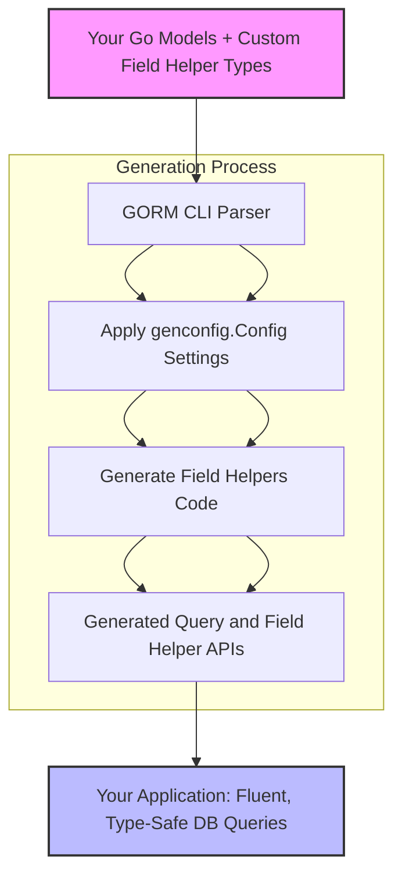

# Implementing Custom Field Helpers

Extending GORM CLI with custom field helpers enables you to tailor the generated code to accommodate specialized data types, complex domain-specific encodings, or database-specific query logic beyond the standard scalar and association helpers. This guide walks you through the design patterns, implementation steps, and common practices using a JSON field helper as a canonical example.

---

## Why Implement Custom Field Helpers?

While GORM CLI automatically generates type-safe field helpers for common Go types and standard database mappings, advanced projects often require handling custom field types such as:

- JSON or JSONB column types with dialect-specific SQL functions
- Time intervals, durations, or domain-specific temporal types
- Encrypted or encoded fields that require specialized SQL or application logic
- Complex nested structures with their own query semantics

Custom field helpers bring these capabilities into the generated API, preserving **compile-time safety**, **fluent query syntax**, and **dialect-aware SQL generation**.


## Conceptual Overview

Custom field helpers are Go types that embed or wrap a column reference and implement predicate and setter methods recognized by GORM CLI’s code generator. These helpers generate SQL expressions tailored to the field’s semantics and database dialect.

### Core Design Pattern

- Define a **struct** encapsulating metadata, typically the column name.
- Implement methods that return GORM-compatible SQL expressions or predicates.
- Provide a `WithColumn(name string)` constructor to associate the helper with a specific database column.
- Leverage GORM `clause.Expr` or `clause.Expression` interfaces to produce SQL with safely bound parameters.


## Example: JSON Field Helper Implementation

Using the JSON field helper from the provided example, we illustrate the core pattern:

```go
// JSON is a custom field helper for JSON database columns.
type JSON struct { column clause.Column }

// WithColumn returns a new JSON helper bound to the given column name.
func (j JSON) WithColumn(name string) JSON {
    c := j.column
    c.Name = name
    return JSON{column: c}
}

// Equal builds an expression comparing JSON path values differently by database dialect.
func (j JSON) Equal(path string, value any) clause.Expression {
    return jsonEqualExpr{col: j.column, path: path, val: value}
}

type jsonEqualExpr struct {
    col  clause.Column
    path string
    val  any
}

func (e jsonEqualExpr) Build(builder clause.Builder) {
    if stmt, ok := builder.(*gorm.Statement); ok {
        switch stmt.Dialector.Name() {
        case "mysql":
            v, _ := json.Marshal(e.val)
            clause.Expr{SQL: "JSON_EXTRACT(?, ?) = CAST(? AS JSON)", Vars: []any{e.col, e.path, string(v)}}.Build(builder)
        case "sqlite":
            clause.Expr{SQL: "json_valid(?) AND json_extract(?, ?) = ?", Vars: []any{e.col, e.col, e.path, e.val}}.Build(builder)
        default: // Postgres or others
            clause.Expr{SQL: "jsonb_extract_path_text(?, ?) = ?", Vars: []any{e.col, e.path[2:], e.val}}.Build(builder)
        }
    }
}
```

This helper:

- Encapsulates JSON path and expected value.
- Emits dialect-specific SQL using conditional logic.
- Supports safe parameter binding.
- Can be used seamlessly with generated query APIs.


## Integrating Your Custom Helper with GORM CLI

### 1. Define Helper Type and Methods

Create your custom field helper Go type and essential methods (`WithColumn`, predicates, setters) similar to the JSON example. Focus on returning **`clause.Expression`** for predicates.

### 2. Map the Custom Helper in `genconfig.Config`

To make GORM CLI use your field helper type in generated code, map your Go struct tags or Go types to your helper type in the `genconfig.Config` object.

```go
import "gorm.io/cli/gorm/genconfig"

var _ = genconfig.Config{
    FieldNameMap: map[string]any{
        "json": JSON{}, // tells generator to use JSON helper for fields tagged with `gen:"json"`
    },
}
```

### 3. Annotate Your Model Fields

Tag the relevant struct fields with the configured tag to trigger generation of your custom helper.

```go
// User model with custom JSON field
type User struct {
    // ... other fields ...
    Profile string `gen:"json"`
}
```

### 4. Generate Code

Run GORM CLI code generation as usual, and confirm your custom helper is generated for the annotated fields.

### 5. Use the Generated Helper in Queries

The generated helpers expose your predicate methods for fluent, type-safe DSL usage.

```go
// Query users with profile JSON containing vip=true
u, err := gorm.G[User](db).
    Where(generated.User.Profile.Equal("$.vip", true)).
    Take(ctx)
```


## Best Practices

- **Encapsulate Dialect Differences:** Embed dialect-specific SQL generation inside the `Build` method to isolate complexity.
- **Ensure Safe Parameter Binding:** Always use GORM’s `clause.Expr` with `Vars` to prevent SQL injection.
- **Provide Fluent API:** Design predicates and setters that feel natural with the generated field helpers.
- **Document Usage Clearly:** Provide usage examples, especially for complex custom expressions.
- **Test Extensively:** Write integration tests to confirm SQL generation and execution correctness across supported databases.


## Common Pitfalls

- Ignoring dialect-specific syntax can cause runtime failures.
- Missing `WithColumn` breaks integration with generated models.
- Returning raw SQL without parameters risks security issues and breaks GORM’s optimizations.
- Assuming generated code refresh without rerunning generator after changing config or helpers.


## Advanced Extensions

- **Supporting Complex Expressions:** Implement additional methods for JSON path existence, array containment, or full-text search.
- **Setter Support:** Add update-time helpers for setting JSON fields or other complex types.
- **Custom Scanners/Valuers:** Integrate with GORM’s `Scanner` and `Valuer` interfaces if field type requires custom Go-side marshalling.


---

## Learning Path & Further Reading

- Explore the [Custom JSON Fields guide](/guides/integration-and-examples/custom-json-fields) for extended examples.
- Review [Model-Driven Field Helpers concepts](/concepts/core-architecture/model-field-helpers) for foundational understanding.
- Consult the [Configuration & Extensibility documentation](/concepts/advanced-concepts/customization-and-config) for controlling generation.
- See [Using Generated APIs](/guides/core-workflows/using-generated-apis) for practical usage of your custom helpers.


---

<CardGroup cols={2}>
<Card title="Sample JSON Field Helper">
```go
type JSON struct {...}
func (j JSON) Equal(path string, value any) clause.Expression {...}
// Build() emits dialect-aware SQL
```
</Card>
<Card title="Example Configuration">
```go
var _ = genconfig.Config{
  FieldNameMap: map[string]any{"json": JSON{}},
}
```
</Card>
</CardGroup>


---

<Tip>
Extending GORM CLI with custom field helpers unlocks powerful, maintainable, and type-safe domain modeling – invest in clean, idiomatic helpers keyed to your database schema.
</Tip>

<Info>
Be sure to rerun the CLI generator after any changes to configuration or custom field helpers to keep generated APIs up to date.
</Info>


---

## Diagram: Custom Field Helper Integration Flow


```


---

## Troubleshooting

<AccordionGroup title="Common Issues Implementing Custom Field Helpers">
<Accordion title="Generated helper not appearing for my field">
- Verify your model's struct field has the correct `gen:"<tag>"`.
- Confirm your `genconfig.Config` mapping uses exactly the tag or Go type string.
- Check that the generator runs on the correct package/path and no filtering excludes your struct.
</Accordion>

<Accordion title="SQL syntax errors or runtime failures">
- Ensure the `Build` method produces valid SQL for all supported dialects.
- Use `clause.Expr` with properly bound variables.
- Test SQL snippets directly on your database.
</Accordion>

<Accordion title="Updates to helper code not reflected in generated APIs">
- Rerun `gorm gen` after code or config changes.
- Clear any cached/generated files if necessary.
- Confirm no conflicting multiple config files.
</Accordion>
</AccordionGroup>


---

# Next Steps

Once your custom field helper is implemented and integrated:

- Explore writing advanced SQL templates to leverage the custom helper predicates.
- Combine custom helpers with association helpers for rich domain models.
- Share your helpers as reusable packages or contribute upstream.


---

For detailed walk-throughs, see [Customizing Generation Configuration](/concepts/advanced-concepts/customization-and-config) and [Template-Based Query Generation](/guides/advanced-patterns/template-based-sql).


---

<Source url="https://github.com/go-gorm/cli" paths=[{"path":"examples/models/user.go","range":"1-60"},{"path":"examples/query.go","range":"1-57"},{"path":"examples/output/models_field_helpers_test.go","range":"1-317"}] />
