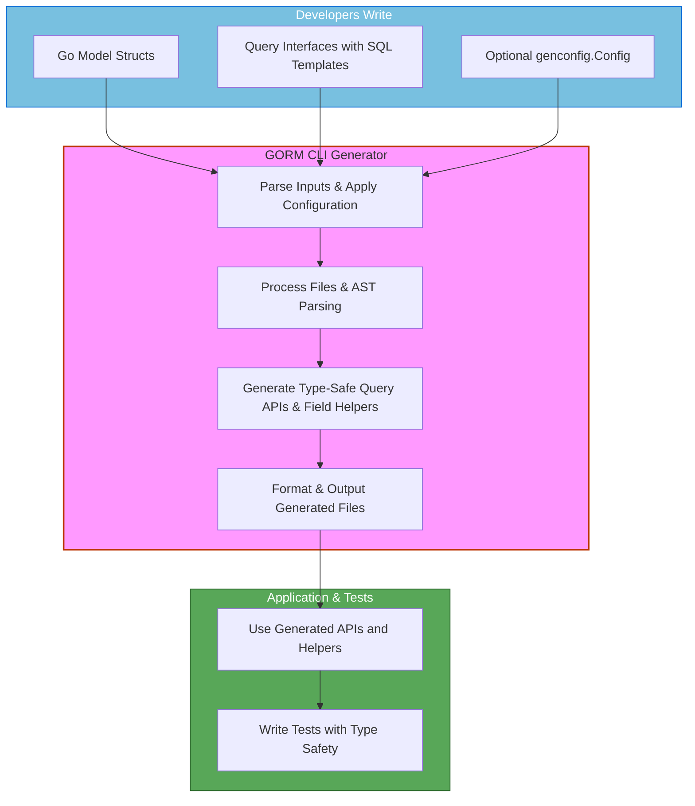

# Integration Patterns and Best Practices

GORM CLI bridges powerful type-safe code generation with familiar GORM ORM workflows, fitting naturally into your application’s architecture and Go build process. This guide unpacks how the generated code integrates with your existing models, query logic, and testing strategies, highlighting patterns that enhance maintainability, safety, and incremental adoption.

---

## Seamless Integration with GORM ORM

At the heart of GORM CLI is the generation of two complementary code layers:

- **Type-safe query APIs** generated from Go interfaces annotated with SQL templates.
- **Model-driven field helpers** derived from your Go structs representing database models.

These layers integrate fluidly with your existing `gorm.io/gorm` usage, providing a unified API that feels like native GORM but with the addition of:

- Compile-time checking of query parameters and method signatures.
- Discoverable, fluent field accessors, predicates, and setters.
- Strongly typed association helpers for managing relationships effortlessly.

### Typical Usage Flow

1. **Write Models and Query Interfaces**
   - Define your Go structs for database tables.
   - Create interfaces with SQL templated methods describing queries.

2. **Generate Code Using GORM CLI**
   - Run `gorm gen -i ./your-package -o ./generated`.
   - This produces typed APIs alongside field and association helpers.

3. **Invoke Generated APIs in Application Code**
   - Use the generated interfaces as drop-in, type-safe replacements or augmentations of direct GORM DB calls.
   - Leverage generated helpers for predicates, updates, and linked association operations.

### Example: Basic Query Usage

```go
user, err := generated.Query[models.User](db).GetByID(ctx, 123)
if err != nil {
    // Handle error
}

// Fluent filtering with helpers
activeUsers, err := generated.Query[models.User](db).
    FilterByNameAndAge("alice", 30).
    Find(ctx)
```

Here, `generated.Query[User]` wraps a GORM DB instance (`*gorm.DB`), adding methods generated from your SQL templated interfaces.

---

## Organizing Generated Code Within Your Project

GORM CLI respects your existing Go project structure and supports flexible output configurations:

- **Same package vs. separate package** — you can generate code alongside your models or isolate it in a distinct `generated` package depending on your project preferences.

- **Configuration via `genconfig.Config`** — control output paths, include or exclude specific structs or interfaces, and customize field helper mappings.

- **File-level vs. package-level config** — you can apply configs narrowly to individual files or broadly to entire packages.

### Best Practice: Incremental Adoption

Integrate GORM CLI gradually without disrupting your codebase:

- Start by generating APIs only for new or isolated modules by configuring `IncludeInterfaces` and `IncludeStructs`.
- Use the `OutPath` config setting to place generated code in a separate folder.
- Refactor existing queries to use generated interfaces step by step.
- Maintain coexistence of generated and manual code.

### Example Config Snippet

```go
var _ = genconfig.Config{
  OutPath: "./generated",
  IncludeInterfaces: []any{"Query*"},
  IncludeStructs: []any{"User", "Account"},
  FieldTypeMap: map[any]any{
    sql.NullTime{}: field.Time{},
  },
  FieldNameMap: map[string]any{
    "json": JSON{},
  },
}
```

---

## Testability Patterns

Type-safe generated APIs encourage robust testing practices:

- **Isolated interface testing:** Write unit tests against your query interfaces in isolation, mocking the `gorm.DB` instance if needed.

- **Consistent field usage:** Use generated field helpers for constructing predicates and setters to reduce manual errors.

- **Association operations:** Leverage association helpers in tests to verify CRUD operations on related models clearly.

### Testing Example

```go
func TestGetUserByID(t *testing.T) {
  db := setupTestDB() // your test db setup
  query := generated.Query[models.User](db)

  user, err := query.GetByID(context.Background(), 1)
  require.NoError(t, err)
  require.Equal(t, "Alice", user.Name)
}
```

This approach benefits from compile-time method signature checks and eliminates risks of SQL injection through templated generation.

---

## Code Organization and Readability

Generated code follows patterns that simplify navigation and maintenance:

- **Package layout** matches your input source layout, preserving relative paths.

- **Naming conventions** prepend underscore (`_`) to interfaces and group generated helpers clearly.

- **Structured output** supports reading generated models and query APIs as composable parts.

- **Generated comments** alert you to avoid editing generated files directly.

### Pattern: Clear Separation

Maintain a clear boundary between manually written business logic and generated boilerplate. This facilitates smooth regeneration cycles during development.

---

## Handling Complex Relationships with Association Helpers

GORM CLI generates association helpers reflecting your model relationships. These helpers streamline CRUD operations on linked data:

- **Add, update, unlink, delete associations with strong typing.**
- **Compose operations fluently in `Set()` invocations alongside parent creates or updates.**

### Example: Association Operations

```go
// Create user with pets
err := gorm.G[models.User](db).
    Set(
      generated.User.Name.Set("alice"),
      generated.User.Pets.Create(generated.Pet.Name.Set("fido")),
    ).
    Create(ctx)

// Update a user's pet where pet name="fido"
err = gorm.G[models.User](db).
    Where(generated.User.ID.Eq(1)).
    Set(
      generated.User.Pets.Where(generated.Pet.Name.Eq("fido")).
        Update(generated.Pet.Name.Set("rex")),
    ).
    Update(ctx)

// Unlink all pets from a user
err = gorm.G[models.User](db).
    Where(generated.User.ID.Eq(1)).
    Set(generated.User.Pets.Unlink()).
    Update(ctx)
```

Refer to [Working with Associations](/guides/advanced-patterns/working-with-associations) for in-depth context and additional examples.

---

## Incremental Adoption and Code Safety

Adopt GORM CLI in your projects confidently by:

- Generating code incrementally: start with a subset of structs or interfaces.
- Applying filtering rules (`Include*` / `Exclude*`) in config files.
- Avoiding regeneration overwriting critical manual changes - treat generated code as artifact.
- Encapsulating database access logic in wrappers around generated code.
- Integrating generated APIs in tests early to catch mismatches.

This strategy ensures safer migrations and gradual improvements without disruptive refactors.

---

## Common Pitfalls and How to Avoid Them

- **Mixing manual and generated code unguardedly:** Always separate generated code into designated packages or directories.
- **Omitting context parameter:** Generated code assumes `context.Context`, so ensure your interface methods consistently handle this.
- **Ignoring configuration filters:** If you find unexpected types generated or missing, review your `genconfig.Config` filters.
- **Regenerating without checking imports:** Conflicting imports can break formatting; keep an eye on `OutPath` and package layout.

---

## Integration Flow Diagram



---

## Next Steps

- Explore [Integration with GORM](/guides/integration-and-examples/integration-with-gorm) for detailed examples of using generated APIs.
- Learn about [Customizing Generation](/concepts/advanced-concepts/customization-and-config) to tailor outputs for your project.
- Master [Working With Associations](/guides/advanced-patterns/working-with-associations) to manipulate complex relational data safely.
- Review [Template-Based Queries](/guides/advanced-patterns/template-based-sql) for writing powerful, dynamic SQL templates.

---

<Tip>
Maximize safety and maintainability by organizing your generated code alongside your existing models and by using configuration filtering to control the scope of generation.
</Tip>

<Note>
Always treat the generated code as an artifact: do not edit directly. Regenerate when your models or query interfaces evolve.
</Note>

<Warning>
Avoid mixing different generation configurations in overlapping packages to prevent unpredictable output.
</Warning>

<Check>
Use the generated field helpers and association helpers consistently in your application code to reap the benefits of type safety and clear intent.
</Check>

---

## References

- [GORM CLI Overview & Installation](https://gorm.io/cli/gorm)
- [Defining Your Models and Query Interfaces](/getting-started/your-first-generation/writing-models-interfaces)
- [Running the Generator](/getting-started/your-first-generation/running-the-generator)
- [Using Generated APIs](/getting-started/your-first-generation/using-generated-apis)
- [Configuration and Extensibility](/overview/features-and-workflows/configuring-generation)
- [Working with Associations](/guides/advanced-patterns/working-with-associations)


---

For code examples, real-world scenarios, and integration walks, refer also to the `examples` directory in the [GORM CLI GitHub repository](https://github.com/go-gorm/cli).

---