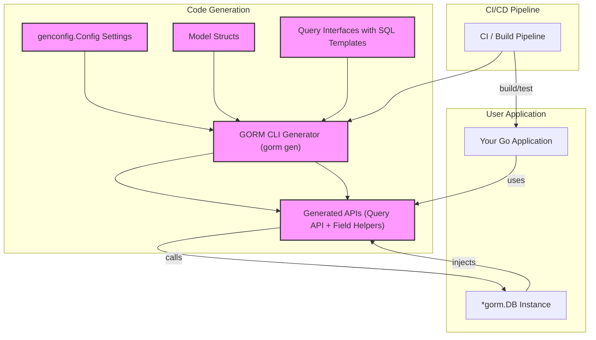

# Integration Patterns

Understanding where the GORM CLI-generated APIs fit within typical Go and GORM application architectures is crucial for maximizing their effectiveness and seamlessly integrating them into existing workflows. This guide explains common integration scenarios, multi-database project support, and how generated code can connect with widely used workflow tools and CI pipelines.

---

## Positioning Generated APIs in Go & GORM Applications

GORM CLI produces two key types of generated code:

- **Interface-driven, type-safe query APIs** generated from Go interfaces with embedded SQL templates.
- **Model-driven field helpers** generated from your model structs, providing strongly typed filters, updates, and association helpers.

Together, these generated APIs augment standard GORM usage by providing safer, discoverable, and more fluent data access layers.

### Seamless Integration With Existing Models

Generated code is designed to work side-by-side with your existing GORM models and `*gorm.DB` instances without intrusive changes:

- **Model structs remain unchanged** and continue serving as your single source of truth for schema and ORM mapping.
- **Generated query interfaces add specialized, type-safe methods layered atop your models.** These methods provide expressiveness and compile-time safety by leveraging SQL templates embedded in interface comments.
- **Field helpers enhance your model fields** with predicates for filtering and setters for updates that use GORM’s `clause` expressions internally.

#### Typical User Flow

<Steps>
<Step title="Define Models and Query Interfaces">
Write your Go structs defining the data schema as usual and add interfaces with SQL templates describing your queries and updates.
</Step>
<Step title="Run the GORM CLI Generator">
Execute the CLI to parse your interfaces and models, producing generated code with type-safe query API implementations and field helpers.
</Step>
<Step title="Use Generated APIs in Application Code">
Inject your `*gorm.DB` into the generated APIs, invoke typed methods for queries, filtering, updates, and association operations with confidence.
</Step>
<Step title="Leverage Fluent API for Complex Operations">
Use association helpers and composed predicates to express complex ORM operations in concise, safe code that integrates naturally with GORM chains.
</Step>
</Steps>

### Illustrative Example

```go
// Create a new user and associate a pet
err := gorm.G[User](db).
  Set(
    generated.User.Name.Set("alice"),
    generated.User.Pets.Create(generated.Pet.Name.Set("fido")),
  ).
  Create(ctx)

// Query user by ID with type-safe interface method
u, err := generated.Query[User](db).GetByID(ctx, 123)

// Update user with fluent predicates
err = gorm.G[User](db).
  Where(generated.User.Name.Eq("alice")).
  Set(generated.User.Age.Incr(1)).
  Update(ctx)
```

These patterns ensure that existing GORM models and DB objects remain reusable and compatible with generated APIs.

---

## Supporting Multi-Database and Modular Projects

In larger projects where multiple databases or service modules coexist, GORM CLI-generated code adapts smoothly to various architectural needs:

- **Multiple Output Paths:** Use the `genconfig.Config` `OutPath` to organize generated code into module or database-specific directories.

- **Interface and Struct Filtering:** Leverage `IncludeInterfaces`, `ExcludeInterfaces`, `IncludeStructs`, and `ExcludeStructs` filters in `genconfig.Config` to control what parts of your interfaces and models get code generated. This enables modular generation per database or service context.

- **Type & Field Mapping:** Customize type mappings in `FieldTypeMap` and field name mappings in `FieldNameMap` to handle database-specific types or extensions.

- **Platform Integration Example:** You might have separate packages for `userdb` and `ordersdb` with their own sets of models and interfaces, each with dedicated config to generate isolated, self-contained generated APIs.

### Integration Workflow for Multi-Database Projects

1. Define separate packages or directories for each database module.
2. Place interfaces and models per module.
3. Configure generation paths and filters in `genconfig.Config` for each module.
4. Run generation per module, producing isolated generated code.
5. Import and use generated APIs selectively in services connecting to those databases.

This promotes clean modular boundaries, clear code ownership, and less coupling.

---

## Connecting Generated APIs With Workflow and CI Pipelines

Harnessing the power of automation and continuous integration elevates the value of GORM CLI-generated code. Here’s how to integrate smoothly.

### Command-Line CLI Usage in Pipelines

- **Standardized CLI Invocation:** Run `gorm gen -i ./path/to/interfaces -o ./path/to/generated` as a CI step to regenerate APIs whenever interfaces or models change.

- **Configuration Management:** Commit your `genconfig.Config` within the code repository for consistent generation across environments.

- **Validation:** Include the generation step in your build pipeline before compilation to catch mismatches early.

### Best Practices for CI Integration

- **Version Pinning:** Use a fixed version of the CLI tool by specifying the version in `go install gorm.io/cli/gorm@<version>` to prevent unexpected API changes.

- **Pre-commit Hooks:** Automate generation in pre-commit hooks or pre-push checks for fresh generated code.

- **Differential Build:** Only regenerate affected code depending on changed interfaces to speed up CI.

- **Code Review:** Treat generated code as a reviewed artifact by checking diffs to ensure interfaces remain consistent.

### Example GitHub Actions Snippet

```yaml
steps:
  - uses: actions/checkout@v3
  - name: Install GORM CLI
    run: go install gorm.io/cli/gorm@latest
  - name: Generate GORM APIs
    run: gorm gen -i ./examples/query.go -o ./generated
  - name: Build
    run: go build ./...
```

---

## Practical Recommendations and Tips

- **Keep Interface & Model Packages Organized:** Put interfaces and models that belong together in the same package or directory to take advantage of relative generation and config inheritance.

- **Customize Generation Selectively:** Use `genconfig.Config` filters to avoid generating for deprecated or irrelevant interfaces to reduce noise.

- **Use Field Mapping for Complex Types:** Map custom Go types or database extensions to custom helpers to maintain fluent API designs.

- **Check Generated Code Regularly:** Incorporate generated code into your IDE workflow for code completion and early error detection.

- **Use Context Consistently:** Generated interfaces inject `context.Context` automatically for traceability and cancellations; ensure you pass it through your app layers.

- **Leverage Association Helpers:** Use generated association operations to simplify complex relationship management without writing raw SQL.

---

## Integration Overview Diagram



---

## Troubleshooting Common Integration Issues

<AccordionGroup title="Common Issues and Solutions">
<Accordion title="Generated Code Does Not Reflect Model Changes">
Update the generation by rerunning `gorm gen` against updated interfaces/models. Ensure your CLI version matches the one expected.
</Accordion>
<Accordion title="Conflicts in Multi-Module Projects">
Check `genconfig.Config` filters and output paths to ensure no overlapping file targets. Use file-level configs for strict scoping.
</Accordion>
<Accordion title="Runtime Type Mismatches or Unknown Field Errors">
Verify that all states of your models and interfaces are included in generation filters; ensure the correct packages are generated together.
</Accordion>
<Accordion title="Issues Using Generated Association Helpers">
Confirm association tags and support for your relationship types are compatible with GORM CLI expectations. See the Working with Associations guide.
</Accordion>
<Accordion title="CI Pipeline Code Generation Fails or Produces Unexpected Output">
Validate CLI installation step is correct and environment is consistent (Go version, module caching) on build agents.
</Accordion>
</AccordionGroup>

---

This intermediate integration guidance empowers you to embed GORM CLI-generated APIs naturally into your Go and GORM applications, scale to multi-database architectures, and streamline workflows within CI/CD pipelines with confidence and control.


---

**Explore Related Documentation:**

- [Defining Query Interfaces & Models](../getting-started/first-run-and-validation/defining-interfaces-models) for starting code definitions.
- [Generating & Using Type-Safe Query APIs](../guides/core-workflows/generating-and-using-query-apis) for applying generated APIs.
- [Configuration & Extensibility](../concepts/advanced-topics/configuration-extensibility) for advanced generation control.
- [Working with Associations & Relationships](../guides/advanced-patterns/working-with-associations) for relationship handling.

---