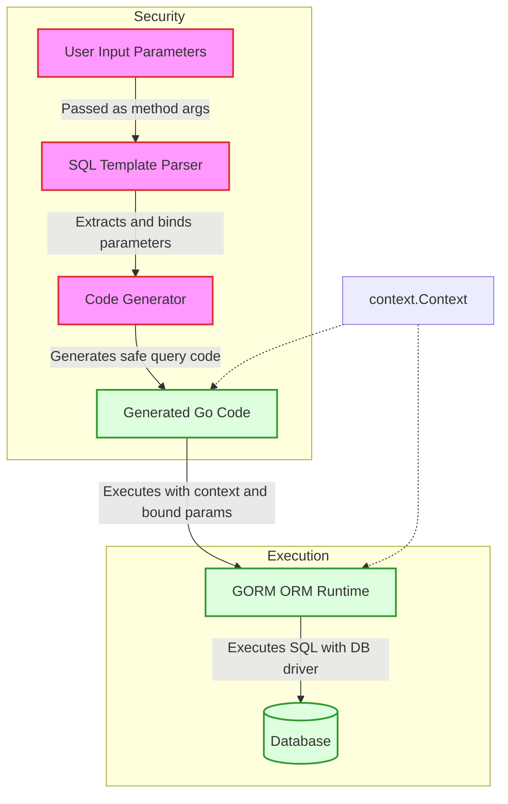

# Security and Performance Considerations

GORM CLI empowers Go developers to generate type-safe, ergonomic code that integrates seamlessly with `gorm.io/gorm`. As your application grows in schema complexity and user demand, understanding how the generated code maintains **security** and **performance** is crucial. This guide provides a conceptual overview of how GORM CLI-generated code guards against injection vulnerabilities, supports context propagation for cancellation and tracing, enforces robust permission boundaries, and scales efficiently with evolving data models.

---

## Safe Query Construction: The Heart of Security

At the core, GORM CLI models query methods as Go interfaces annotated with SQL templates that are **parsed and rendered to safe GORM API calls**. Instead of embedding parameters directly into SQL strings, the generated code uses:

- **Parameterized queries:** User input parameters are always passed separately to the driver, avoiding interpolation vulnerabilities.
- **Table and column placeholders:** Special placeholders like `@@table` and `@@column` are replaced programmatically
- **SQL template DSL:** Enables conditional clauses (`{{if}}`, `{{where}}`, `{{set}}`) that produce safe, well-structured SQL without string concatenation.

### How GORM CLI Prevents SQL Injection

1. **Parameter Binding Is Automatic and Type-Safe:**
   The generator takes all method parameters and converts them into bound variables (`?` placeholders).

2. **No String Concatenation of User Data:**
   Even dynamic WHERE clauses or SET clauses use internal builders with prepared statements.

3. **Controlled Template Syntax:**
   Templates operate over Go method parameters, disallowing arbitrary code injection.

4. **Safe Column/Table Resolution:**
   Dynamic table and column names resolve to `clause.Table` and `clause.Column` objects, ensuring valid identifiers.

<Note>
Always trust the generated APIs to sanitize SQL parameters properly. Avoid manually writing raw SQL strings inside templates or query code without parameter binding.
</Note>

## Context Propagation: Reliable Execution Control

All generated interface methods accept a `context.Context` argument — either explicitly defined or injected by the generator. This ensures:

- **Timeout management and cancellation:** Queries respect client cancellations or deadlines.
- **Tracing and logging propagation:** Distributed tracing spans and logs can be integrated downstream.

Providing context consistently aligns with Go best practices for database drivers and ORM usage.

<Check>
Use the generated API methods with valid `context.Context` values. Failure to propagate context risks resource leaks and untraceable database operations.
</Check>

## Maintaining Robust Permission Boundaries

While GORM CLI does not embed authorization logic directly, its type-safe APIs:

- Enable **clear separation** of query-building and execution layers,
- Aid in **expressing permission checks declaratively** in custom query interfaces,
- Help **prevent accidental injection of unauthorized data filters or updates** by avoiding raw SQL patching.

### Best Practices to Enforce Security Boundaries

- Add **authorization checks prior to calling generated query/update methods**.
- Use **custom SQL templates** in interfaces to declare explicit filters, e.g., `WHERE owner_id=@userID`.
- Leverage **input validation** to sanitize parameters before they enter query APIs.

<Warning>
Always avoid user input directly controlling dynamic table or column names, even via templates, unless strictly validated.
</Warning>

## Performance Considerations for Large Schemas and Operations

GORM CLI-generated code is designed to scale in both:

- **Code clarity and maintainability:** enabling large projects to manage numerous query interfaces and model helpers.
- **Runtime efficiency:** minimizing overhead.

### Key Performance Factors

1. **Minimal Reflection and No Runtime Parsing:**
   The generator analyzes ASTs at code generation time, producing static, efficient Go code. No parsing overhead exists at runtime.

2. **Efficient Use of String Builders and Parameter Slices:**
   Queries are assembled using `strings.Builder` and slice allocations sized precisely to parameters, reducing GC overhead.

3. **Context-Aware Query Execution:**
   Context cancellation and timeout afford prompt resource freeing.

4. **Association Helpers with Fluent APIs:**
   These allow batching and conditional filtering, reducing excess queries or updates.

### Managing Complex Queries

- Use **SQL template DSL directives** like `{{where}}` and `{{set}}` to dynamically include only needed clauses, avoiding full table scans.
- Utilize **batch operations** such as `CreateInBatch` and conditionally filtered association updates to optimize database round-trips.

<Info>
Performance bottlenecks typically arise from large parameter sets or inefficient template logic; simplify templates and use profiling tools when needed.
</Info>

## Troubleshooting Common Security and Performance Issues

### Symptoms and Resolutions

| Problem                         | Cause                                 | Resolution                                                         |
|--------------------------------|-------------------------------------|------------------------------------------------------------------|
| Unexpected SQL injection risk  | Unsafe raw SQL in templates or code | Refactor templates to use parameter binding; avoid raw concatenation |
| Context not respected          | Missing or incorrect context parameter | Verify all generated methods use `context.Context`; pass correct context at call site |
| Permission leaks               | Missing application-layer checks     | Add explicit filters and checks in interface methods or pre-query logic |
| Slow query generation          | Excessive string concatenations or complex DSL templates | Profile template logic; simplify conditionals; batch operations |

---

## Summary

GORM CLI-generated code strengthens your database access layer by:
- Ensuring **SQL injection safety** through rigorous parameterization
- Supporting **context propagation for timely cancellations and tracing**
- Encouraging **clear permission boundaries with declarative filters**
- Delivering **efficient, scalable query construction mechanisms** suitable for modern Go applications

By integrating these security and performance concepts into your development lifecycle, you empower safer, faster, and more maintainable data access workflows.

---

## Related Documentation

- [Core Concepts and Terminology](../overview/product-intro-concepts/core-concepts-terminology) — foundational ideas behind type-safe APIs and field helpers.
- [Generating & Using Type-Safe Query APIs](../../guides/core-workflows/generating-and-using-query-apis) — how to write interfaces and use generated APIs safely.
- [Template-Based SQL Generation](../concepts/advanced-topics/template-queries) — detailed guide on writing secure and flexible SQL templates.
- [Working with Associations & Relationships](../../guides/advanced-patterns/working-with-associations) — efficiently handling related data and batch operations.
- [Quick Validation Checklist](../../getting-started/troubleshooting-and-validation/quick-validation-steps) — confirm your setup supports secure, well-performing code generation.

---

## Visualizing Safe Query Generation Flow

This flow depicts how input parameters travel safely through parsing, code generation, and execution with context awareness.

---