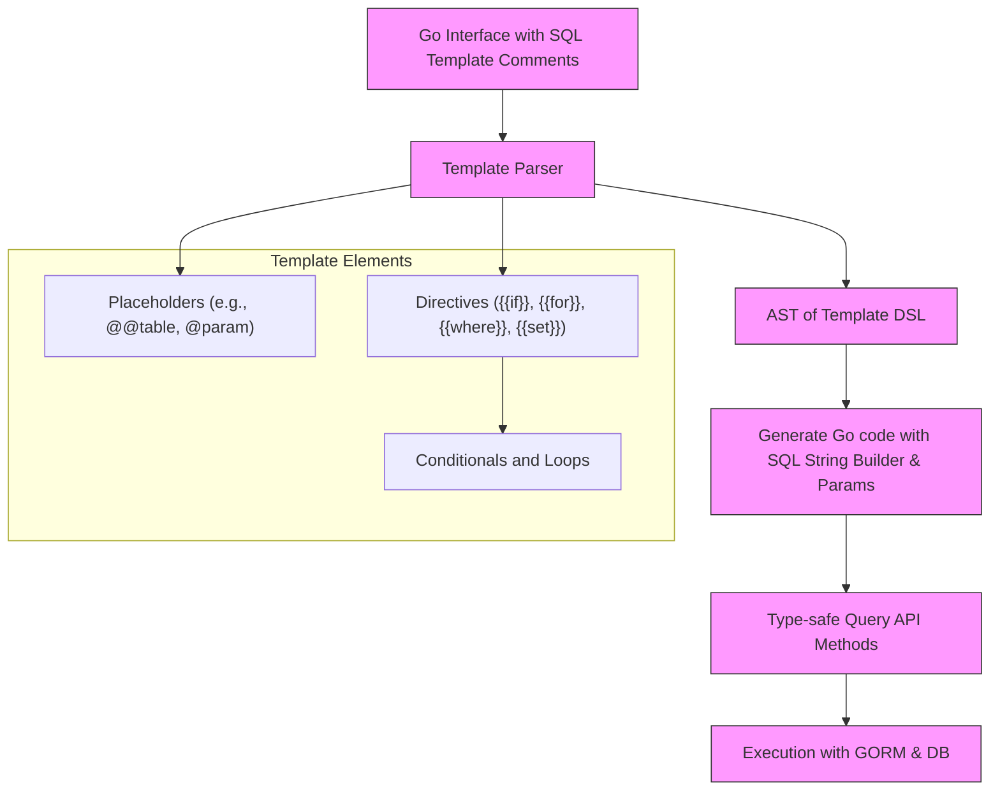

# Template-Based SQL Generation

Explore the powerful concept of SQL templates embedded within interface comments in GORM CLI. This feature lets you declare flexible, type-safe SQL queries using a mini domain-specific language (DSL) right inside Go interface method comments. Learn how to leverage supported directives, automatic parameter binding, and dynamic decision logic to generate safe, efficient SQL queries with minimal effort.

---

## Introduction to SQL Templates

GORM CLI enables you to write SQL queries as templates inside Go interface comments. These templates use special directives and placeholders to enable:

- **Automatic parameter binding:** Bind Go method parameters directly into SQL statements safely.
- **Dynamic SQL generation:** Use conditional logic, loops, and context-aware directives to build flexible queries.
- **Reusability & abstraction:** Interface methods define your SQL once, and the CLI generates type-safe, idiomatic Go query APIs.

This approach transforms raw SQL strings into maintainable, readable, and safe query definitions that integrate seamlessly with GORM.

### What Are SQL Templates?

SQL templates are raw SQL snippets enhanced with a lightweight DSL supporting:

- Placeholders like `@@table`, `@@column` for dynamic table and column resolution.
- Parameter markers like `@param` that safely bind Go values.
- Conditional blocks (`{{if}}`, `{{else}}`, `{{end}}`) for decision logic.
- Sections for building `WHERE` clauses and `SET` clauses dynamically via `{{where}}` and `{{set}}`.
- Iterative constructs (`{{for}}`) to support repeated SQL fragments.

All templates are written as method comment annotations on Go interfaces, making query definitions explicit and discoverable.

## Supported Directives and Placeholders

| Directive / Placeholder | Purpose                             | Explanation & Example                                             |
|-------------------------|-----------------------------------|------------------------------------------------------------------|
| `@@table`               | Inserts current model's table name| `SELECT * FROM @@table WHERE id=@id`                             |
| `@@column`              | Inserts a column name dynamically | `WHERE @@column=@value`                                          |
| `@param`                | Binds a Go method parameter safely| `WHERE name=@user.Name`                                          |
| `{{where}}`             | Conditional WHERE clause builder   | Wraps dynamic filters; trims leading/trailing `AND/OR`           |
| `{{set}}`               | Conditional SET clause builder     | Builds dynamic update statements; trims trailing commas          |
| `{{if}} ... {{else}}`   | Conditional logic                  | Controls blocks inclusion/exclusion based on runtime conditions  |
| `{{for}}`               | Iterates over slices or maps      | Supports dynamic repeated SQL fragments (e.g., multiple OR clauses) |

### Key Placeholders Explained

- `@@table`: Automatically replaced with the table name corresponding to the model type parameter `T`. This replaces hard-coded table names, ensuring consistency and flexibility.

- `@@column`: Allows you to dynamically insert any column name, useful for generic filtering where the column name is a parameter.

- `@param`: Binds a Go method parameter or nested struct field as a prepared statement parameter (`?`), preventing SQL injection and handling value conversions.

### Example:
```go
// SELECT * FROM @@table WHERE id=@id AND status=@status
GetByID(id int, status string) (T, error)
```

## How Parameter Binding Works

The generator analyzes your interface method signatures and automatically maps each parameter to the placeholders in the SQL template:
- Parameters referenced as `@name` or `@structField` are bound according to their names and types.
- Complex structs and slices can be referenced with field access or iteration using `{{for}}`.
- All parameters are safely bound using `?` placeholders behind the scenes to prevent SQL injection.

The generated Go code builds parameter lists and composes the final SQL string with bound parameters.

## Decision Logic and Conditional Constructs

GORM CLI extends Go template syntax with SQL-aware directives to enable dynamic query building:

- `{{if condition}} ... {{else}} ... {{end}}`: Conditionally include SQL fragments based on Go expressions (e.g., presence of a field, comparison).

- `{{where}} ... {{end}}`: Wrap zero or more conditions, automatically generating the `WHERE` keyword if any condition is present, and trimming leading/trailing conjunctions (`AND`, `OR`).

- `{{set}} ... {{end}}`: Build UPDATE SET clauses conditionally, trimming trailing commas and omitting empty sets.

- `{{for ...}} ... {{end}}`: Iterate over slices to dynamically generate repeated SQL fragments, such as multiple OR conditions.

### Practical Example:
```go
// SELECT * FROM @@table
// {{where}}
//   {{if user.ID > 0}}
//     id=@user.ID
//   {{else if user.Name != ""}}
//     name=@user.Name
//   {{end}}
// {{end}}
QueryWith(user models.User) (T, error)
```

This example selects all rows when no filter is given, or filters by id or by name.

## Template DSL Use in Interface Comments

Define SQL queries within the Go interface method comments to couple your query with its signature clearly and concisely:

```go
// Query interface with embedded SQL templates
//
type Query[T any] interface {
  // SELECT * FROM @@table WHERE id=@id
  GetByID(id int) (T, error)

  // UPDATE @@table
  // {{set}}
  //   {{if user.Name != ""}} name=@user.Name, {{end}}
  //   {{if user.Age > 0}} age=@user.Age, {{end}}
  // {{end}}
  // WHERE id=@id
  UpdateInfo(user models.User, id int) error
}
```

Generated code will transform these templates into fully parameterized, safe SQL queries with contextual parameter lists.

## Context and Parameter Management

- The generated methods automatically inject a `context.Context` as the first parameter in the implementation (if not explicitly present) to enable context propagation.

- Placeholders bind to the method parameters or nested struct fields directly, and the generator manages the ordered parameter list passed to the underlying GORM execution functions.

- Parameters are carefully mapped to `clause.Table`, `clause.Column`, or raw Go values depending on placeholder type (`@@table`, `@@column`, or `@param`).

## Common Use Cases and Examples

### 1. Basic Select with Dynamic Filter

```go
// SELECT * FROM @@table WHERE id=@id
GetByID(id int) (T, error)
```

### 2. Update with Dynamic Set Clause

```go
// UPDATE @@table
// {{set}}
//   {{if user.Name != ""}} name=@user.Name, {{end}}
//   {{if user.Age > 0}} age=@user.Age {{end}}
// {{end}}
// WHERE id=@id
UpdateInfo(user models.User, id int) error
```

### 3. Filtering with Multiple Dynamic Conditions

```go
// SELECT * FROM @@table
// {{where}}
//   {{for _, user := range users}}
//     {{if user.Name != "" && user.Age > 0}}
//       (name = @user.Name AND age = @user.Age) OR
//     {{end}}
//   {{end}}
// {{end}}
Filter(users []models.User) ([]T, error)
```

These examples demonstrate flexible, dynamic SQL generation with guaranteed type safety and parameter correctness.

## Best Practices and Tips

- **Use meaningful parameter names** matching your Go method signatures for straightforward placeholder mapping.

- **Employ `{{where}}` and `{{set}}` blocks** to avoid manual handling of SQL conjunction trimming.

- **Leverage `{{if}}` and `{{for}}`** to build concise, condition-aware queries that avoid empty or invalid SQL.

- **Escape literals carefully:** To insert a literal `@` inside SQL (not a parameter), escape as `\@` (double escape in the comment).

- **Avoid overly complex logic in templates:** Limit template logic to SQL construction; business logic or complex Go computations should occur before calling the generated API.

## Troubleshooting Common Template Issues

<AccordionGroup title="Common Issues with SQL Templates">
<Accordion title="Unmatched {{end}} or block errors">
Check that every `{{if}}`, `{{for}}`, `{{where}}`, or `{{set}}` directive has a corresponding `{{end}}`. Nested blocks must be properly closed to avoid parsing errors.
</Accordion>
<Accordion title="Parameters not bound or missing">
Ensure all `@param` placeholders correspond exactly to method parameters or struct fields passed into the method. Mismatches result in compile or runtime errors.
</Accordion>
<Accordion title="Incorrect trimming of AND/OR in WHERE">
Always wrap dynamic conditions inside `{{where}} ... {{end}}` to automatically trim leading or trailing conjunctions and avoid invalid SQL.
</Accordion>
<Accordion title="Literal @ signs being converted to parameter placeholders">
Escape any literal `@` signs by prefixing with a backslash `\@` inside the SQL comment to prevent accidental parameter substitution.
</Accordion>
</AccordionGroup>

## Behind the Scenes: How Template Rendering Works

- The CLI parses the method comments containing SQL templates.
- It tokenizes directives and placeholders, building an internal AST representing text chunks, conditional branches, loops, and function blocks (`where`/`set`).
- This AST is translated into Go code that builds the SQL string and parameter list using `strings.Builder` and `params` slice.
- Conditional and loop logic emits Go control structures, ensuring generated code matches intent.
- Placeholders are replaced with proper GORM `clause.Table`, `clause.Column`, or parameter bindings in an ordered manner.

This process guarantees your SQL templates are not only syntactically correct but also optimized and secure.

---

## Visualizing Template-Based SQL Generation



---

## Summary

Template-based SQL generation in GORM CLI transforms annotated Go interface comments into safe, flexible, and type-checked SQL query APIs. Users write expressive SQL snippets using special placeholders and DSL directives, enabling dynamic query construction with automatic parameter binding and context management. This approach streamlines complex queries, optimizes maintainability, and integrates seamlessly with GORM.

---

## See Also

- [Defining Query Interfaces & Models](https://docs.gorm.io/getting-started/first-run-and-validation/defining-interfaces-models) — Learn how to embed SQL templates in query interfaces alongside your model.
- [Generating & Using Type-Safe Query APIs](https://docs.gorm.io/guides/core-workflows/generating-and-using-query-apis) — Step through code generation and consume generated APIs.
- [Using Template SQL & DSL in Custom Queries](https://docs.gorm.io/guides/advanced-patterns/template-sql-dsl) — Deep dive into writing complex templates and directives.
- [Core Concepts and Terminology](https://docs.gorm.io/overview/product-intro-concepts/core-concepts-terminology) — Foundation concepts behind GORM CLI's query DSL.

---

## Additional Resources

- Official source: [gorm.io/cli/gorm Template SQL Generation](https://github.com/go-gorm/cli)
- Example query interface definitions: `examples/query.go`
- Template parsing internals: `internal/gen/sqlparser.go`
- Code generation entry point: `internal/gen/generator.go`

---

By mastering template-based SQL generation, you unlock concise, flexible, and safe query API development that dramatically improves productivity while reducing runtime errors and SQL injection risks.