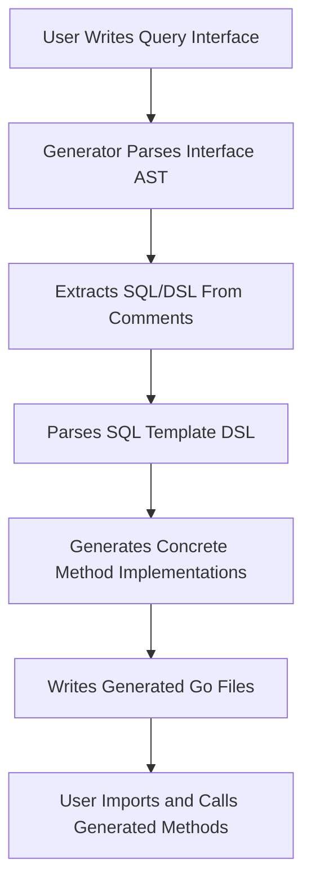

# Interface-to-SQL Generation Pattern

Explore how GORM CLI transforms Go interfaces—annotated with inline SQL templates—into fully implemented, type-safe query methods. This guide unpacks the pattern from interface definition through method binding and template interpretation to final generated code, empowering you to write expressive, maintainable database access layers with automated generation.

---

## Introduction

The core strength of GORM CLI lies in the Interface-to-SQL generation pattern: you declare abstract query interfaces in Go, embed SQL—or SQL templates—within method comments, and the CLI generates concrete, type-safe implementations. This pattern elevates your development workflow by turning documentation-like interface methods into executable code.

You focus on what you want to query and update, while GORM CLI handles method implementation details, SQL parameter handling, and integration with GORM’s ORM model.

## How It Works: From Interface to Implementation

1. **Define Interfaces with SQL Templates**
   Write query interfaces in Go. Each method includes an SQL snippet or template right in its comment.

   ```go
   type Query[T any] interface {
       // SELECT * FROM @@table WHERE id=@id
       GetByID(id int) (T, error)

       // UPDATE @@table
       //  {{set}}
       //    {{if user.Name != ""}} name=@user.Name, {{end}}
       //    {{if user.Age > 0}} age=@user.Age, {{end}}
       //  {{end}}
       // WHERE id=@id
       UpdateInfo(user User, id int) error
   }
   ```

2. **Annotate Methods with SQL or Template DSL**
   SQL templates support dynamic clauses like `{{where}}` and `{{set}}`, parameter bindings such as `@param`, and built-in dynamic variables like `@@table` referencing the model's table.

3. **Run the Generator Command**
   Use the CLI command:

   ```bash
   gorm gen -i ./path/to/interfaces -o ./path/to/generated
   ```

4. **Parsing & Extraction**
   The generator parses input Go files, extracting interfaces and their methods, reading method comments to extract raw SQL or template DSL.

5. **Template Processing & Code Generation**
   Embedded SQL templates are parsed into Go code that dynamically builds SQL strings with safe parameter binding.

6. **Output Concrete Type-Safe Code**
   For each interface, a struct implementing the methods is generated, adhering to the interface contract with correct method signatures and contextual parameters.

## Key Concepts

### Method Signatures and Context Injection

The generator auto-injects a `context.Context` parameter if absent, ensuring consistent method signatures with support for cancellation and deadlines.

```go
func (e _QueryImpl[T]) GetByID(ctx context.Context, id int) (T, error) { ... }
```

### SQL Template DSL Features

- `@@table` and `@@column` placeholders dynamically map to the underlying model’s table and columns.
- `@param` syntax binds Go method parameters safely into SQL statements.
- `{{where}}`, `{{set}}` enable conditional and dynamic SQL composition.
- Control structures (`{{if}}`, `{{else}}`, `{{for}}`) allow complex query customization inside comments.

### Generated Code Structure

- Each interface generates two types:
  - **`InterfaceNameInterface[T]`**: exposes the signatures including the generated methods.
  - **`InterfaceNameImpl[T]`**: the concrete implementation with method bodies.

- Implementations construct SQL with string builders and parameter slices, then execute queries via GORM’s `Raw` or `Exec` methods.

### Example Generated Method

```go
func (e _QueryUserImpl[T]) GetByID(ctx context.Context, id int) (T, error) {
    var sb strings.Builder
    params := make([]any, 0, 2)

    sb.WriteString("SELECT * FROM ? WHERE id=?")
    params = append(params, clause.Table{Name: clause.CurrentTable}, id)

    var result T
    err := e.Raw(sb.String(), params...).Scan(ctx, &result)
    return result, err
}
```

This structure safely binds parameters, replaces placeholders, and executes the query with context.

## Step-by-Step User Workflow

### Step 1: Create Query Interface with Templates

Define a Go interface for your query operations and embed SQL or DSL in method comments.

```go
// Select user by ID
// SELECT * FROM @@table WHERE id=@id
GetByID(id int) (T, error)
```

### Step 2: Run GORM CLI Generator

Invoke the CLI with the input directory of your interfaces to produce generated files.

```bash
gorm gen -i ./examples -o ./generated
```

### Step 3: Use Generated Code

Import generated package and invoke query methods with type-safe parameters.

```go
user, err := generated.Query[User](db).GetByID(ctx, 42)
```

### Step 4: Customize and Evolve

Update your interfaces or templates as needed; rerun generation to keep code in sync.

## Practical Tips & Best Practices

- Always name your interface methods clearly to reflect the database operation for better readability.
- Use the SQL Template DSL to avoid manual string concatenation and minimize SQL injection risks.
- Leverage config files (`genconfig.Config`) to control which interfaces or structs are included in generation and to customize output paths.
- Test generated code immediately with typical use cases to ensure SQL matches your database schema.

## Common Pitfalls and Troubleshooting

- **No return values or incorrect error handling:** Methods with `Raw` SQL templates must return at least one value with an error as the last return type.
- **Forgetting context parameter:** If omitted in the interface, the generator adds `ctx context.Context` automatically.
- **Template parsing errors:** Incorrect SQL template syntax leads to generation errors; validate templates carefully.
- **Missing include/exclude setup:** Without proper config, your interfaces or structs might be skipped.

For detailed troubleshooting, see the [Troubleshooting & Common Issues guide](../getting-started/first-steps/troubleshooting).

## Architecture Overview (Simplified Mermaid Diagram)



## Summary

The Interface-to-SQL generation pattern is the foundation of GORM CLI’s code generation magic. It translates your annotated Go interfaces into concrete, executable, and type-safe query APIs. Understanding this pattern lets you write clean interface declarations that the generator can easily transform into powerful database query tools that integrate seamlessly with GORM.

---

## See Also

- [Writing Models and Query Interfaces](../getting-started/first-steps/write-models-interfaces) — For best practices in struct and interface declaration.
- [Mastering the SQL Template DSL](../../guides/real-world-patterns/template-dsl) — Deep dive into writing flexible SQL templates.
- [Configuring Code Generation](../../guides/real-world-patterns/configuring-generation) — Customizing interface inclusion and output.
- [Testing and Using Generated Code](../getting-started/first-steps/validate-usage) — How to validate and invoke generated methods.
- [Troubleshooting & Common Issues](../getting-started/first-steps/troubleshooting) — Fix common errors during code generation and usage.

---

This page is part of the 'Concepts' section, closely related to other core interactive guides that help you master GORM CLI’s interface-driven code generation.


