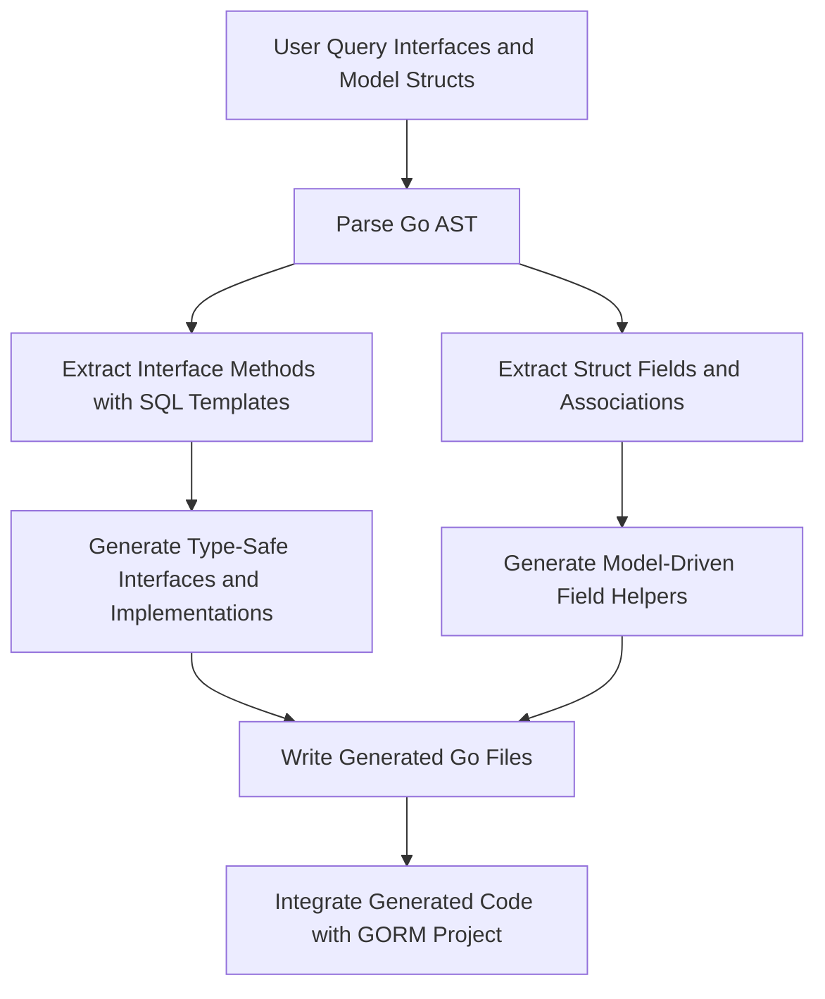

# Type-Safe APIs and Fluent Patterns

GORM CLI empowers Go developers by transforming pure Go domain interfaces and structs into fluent, discoverable, and type-safe APIs. This page explains how GORM CLI generates these APIs, details the design choices that optimize developer productivity, and highlights practical patterns and trade-offs embedded in this transformation. Understanding these core concepts will enable you to write cleaner, safer data access layers with greater confidence.

---

## The Essence of Type-Safe APIs

At its core, GORM CLI reads your **user-defined Go query interfaces** annotated with SQL templates and your **domain model structs** to automatically generate concrete Go types and methods. These generated artifacts offer:

- **Compile-time safety:** Method signatures and query parameters are strictly typed by Go’s type system to prevent a large class of runtime SQL errors.
- **Fluent, discoverable APIs:** Generated methods chain seamlessly for composing queries and mutations, making usage intuitive and concise.
- **Separation of concerns:** SQL query logic lives in annotated interfaces while your domain models remain plain Go structs.

This approach aligns perfectly with Go’s idiomatic practices, leveraging static typing and generics to yield code that is both powerful and maintainable.

---

## Transformation Workflow: From Interfaces to Generated Code

GORM CLI’s generator parses your query interfaces and model structs, extracting:

- **Interface methods with SQL templates:** GORM CLI interprets method-level comments as annotated SQL statements or DSL templates, using them as blueprints to generate method implementations.
- **Method parameters and return types:** Analyzed to ensure correct signatures with automatic insertion of `context.Context` where missing.
- **Models' fields and associations:** To generate corresponding model-driven *field helpers* that assist in type-safe filtering, updating, ordering, and association management.

The output consists of:

- A generated interface with the original methods, now strongly typed and ready for direct use.
- A corresponding struct implementing that interface, wrapping GORM’s core generic interfaces.
- Model field helper variables and types that enable expressive query conditions.

### Example of Generated Code Style

```go
// Example generated from interface `Query[T any]`
func Query[T any](db *gorm.DB, opts ...clause.Expression) _QueryInterface[T] {
    return _QueryImpl[T]{
        Interface: gorm.G[T](db, opts...),
    }
}

type _QueryInterface[T any] interface {
    gorm.Interface[T]
    GetByID(ctx context.Context, id int) (T, error)
    FilterByNameAndAge(ctx context.Context, name string, age int) _QueryInterface[T]
}

type _QueryImpl[T any] struct {
    gorm.Interface[T]
}

func (e _QueryImpl[T]) GetByID(ctx context.Context, id int) (T, error) {
    // method body invoking raw SQL with parameters
}

func (e _QueryImpl[T]) FilterByNameAndAge(ctx context.Context, name string, age int) _QueryInterface[T] {
    // chaining method body for fluent query composition
    return e
}
```

This style enforces type safety, fluent chaining, and separation of query definition from execution.

---

## Fluent Patterns Explained

### 1. **Method Chaining for Query Building**

Most methods that extend or filter queries return the same interface: this allows chaining filters and conditions seamlessly before executing the query.

Example:

```go
users, err := generated.Query[User](db).
    FilterByNameAndAge(ctx, "alice", 30).
    Where(ctx, generated.User.IsAdult.Eq(true)).
    Find(ctx)
```

### 2. **Context Injection**

If you omit the `ctx context.Context` parameter in your interface, the generator automatically injects it into method signatures ensuring context-awareness for database operations.

### 3. **SQL Template Embedding & Dynamic Conditions**

The SQL template language allows embedding dynamic `WHERE`, `SET`, and conditional logic via `{{where}}`, `{{set}}`, and Go-like `{{if}}/{{for}}` blocks. This allows:
- Expressive, parameterized SQL that adapts at runtime
- Compile-time checked parameter binding

### 4. **Return Types and Error Handling**

Methods that execute raw queries return data and errors explicitly. Methods designed for query chaining return the interface itself to allow continued chaining.

Best practice enforced by the generator:
- Query methods return `(T, error)` or `([]T, error)`.
- Chainable filters return the interface type.

---

## Model-Driven Field Helpers: Bridging Models to Queries

GORM CLI generates specialized, type-safe field helper variables and types for all your model fields and associations.

### Field Types:
- **Basic fields:** Typed as appropriate helpers (`field.String`, `field.Number[int]`, `field.Time`, etc.) based on underlying Go types.
- **Associations:** Generated as `field.Struct[T]` for single relations and `field.Slice[T]` for collections.

### Typical Usage

```go
// Filters
generated.User.Name.Eq("alice")               // name = 'alice'
generated.User.Age.Between(18, 65)              // age BETWEEN 18 AND 65

gorm.G[User](db).
    Where(generated.User.Name.Like("%jinzhu%"),
          generated.User.IsAdult.Eq(true)).
    Find(ctx)
```

Field helpers also support updates, expressions, and zero-value fields with well-defined semantics.

### Association Methods

Support for create, update, unlink, delete, and batch create operations on related entities via generated helpers allows sophisticated, type-safe association management.

---

## Design Rationale and Trade-Offs

| Aspect                    | Benefit                                                       | Trade-Off                                                |
|---------------------------|--------------------------------------------------------------|----------------------------------------------------------|
| Strongly typed interfaces | Catch errors at compile time, improve IDE discoverability    | Requires clear pre-definition of interface and models   |
| SQL Template DSL           | Flexible, dynamic query construction with type safety        | Learning curve for template syntax                       |
| Generated chaining methods | Fluent, expressive query building                            | More boilerplate code, but automated by generator       |
| Context auto-injection     | Ensures consistent context use                               | Implicit context injection can confuse beginners        |
| Association helpers        | Clean, consistent association CRUD semantics                 | Slight complexity learning curve for various assoc types|

The decisions prioritize developer experience, safety, and maintainability over minimalism.

---

## Practical Tips to Maximize Value

- **Define clear Go interfaces**: Keep your query interfaces focused and annotate with expressive SQL templates.
- **Leverage chaining**: Compose expressive queries via chaining for clarity and modularity.
- **Use model field helpers consistently**: Simplifies predicates and updates with compile-time guarantees.
- **Employ configuration wisely**: Adjust field mappings and inclusion rules via `genconfig.Config` to align with your codebase naming and types.

---

## Troubleshooting Common Issues

<Accordion title="Method Return Value Errors">
Sometimes method signatures without error as last return or improper return counts cause generation failures.
- Ensure query methods returning data always have `error` as last return value.
- Chainable methods should return the interface type.
</Accordion>

<Accordion title="Unexpected Context Parameters">
If your interface method is designed without `context.Context`, the generator injects it automatically.
- This is expected behavior and enhances context propagation.
- Explicitly include `ctx context.Context` if you want to control position.
</Accordion>

<Accordion title="SQL Template Parsing Failures">
Malformed template syntax in comments causes parsing errors.
- Validate templates carefully.
- Use reference examples from the Quick Start and Template DSL documentation.
</Accordion>

---

## Visual Representation of API Generation Flow



---

## Next Steps

- Explore **Defining Models and Query Interfaces** to craft effective inputs.
- Use **Running the Code Generator** to produce your first APIs.
- Dive into **Using Model-Driven Field Helpers** for fluent and safe queries.
- Expand with **Working with Associations** and **Template SQL DSL** for advanced capabilities.

Harness GORM CLI’s type-safe API generation to elevate your Go data access layer from fragile SQL strings to robust, fluently typed constructs.

---

## Related Documentation

- [System Overview & Data Flow](../overview/architecture_concepts/system_overview_diagram)
- [Core Concepts & Terminology](../overview/architecture_concepts/core_concepts)
- [Defining Models and Query Interfaces](../../getting-started/first-code-generation/defining-models-and-interfaces)
- [Running the Code Generator](../../getting-started/first-code-generation/running-gorm-cli-gen)
- [Using Model-Driven Field Helpers](../../guides/core-workflows/field-helper-generation)

---

## Summary
This page clarified how GORM CLI automatically produces type-safe query interfaces and fluent APIs by transforming annotated Go interfaces and model structs. It outlined the generated method patterns, context handling, chaining strategies, and model-driven field helper semantics. With practical usage tips, trade-offs, troubleshooting guidance, and a flow diagram, this guide equips users to unlock safer, cleaner, and more maintainable data access code.

---

# Glossary

| Term                  | Description                                             |
| --------------------- | -------------------------------------------------------|
| Type-Safe API         | Generated Go interfaces with strict typing enforcing method signatures and parameter types.
| Fluent API            | Method chaining pattern that allows expressive, sequential query building.
| Field Helpers         | Generated variables and types that assist in building predicates, updates, and association operations.
| Template SQL DSL      | Embedded templating language within Go comments to build dynamic SQL.
| Chainable Method      | A method that returns the same interface type to enable chaining.

---

# Frequently Asked Questions

<AccordionGroup title="FAQs">
<Accordion title="Why does GORM CLI inject context.Context parameter automatically?">
Auto-injecting context ensures that all generated methods support cancellation, deadlines, and tracing by default, conforming to Go best practices for database operations.
</Accordion>
<Accordion title="Can I customize the generated APIs?">
Yes. You can define `genconfig.Config` variables in your package to customize output paths, field mappings, inclusions, and exclusions for interfaces and structs.
</Accordion>
<Accordion title="What happens if my interface method has no return values?">
Methods without return values are considered chainable if they have no raw SQL. If a method has SQL that returns rows, it must return at least a value and error.
</Accordion>
</AccordionGroup>