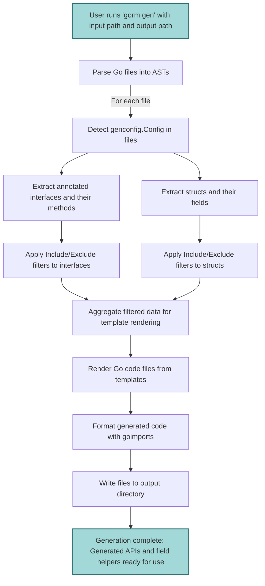

# Code Generation Workflow

Unlock the full power of GORM CLI by understanding how it translates your Go interfaces and model structs into robust, type-safe query APIs and field helpers. This guide walks you through the end-to-end generation process, highlighting the roles of configuration files, template rendering, and generator modules to deliver ready-to-use code crafted specifically for your data models.

---

## Introduction

At its core, GORM CLI automates the conversion of annotated Go source files into fluent, compile-time safe APIs that streamline database interactions. This workflow intricately combines parsing user-defined interfaces with SQL templates, interpreting model structs, applying user-defined generation configurations, and finally generating Go code using carefully crafted templates.

Understanding this workflow empowers you to customize, extend, and troubleshoot the generation process to suit complex project needs.

---

## High-Level Workflow Overview

The generation process follows these stages, each contributing to the final output of generated APIs and helpers:

1. **Input Processing:** CLI accepts paths to Go files or directories containing your interfaces and models.
2. **AST Parsing:** Each input file is parsed into an abstract syntax tree (AST) to analyze code structure.
3. **Configuration Application:** Any `genconfig.Config` found within files influences generation scope and customization.
4. **Interface and Struct Extraction:** Interfaces with SQL annotations and model structs are extracted and parsed.
5. **Filtering:** Based on include/exclude rules, relevant interfaces and structs are selected.
6. **Code Generation:** The parsed data is passed to templates rendering Go source files.
7. **Output Writing:** Generated files are written to the specified output directory, formatted and ready for use.

---

## User Journey Through the Generation Process

Imagine you're a developer eager to build type-safe query APIs and field helpers for your Go models. Here's how GORM CLI enables this journey:

### 1. You organize your project with Go interfaces containing SQL templates and model structs representing your database entities.

### 2. You optionally create or adjust a generation configuration (`genconfig.Config`) in your package to customize output paths, field mappings, or generation scopes.

### 3. Running `gorm gen` with your input path triggers the generation engine to scan and parse relevant source files, respect your configs, and interpret your code.

### 4. The generator extracts all documented SQL queries defined in interface method comments and maps model fields to strongly typed field helpers.

### 5. Interfaces and structs that don’t match your include/exclude filters are ignored, keeping output targeted and relevant.

### 6. Finally, the templates produce robust, readable Go code with generated methods and helper structs, in a directory you control.

### 7. You seamlessly import and use the generated APIs in your application code, benefiting from compile-time validation and fluent query construction.

---

## Deep Dive: Core Components in the Workflow

### Input Handling and Parsing
- The tool accepts a single Go file or directory.
- Uses Go's `parser.ParseFile` to transform source files into ASTs, enabling detailed code analysis.
- Recursively processes directories maintaining package structure for output organization.

### Configuration Detection and Application
- Looks for `genconfig.Config` composite literals within files.
- Configuration can:
  - Override the output folder.
  - Map Go field types or struct tags to specific field helper types.
  - Whitelist or blacklist interfaces and structs by patterns or type literals.
  - Apply at file-level or package-level scope.
- Multiple configurations combine when nested, respecting priority and scope.

### Interface Extraction and SQL Parsing
- Parses each interface's methods along with their documented SQL queries or templates.
- Ensures methods respect signature rules: return values must include error, and optionally a data type.
- Supports the advanced SQL template DSL that allows conditionals, loops, and dynamic placeholders.

### Struct Parsing and Field Helper Mapping
- Processes exported struct fields, respecting embedded structs and anonymous fields.
- Uses configuration mappings and built-in heuristics to decide field helper types (e.g., `field.String`, `field.Number[int]`, `field.Struct[T]`).
- Handles association fields distinctly for relational mapping.

### Filtering by Configuration Rules
- Inclusion/Exclusion applies to interfaces and structs based on patterns or explicit type matches.
- Supports shell-style patterns (e.g., `Query*`, `Account*`) and type-literal forms (`models.User{}`).
- Ensures only relevant code is generated, improving build time and output clarity.

### Template Rendering and File Output
- Uses a comprehensive template (`internal/gen/template.go`) that stitches generated code:
  - Includes generated type-safe interfaces and implementations for queries.
  - Provides strongly typed field helper structs for models.
  - Organizes imports and package declarations dynamically.
- Outputs files preserving the input directory structure under the target output path.
- Runs `goimports` to ensure formatting and import correctness.

---

## Practical Tips for Effective Generation

- **Maintain clear and consistent SQL annotations in your interface methods** to leverage the full expressiveness of the SQL template DSL.
- **Use `genconfig.Config` thoughtfully** to map custom field types (e.g., JSON) and filter interfaces or structs to keep your generated code concise.
- **Structure your project directory with clear separation between models and query interfaces** to help the generator interpret code efficiently.
- **Regularly verify generated outputs after changes** to your interfaces or structs, ensuring expectations match generated code.

<Check>
Consistently running `gorm gen` and reviewing generated files avoids surprises and helps detect issues early in your development cycle.
</Check>

---

## Common Pitfalls and Troubleshooting

<Warning>
- **Missing `error` return in interface methods:** GORM CLI enforces error return values for safety. Ensure all query methods return `error` as last value.
- **Mismatches in include/exclude patterns:** Carefully verify your filter patterns in configs to avoid unintentionally skipping relevant interfaces or structs.
- **Incorrect struct field tags or unexported fields:** Only exported fields are processed. Use appropriate Go naming and struct tags to guide generation.
- **Running generation without specifying input:** The `--input` flag is mandatory; omission leads to a failure.
</Warning>

If you encounter generation errors, enable debug logs or consult the troubleshooting guides for environment setup and input correctness.

---

## Illustrative Mermaid.js Diagram

---

## Summary

This Code Generation Workflow equips you with a detailed understanding of how GORM CLI transforms your typed interfaces and model structs into comprehensive, safe, and fluent database query APIs. Mastery of this workflow ensures you can harness configuration options, write expressive SQL templates, and optimize generation output.

---

## Next Steps

- Explore [Quickstart: Your First Workflow](/overview/architecture-and-concepts/quickstart-workflow) for hands-on introduction.
- Deepen insight with [Core Concepts & Terminology](/overview/architecture-and-concepts/core-concepts-terminology) for foundational knowledge.
- Customize your code generation with [Configuring Generation](/guides/advanced-patterns-customization/configuring-codegen).
- Implement your first custom queries using [SQL Template DSL](/guides/advanced-patterns-customization/sql-template-dsl).

---

## Related Documentation

- [Installing the GORM CLI](/getting_started/installation_prerequisites/installing_cli)
- [Your First Code Generation](/getting_started/first_code_generation/generating_code)
- [Using the Generated APIs](/guides/getting-started-workflows/using-generated-apis)

#