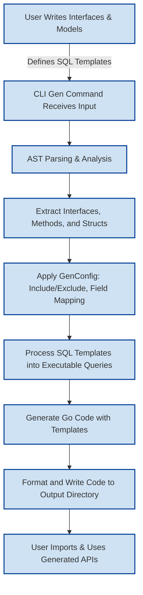

# How GORM CLI Works

GORM CLI empowers Go developers to transform concise interface definitions and model structs into fully-generated, type-safe, and fluent database access code. This guide provides a clear overview of the entire CLI code generation process — from analyzing source Go interfaces annotated with SQL templates to producing rich query APIs and field helpers — all orchestrated seamlessly by the CLI.

---

## Core Workflow: From Source to Generated Code

At its heart, the GORM CLI tool reads your input Go files or directories containing **query interfaces** and **model definitions**, analyzes them using Go's Abstract Syntax Tree (AST), then generates idiomatic Go code that wraps your raw SQL annotations into discoverable, type-safe APIs.

### The User Journey

1. **Define interfaces with SQL Templates:** Write interfaces in Go, annotating methods with SQL snippets in comments. This declarative style lets you express database queries and updates with placeholder-driven templates.

2. **Create model structs:** Define your data models as Go structs, optionally using struct tags and generics-aware patterns.

3. **Run the CLI:** Using `gorm gen -i <input> -o <output>`, invoke the CLI to process input files.

4. **Automatic code generation:** The tool parses your Go files, extracts interfaces and structs, processes SQL templates, applies configuration, and writes formatted code to the output directory.

5. **Use generated APIs:** Your application imports the generated code and harnesses type-safe methods with fluent chaining for querying, filtering, creating, updating, and managing associations.

---

## Step-by-Step Execution Details

### 1. CLI Entry Point

- The executable entrypoint (`main.go`) uses Cobra to define the root `gorm` command with a subcommand `gen`.
- `gen` accepts flags such as `-i` (input path to interfaces/models) and `-o` (output directory).
- The user runs a command similar to:

  ```bash
  gorm gen -i ./examples -o ./generated
  ```

### 2. Processing Input Files

- The generator determines if the input is a directory or a single file.
- For directories, it recursively walks files, parsing each Go file into an AST.
- It skips generated files to avoid cyclical processing.

### 3. AST Analysis and Metadata Extraction

- For each parsed file, it extracts:
  - The package name and import paths for correct code generation.
  - Interfaces and their methods, capturing method signatures along with embedded SQL templates extracted from method comments.
  - Structs and their fields, along with tags and type information.
  - Configuration overrides via package-level variables (e.g., `genconfig.Config`), supporting output path overrides, inclusion/exclusion filters, and custom field mappings.

### 4. Transforming Method SQL Templates

- SQL annotations support directives like `@@table`, `@param`, `{{where}}`, `{{set}}`, `{{if}}`, and iteration with `{{for}}` to express dynamic, type-safe queries.
- The generator translates these templates into Go code that builds SQL statements, automatically binding method parameters as query arguments.

### 5. Mapping Field Types to Field Helpers

- Using a comprehensive mapping strategy, Go types in structs are mapped to appropriate field helper types (e.g., `string` to `field.String`, `int` to `field.Number[int]`, slices to collection helpers).
- This ensures fluent API operations for filtering, ordering, and updates on known field types.
- Users can customize mappings via `genconfig.Config` for specialized types (e.g., JSON fields).

### 6. Applying Inclusion/Exclusion and Configuration

- The generator applies configured filters to decide exactly which interfaces and structs produce code.
- It supports both package-level and file-level configurations for granular control.

### 7. Code Generation and Formatting

- Using Go's standard `text/template` engine combined with custom template functions, the generator outputs Go source files reflecting the interfaces and structs.
- Generated code includes:
  - Interfaces: Fluent querying interfaces with type-safe method signatures.
  - Implementations: Concrete struct types implementing those interfaces.
  - Field helpers: Generated constants and structs to help compose queries.
- Generated files are organized respecting the source directory structure and configured output paths.
- The code is automatically formatted using the `goimports` tool to enforce idiomatic standards.

---

## Practical Example: From Interface to Client Code

### Interface Definition

```go
// Query defines a user query interface with SQL templates.
type Query[T any] interface {
  // SELECT * FROM @@table WHERE id=@id
  GetByID(id int) (T, error)

  // where("name=@name AND age=@age")
  FilterByNameAndAge(name string, age int)
}
```

### CLI Invocation

```bash
gorm gen -i ./examples -o ./generated
```

### Generated Code Usage

```go
// Query[User](db).GetByID(ctx, 123) executes a typed-safe query by ID
user, err := generated.Query[User](db).GetByID(ctx, 123)

// Filter users by name and age
users, err := generated.Query[User](db).FilterByNameAndAge("jinzhu", 25).Find(ctx)
```

---

## Key Components and Their Responsibilities

| Component            | Responsibility                                                 |
|----------------------|----------------------------------------------------------------|
| `main.go`            | CLI entry point, parses commands and directs to `gen`         |
| `gen.go`             | Implements Cobra command `gen`, parses flags                   |
| `generator.go`       | Core AST parsing and code generation logic                      |
| `template.go`        | Templates defining output Go code structures                    |
| SQL Template DSL     | Embedded SQL parsing and parameter binding                      |
| Configuration (`genconfig.Config`) | Controls generation options, field mappings, inclusion/exclusion |

---

## Best Practices and Tips

- **Always annotate your interfaces with clear SQL templates** to leverage compile-time safety and auto-binding.
- **Structure your input code neatly** — place query interfaces and models in consistent packages/directories for cleaner output.
- **Use configuration overrides** in the same package to control output paths or map custom field types.
- **Validate generated code** frequently after generation to catch any template errors early.
- **Leverage the generated fluent APIs** for expressive and maintainable DB operations.

---

## Common Pitfalls

- Missing or malformed SQL annotations can cause generation errors or silent omissions.
- Forgetting to include the `input` flag on CLI causes mandatory input specification errors.
- Overlapping or conflicting configurations may exclude desired interfaces or structs unintentionally.
- Using unsupported or complex Go types without mapping them can result in incorrect field helper generation.

---

## Troubleshooting

<AccordionGroup title="Troubleshooting Code Generation Issues">
<Accordion title="Input File Parsing Errors">
If the CLI fails to parse your input files, verify:
- The input path exists and is accessible
- Files contain valid Go code
- The interface methods have well-formed SQL templates
- No conflicting or duplicate interface names
</Accordion>
<Accordion title="Missing Generated Code or Interfaces">
- Check inclusion/exclusion rules in your `genconfig.Config`
- Ensure interfaces and structs are exported and correctly defined
- Confirm package import paths are accurate
</Accordion>
<Accordion title="Template or Method Signature Errors">
- Each interface method intended as a finishing query must return at least one value (usually a result and error)
- Methods returning two values must have the second as `error`
- Context parameters are auto-injected if missing but verify your signatures
</Accordion>
</AccordionGroup>

---

## Visualizing the GORM CLI Generation Flow



---

## Additional Resources

- [Core Concepts & Terminology](/overview/core-concepts-and-architecture/core-concepts) — For a foundational vocabulary.
- [Quickstart Workflow](/overview/feature-highlights-and-getting-started/quickstart) — For a practical introduction.
- [Generating Type-Safe APIs](/guides/getting-started/generating-type-safe-apis) — To master generation details.
- [Using the Generated Code](/guides/getting-started/using-generated-code) — For day-to-day usage guidance.
- [Configuration & Customization](/getting-started/first-steps/configuration-setup) — To tailor generation.
- [Troubleshooting Generation & Output](/getting-started/troubleshooting/troubleshooting-generation) — For resolving common issues.

---

Harness the power of GORM CLI to convert your interface contracts and models into safe, expressive, and maintainable database access layers automatically. This cohesive workflow ensures that your data operations stay robust, clear, and aligned with Go best practices.
