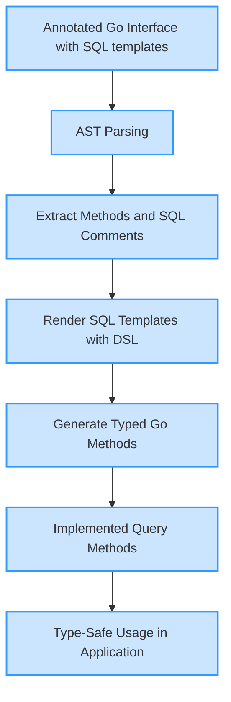

# Interface-Driven Queries

Discover how GORM CLI transforms your annotated Go interfaces into fully type-safe, expressive query APIs. This guide unpacks the core design behind interface-driven query API generation—showing how SQL templates embedded in method comments become robust, context-aware query methods that preserve type safety and harness the power of an embedded Template DSL.

---

## What Are Interface-Driven Queries?

At its heart, interface-driven query generation means you define database queries declaratively, crafting Go interfaces whose methods carry SQL templates in their documentation comments. These templates contain special placeholders and DSL directives that the GORM CLI code generator parses and converts into concrete, fluent query methods.

Instead of writing SQL queries scattered throughout your code, you compose reusable query abstractions with clear method signatures. The generator then produces implementations that:

- Integrate seamlessly with your GORM models and database context.
- Ensure compile-time type safety for parameters and results.
- Preserve the expressiveness of raw SQL with templating power.


## The User Journey: From Interface to Query Method

Imagine you want a query to find users by ID.

1. Write an interface method with a SQL template comment:

   ```go
   // GetByID finds a record by id
   //
   // SELECT * FROM @@table WHERE id=@id AND name = "\@name"
   GetByID(id int) (T, error)
   ```

2. The generator parses this interface and produces a method implementation:

   ```go
   func (e _QueryImpl[T]) GetByID(ctx context.Context, id int) (T, error) {
     var sb strings.Builder
     params := make([]any, 0, 2)

     sb.WriteString("SELECT * FROM ? WHERE id=? AND name = \"@name\"")
     params = append(params, clause.Table{Name: clause.CurrentTable}, id)

     var result T
     err := e.Raw(sb.String(), params...).Scan(ctx, &result)
     return result, err
   }
   ```

3. Use it in your code, enjoying type safety and clean syntax:

   ```go
   user, err := generated.Query[User](db).GetByID(ctx, 123)
   ```

This pattern applies to all query methods—whether simple lookups, conditional filters, or complex dynamic updates.


## Key Concepts Explained

### Annotated Interfaces
Your query interfaces define methods with generics and well-typed parameters and return values. Above these methods, you write SQL templates as Go comments, using DSL features for flexibility.

### SQL Template Directives
- `@@table` resolves to the current model's table name, ensuring queries stay dynamically tied to models.
- `@@column` allows dynamic column names.
- `@param` binds Go method parameters into SQL safely.
- `{{where}}` constructs conditional WHERE clauses.
- `{{set}}` builds conditional SET clauses for UPDATE operations.
- Control structures (`{{if}}`, `{{else}}`, `{{for}}`) add logic and iteration inside SQL.


### Type Safety & Code Generation
The generator parses the interface AST, extracts method signatures and SQL comments, and produces:

- Interface implementations with methods accepting `context.Context` (auto-injected if missing).
- Parameter binding with safe placeholders (`?`) mapped in order.
- Result scanning into generically typed return values.

This process guarantees your queries align with your Go types, minimizing runtime SQL errors.


## Practical Examples of Interface-Driven Queries

### Basic Select by ID
```go
// SELECT * FROM @@table WHERE id=@id
GetByID(id int) (T, error)
```
Generates a method fetching a single entry by `id`.

### Dynamic Filtering with Conditional WHERE
```go
// SELECT * FROM @@table
// {{where}}
//   {{if user.ID > 0}}
//     WHERE id=@user.ID
//   {{else if user.Name != ""}}
//     WHERE name=@user.Name
//   {{end}}
QueryWith(user models.User) (T, error)
```
Generates a query that builds conditions based on runtime parameter values.

### Complex Update with Conditional SET
```go
// UPDATE @@table
//  {{set}}
//    {{if user.Name != ""}} name=@user.Name, {{end}}
//    {{if user.Age > 0}} age=@user.Age, {{end}}
//    {{if user.Age >= 18}} is_adult=1 {{else}} is_adult=0 {{end}}
//  {{end}}
// WHERE id=@id
UpdateInfo(user models.User, id int) error
```
Generates a method that conditionally updates fields based on provided data.


## How the Template DSL Preserves Expressiveness & Safety

The embedded Template DSL allows constructing complex, conditional SQL statements without losing the safety and expressiveness Go developers expect:

- Parameters get automatically translated into `?` placeholders; SQL injection risks are mitigated.
- You can use loops to iterate over slices for filtering.
- Logical branching (`if-else`) caters to flexible query adjustments depending on input.
- Built-in directives `{{where}}` and `{{set}}` help generate syntactically correct WHERE and SET clauses.


## Tips and Best Practices

- **Write clear, expressive SQL templates**: Use the DSL directives to avoid manual string concatenation.
- **Leverage generics for maximum reusability**: Parametrize your interfaces on model types and reuse queries across types.
- **Annotate thoroughly**: Detailed comments ensure the generator captures your intent and produces precise code.
- **Use context.Context in signatures**: The generator will add it if missing, but explicit declarations improve clarity.
- **Test generated methods**: Validate by calling generated APIs to ensure queries align with your schema.


## Common Pitfalls & How to Avoid Them

<AccordionGroup title="Troubleshooting Interface-Driven Queries">
<Accordion title="Missing or Malformed SQL Comments">
Generated code depends on method comments containing SQL templates. Missing or improperly formatted comments cause generation failures or incorrect output. Always start method comments with your SQL, respecting DSL syntax.
</Accordion>
<Accordion title="Incorrect Parameter Bindings">
Ensure your placeholder names (`@param`) reflect the actual method parameter names and nested struct fields. Mismatches lead to bind errors.
</Accordion>
<Accordion title="Result Type Deficiencies">
Methods producing results must return either `(T, error)` or `(error)`. Other return signatures may cause generator errors. Always include error as the last return type.
</Accordion>
<Accordion title="Improper Use of Template Directives">
Avoid using unsupported or unsupported control flow statements outside the DSL defined directives. Stick to provided DSL constructs for robust generation.
</Accordion>
</AccordionGroup>


## Under the Hood: How Queries Are Generated (Conceptual Overview)

The generator performs the following steps:

1. **AST Parsing:** Parses your Go interface file, extracting interface methods and associated doc comments.
2. **SQL Extraction:** Pulls SQL and DSL templates from method comments using custom parsers.
3. **Template Processing:** Runs templates through a renderer that converts DSL into Go code building SQL strings and parameter slices.
4. **Code Emission:** Generates code implementing methods on a typed struct that wraps GORM's database context.
5. **Parameter Binding:** Constructs SQL with `?` placeholders and assembles arguments in order.
6. **Execution & Scanning:** Generates code that runs raw SQL with GORM's APIs and scans rows into returned types.


## Diagram: Flow from Interface to Generated Query Method




## Summary

Interface-driven queries represent a powerful design pattern in GORM CLI that empowers developers to write concise, maintainable, and type-safe database query abstractions. By embedding SQL templates in interface comments and leveraging a rich template DSL, the system converts simple interface definitions into production-ready query methods with fluent Go signatures, safeguarding correctness and enhancing developer productivity.

---

## See Also

- [Template Queries and DSL Guide](/guides/advanced-patterns/template-queries-dsl) — Dive deeper into writing SQL templates with DSL features.
- [How GORM CLI Works](/concepts/architecture-and-core-concepts/how-gorm-cli-works) — Understand the full generation workflow.
- [Configuration & Customization](/getting-started/first-steps/configuration-setup) — Learn how to control generation per package or file.
- [Using the Generated Code](/guides/getting-started/using-generated-code) — Practical tips on calling generated query methods.

---

## Code References

- Source interface example: [examples/query.go](https://github.com/go-gorm/cli/blob/main/examples/query.go)
- Generated output example: [examples/output/query.go](https://github.com/go-gorm/cli/blob/main/examples/output/query.go)
- Template processing logic: [internal/gen/generator.go](https://github.com/go-gorm/cli/blob/main/internal/gen/generator.go)


## Troubleshooting

If you encounter issues with interface-driven queries:

- Verify your method comments have correct SQL and DSL syntax.
- Check all method parameters match placeholders.
- Ensure return types conform to `(T, error)` or `(error)` patterns.
- Use the troubleshooting guides under Getting Started to resolve common generation errors.

---

By mastering interface-driven queries, you unlock a truly expressive, type-safe way to build SQL queries seamlessly integrated with your Go GORM projects.