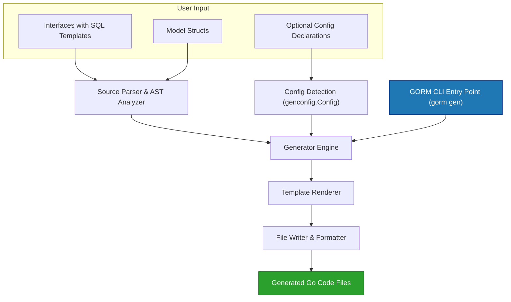

# System Architecture Overview

Discover how **GORM CLI** orchestrates its powerful code generation pipeline to unify interface-driven query APIs with model-driven field helpers. This guide breaks down the core components, workflows, and output structures that enable a seamless developer experience in generating type-safe, fluent GORM APIs.

---

## Introduction

The GORM CLI tool transforms your annotated Go interfaces and model structs into fully typed, SQL-backed query APIs and expressive field helpers. It empowers you to write safe, efficient, and maintainable database code grounded in your domain models. This page offers a clear, user-focused understanding of how the CLI entry point, generation engine, template rendering, and output organization work together to deliver this value.

---

## 1. CLI Entry Point: Running the Generator

At the heart of GORM CLI is a command-line interface powered by Cobra. You invoke the generator using the `gorm gen` command, specifying input source files or directories and an output path for the generated Go code.

**Typical user workflow:**

```bash
gorm gen -i ./examples -o ./generated
```

- **Input (`-i`)**: Path to Go source files containing your interfaces annotated with SQL templates and your model structs.
- **Output (`-o`)**: Destination folder for all generated code.

The CLI handles argument validation and kicks off the generator engine, which then parses your sources and produces type-safe implementations and field helpers.

**Key point:** You do not need to manually configure the pipeline; the CLI accommodates config declarations embedded in source files that augment or override default behaviors.

---

## 2. The Generator Engine: Parsing & Analysis

The generator engine processes your input files by parsing their Go Abstract Syntax Tree (AST):

- **Interfaces**: It extracts method signatures and associated SQL templates from comments.
- **Structs**: It interprets your domain models’ fields, tags, and embedded types to create helpers for each field and association.
- **Config**: It detects any `genconfig.Config` declarations in your packages to apply generation overrides such as output paths, inclusion/exclusion filters, and custom type mappings.

The engine maintains the directory structure and package relationships of your input to organize generated code logically, reflecting the source layout.

**User value:** The generator ensures that only relevant interfaces and structs (based on your config) are processed, producing clean, predictable outputs aligned with your project structure.

---

## 3. Template Rendering: Code Synthesis

After parsing, the generator feeds extracted data into a Go text template that synthesizes the final source files.

### What gets generated?

- **Query APIs**: For each interface, the generator produces a concrete implementation struct with method bodies based on your SQL templates and signatures. These methods include:
  - SQL template rendering with parameter binding,
  - Automatic injection of `context.Context` if omitted,
  - Return types reflecting either raw SQL execution or fluent query interface chaining.

- **Field Helpers**: For each struct and its fields,
  - Typed field helpers are created (e.g., `field.String`, `field.Number[int]`, `field.Time`),
  - Association helpers represent relational fields (has one, has many, many2many),
  - Helpers are wrapped with metadata such as column or field names for intuitive usage.

The template adapts output based on the detected types and your custom mappings declared in configs.

**Example snippet of generated code structure:**

```go
func Query[T any](db *gorm.DB, opts ...clause.Expression) _QueryInterface[T] {
  return _QueryImpl[T]{Interface: gorm.G[T](db, opts...)}
}

var User = struct {
  ID   field.Number[uint]
  Name field.String
}{
  ID: UserID.WithColumn("id"),
  Name: UserName.WithColumn("name"),
}
```

---

## 4. Output Structure & File Organization

The generator emits code files that correspond to your input package paths while respecting configuration-driven output directories.

- Files maintain the original package declarations.
- Interface implementations and field helpers are generated together per package/file.
- Imports are managed automatically and formatted with `golang.org/x/tools/imports` for consistency.

**Best practice:**

Keep your query interfaces and models in logical directories so the generated code is easy to find and import.

**Customizing outputs** through `genconfig.Config` allows specifying different output folders per directory or fine-grained inclusion/exclusion of files or entities.

---

## 5. User Workflow in the Context of Architecture

Here’s a simplified flow of how a user’s input travels through the system:

1. **Write Go interfaces** with SQL templates and define your domain **model structs**.
2. **Optionally declare** a `genconfig.Config` in one or more files for custom output paths and mapping.
3. **Invoke the CLI command** specifying input and output.
4. **Generator parses and analyzes** AST data, applying configs and filtering irrelevant parts.
5. **Templates render** concrete code files that include:
   - Fluent, type-safe query interface implementations
   - Model-driven field helper definitions
6. **Generated code is saved** in your specified output directory, maintaining package boundaries and import safety.
7. **You import and use** the generated APIs in your application with confidence in their type safety and compile-time verification.

---

## 6. Practical Tips & Best Practices

- Always keep your interface and model files well-organized per package to ensure predictable generated output.
- Leverage `genconfig.Config` to control generation scope and customize field helpers, especially for complex or third-party types.
- Remember that the CLI auto-injects `context.Context` in generated method parameters if omitted.
- Use the generated field helpers to compose fluent, safe queries and updates instead of raw SQL strings.
- Keep an eye on the CLI logs during generation to catch skipped files or filtering based on config.

---

## 7. Common Pitfalls & Troubleshooting

- **Missing context parameter in interface method:** The generator adds it automatically during codegen, so your signature can omit it for convenience.
- **No generated output:** Check your `genconfig.Config` for any include/exclude conflicts or misspecified input paths.
- **Unexpected import errors:** Ensure generated code import paths align with your module structure and that you run `go mod tidy` after generation.
- **Syntax parsing errors:** Verify your interfaces have correctly formatted SQL templates in comments.

---

## 8. Diagram: GORM CLI System Architecture



---

## 9. Related Documentation

- [Core Concepts & Terminology](/overview/architecture-and-concepts/core-concepts-terminology) — For foundational terms on query interfaces and field helpers.
- [Code Generation Workflow](/concepts/architecture-and-core-concepts/code-generation-workflow) — Step-by-step generation details.
- [Minimal Configuration](/getting_started/first_code_generation/minimal_configuration) — Learn how to set up basic `genconfig.Config`.
- [Your First Code Generation](/guides/getting-started-workflows/your-first-codegen) — Hands-on walkthrough from writing interfaces to generating code.
- [Using the Generated APIs](/guides/getting-started-workflows/using-generated-apis) — How to use the output in your Go applications.

---

Harnessing the GORM CLI architecture will boost your productivity by automating routine query and helper code generation, ensuring type safety and an expressive API surface bound directly to your domain models.

Start by defining concise, SQL-annotated interfaces and models, then let GORM CLI do the rest—transforming your design into production-ready, fluent Go database code.
