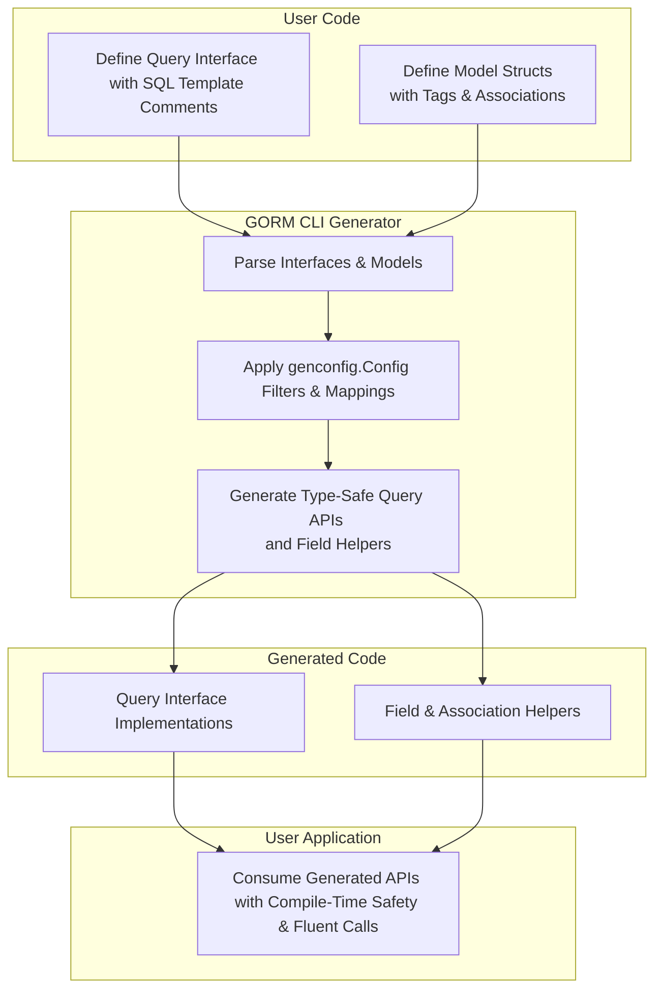

# Type Safety & Fluent API Design

Explore the conceptual foundation behind GORM CLI's type-safe patterns. This guide demonstrates how query interfaces, field helpers, and associations come together to form a discoverable, trustworthy, and expressive API surface, streamlining how you write database queries and mutations in Go.

---

## Understanding the Type Safety Principle

At its core, GORM CLI generates **type-safe query APIs** and **model-driven field helpers** from your Go source code, giving you compile-time guarantees when performing database operations. This eliminates many common runtime errors caused by typos, mismatched types, or unsafe query constructions.

By leveraging Go's generics (Go 1.18+), every generated API directly correlates to your data model structures and query interface definitions:

- **Query Interfaces:** Define your expected queries and mutations with raw SQL templates written as comments on interface methods. The generator produces concrete, type-safe implementations exploiting Go's type system.
- **Field Helpers:** Based on your model struct fields, generate strongly typed accessors and predicates (e.g., `generated.User.Name.Eq("jinzhu")`). This enables fluent, readable, and correct query building.

This approach reflects a seamless translation of your data and query expectations into a rich, discoverable Go API.

<Tip>
Using type safety means bugs involving column names, incorrect types, or missing parameters are caught **during compilation**, saving you hours debugging runtime SQL errors.
</Tip>

---

## Key Components Enabling Type Safety

### 1. Query Interfaces

Your starting point is to declare Go interfaces describing the queries you want to run. Annotate interface methods with SQL or template DSL comments that include placeholder tokens to bind Go parameters safely.

For example:

```go
// Query.go
package examples

type Query[T any] interface {
  // SELECT * FROM @@table WHERE id=@id
  GetByID(id int) (T, error)

  // UPDATE @@table
  // {{set}}
  //   {{if user.Name != ""}} name=@user.Name, {{end}}
  //   {{if user.Age > 0}} age=@user.Age, {{end}}
  // {{end}}
  // WHERE id=@id
  UpdateInfo(user User, id int) error
}
```

The generator reads your interface and produces a **generic implementation** with the exact method signatures, augmented by context injection if omitted, ensuring you provide all necessary parameters properly typed.

### 2. Field Helpers

Your model structs are analyzed to generate **field helpers** for each field based on its Go type and tags.

Fields map to helper types offering common predicates and setters:

- Basic fields like `int`, `string`, `bool`, `time.Time` become typed helpers such as `field.Number[int]`, `field.String`, and `field.Bool`.
- Named or complex types implementing special interfaces like SQL `Scanner`/`Valuer` or `GORM Serializer` are mapped appropriately.

These helpers enable fluent expressions like:

```go
generated.User.Name.Eq("jinzhu")           // WHERE name = 'jinzhu'
generated.User.Age.Between(18, 60)          // WHERE age BETWEEN 18 AND 60
generated.User.Score.IsNull()                // WHERE score IS NULL
```

### 3. Association Helpers

GORM CLI also generates helpers for your model associations:

- **Has One / Has Many / Belongs To / Many2Many (including polymorphic)** associations produce `field.Struct[T]` or `field.Slice[T]` helpers.
- These enable rich operations such as creating, updating, unlinking, deleting, and batch-creating associations with compile-time safety.

Example:

```go
gorm.G[User](db).
  Set(
    generated.User.Name.Set("alice"),
    generated.User.Pets.Create(generated.Pet.Name.Set("fido")),
  ).
  Create(ctx)
```

---

## Fluent API Design Patterns

### Progressive Method Chaining

The generated APIs favor chaining that guides you through building queries without needing manual SQL strings.

For instance, the query interface method returns an interface allowing you to call `.Find(ctx)` or `.Take(ctx)`, making for an intuitive, fluent workflow.

### Automatic Context Injection

If your query interface method signature omits `context.Context`, the generator inserts it automatically for standard Go context-aware database operations.

This ensures proper cancellation and timeouts without boilerplate.

### Typed Parameters & Results

- All parameters match declared method signatures precisely.
- Return types exactly match the expected data model or error.

### Compile-Time Safety & Discoverability

- Intellisense tooling easily discovers available fields and predicates.
- Mistakes like passing a string instead of int will fail compilation.
- Your declared interfaces serve as dependable contracts.

---

## Real-World Usage Scenarios

### Example: Query Interface with Templated DSL

```go
type Query[T any] interface {
  // SELECT * FROM @@table WHERE id=@id
  GetByID(id int) (T, error)

  // SELECT * FROM @@table
  // {{where}}
  //   {{if user.Name != ""}} name=@user.Name {{end}}
  //   {{if user.Age > 0}} AND age=@user.Age {{end}}
  // {{end}}
  Filter(user User) ([]T, error)
}
```

Using the generated API:

```go
q := generated.Query[User](db)
user, err := q.GetByID(ctx, 123)
if err != nil {
  // handle error
}

users, err := q.Filter(ctx, User{Name: "jinzhu", Age: 30})
```

The generated `Filter` method crafts the WHERE clause conditionally based on your struct fields, handling proper SQL binding and safe parameterization.

### Example: Using Field Helpers

```go
users, err := gorm.G[User](db).
  Where(generated.User.Name.Like("%jinzhu%"), generated.User.Age.Gt(18)).
  Find(ctx)
```

This code is concise, type-safe, and expressive without writing raw SQL strings.

---

## Practical Tips & Best Practices

- **Write clear interface method comments using the template DSL.** Use directives like `@@table`, `@param`, `{{where}}`, and `{{set}}` to control SQL generation.
- **Use model struct tags (`gen:"json"`) to customize field helper mappings** — for example, use specialized JSON operators.
- **Leverage association helpers** to manipulate related entities safely and succinctly, minimizing manual FK management.
- **Consider adding filtering directives in your `genconfig.Config`** to include only certain interfaces or structs for generation, maintaining lean and focused generated code.

<Warning>
Avoid mixing raw SQL strings in your application code after generation; trust the generated APIs to maintain correctness and safety.
</Warning>

---

## Common Pitfalls & Troubleshooting

<AccordionGroup title="Common Issues & Resolutions">
<Accordion title="Missing Generated Methods After Running CLI">
Verify that your interface files and model structs are in the `-i` input path and your configuration doesn’t exclude them unintentionally. Ensure your interface method signatures have proper comments with supported template syntax.
</Accordion>
<Accordion title="Compilation Errors Involving Types">
Check that your Go version is 1.18+ and that your project modules are correctly organized. Ensure all referenced types in your interfaces and models are imported and resolvable.
</Accordion>
<Accordion title="Generated Code Formatting or Import Errors">
The generator runs `imports.Process` automatically — verify that your package imports are correct, and your Go environment supports automatic formatting.
</Accordion>
<Accordion title="Context Argument Not Passed">
If your interface method omits `context.Context`, the generator automatically adds it. If you need to handle context differently, explicitly define it in your interface method.
</Accordion>
</AccordionGroup>

---

## Visualizing the Type-Safe API Flow



---

## Summary

The type safety and fluent API design in GORM CLI help you write safer, clearer, and more maintainable database operations. By declaring your query interfaces and models naturally, the CLI generates expressive, compile-time verified APIs that integrate smoothly with your Go application.

For maximum benefit, embrace interface-driven query definitions, leverage field and association helpers, and customize generation via configuration where needed to precisely model your domain.

<br/>

---

## References & Related Documentation

- [Core Concepts & Terminology](https://gorm.io/docs/overview/architecture-and-core-concepts/core-concepts-terminology) — Understand foundational concepts behind GORM CLI.
- [Code Generation Workflow](https://gorm.io/docs/concepts/architecture-and-core-concepts/code-generation-workflow) — See the full pipeline turning interfaces into generated code.
- [Writing Custom Queries with SQL Template DSL](https://gorm.io/docs/guides/advanced-patterns-customization/sql-template-dsl) — Dive deeper into the template language.
- [Configuring Generation with genconfig.Config](https://gorm.io/docs/guides/advanced-patterns-customization/configuring-codegen) — Customize your code generation.
- [Working with Associations](https://gorm.io/docs/guides/advanced-patterns-customization/working-with-associations) — Manage relations with association helpers.
- [Using Generated APIs in Your Application](https://gorm.io/docs/guides/getting-started-workflows/using-generated-apis) — Practical usage instructions.

---

## Next Steps

- Define your query interfaces with SQL template DSL comments.
- Annotate your model structs appropriately, including association tags.
- Run the CLI code generator and integrate the generated APIs.
- Explore customization options via `genconfig.Config` as your project grows.
- Utilize association helpers to simplify complex relational operations.


---

End of "Type Safety & Fluent API Design" conceptual guide.
