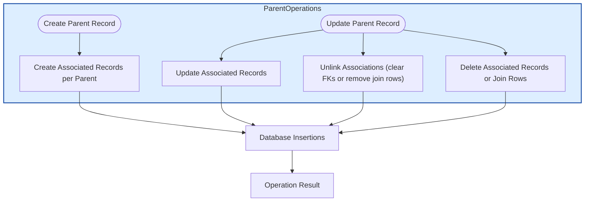

# Association Types & Semantics

## Understanding Associations in GORM CLI

Associations form the backbone of relational data modeling in your Go applications using GORM CLI. This page explores the different association types supported—*Has One*, *Has Many*, *Belongs To*, *Many2Many*, including *Polymorphic* associations—and how each is reflected in your Go structs, the generated helpers, and the underlying CRUD/link/unlink/delete operations.

By mastering these association semantics, you unlock the power of GORM CLI's type-safe, fluent APIs to express complex data relationships and operations clearly and reliably.

---

## Overview of Association Types

### 1. Has One

- **Definition:** The parent has exactly one related child record.
- **Go Modeling:** A struct field holding a nested struct or pointer, e.g., `Account Account`.
- **Example:** A `User` has one `Account`.
- **Behavior:** When you create or update a `User`, you can create, update, unlink, or delete the singular associated `Account` record via the generated association helpers.

### 2. Has Many

- **Definition:** The parent has zero or more related children.
- **Go Modeling:** A struct field holding a slice of pointers or structs, e.g., `Pets []*Pet`.
- **Example:** A `User` has many `Pets`.
- **Behavior:** You can create individual or batch associated children, update them conditionally, unlink (set foreign key fields to NULL), or delete child records.

### 3. Belongs To

- **Definition:** The entity belongs to exactly one parent entity.
- **Go Modeling:** A pointer or struct field with a foreign key field in the model, e.g., `Company Company` with a `CompanyID` FK.
- **Example:** A `User` belongs to a `Company`.
- **Behavior:** The association helpers allow updating the parent, unlinking (setting the parent's foreign key in this model to `NULL`), or deleting the parent entity.

### 4. Many2Many

- **Definition:** Many-to-many relationship expressed via a join table.
- **Go Modeling:** A slice field annotated with `gorm:"many2many:<join_table>"`, e.g., `Languages []Language "gorm:\"many2many:UserSpeak\""`.
- **Example:** A `User` speaks many `Languages`.
- **Behavior:** Supports creating, batch creating, unlinking, and deleting join table links. Deletion only removes join table entries, preserving the associated entity rows.

### 5. Polymorphic

- **Definition:** An entity relates to multiple types on the associated side, distinguished by type fields.
- **Go Modeling:** Annotated with `gorm:"polymorphic:<Owner>"`, e.g., `Toy []Toy "gorm:\"polymorphic:Owner\""`.
- **Example:** A `Pet` has one `Toy` polymorphically.
- **Behavior:** Associations are handled by setting appropriate owner ID and type fields during create/link operations. Unlinking clears ownership fields but keeps rows.

---

## Reflection of Associations in Generated Helpers

GORM CLI generates two main association helper types to handle relationships:

| Helper Type       | Usage                           | Handles                  |
|-------------------|--------------------------------|--------------------------|
| `field.Struct[T]` | Single related struct (has one, belongs to, polymorphic) | One-to-one associations  |
| `field.Slice[T]`  | Multiple related structs (has many, many2many)             | One-to-many, many2many   |

These helpers expose methods to perform operations on associations. Examples of key methods include:

- `Create(...)`: Create and link a new associated record per matched parent.
- `CreateInBatch([]T)`: Batch create association records (slice helpers only).
- `Update(...)`: Update existing associated records with optional filters.
- `Unlink()`: Remove association without deleting associated records.
- `Delete()`: Delete associated records (removes join rows only for many2many).

You invoke these on generated models within `Set(...)` calls paired with either `.Create(ctx)` or `.Update(ctx)` on the parent.

---

## Detailed Semantics & Usage Patterns

### Creating and Linking Associations

**Use Case:** You want to create a parent with one or more associated children atomically, or add associated records to existing parents.

```go
// Create a new user with one pet (has many)
gorm.G[User](db).
  Set(
    generated.User.Name.Set("alice"),
    generated.User.Pets.Create(
      generated.Pet.Name.Set("fido"),
    ),
  ).
  Create(ctx)

// For existing users, create one pet each
gorm.G[User](db).
  Where(generated.User.ID.Eq(1)).
  Set(generated.User.Pets.Create(generated.Pet.Name.Set("rex"))).
  Update(ctx)

// Create and link multiple many2many languages
gorm.G[User](db).
  Set(
    generated.User.Name.Set("polyglot"),
    generated.User.Languages.CreateInBatch([]models.Language{{Code: "EN"}, {Code: "FR"}}),
  ).
  Create(ctx)
```

### Updating Associations with Conditions

**Use Case:** Modify specific associated records matching criteria without affecting others.

```go
gorm.G[User](db).
  Where(generated.User.ID.Eq(1)).
  Set(
    generated.User.Pets.Where(generated.Pet.Name.Eq("fido")).Update(generated.Pet.Name.Set("rex")),
  ).
  Update(ctx)
```

### Unlinking Associations

**Unlink semantics differ by association type:**

- *Belongs To*: sets FK field on the parent model to `NULL`
- *Has One / Has Many*: sets FK fields on associated children to `NULL`
- *Many2Many*: removes rows from the join table only

```go
// Unlink all pets from user (pets remain but user_id is NULL)
gorm.G[User](db).
  Where(generated.User.ID.Eq(1)).
  Set(generated.User.Pets.Unlink()).
  Update(ctx)

// Unlink belongs-to company from user (sets CompanyID to NULL)
gorm.G[User](db).
  Where(generated.User.ID.Eq(1)).
  Set(generated.User.Company.Unlink()).
  Update(ctx)
```

### Deleting Associations

- For *has one* and *has many*, `Delete()` removes the associated rows.
- For *many2many*, `Delete()` removes only the join table rows, keeping associated entities intact.

```go
// Delete a pet by name
gorm.G[User](db).
  Where(generated.User.ID.Eq(1)).
  Set(generated.User.Pets.Where(generated.Pet.Name.Eq("old")).Delete()).
  Update(ctx)

// Delete join for many2many, keeps entity rows
gorm.G[User](db).
  Where(generated.User.ID.Eq(1)).
  Set(generated.User.Languages.Where(generated.Language.Code.Eq("EN")).Delete()).
  Update(ctx)
```

---

## Polymorphic Associations

Polymorphic associations let an entity own associations of multiple types recorded by `OwnerID` and `OwnerType` fields.

Example: `Pet` has one polymorphic `Toy`.

- Ownership is tracked via `OwnerID` and `OwnerType`.
- Association helpers ensure `OwnerID` and `OwnerType` are set or cleared appropriately during create, unlink, or delete operations.

```go
// Update toy associated with a pet polymorphically
gorm.G[Pet](db).
  Where(generated.Pet.ID.Eq(petID)).
  Set(generated.Pet.Toy.Where(generated.Toy.Name.Eq("ball")).Update(generated.Toy.Name.Set("cube"))).
  Update(ctx)

// Unlink polymorphic toy (sets OwnerID=0, row stays)
gorm.G[Pet](db).
  Where(generated.Pet.ID.Eq(petID)).
  Set(generated.Pet.Toy.Unlink()).
  Update(ctx)

// Delete polymorphic toy
gorm.G[Pet](db).
  Where(generated.Pet.ID.Eq(petID)).
  Set(generated.Pet.Toy.Delete()).
  Update(ctx)
```

---

## Practical Tips and Best Practices

- **Use generated association helpers exclusively** to ensure correct and type-safe operations on associations.
- **Always include context** when calling `Create(ctx)` or `Update(ctx)` for proper cancellation and tracing.
- **When unlinking** be aware the associated data remains unless you explicitly delete.
- **For batch operations** on has many or many2many, prefer `CreateInBatch` for improved performance.
- **Use conditional filters** (`Where(...)` on helpers) to precisely target associated records in updates, unlink, or delete.
- **Check foreign key nullability** in your schema as unlink operations set FK fields to NULL when permitted.

---

## Common Troubleshooting Scenarios

<AccordionGroup title="Troubleshooting Association Operations">
<Accordion title="Created child records not linked correctly">
Ensure the foreign key fields in your model are correctly defined and permitted to be assigned. Association helpers manage linking automatically by setting these keys during create. Verify your model tags and schema.
</Accordion>
<Accordion title="Unlink doesn't remove associated rows">
Unlinking only breaks the association link (sets FK fields to NULL or removes join rows). To delete associated records, use the `Delete()` helper explicitly.
</Accordion>
<Accordion title="Batch create silently fails for many2many">
Verify your join table and models are properly configured, and that the batch of records is valid. Use `CreateInBatch` association helper with a slice of associated structs.
</Accordion>
<Accordion title="Polymorphic association fields not cleared on unlink">
Check that polymorphic ownership fields `OwnerID` and `OwnerType` are supported as nullable or zero-valued in your schema. The unlink operation resets these.
</Accordion>
</AccordionGroup>

---

## Visualization of Association Operations Flow



---

## References and Next Steps

- For practical usage examples and code samples on association management, see the [Managing Associations guide](/guides/real-world-usage-patterns/working-with-associations).
- Deepen your understanding of model-driven field helpers in [Model-Driven Field Helpers](/guides/getting-started/model-driven-field-helpers).
- Review the [Core Concepts & Terminology](/overview/core-overview/core-terminology) for foundational terms.
- Explore the [Generator Architecture Overview](/concepts/architecture-and-data-models/generator-architecture) to understand how association helpers are generated.

By mastering association types and their semantics, you ensure your GORM CLI-powered application handles complex relational data confidently, with compile-time safety and intuitive API clarity.
