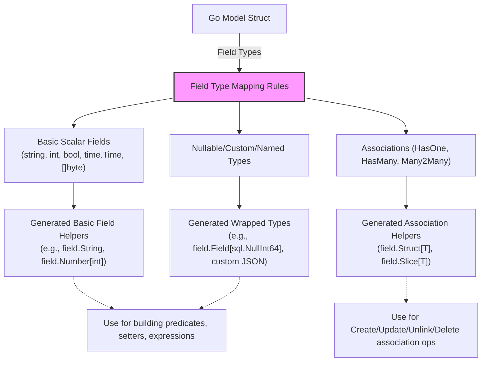

# Data Modeling & Field Helpers

Dive deep into how GORM CLI interprets your Go model structs to generate powerful, expressive field helpers. This page unpacks the conventions for structuring your data models and how field helpers are derived for various field types—standard Go types, custom field wrappers, and associations—enabling type-safe, fluent querying and mutating in GORM.

---

## Understanding Model-Driven Field Helpers

GORM CLI generates a set of strongly-typed field helpers for each Go struct in your project. These helpers empower you to build queries, updates, and association operations with compile-time safety and discoverability. They are the foundation behind fluent and expressive ORM usage.

### What Are Field Helpers?

Field helpers are Go values generated per struct, where each field corresponds to a wrapper type specialized for its underlying Go type or association.

- **Basic fields** like `string`, `int`, `bool`, `time.Time`, and nullable SQL types get typed predicate and setter helpers.
- **Custom mapped fields** use user-defined wrappers configured via generation mappings.
- **Associations** become `field.Struct[T]` or `field.Slice[T]` helpers representing related models.

These helpers support:
- Building type-safe `WHERE` predicates using operators like `Eq`, `Gt`, `Like`, etc.
- Expressing update setters and expressions (e.g., `Set`, `Incr`).
- Managing associations via `Create`, `Update`, `Unlink`, `Delete`, and batch variants.


## How Field Helpers Map to Go Types

GORM CLI applies a clear set of rules to determine the generated helper type for every field:

| Go Type Pattern                     | Generated Helper Type          | Description                                                   |
|-----------------------------------|-------------------------------|---------------------------------------------------------------|
| `string`                          | `field.String`                | Basic string fields                                              |
| `bool`                            | `field.Bool`                  | Boolean fields                                                  |
| Numeric types (`int`, `int64`, etc.) | `field.Number[<GoType>]`      | Number helpers are generic over the exact numeric Go type       |
| `time.Time` and mapped nullable types  | `field.Time` or custom mapped | Times and nullable times with default or configured wrappers    |
| `[]byte`                         | `field.Bytes`                 | Binary data                                                    |
| Nullable/Scanner/Valuer wrappers | `field.Field[<Type>]`         | Generic wrapper type for nullable and other complex fields      |
| Slices of structs (`[]T` or `[]*T`) | `field.Slice[T]`              | Collection of related models (has-many, many-to-many)           |
| Struct fields representing related models | `field.Struct[T]`             | Represent belongs-to or has-one associations                     |

### Example from the `User` Model

```go
var User = struct {
    Name      field.String
    Age       field.Number[int]
    Birthday  field.Time
    Score     field.Field[sql.NullInt64]
    Account   field.Struct[models.Account]
    Pets      field.Slice[models.Pet]
    Profile   examples.JSON
}{
    Name:      field.String{}.WithColumn("name"),
    Age:       field.Number[int]{}.WithColumn("age"),
    Birthday:  field.Time{}.WithColumn("birthday"),
    Score:     field.Field[sql.NullInt64]{}.WithColumn("score"),
    Account:   field.Struct[models.Account]{}.WithName("Account"),
    Pets:      field.Slice[models.Pet]{}.WithName("Pets"),
    Profile:   examples.JSON{}.WithColumn("profile"),
}
```

This struct makes it easy to write:

```go
// Find users older than 30 and with a JSON profile containing vip=true
users, err := gorm.G[models.User](db).
    Where(generated.User.Age.Gt(30), generated.User.Profile.Equal("$.vip", true)).
    Find(ctx)
```


## Using Struct Tags and Configurations for Custom Field Helpers

You can influence field helper generation with struct tags and generation configurations.

### `gen:"customName"` Tag

This tag enables specifying custom mapping keys that the generator uses to apply special field helpers.

Example:

```go
type User struct {
    Profile string `gen:"json"`
}
```

With a user configuration mapping `json` to a JSON helper type, the profile field is generated with the custom JSON field helper.

### Mapping Custom Types via `genconfig.Config`

You can configure both type and name mappings to customize what's generated:

```go
var _ = genconfig.Config{
    FieldTypeMap: map[any]any{
        sql.NullTime{}: field.Time{},
    },
    FieldNameMap: map[string]any{
        "json": JSON{},
    },
}
```

This instructs the generator to use `field.Time` for `sql.NullTime` fields and to generate the `JSON` field helper for fields tagged with `gen:"json"`.


## Associations Become Dedicated Field Helpers

GORM CLI detects associations by the Go type and generates distinct helpers:

| Association Type       | Helper Type          | Description                                               |
|-----------------------|---------------------|-----------------------------------------------------------|
| Belongs To / Has One   | `field.Struct[T]`    | Single related model fields                               |
| Has Many / Many-to-Many| `field.Slice[T]`     | Collections of related models                             |

For example, the `User` struct with Pets represented as `[]*Pet` results in a helper

```go
Pets field.Slice[models.Pet]
```

### Using Association Helpers

They enable granular association operations:

- `Create`: Create and link a new associated record.
- `Update`: Update associated records with conditions.
- `Unlink`: Remove association links without deleting records.
- `Delete`: Delete associated records or join rows.
- `CreateInBatch`: Batch create for slices.

Example:

```go
gorm.G[User](db).
  Set(
    generated.User.Name.Set("alice"),
    generated.User.Pets.Create(generated.Pet.Name.Set("fido")),
  ).
  Create(ctx)
```

## Model-Driven Field Helpers in Action

### Filtering and Querying

```go
// Get users older than 18 with role "active"
users, err := gorm.G[models.User](db).
    Where(generated.User.Age.Gt(18), generated.User.Role.Eq("active"))
    .Find(ctx)
```

### Updating Fields Safely

```go
// Flip role from "pending" to "active"
rows, err := gorm.G[models.User](db).
    Where(generated.User.Role.Eq("pending"))
    .Set(generated.User.Role.Set("active"))
    .Update(ctx)
```

### Working with Nullable Fields

You can use generated helpers for nullable types like `sql.NullInt64`:

```go
// Find users where score is NULL
count, err := gorm.G[models.User](db).
    Where(generated.User.Score.IsNull()).
    Count(ctx, "*")
```

### Using Custom JSON Field Helpers

The JSON helper supports database-specific SQL generation:

```go
// Find users with JSON profile containing vip flag
user, err := gorm.G[models.User](db).
    Where(generated.User.Profile.Equal("$.vip", true)).
    Take(ctx)
```

The SQL generated adapts per database (MySQL, SQLite, Postgres).

## Table Naming Conventions for Helpers

- Regular scalar fields use `.WithColumn(<column_name>)` referencing DB columns.
- Associations use `.WithName(<field_name>)` reflecting nested struct fields.

This distinction aligns generated code with the underlying data model.

## Best Practices

- Use struct tags like `gen:"json"` to extend field helper types.
- Configure `genconfig.Config` to override mappings globally or per package.
- Leverage association helpers for concise and safe relational operations.
- Combine field helpers with GORM generic helper `gorm.G[T]` for fluent ORM operations.

## Troubleshooting Common Pitfalls

<AccordionGroup title="Troubleshooting Field Helper Generation">
<Accordion title="Helpers Not Generated as Expected">
Ensure your structs are exported and fields are exported.
Check that your `genconfig.Config` mappings are correctly typed and visible.

Run generation with verbose logging to identify skipped structs or fields.
</Accordion>
<Accordion title="Custom Field Helper Not Working in Queries">
Double-check that your custom field helper implements the required methods (e.g., `WithColumn`).
Verify configuration maps tag names and types correctly.

Ensure your DB supports the custom SQL generated (e.g., JSON functions).
</Accordion>
<Accordion title="Association Helpers Missing or Incorrect">
Verify association tags (`gorm:"many2many"`, `gorm:"polymorphic"`) are correct.
Check the underlying Go slice or struct field types for correct definitions.
</Accordion>
</AccordionGroup>

---

## Summary

GORM CLI's **Data Modeling & Field Helpers** page equips you with an understanding of how structured Go models transform into rich, type-safe field helpers. These helpers unlock powerful and safe operations on scalar fields and complex associations through consistent mapping rules and configurable mappings.

Start by structuring your models thoughtfully, use `genconfig.Config` for customization, and leverage generated helpers to write expressive, readable, and maintainable data access code.

---

## See Also

- [Generating Type-Safe Query APIs](/guides/getting-started/generate-type-safe-apis) — How to write query interfaces that complement field helpers
- [Managing Associations](/guides/real-world-usage-patterns/working-with-associations) — Deep dive on association operations and helpers
- [Custom Field Helpers](/guides/advanced-customization/custom-field-helpers) — Extend helpers for JSON and other types
- [Generation Configuration](/concepts/configuration-and-customization/generation-configuration) — Detailed config options for field mappings
- [Model Examples (User)](/examples/models/user.go) — Practical model struct featuring typical field patterns and associations

---

## Diagram: Field Helper Type Mapping Overview



---

## Code Example Recap

Using generated field helpers for queries and updates:

```go
// Find active users over 18
users, err := gorm.G[models.User](db).
    Where(generated.User.Age.Gt(18), generated.User.Role.Eq("active"))
    .Find(ctx)

// Update role for pending users
_, err = gorm.G[models.User](db).
    Where(generated.User.Role.Eq("pending"))
    .Set(generated.User.Role.Set("active"))
    .Update(ctx)

// Create user with associated pets
err = gorm.G[models.User](db).
    Set(
      generated.User.Name.Set("alice"),
      generated.User.Pets.Create(generated.Pet.Name.Set("fido")),
    ).
    Create(ctx)
```

This programming model ensures clear, concise, and compile-safe interaction with your database.

---

## Closing

Mastering model-driven field helpers is pivotal to fully leveraging GORM CLI’s power. By aligning your Go model definitions with consistent field helper generation, you achieve type-safe, fluent, and maintainable data operations that boost productivity and reduce errors.

Harness this capability early in your project to architect resilient and expressive ORM layers.
