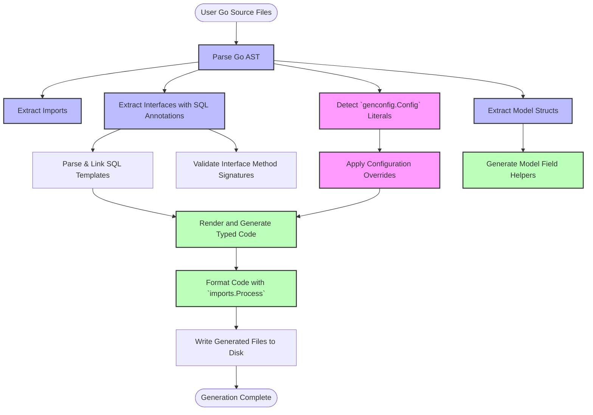

# Generator Architecture Overview

Understanding the internal flow of the GORM CLI code generation system demystifies how your Go interfaces and model structs translate into robust, type-safe, and fluent APIs. This guide walks you through the high-level process: how the CLI parses your source code, links raw SQL templates to interface methods, applies generation configurations, and outputs well-structured Go code ready for seamless database queries and updates.

---

## 1. The Generation Flow: From Source to Type-Safe APIs

At the heart of GORM CLI lies a code generator that reads your Go source files containing:

- **User-defined interfaces** annotated with raw SQL queries as comments.
- **Model structs** representing database tables.
- Optional generation configuration via `genconfig.Config` literals.

The CLI then produces two main outputs:

- Concrete implementations of your SQL-annotated interfaces with type-safe method signatures.
- Strongly-typed field helpers generated from your model structs.

This process transforms your high-level, declarative code into expressive, compiler-checked ORM APIs.


### User Intent & Outcome

You want to write concise interfaces with embedded SQL, define Go structs as your database models, and get fully generated Go code that:

- Enforces type safety at compile time.
- Matches your SQL query semantics precisely.
- Provides reusable, fluent APIs for querying and modifying data.

All without manually writing boilerplate.

---

## 2. Parsing Inputs: Interfaces, Structs, and Configuration

The generation starts by recursively processing your input path (file or directory). For each `.go` file, the generator:

- Parses the Go Abstract Syntax Tree (AST).
- Extracts all **import paths** to understand dependencies.
- Detects **package-level configuration literals** (`genconfig.Config`) that customize generation options such as output directory, type mappings, and inclusion/exclusion filters.
- Collects all **interfaces** with methods annotated by raw SQL in their comments.
- Collects all **structs** with their exported fields.

The parsing respects your project's module boundaries to correctly resolve full import paths and package names.

---

## 3. Linking SQL Templates to Interface Methods

Every method inside your user-defined interfaces is analyzed as follows:

- The method's comment block is scanned to extract raw SQL or SQL templates.
- Parameters and return types are parsed from the method signature.
- Validation ensures that methods conform to generator constraints, for example, a finishing method must return (`result, error`) or only `error`.
- SQL templates use placeholders like `@@table`, `@param`, `{{where}}`, `{{set}}`, and control structures which the generator interprets to produce dynamic SQL builders.

This linkage ensures your embedded SQL code is correctly translated into executable Go code that maps parameters and maps query results to your model types.

---

## 4. Applying Generation Configuration (`genconfig.Config`)

Your package can optionally declare a variable of type `genconfig.Config` that controls several aspects of code generation:

- **Output Path (`OutPath`)**: Overrides the default output directory for generated files in that package.
- **Field and Name Mappings**: Customize how Go types map to field helpers, e.g., map `sql.NullTime{}` to `field.Time{}`.
- **Include/Exclude Filters**: Whitelists or blacklists interfaces and structs by name patterns or type literals to control which are processed.
- **File-Level Configuration**: Limit config scope to individual files rather than whole packages.

The generator applies the most specific configuration available when processing files, allowing granular control respecting complex project layouts.

---

## 5. Code Generation and Output

Once all AST data and configurations are collated, the generator proceeds to render code:

- It merges imports collected across files and configurations for cohesion.
- Filters interfaces and structs following the effective include/exclude rules.
- Skips generation if no valid interfaces or structs remain.
- Uses a text/template based file template to:
  - Generate a constructor function for each interface to create a typed instance.
  - Generate interface definitions with strongly-typed method signatures.
  - Generate method implementations that embed both your SQL logic and GORM fluent builders.
  - Generate a struct containing statically typed *field helpers* for every model struct, exposing fields as strongly typed predicate and setter helpers.

Files are generated preserving your input directory structure within the configured output path.

Finally, the generator formats the generated Go source files using `golang.org/x/tools/imports` to ensure standard style and clean imports.

---

## 6. Illustration of the Generator's Workflow



---

## 7. Practical Tips and Best Practices

- **Keep your interfaces focused:** Write clean interfaces with descriptive method signatures and use comments for SQL templates clearly.
- **Annotate your models:** Use struct tags for custom field helper mapping via `gen:"name"` and declare `genconfig.Config` for overrides.
- **Control generation granularity:** Use include/exclude fields inside `genconfig.Config` to scale your project without unnecessary code generation.
- **Understand method types:** Differentiate between 'chaining' methods (returning interface for building queries) and 'finishing' methods (returning data or error).
- **Organize your files:** Maintain a clear directory structure for input sources and leverage output directory configs for clean generated code management.

---

## 8. Troubleshooting Common Issues

- **No generated code for an interface:** Check if your interface matches inclusion filters set in `genconfig.Config`. 
- **Method signature errors:** Ensure finishing methods return error as the last value and do not exceed two return values.
- **Incorrect SQL parsing:** Verify that your SQL templates in method comments follow the supported DSL syntax and placeholders.
- **Output path not honored:** Confirm your `OutPath` is declared properly in a package-level `genconfig.Config`.

For a deeper dive into troubleshooting, refer to the [Common Setup and Generation Issues guide](/getting-started/troubleshooting-help/common-issues).

---

## 9. Code Generation in Action: Simplified Example

Suppose you have an interface:

```go
// UserQuery.go
package examples

type UserQuery[T any] interface {
  // SELECT * FROM @@table WHERE id=@id
  GetByID(id int) (T, error)
}
```

And a model:

```go
package examples

type User struct {
  ID   int
  Name string
}
```

The generator will:

- Parse `UserQuery` and find the `GetByID` method.
- Extract the SQL template `SELECT * FROM @@table WHERE id=@id`.
- Determine parameters and return types.
- Generate a method on the concrete implementation that:
  - Builds SQL with `clause.Table{Name: clause.CurrentTable}`.
  - Maps the `id` parameter.
  - Scans the result into type `T`.

The generated code snippet for the method body will resemble:

```go
var sb strings.Builder
params := make([]any, 0, 2)
sb.WriteString("SELECT * FROM ? WHERE id=?")
params = append(params, clause.Table{Name: clause.CurrentTable}, id)

var result T
err := e.Raw(sb.String(), params...).Scan(ctx, &result)
return result, err
```

This tightly binds your SQL to Go method invocations, minimizing runtime errors.

---

## 10. Additional Resources

- [Core Concepts & Terminology](overview/core-overview/core-terminology)
- [Running the Generator Guide](getting-started/configuration-quickstart/running-the-generator)
- [Generation Configuration (`genconfig.Config`)](guides/advanced-customization/generation-config)
- [SQL Template DSL & Parameter Binding](concepts/type-safety-and-templates/sql-template-dsl)

Understanding the Generator Architecture empowers you to write better input files, customize generation behavior, and diagnose issues efficiently, leveraging GORM CLI’s full power.

---

## Glossary

| Term               | Description                                                                                  |
|--------------------|----------------------------------------------------------------------------------------------|
| AST                | Abstract Syntax Tree, the parsed representation of Go source code                            |
| genconfig.Config   | User-declared configuration struct controlling generation options                           |
| SQL Template       | Annotated SQL statements in interface method comments guiding SQL generation                |
| Field Helpers      | Generated typed struct fields aiding fluent query building and updates                      |
| Chaining Method    | Interface method returning interface to allow method chaining (build queries incrementally)|
| Finishing Method   | Interface method returning data (and error) indicating query execution completion           |

---

## Summary
This concepts guide unpacks the Generator Architecture behind GORM CLI’s powerful code generation system. It explains how interfaces annotated with SQL comments and model structs feed into a streamlined process parsing Go AST, applying configurations, and outputting type-safe, composable APIs. With visual flowcharts, practical examples, and best practices, this document equips you with a deep understanding needed to effectively write input code and harness the CLI.

---

## Related Diagrams

Mermaid.js code illustrating the flow of generation is included in section 6 to visualize component interactions during code generation.


---

<!-- END -->