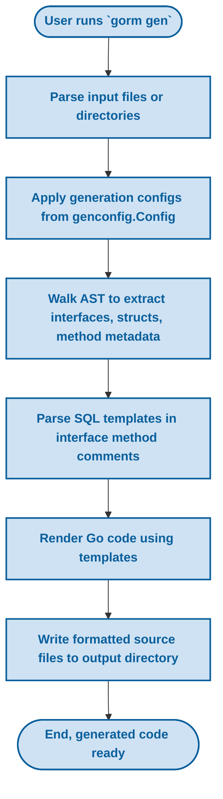

# GORM CLI Architecture Overview

Understand the high-level structure of GORM CLI: how the main executable, generators, and templates collaborate to scan your models and interfaces, interpret SQL templates, and output concrete, type-safe code. This foundational knowledge prepares you to use the tool effectively and builds the basis for deeper exploration of individual components.

---

## Introduction

GORM CLI is a powerful code generation tool designed to transform your Go project containing GORM models and interface-based SQL templates into fully type-safe, fluent query APIs and model-driven field helpers. At its core, the architecture organizes around scanning and parsing your input sources, applying configurations, interpreting embedded SQL templates, and finally producing clean, maintainable Go code.

This page breaks down the major components of GORM CLI's architecture and explains how they fit together to achieve this transformation.

---

## Architecture Components and Their Roles

### 1. Main Executable (`gorm`) Command

- **Entry Point:** The main `gorm` CLI acts as the user-facing entry point. It hosts subcommands, with `gen` being the primary command for generating code.
- **Command Definition:** Using the Cobra framework, `gen` exposes flags such as `-i` for input source files/directories and `-o` for output target directories.
- **User Interaction:** Users invoke `gorm gen` specifying the Go interface files containing raw SQL templates, triggering the generation workflow.

### 2. Generator Core (`internal/gen` Package)

The Generator is the heart of code synthesis. It orchestrates multiple stages:

#### a) Input Parsing and Analysis

- **Parsing Sources:** Processes input Go files or directories, using Go’s native `go/parser` and `go/ast` packages.
- **AST Traversal:** Walks through AST nodes to extract:
  - Interfaces with embedded SQL templates in method comments.
  - Struct definitions representing database models.
  - Package-level configuration using a special `genconfig.Config` struct.
- **Configuration Application:** Determines applicable generation configurations through include/exclude filters and field mappings.

#### b) Metadata Extraction

- Extracts interface methods, parameter types, and expected return types.
- Parses SQL embedded in comments using a specialized DSL, separating raw SQL, `Select`, `Where`, and other template directives.
- Maps model fields to corresponding field helpers, based on Go types or custom user mappings.

#### c) Code Rendering

- Uses Go `text/template` engine with custom templates to emit Go source code.
- Produces:
  - Concrete implementations of user-defined interfaces with type-safe methods.
  - Struct-based field helpers for model fields, supporting powerful filtering, updating, and association management.
- Applies Go imports management and formatted output via `golang.org/x/tools/imports`.

---

## User Flow Summary

This succinct user flow illustrates how the architectural components collaborate:



This flow ensures that your handwritten SQL definitions are transformed into usable, safe, and maintainable code.

---

## SQL Template Interpretation

A key architectural feature is the specialized **SQL Template DSL** embedded within Go interface method comments. The generator extracts and parses these templates rather than raw strings, enabling dynamic, conditional, and type-safe query construction.

- **Tag Directives** such as `@@table`, `@@column`, and `@param` allow substitution of table names, dynamic columns, and parameter bindings.
- **Control Structures** like `{{if}}`, `{{for}}`, `{{where}}`, and `{{set}}` enable optional clauses and iteration.
- The generator parses these templates to produce secure, parameterized Go code that builds SQL strings and arguments.

The `internal/gen/sqlparser_test.go` file contains comprehensive tests that validate this parsing and rendering process to ensure query correctness.

---

## Generation Template Layer

The output is generated through structured Go `text/template` files found in `internal/gen/template.go`:

- **Interface Implementations:** For each user query interface, a concrete struct implementing the interface is generated, with methods matching those defined.
- **Type Safety:** Use of generics `[T any]` and GORM `*gorm.DB` integration ensures seamless, safe querying.
- **Field Helpers:** Model structs get corresponding strongly typed helpers for fields and associations, enabling expressive query building.
- **Import Handling:** Import statements are intelligently managed to prevent conflicts and maintain correctness.

This layers built on the parsed AST and SQL templates deliver ready-to-use Go source files for your projects.

---

## Configuration Integration

To respect developer preferences and project-specific requirements, the architecture supports package-level configuration via `genconfig.Config`:

- **Output Paths:** Control where generated files are placed.
- **Field Type Mapping:** Override default Go type to field helper mappings.
- **Inclusion/Exclusion Filters:** Whitelist or blacklist interfaces and structs to control generation scope.
- **File Level Control:** Choose whether configs apply at file or package level.

These configurations are discovered and layered by the generator at runtime, ensuring flexibility.

---

## Practical Example

A summary of how these parts come together:

1. User writes an interface with SQL templates in comments (`examples/query.go`):

```go
// GetByID query data by id
// SELECT * FROM @@table WHERE id=@id
GetByID(id int) (T, error)
```

2. User invokes `gorm gen -i ./examples/query.go -o ./generated`.

3. The generator:
  - Parses the interface method and its SQL comment.
  - Extracts parameter types and return signatures.
  - Parses the SQL template with substitution parameters.
  - Generates a concrete `Query[T]` struct with `GetByID` method, building parameterized SQL.

4. The generated code can then be imported and used with a GORM `*gorm.DB` to perform type-safe queries.

---

## Troubleshooting Tips

- Ensure your interface methods have proper SQL annotations in comments; missing annotations cause generation failures.
- Validate that method signatures conform to rules (e.g., return error as last value).
- Use package-level configs to filter large codebases and speed generation.
- Check that Go modules and imports are properly set up to avoid parsing issues.
- Run the tests in `internal/gen/sqlparser_test.go` to verify template correctness during development.

---

## Summary

GORM CLI’s architecture harmonizes the following:

- Entry-point CLI commands for user interaction.
- Parsing and analysis of Go source code and embedded SQL templates.
- Dynamic, type-safe generation of query interfaces and field helpers.
- Configuration layering for customization and scalability.

Together, these components enable developers to write declarative interfaces and models and receive robust, maintainable database access code in return.

---

## Further Reading and Related Documentation

- [Core Concepts & Terminology](/overview/architecture-concepts/core-concepts-terminology) — Understand the foundational elements in more detail.
- [Template SQL DSL](/concepts/architecture-core-concepts/template-sql-dsl) — Deep dive into the SQL templating syntax and features.
- [Building Type-Safe Queries with Interfaces](/guides/core-workflows/type-safe-queries) — Practical guide for defining interfaces with embedded SQL templates.
- [Using Model-Driven Field Helpers](/guides/core-workflows/field-helpers) — Leverage generated helpers for filtering, updates, and associations.
- [Configuring the Generator](/getting-started/configuration/generator-configuration) — Customize your code generation with `genconfig.Config`.

---

By mastering this architecture, you lay a strong foundation for building reliable, maintainable, and type-safe Go applications powered by GORM CLI.