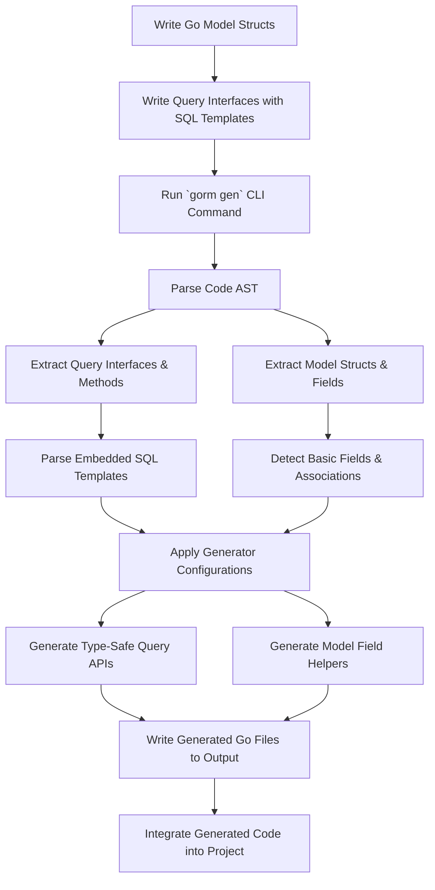

# Code Generation Workflow

## Introduction

The **Code Generation Workflow** guides you through the comprehensive process of transforming your Go code—specifically, your model structs and query interfaces—into robust, type-safe, fluent APIs and field helpers with GORM CLI. This page details each step from writing input code, running the generator, through to integrating and utilizing the generated outputs efficiently in your development cycle.

By understanding this workflow, you can maximize the productivity gains offered by GORM CLI while maintaining clarity, maintainability, and compile-time safety in your database access layer.

---

## 1. Writing Your Models and Query Interfaces

Your journey begins by defining:

- **Model Structs**: These represent your database tables with fields corresponding to columns. Field tags and Go types guide the generation of field helpers.
- **Query Interfaces**: Written as Go interfaces that embed raw SQL templates in method comments. These define the query operations you want with strong typing.

### Model Structs

Models serve as the foundation for generating **field helpers**. These helpers enable:
- Typed filter predicates (`Eq`, `Gt`, `Between`, `IsNull` etc.)
- Update setters with zero-value or expression support
- Association helpers for relationships (has-one, has-many, belongs-to, many2many)

Example:

```go
// User model struct
type User struct {
    ID        uint
    Name      string
    Email     string
    Age       int
    CreatedAt time.Time
}
```

### Query Interfaces

Interfaces declare your query methods with embedded SQL templates in comments, combining placeholders, conditionals, and loops via the GORM CLI SQL Template DSL.

Example:

```go
// Query interface with SQL annotations
// SELECT * FROM @@table WHERE id=@id
GetByID(id int) (T, error)

// UPDATE @@table
// {{set}}
//   {{if user.Name != ""}} name=@user.Name, {{end}}
// {{end}}
// WHERE id=@id
UpdateUser(user User, id int) error
```

### Embedded SQL Template DSL Highlights

| Directive  | Usage                                  | Purpose                                |
|------------|----------------------------------------|----------------------------------------|
| `@@table`  | `SELECT * FROM @@table WHERE id=@id`  | Resolves to the model's table name    |
| `@param`  | `WHERE name=@user.Name`                | Binds Go method param to SQL           |
| `{{where}}`| conditional WHERE clauses              | Conditional, dynamic filtering logic   |
| `{{set}}`  | conditional SET for UPDATE             | Dynamic update columns                 |
| `{{if}}`   | conditional SQL fragments              | Include SQL only if condition true    |
| `{{for}}`  | iterate collections                    | Build complex queries dynamically      |

<Tip>
Using these directives lets your query interfaces stay concise yet expressive, enabling powerful type-safe code generation.
</Tip>

---

## 2. Running the Generator

Once models and query interfaces are declared, invoke the GORM CLI generator to convert them into concrete code, workflows include:

### Command Usage

```bash
gorm gen -i ./path/to/your/package -o ./generated/output
```

- `-i` specifies your input directory or file with Go models and interfaces
- `-o` defines where the generated code will be written

### How GORM CLI Analyzes Code

- Parses Go source files using Go's AST parser.
- Extracts interfaces and their methods, and recognizes embedded SQL templates.
- Processes model structs, detecting fields and associations.
- Applies optional configuration (`genconfig.Config`) to customize generation (output location, type mappings, filtering).

### Output

The generator produces:
- **Concrete Query Implementations:** Typed struct implementations of your interfaces with methods executing the generated SQL.
- **Field Helper Variables:** Global variables representing your model’s fields and associations for building fluent queries.

Example output usage:

```go
// Query User by ID
user, err := generated.Query[User](db).GetByID(ctx, 123)

// Use field helper in where clause
users, err := gorm.G[User](db).
  Where(generated.User.Age.Gt(18)).Find(ctx)
```

<Tip>
If you want to control which interfaces or structs get generated, use package-level `genconfig.Config` with `Include*` and `Exclude*` filters.
</Tip>

---

## 3. Integrating Generated Code

The generated code integrates smoothly with GORM’s existing APIs, enhancing your development without changing underlying patterns.

### Typical Workflow

1. Import the generated package alongside your models.
2. Use generated query interfaces for CRUD or complex queries with compile-time safety.
3. Employ field helpers to write expressive filter or update conditions without risk of runtime mistakes.
4. Manage associations using association helpers for `Create`, `Update`, `Unlink`, and `Delete` operations.

### Example: Fluent Queries and Updates

```go
// Find users older than 25
users, err := gorm.G[User](db).
  Where(generated.User.Age.Gt(25)).Find(ctx)

// Update user name by ID
err := generated.Query[User](db).
  UpdateUser(ctx, User{Name: "newname"}, 123)
```

### Association Example

```go
// Create user with associated pets
err := gorm.G[User](db).
  Set(
    generated.User.Name.Set("alice"),
    generated.User.Pets.Create(generated.Pet.Name.Set("fido")),
  ).
  Create(ctx)
```

<Tip>
Remember that `Create` operations insert new rows followed by applying association actions, while `Update` modifies existing rows and applies associations accordingly.
</Tip>

---

## 4. Behind the Scenes: Detailed Workflow

Here is a figurative flow outlining what happens internally:



This diagram illustrates the transition from your source code to the enforced, generated code you consume.

---

## 5. Customization and Extensions

You can customize generation behavior via a **package-level `genconfig.Config`**:

- Override output directories
- Map Go types (e.g., `sql.NullTime`) to chosen field helpers for custom SQL generation
- Whitelist or blacklist interfaces or structs by pattern or explicit name

Example config:

```go
var _ = genconfig.Config{
  OutPath: "output/generated",
  FieldTypeMap: map[any]any{
    sql.NullTime{}: field.Time{},
  },
  IncludeInterfaces: []any{"Query*"},
}
```

<Tip>
Establish configuration early in your project to keep generation scope manageable and predictable.
</Tip>

---

## 6. Common Pitfalls and Troubleshooting

- **No output generated?**
  - Verify `-i` path is correct and contains expected Go files.
  - Confirm that structs and interfaces meet export and naming conventions.
  - Check filters in `genconfig.Config` aren’t excluding your files.

- **Errors parsing SQL templates?**
  - Review your embedded SQL; ensure placeholders and DSL constructs conform to syntax.
  - Avoid escaping errors, and use the provided template DSL directives properly.

- **Compile errors after generation?**
  - Check Go module dependencies are up to date.
  - Ensure generated files are within your module path and correctly imported.

For detailed issue resolutions, refer to the [Troubleshooting Guide](/getting-started/validation/troubleshooting).

---

## Summary

This workflow empowers you to write concise, declarative models and queries in Go, then leverage GORM CLI to automate the creation of safe, efficient, and maintainable data access layers. Each step—from code writing through generation to integration—works cohesively to improve your development experience, reduce boilerplate, and catch errors early.

---

## See Also

- [What is GORM CLI?](/overview/product-intro/what-is-gorm-cli)
- [Core Concepts & Terminology](/overview/architecture-concepts/core-concepts-terminology)
- [Building Type-Safe Queries with Interfaces](/guides/core-workflows/type-safe-queries)
- [Using Model-Driven Field Helpers](/guides/core-workflows/field-helpers)
- [Configuring the Generator](/getting-started/configuration/generator-configuration)
- [Troubleshooting Common Issues](/getting-started/validation/troubleshooting)

---

## Additional Resources

Explore the [GORM CLI GitHub repository](https://github.com/go-gorm/cli) for source code and examples.

---

By mastering this workflow, you will seamlessly integrate GORM CLI into your Go projects, increasing productivity while ensuring your database interactions are safe, maintainable, and expressive.
