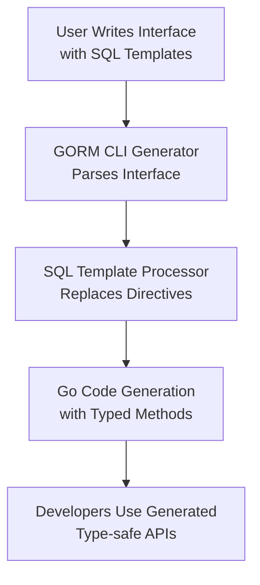

# SQL Template DSL & Type Mapping

GORM CLI enables you to write expressive, type-safe database queries through a powerful SQL template DSL embedded directly in Go interface method comments. This page unpacks the key directives, how to write conditional and dynamic SQL fragments, and how Go types and struct-level metadata translate into corresponding helper methods and SQL constructs during generation.

---

## Understanding the SQL Template DSL

At the heart of GORM CLI’s query interface generation is its bespoke Template Domain-Specific Language (DSL). This DSL allows you to embed parameterized SQL queries and dynamic conditional blocks inside Go interface comments. The generator interprets these templates and produces type-safe, performant implementations.

### Core Directives and Placeholders

- `@@table`

  Resolves to the database table name associated with the Go model struct linked to the query interface.

  ```sql
  SELECT * FROM @@table WHERE id=@id
  ```

- `@@column`

  Used for dynamic column substitution, allowing you to safely reference a column name as a SQL identifier.

  ```sql
  SELECT * FROM @@table WHERE @@column=@value
  ```

- `@param`

  Binds Go method parameters to query parameters for safe, automatic SQL placeholder filling.

  ```sql
  WHERE name=@user.Name AND age>@user.Age
  ```

- `{{where}} ... {{end}}`

  Defines a conditional WHERE clause block. Content inside is included only if it evaluates to non-empty after processing conditions.

  ```sql
  SELECT * FROM @@table
  {{where}}
    {{if user.Name != ""}} name=@user.Name {{end}}
    {{if user.Age > 0}} AND age=@user.Age {{end}}
  {{end}}
  ```

- `{{set}} ... {{end}}`

  Used to build dynamic SET clauses for UPDATE statements, including fields conditionally.

  ```sql
  UPDATE @@table
  {{set}}
    {{if user.Name != ""}} name=@user.Name, {{end}}
    {{if user.Age > 0}} age=@user.Age, {{end}}
    {{if user.Age >= 18}} is_adult=1 {{else}} is_adult=0 {{end}}
  {{end}}
  WHERE id=@id
  ```

- `{{if condition}} ... {{end}}` and `{{else}}`

  Standard conditional fragments that control inclusion of parts of the SQL based on method parameters or other variables.

- `{{for _, item := range collection}} ... {{end}}`

  Iterates over collections (e.g., slices), allowing generation of dynamic OR/AND clauses or multi-row inserts.

### Example: Combining Directives

```go
// SELECT * FROM @@table
// {{where}}
//   {{for _, user := range users}}
//     {{if user.Name != "" && user.Age > 0}}
//       (name = @user.Name AND age=@user.Age AND role LIKE concat("%",@user.Role,"%")) OR
//     {{end}}
//   {{end}}
// {{end}}
Filter(users []User) ([]T, error)
```

This example generates a dynamic WHERE clause filtering on a collection of users, automatically composing SQL OR expressions for each valid user.

---

## How GORM CLI Processes Templates

1. **Parsing:** The CLI loads your Go interface source file, extracting SQL templates embedded as comments in each method.
2. **Templating:** It evaluates conditional blocks (`{{if}}`, `{{for}}`, `{{where}}`, `{{set}}`) to include or omit clauses based on parameter values.
3. **Parameter Binding:** It converts all Go method parameters referenced via `@param` to safely bound query parameters.
4. **Table and Column Resolution:** `@@table` and `@@column` placeholders are replaced with the model's table name and safely escaped columns, preventing injection.
5. **Code Generation:** The final rendered SQL string and parameter assembly code are generated into method implementations with fully typed signatures.

### Benefits

- Ensures **compile-time safety** by binding Go parameters directly and preventing SQL injection.
- Supports **dynamic, conditional query composition** without verbose manual coding.
- Leverages Go generics for flexible, reusable code patterns.

---

## Go Types to SQL and Helper Method Mapping

GORM CLI tightly integrates your Go types and struct tags with SQL generation, empowering you with strongly typed, discoverable query helpers.

### Field Helpers Overview

Each exported field in your Go model struct generates a corresponding field helper. These helpers provide methods for predicates, setters, and expressions tailored to the field’s type.

Example:

```go
// Model
type User struct {
  ID   uint
  Name string
  Age  int
}

// Generated Helpers Usage
u := generated.User

// Predicates
u.ID.Eq(123)           // id = 123
u.Name.Like("%jinzhu%") // name LIKE '%jinzhu%'
u.Age.Between(18, 65)   // age BETWEEN 18 AND 65

// Setters
u.Name.Set("jinzhu")
u.Age.Incr(1)           // age = age + 1
```

### Type Mapping Rules

| Go Type                   | Generated Field Helper Type    | Description                                       |
|---------------------------|-------------------------------|---------------------------------------------------|
| `string`                  | `field.String`                 | Basic string predicates and setters               |
| `int`, `int32`, `int64`  | `field.Number[int type]`       | Numeric operators like Eq, Gt, Lt, Between        |
| `float32`, `float64`      | `field.Number[float type]`     | Numeric predicates with float support             |
| `bool`                   | `field.Bool`                   | Boolean predicates and setters                     |
| `time.Time`              | `field.Time`                   | Time comparisons and setters                        |
| Structs (custom types)    | `field.Struct[Type]`           | Association fields mapped to struct helpers       |
| Slices                   | `field.Slice[ElementType]`    | Has-many or many-to-many relationship helpers     |
| Types implementing `Scanner` or `Valuer` | `field.Field[Type]`       | Generic type support for complex DB types          |

### Using `gen` Struct Tags for Custom Mapping

You can specify custom field helper types using struct tags with the `gen` key:

```go
// User model with custom JSON field helper
type User struct {
  Profile string `gen:"json"` // Will generate a JSON type helper
}
```

Refer to your package-level `genconfig.Config` to map `gen` tags or Go types to your own helpers.

---

## Practical Examples

### Template with Conditional WHERE

```go
// SELECT * FROM @@table
// {{where}}
//   {{if name != ""}} name=@name {{end}}
//   {{if age > 0}} AND age>@age {{end}}
// {{end}}
FilterByNameAndAge(name string, age int)
```

Generates dynamic filtering based on whether `name` and `age` passed as parameters are non-default.

### Dynamic Update SET Clause

```go
// UPDATE @@table
// {{set}}
//   {{if user.Name != ""}} name=@user.Name, {{end}}
//   {{if user.Age > 0}} age=@user.Age, {{end}}
// {{end}}
// WHERE id=@id
UpdateUser(user User, id int) error
```

Builds an update statement only setting changed fields, avoiding unnecessary writes.

### Iteration and Complex Filtering

```go
// SELECT * FROM @@table
// {{where}}
//   {{for _, user := range users}}
//     {{if user.Name != "" && user.Age > 0}}
//       (name=@user.Name AND age=@user.Age) OR
//     {{end}}
//   {{end}}
// {{end}}
Filter(users []User) ([]T, error)
```

Generates a compound OR condition filtering for all users in the collection.

---

## Common Pitfalls & Tips

- **Always ensure placeholders match Method Parameters:** Use `@param` precisely as defined in the method signature for automatic binding.
- **Avoid Complex Logic in Templates:** Templates support conditionals and loops but complex computation or business logic should be done in Go.
- **Check for Trailing Commas or Logical Operators:** When using `{{set}}` or `{{where}}` blocks, trim trailing commas or AND/OR connectors properly to avoid SQL syntax errors; the generator handles standard trimming.
- **Map Custom Go Types:** For non-standard field types, declare mappings in `genconfig.Config` to generate appropriate helpers.
- **Use `@@table` & `@@column` for Safety:** Prefer these over hardcoded table or column names to keep queries portable and safe.

---

## Visualizing the Data Flow



This flow shows how your annotated interface methods turn into concrete, safe Go querying code.

---

## Next Steps

- Explore the [Building Type-Safe Queries with Interfaces](../guides/core-workflows/type-safe-queries) guide for practical interface design.
- Learn about [Using Model-Driven Field Helpers](../guides/core-workflows/field-helpers) to apply the generated field helpers in your queries.
- Customize generation via [Configuring the Generator](../../getting-started/configuration/generator-configuration).


---

## References

- [SQL Template DSL Syntax Example](../../guides/advanced-patterns/template-based-queries)
- [genconfig.Config for Field Mapping](../../getting-started/configuration/generator-configuration)
- [GORM CLI Quickstart Workflow](../../overview/integration-getting-started/quickstart-workflow)


---