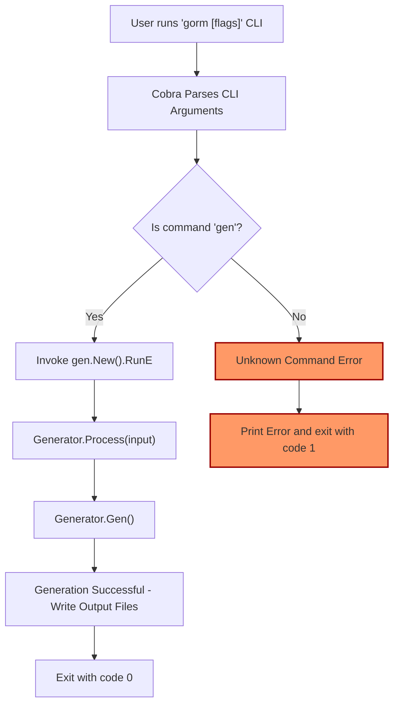

# CLI Bootstrapping and Command Structure

Understanding how the GORM CLI is structured and operates at the command line level is essential for effectively generating type-safe query APIs and model-driven helpers. This guide unpacks the entry point of the CLI, the organization of commands, particularly the `gen` subcommand, and the orchestration role played by the Cobra library in workflow management and error handling.

---

## 1. Entry Point: Starting the CLI

The GORM CLI's lifecycle begins in the `main.go` file. Here, an instance of the Cobra root command (`gorm`) is created, serving as the base command that users interact with.

```go
func main() {
    rootCmd := &cobra.Command{
        Use:   "gorm",
        Short: "GORM CLI Tool",
    }

    rootCmd.AddCommand(gen.New())

    if err := rootCmd.Execute(); err != nil {
        fmt.Println(err)
        os.Exit(1)
    }
}
```

- **Root Command (`gorm`)**: This is the main CLI executable users invoke.
- **Subcommand Registration**: The generator subcommand `gen` is registered dynamically through `gen.New()`.
- **Execution & Error Handling**: `Execute()` runs the appropriate command based on user input. If execution returns an error, it is printed, and CLI exits with a failure code.

### User Flow

1. User runs a CLI command prefixed with `gorm`, e.g., `gorm gen -i ./path -o ./out`.
2. Cobra parses the CLI arguments and dispatches control to the appropriate subcommand handler (`gen` in this case).
3. Errors encountered at any step prompt immediate CLI termination with user-friendly output.

---

## 2. The `gen` Subcommand: Command Definition and Workflow

The `gen` subcommand is the core entry point for code generation. It transforms raw SQL-annotated Go interfaces into fully typed query APIs and model-driven field helpers.

```go
func New() *cobra.Command {
    var output string
    var input string

    cmd := &cobra.Command{
        Use:   "gen",
        Short: "Generate GORM query code from raw SQL interfaces",
        RunE: func(cmd *cobra.Command, args []string) error {
            g := Generator{
                Files:   map[string]*File{},
                outPath: output,
            }

            err := g.Process(input)
            if err != nil {
                return fmt.Errorf("error processing %s: %v", input, err)
            }

            err = g.Gen()
            if err != nil {
                return fmt.Errorf("error render template got error: %v", err)
            }

            return nil
        },
    }

    cmd.Flags().StringVarP(&output, "output", "o", defaultOutPath, "Directory to place generated code")
    cmd.Flags().StringVarP(&input, "input", "i", "", "Path to Go interface file with raw SQL annotations")
    cmd.MarkFlagRequired("input")

    return cmd
}
```

### Key Points of the `gen` Command

- **Flags:**
  - `-i` / `--input`: Required. Path to the Go interface file containing raw SQL comments.
  - `-o` / `--output`: Optional. Directory to place the generated code. Defaults to `./g`.

- **Run Logic:**
  - Instantiates a `Generator` with an empty file map and the desired output path.
  - Calls `Process(input)` to parse Go files, extract metadata, interfaces, and struct definitions.
  - Calls `Gen()` to generate code files based on processed data.
  - Ensures any errors in processing or generation bubble up to the CLI level for handling.

### Workflow Summary

- User invokes the command with necessary flags.
- The generator engine processes interface files recursively, applying any configuration.
- The engine produces output files in the defined directory.
- CLI reports success or detailed errors.

---

## 3. Command Orchestration with Cobra

The CLI leverages the [Cobra](https://github.com/spf13/cobra) library to orchestrate its command parsing, subcommand structure, flag management, and error reporting.

### Responsibilities Managed by Cobra

- **Command Tree Management:** Cobra enables modular subcommands (like `gen`) to register themselves easily with the root.
- **Flag Parsing & Validation:** It parses command-line flags, supports required flags (`cmd.MarkFlagRequired`), and provides automatic help documentation.
- **Execution Control:** It runs the configured `RunE` functions, ensuring errors can be returned and handled gracefully.
- **User Feedback:** Provides help text, usage instructions, and error messages to guide the user.

### Why Cobra?

- Standard CLI builder for Go projects.
- Robust subcommand capabilities that scale with the product.
- Clean separation of concerns between command definition and execution logic.

---

## 4. Extensibility Model: Subcommands like `gen`

The CLI is designed for extensibility by incorporating subcommands that encapsulate distinct workflows.

- **Subcommand Modularity:** Each major operation (e.g., code generation) is encapsulated within its own Cobra command struct.
- **Registering Subcommands:** The root command registers subcommands via `.AddCommand()`. Currently, `gen` is the primary subcommand.
- **Custom Flags & Behavior:** Each subcommand defines its own flags and handles its workflow independently.
- **Future Extension:** Additional subcommands—for testing, configuration, or integration—can be added without affecting the core CLI structure.

---

## 5. Visualizing the CLI Bootstrapping and Command Flow



---

## 6. Practical Tips and Best Practices

- Always provide the required `-i` flag pointing to the interface file(s) containing SQL annotations.
- Use the `-o` flag to organize generated code in your project structure.
- Errors during generation report file names and error details to help troubleshooting.
- Explore Cobra’s built-in help system (`gorm gen --help`) for flag descriptions and command usage.
- Anticipate adding multiple subcommands in future versions as your workflow evolves.

---

## 7. Troubleshooting Common CLI Issues

- **Missing Required Flags:** The CLI enforces required flags (e.g., `-i`), and will prompt if missing.
- **File Parsing Errors:** Ensure your input Go files are syntactically correct.
- **Permission Issues:** Verify that output directories are writable.
- **Unexpected CLI Errors:** Check the error output printed and refer to troubleshooting documentation for common cases.

---

## 8. Next Steps

Once comfortable with the CLI entry and command structure:

- Explore the [Generating Code guide](/getting-started/first-steps/generating-code) to learn how to write interface annotations and trigger generation.
- Study the [Core Concepts & Terminology](/overview/concepts-architecture/core-concepts-terminology) to understand the generated artifacts.
- Dive deeper into customizing the generation process via configuration as documented in [Customizing Generation](/guides/advanced-patterns/customizing-generation).

---