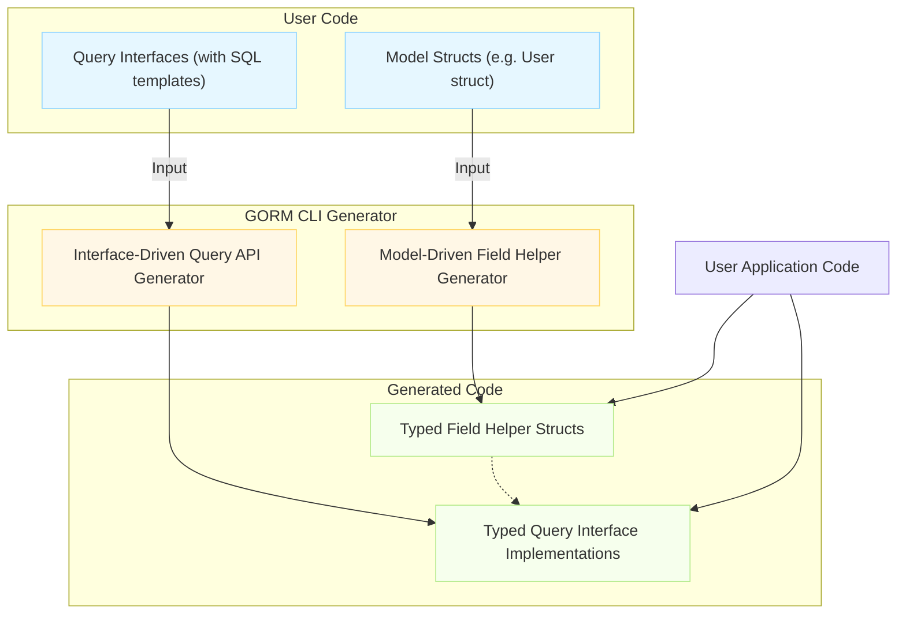

# The Dual Generator Approach

Discover how GORM CLI separates generation into two parallel, complementary workflows that together deliver powerful, type-safe, and expressive data access APIs for your Go projects.

---

## Introduction

GORM CLI employs a **dual generator architecture** that distinctly handles:

1. **Query API Generation from Interfaces**
2. **Field Helper Generation from Models**

This separation allows each part to focus on its strengths, ensuring clean, maintainable, and compile-time safe code generation that closely maps to your intentions.

By understanding these two coexist alongside each other, users gain:

- **Compile-time Safety**: Each generated piece is type-checked at compile time, preventing runtime surprises.
- **Expressive APIs**: Fluent, discoverable code for querying and updating.
- **Consistency & Decoupling**: Query methods and model fields evolve independently but harmoniously.

---

## 1. Query API Generation from Interfaces

### What Users Write

You define Go interfaces annotated with SQL templates inside method comments. Example:

```go
// Query interface with templated SQL methods
type Query[T any] interface {
  // SELECT * FROM @@table WHERE id=@id
  GetByID(id int) (T, error)

  // SELECT * FROM @@table WHERE @@column=@value
  FilterWithColumn(column string, value string) (T, error)

  // UPDATE @@table
  // {{set}}
  //   {{if user.Name != ""}} name=@user.Name, {{end}}
  // {{end}}
  // WHERE id=@id
  UpdateInfo(user models.User, id int) error
}
```

### What GORM CLI Generates

- Concrete implementations that create type-safe queries based on your SQL templates.
- Automatic parameter binding.
- Context integration injected automatically if not declared.

### Key Benefits

- Method signatures reflect your exact query contract.
- Compile-time matching of parameters and return types.
- SQL templates are processed into Go code generating `strings.Builder` based SQL with parameters.

---

## 2. Field Helper Generation from Models

### What Users Write

Define Go structs as your models. Example:

```go
type User struct {
  ID        uint
  Name      string
  Age       int
  Profile   string `gen:"json"` // Custom field mapping example
}
```

### What GORM CLI Generates

- Typed field helpers for every model field, reflecting their Go type.
- Helpers for predicates (e.g., `Eq`, `Gt`, `Between`), setters, updates, and association helpers.

Example generated snippet:

```go
var User = struct {
  ID      field.Number[uint]
  Name    field.String
  Age     field.Number[int]
  Profile examples.JSON
}{
  ID:      field.Number[uint]{}.WithColumn("id"),
  Name:    field.String{}.WithColumn("name"),
  Age:     field.Number[int]{}.WithColumn("age"),
  Profile: examples.JSON{}.WithColumn("profile"),
}
```

### Key Benefits

- Strongly typed predicates and setters that guide query and update construction.
- Association fields generate specialized helpers for related data operations.
- Customizable field mappings (e.g., JSON) reflect dialect-specific behaviors.

---

## How the Two Workflows Fit Together

| Aspect                   | Query API Generation                                | Model Field Helper Generation                     |
|--------------------------|----------------------------------------------------|--------------------------------------------------|
| **Input**                | Go interface with SQL templates in comments        | Go struct model definitions                       |
| **Output**               | Concrete interface implementations with typed methods | Typed field helper structs with fluent methods   |
| **User Intent**          | Write reusable, typed query methods with dynamic SQL | Easily build and compose predicates and updates on models |
| **Benefits**             | Compile-time validation of queries and parameters  | Safe, readable, and expressive query building    |

### User Workflow Example

1. Define `Query[T]` interface with SQL templates.
2. Define `User` model struct.
3. Run `gorm gen` command to generate both query API code and field helpers.
4. Use generated query APIs with the typed field helpers for filtering, creation, update, and association management.

---

## Visual Overview



---

## Practical Tips & Best Practices

- **Keep Interfaces Focused:** Write clear and concise query interfaces with self-contained methods.
- **Use Template DSL Thoughtfully:** Leverage GORM CLI’s SQL DSL directives like `@@table`, `{{where}}`, `{{set}}` to build flexible queries.
- **Model Annotation:** Use struct tags (e.g., `gen:"json"`) for customized field helper behavior.
- **Combine APIs:** Use generated query methods alongside field helpers to build complex filters and updates fluidly.
- **Operate Associations Safely:** Take advantage of model-driven association helpers for manipulation without manual FK handling.

---

## Common Pitfalls to Avoid

- Interface methods lacking return types or having invalid signatures—must return error at minimum.
- Missing context parameter in queries: generator auto-adds it, but explicit use is clearer.
- Relying solely on raw SQL strings without using the templates reduces the type-safety benefits.
- Forgetting to run code generation after model/interface changes may cause type mismatches.

---

## Troubleshooting

<AccordionGroup title="Common Issues in Dual Generator Approach">
<Accordion title="Generated Code Compilation Fails">
- Verify your interface method signatures meet required return values
- Confirm no duplicate or conflicting model fields
- Ensure you ran the generator after the last code changes
</Accordion>
<Accordion title="Query Methods Not Found in Generated Code">
- Check the method documentation comments include SQL templates
- Make sure interface methods have valid return types
</Accordion>
<Accordion title="Field Helpers Not Reflecting Custom Mappings">
- Check your `genconfig.Config` for correct field mappings
- Confirm code generation uses the updated config
</Accordion>
</AccordionGroup>

---

## Next Steps

- Dive deeper into [Template-Based Query Definitions](/concepts/query-templates-config/template-query-dsl) to master SQL templating.
- Explore [Model-Driven Field Helpers](/concepts/data-models-helpers/model-driven-field-helpers) for advanced filtering and updates.
- Learn about [Working with Associations](/guides/advanced-patterns/working-with-associations) to manage relationships effectively.

---

## References

- [Example Query Interface](https://github.com/go-gorm/cli/blob/main/examples/query.go)
- [Generated User Field Helper](https://github.com/go-gorm/cli/blob/main/examples/output/models/user.go)
- [GORM CLI README](https://github.com/go-gorm/cli/blob/main/README.md)

---

By embracing the Dual Generator Approach, you unlock the full power of GORM CLI’s code generation, delivering robust, type-safe database interactions tailored to your Go applications.