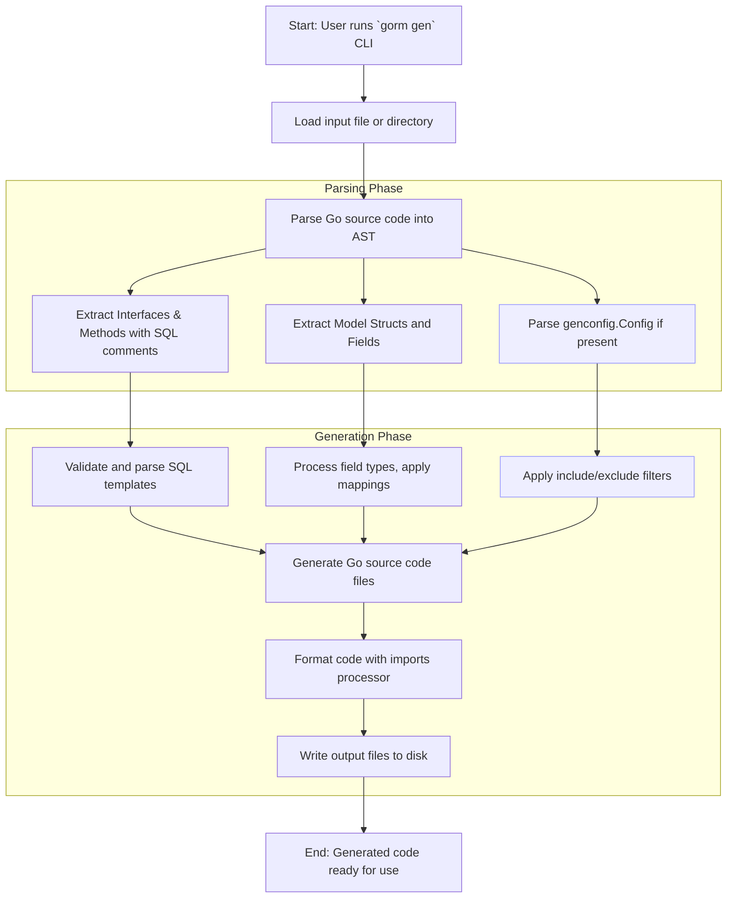

# Code Generation Workflow

Discover how GORM CLI interprets your Go interfaces and model structs to automatically generate powerful, type-safe query APIs and model-driven field helpers. This guide walks you through the end-to-end process GORM CLI follows — from scanning your code base to parsing SQL templates, and finally producing tailored Go source files that seamlessly integrate with GORM.

---

## Introduction

At the heart of GORM CLI lies a robust code generation engine that transforms user-defined interfaces (with embedded SQL templates) and model structs into compiled, type-safe Go code. This process eliminates boilerplate, enforces compile-time safety, and accelerates development, empowering you to write expressive and maintainable data access layers.

This workflow documentation focuses specifically on how the CLI manages input scanning, parsing, template-driven rendering, and output, revealing where and how your source code fits within this flow.

---

## Key Concepts of the Code Generation Workflow

### 1. Input Scanning and Parsing

- **User-Provided Inputs:** You start by defining Go interfaces that describe query methods adorned with SQL annotations in comments, alongside your GORM-compatible model structs.
- **Input Scope:** The CLI accepts either a single file or an entire directory. When it traverses a directory, it recursively scans all Go files, intelligently skipping generated files to avoid unnecessary processing.
- **AST Parsing:** Each Go source file is parsed into an Abstract Syntax Tree (AST), enabling precise extraction of:
  - Package and import declarations
  - Interface types and their methods along with comment annotations (where SQL templates reside)
  - Struct types representing your models, including fields and metadata
  - Configuration literals (e.g., `genconfig.Config`) where present

### 2. Interface and Method Extraction

- The generator inspects each interface to:
  - Identify method signatures and parameters
  - Parse SQL templates embedded in method comments
  - Validate method return values, enforcing predictive return patterns (e.g., last return value must be `error`)

- **SQL Extraction:** Comments are parsed to detect raw SQL or templated SQL sections like `SELECT`, `WHERE`, `SET`, enabling dynamic query construction.

### 3. Model Struct Analysis

- For each struct, the generator analyzes:
  - Field names, types, and associated GORM tags
  - Named or custom type mappings via configuration
  - Embedded structs, inline or from other packages, to flatten fields logically

- The CLI produces metadata representing these structs to generate strongly typed field helpers (e.g., `generated.User.Name.Eq(\"alice\")`).

### 4. Configurations and Overrides

- The generator discovers any package-level configuration literals (`genconfig.Config`), which control:
  - Output file paths
  - Inclusion/exclusion filters for interfaces and structs
  - Custom field type and name mappings
  - File-level vs package-level scope of configuration

- These configurations influence filter application and package organization during code emission.

### 5. SQL Template Rendering

- Embedded SQL templates undergo transformation through a dedicated renderer that:
  - Replaces placeholders like `@@table` and `@@column` with `clause.Table` and `clause.Column` references
  - Translates parameters prefixed with `@` into method call arguments
  - Expands SQL templating directives (`{{where}}`, `{{set}}`, conditional blocks) into efficient Go code for query building

- The rendered SQL is embedded within generated method implementations to produce executable code.

### 6. Code Generation and File Writing

- The generator processes each parsed file, applying configurations and filters to determine what interfaces and structs to generate.
- For each interface and struct:
  - Query API code is generated: interfaces with type parameters, concrete implementations wrapping `gorm.Interface`, and methods reproducing your annotated SQL
  - Field helper sets are generated: static variables offering fluent syntax for filtering, updating, and association operations

- Output files maintain directory structure relative to inputs, with the option to override output paths via configuration or CLI flags.

- After raw code generation, the output is formatted using Go imports processor (`golang.org/x/tools/imports`) to ensure idiomatic and clean source files.

---

## User-Focused Workflow

### Step 1: Define Your Interfaces and Models

Write Go interfaces with method comments containing SQL templates and corresponding structs with GORM tags and Go field types.

```go
// Interface example
// SELECT * FROM @@table WHERE id=@id
GetByID(id int) (T, error)

// Model struct example
type User struct {
  ID int
  Name string
  Age int
}
```

### Step 2: Configure (Optional)

Optionally create a `genconfig.Config` literal in your package to customize output paths, filter which interfaces/structs to generate, and add type mappings for special fields.

```go
var _ = genconfig.Config{
  OutPath: "generated",
  IncludeInterfaces: []any{"Query*"},
  FieldTypeMap: map[any]any{
    sql.NullTime{}: field.Time{},
  },
}
```

### Step 3: Run the Generator

Invoke the CLI command with your input directory or interface file and specify the output directory:

```bash
gorm gen -i ./examples -o ./generated
```

The CLI scans, parses, and generates Go code for your query APIs and field helpers, printing progress messages.

### Step 4: Use the Generated Code

Import your generated package and instantiate query interfaces or use field helpers:

```go
u, err := generated.Query[User](db).GetByID(ctx, 123)
whereClause := generated.User.Name.Eq("alice")
users, err := gorm.G[User](db).Where(whereClause).Find(ctx)
```

---

## Behind the Scenes: Flow Diagram



---

## Practical Tips and Best Practices

- **Keep interfaces and models co-located when possible.** Placing query interfaces and model structs in the same directory or package ensures the generator discovers all relationships and generates correct field helpers.
- **Use clear, consistent SQL templates in method comments.** Stick to the supported directives like `@@table`, `@param`, and `{{where}}` blocks to leverage the templating engine fully.
- **Leverage configuration for complex projects.** When multiple packages or patterns exist, use `genconfig.Config` to include/exclude interfaces or structs and to manage output paths.
- **Avoid manually editing generated files.** Generated code includes a clear header prohibiting edits; regenerate when your interfaces or models change.
- **Check generator error output carefully.** The CLI reports issues for invalid method signatures, missing return values, or parse errors in SQL templates.

---

## Common Pitfalls and Troubleshooting

- **Empty or missing output files:** Ensure input files are specified correctly and contain at least one eligible interface or struct matching any filters.
- **Invalid method signatures:** Methods must have at least one return value when using SQL templates and the last return must be an `error`.
- **SQL template syntax errors:** Review method comment annotations; malformed templates can cause generation failures.
- **Unmapped custom types:** Use `FieldTypeMap` or `FieldNameMap` in configuration to provide custom field helper mappings.

Refer to the troubleshooting documentation for step-by-step problem resolution.

---

## Summary

This Code Generation Workflow guide reveals the precise journey from your interface and model definitions through AST parsing, SQL template rendering, to sophisticated Go code generation. By understanding this flow, you gain insights into harnessing GORM CLI’s full power to generate type-safe, maintainable, and fluent data access layers effortlessly.

---

## Further Reading

- [Generating Code](https://docs.gorm.io/getting-started/first-run-generation/generating-code) — How to run the CLI and structure your inputs
- [Writing Interfaces & Models](https://docs.gorm.io/getting-started/first-run-generation/configuration-basics) — Writing type-safe query interfaces and model structs
- [Template-Based SQL](https://docs.gorm.io/guides/advanced-usage/template-based-sql) — Mastering the DSL for dynamic queries
- [Generation Configuration](https://docs.gorm.io/guides/advanced-usage/generation-configuration) — Customizing behavior via `genconfig.Config`
- [Using Generated APIs](https://docs.gorm.io/getting-started/first-run-generation/first-usage) — Leveraging the generated code in your application


---

## Source Code Links

For an in-depth dive into the generator internals:
- [gen/gen.go - CLI command setup](https://github.com/go-gorm/cli/blob/main/internal/gen/gen.go)
- [gen/generator.go - Core Generator](https://github.com/go-gorm/cli/blob/main/internal/gen/generator.go)
- [gen/template.go - Code templates](https://github.com/go-gorm/cli/blob/main/internal/gen/template.go)

Explore and contribute to the project on [GitHub](https://github.com/go-gorm/cli).
