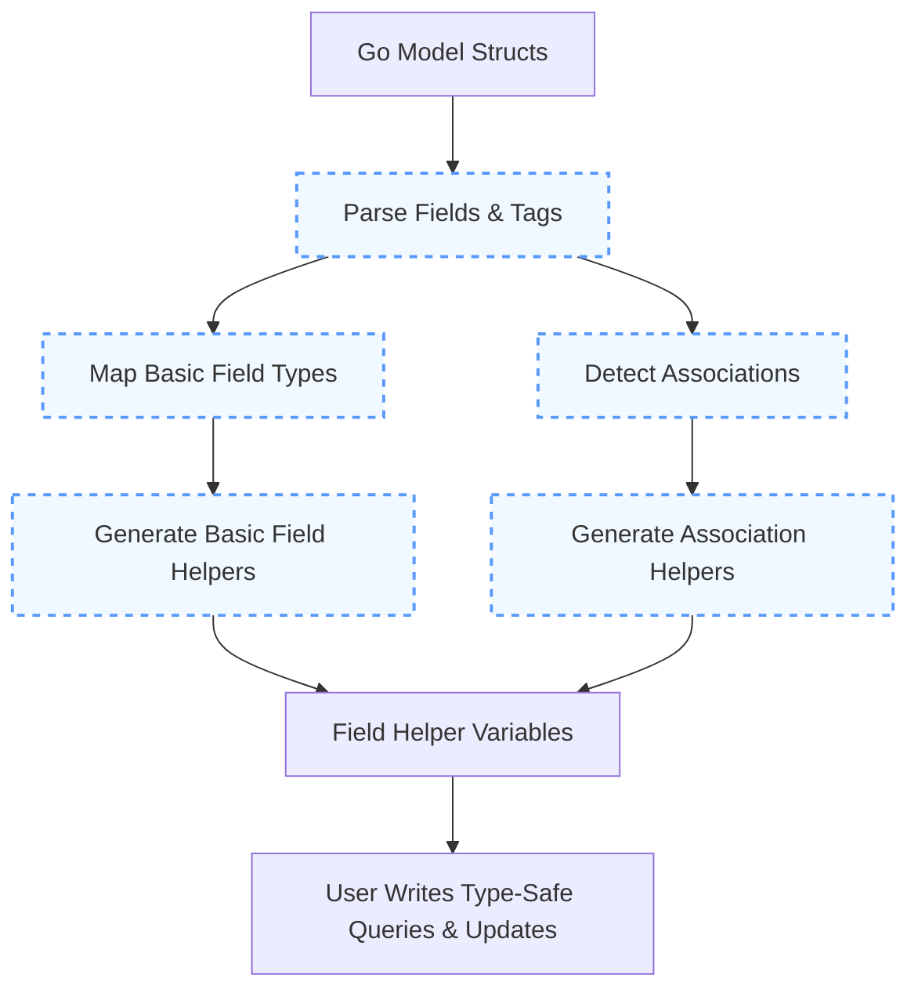

# Field Helpers & Model Mapping

GORM CLI transforms your Go model structs into powerful, type-safe field helpers that streamline database filtering, mutations, and association operations. This page explains how GORM CLI analyzes your Go structs to generate these helpers, detailing the model-driven approach, mapping rules for field types, and recognition and extension of associations.

---

## Understanding the Model-Driven Approach

At the heart of GORM CLI's field helper generation is a model-driven paradigm. The CLI parses your Go structs — which represent your database models — and automatically generates strongly typed field helpers for each field. These helpers enable you to write fluent, compile-time safe queries and updates without manually crafting SQL or boilerplate code.

### What Are Field Helpers?

Field helpers are generated typed objects representing each field in your model structs. They expose methods to build query predicates (e.g., equality, range, null checks), update assignments (including expressions), and sorting directives. For example, a struct field `Age int` generates a `field.Number[int]` helper with methods like `.Eq()`, `.Gt()`, `.Set()`, and `.Incr()`.

### Why Use Field Helpers?

- **Type Safety:** Compilers catch mistakes when incorrect field types or operations are used.
- **Simplified Queries:** Build complex WHERE and SET clauses using fluent, discoverable APIs.
- **Association Support:** Manage related records easily via generated association helpers.

### Workflow: From Struct to Field Helpers

1. Define your model structs as usual with Go and GORM conventions.
2. Run the GORM CLI generator.
3. The generator analyzes each struct's fields, recognizes types and relationships.
4. It creates corresponding field helper variables containing type-specific methods.
5. Use these helpers in your code to build type-safe database operations.


## Supported Field Types and How They Map

GORM CLI carefully maps your struct field types to appropriate field helper types to maximize both type safety and flexibility.

| Go Struct Field Type             | Generated Helper Type                 | Notes                                              |
|---------------------------------|-------------------------------------|----------------------------------------------------|
| Integer types (`int`, `uint`, `int32`, etc.) | `field.Number[<int_type>]`            | Handles numeric comparisons and arithmetic.
|
| Floating point types (`float32`, `float64`)| `field.Number[<float_type>]`            | Supports numeric operators.
|
| `string`                        | `field.String`                      | Supports LIKE, equality, and ordering.
|
| `bool`                          | `field.Bool`                        | Provides boolean logic expressions.
|
| `time.Time`                    | `field.Time`                        | Supports date/time comparisons.
|
| Nullable SQL types (e.g., `sql.NullInt64`, `sql.NullTime`) | `field.Field[nullable_type]`          | Enables IS NULL/NOT NULL queries.
|
| Byte slices (`[]byte`)          | `field.Bytes`                       | Suitable for binary data.
|
| Named types implementing Scanner/Valuer or GORM serializer | `field.Field[<type>]`                 | Custom mapping possible via configuration.
|

### Custom Mappings

- Use the `genconfig.Config` to map specific Go types or struct tags to custom field helpers.
- Example: Mapping JSON annotated fields to a JSON helper to enable database-specific JSON queries.

## Recognizing and Extending Associations

GORM CLI detects associations declared in your structs following GORM conventions, such as `has one`, `has many`, `belongs to`, `many2many`, and polymorphic relations. These associations generate specialized field helpers that extend basic field semantics to linked records.

### Association Types and Generated Helpers

| Association         | Go Field Type               | Generated Helper Type           | Description & Usage                                  |
|---------------------|-----------------------------|-------------------------------|-----------------------------------------------------|
| Has One / Belongs To | Struct                      | `field.Struct[RelatedType]`    | Access and manipulate single related records.       |
| Has Many             | Slice of pointers or structs| `field.Slice[RelatedType]`     | Manage multiple related records, batch operations.  |
| Many2Many            | Slice with `gorm:"many2many"` tag | `field.Slice[RelatedType]`     | Manage many-to-many relations via join tables.      |
| Polymorphic          | Struct or Slice with polymorphic tag | `field.Struct` or `field.Slice` | Support polymorphic relations transparently.       |

### What Association Helpers Provide

- Methods to `Create`, `CreateInBatch`, `Update`, `Unlink`, and `Delete` associated records safely and fluently.
- Support specifying filtering conditions on associated records before mutations.

### Example

Consider this Go struct snippet:

```go
type User struct {
  Account Account       // has one
  Pets    []*Pet        // has many
  Languages []Language  `gorm:"many2many:UserSpeak"` // many to many
}
```

GORM CLI generates:

```go
var User = struct {
  Account field.Struct[Account]
  Pets field.Slice[Pet]
  Languages field.Slice[Language]
}{
  Account: field.Struct[Account]{}.WithName("Account"),
  Pets: field.Slice[Pet]{}.WithName("Pets"),
  Languages: field.Slice[Language]{}.WithName("Languages"),
}
```

You can now write:

```go
gorm.G[User](db).
  Set(
    User.Name.Set("alice"),
    User.Pets.Create(Pet.Name.Set("fido")),
    User.Languages.CreateInBatch([]Language{{Code: "EN"}, {Code: "FR"}}),
  ).
  Create(ctx)
```

### Association Operation Semantics

| Operation         | Effect Summary                                                                 |
|-------------------|-------------------------------------------------------------------------------|
| Create            | Creates new associated records per matching parent record.                   |
| Update            | Updates associated records filtered by optional conditions.                  |
| Unlink            | Removes the association without deleting data (e.g., nullifies FK or removes join rows). |
| Delete            | Deletes associated records or join entries depending on relation type.       |
| CreateInBatch     | Batch create multiple associations at once (for slice associations).         |

## Field Helper Usage in Queries and Mutations

The generated helpers cover a wide range of type-safe DSL methods:

- **Predicates:** `.Eq()`, `.Neq()`, `.Gt()`, `.Lt()`, `.IsNull()`, and more.
- **Update Assignments:** `.Set()`, `.SetExpr()`, `.Incr()`, and specialized expressions.
- **Boolean Logic:** (for `.Bool` fields) `.AndExpr()`, `.OrExpr()`, `.Not()` etc.
- **Ordering:** `.Asc()`, `.Desc()`, `.OrderExpr()`.

With these helpers, you directly express your SQL logic at compile time, avoiding common mistakes and improving readability.

## Customizing the Field Helper Generation

You can fine-tune how GORM CLI maps model fields to field helpers using `genconfig.Config`:

- **OutPath:** Control output directories.
- **FieldTypeMap:** Map custom Go types to specific field helper types.
- **FieldNameMap:** Map struct field tag names (e.g., `gen:"json"`) to custom helpers.
- **Inclusion/Exclusion Lists:** Narrow down which structs and interfaces get generated.

This configuration is detected automatically at generation time if declared in your package.

### Example: Mapping a JSON Field

```go
var _ = genconfig.Config{
  FieldNameMap: map[string]any{
    "json": JSON{}, // Custom JSON helper
  },
}
```

Then a model field like:

```go
Profile string `gen:"json"`
```

will generate a `Profile` field helper using the `JSON` type, enabling database-specific JSON operations.

## Practical Tips and Best Practices

- **Keep your Go structs clean and idiomatic:** GORM CLI depends on standard Go and GORM conventions to detect fields and associations.
- **Use `genconfig.Config` for custom behavior:** For uncommon types or special handling, define explicit mappings.
- **Leverage generated association helpers:** They reduce complexity in managing related data and preserve data integrity.
- **Avoid manual SQL strings for common operations:** Use field helpers to gain type safety and code clarity.

## Common Pitfalls & Troubleshooting

- **Missing association methods:** Ensure your struct field has proper GORM tags for association recognition (e.g., `many2many`, `foreignkey`).
- **Unsupported field types:** Use `genconfig.Config` mappings if you have specialized types not automatically supported.
- **Naming mismatches:** Remember field helper naming follows your Go struct field names; check tags for custom mappings.
- **Zero outputs:** Double-check your inclusion/exclusion filters in `genconfig.Config` if some structs or interfaces do not generate helpers.

## How This Fits in the GORM CLI Ecosystem

This page complements the documentation on:

- [Type-Safe Query API Concepts](https://docs.gorm.io/concepts/architecture-core-principles/query-api-concept) — for how query interfaces and SQL templates generate APIs
- [Integration with GORM & Your Codebase](https://docs.gorm.io/overview/core-concepts-architecture/how-integration-works) — to understand your generated code in application context
- [Field Helper Usage Guide](https://docs.gorm.io/guides/core-workflows/field-helper-usage) — practical usage scenarios for the field helpers

---

## Summary Diagram: From Model Structs to Field Helpers

