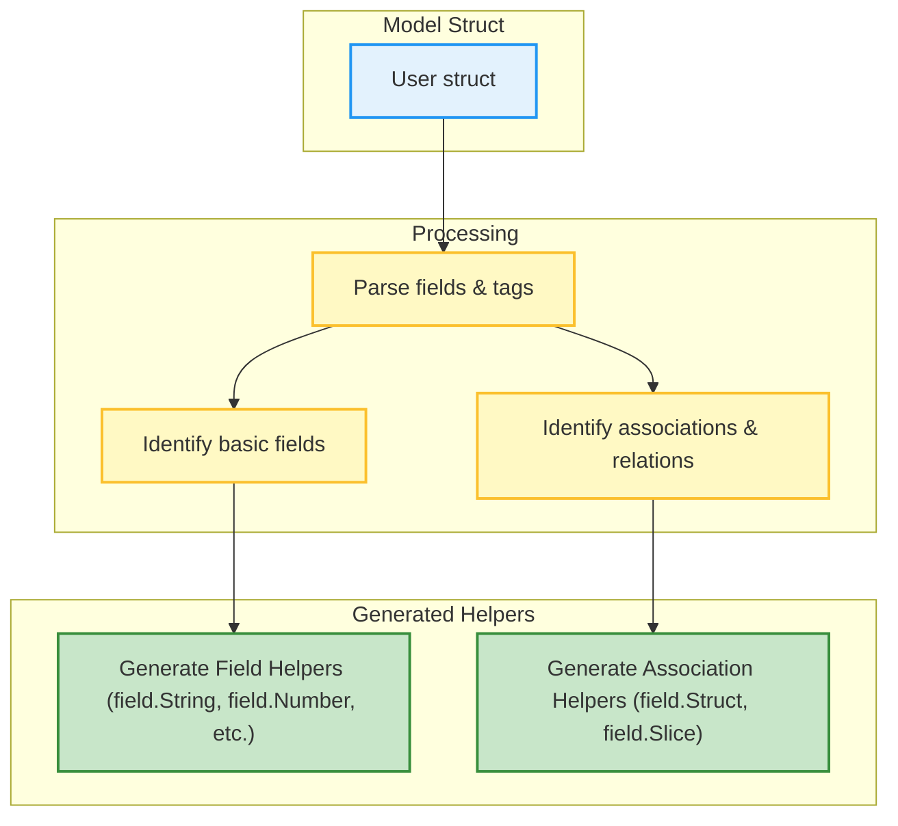

# Data Models & Schemas

GORM CLI generates powerful, type-safe field helpers and query APIs by deeply analyzing your Go model structs and query interfaces. This page explains how GORM CLI interprets your Go model definitions—including basic fields and associations—to build these helpers. It also clarifies supported field types, association processing, and how these map into generated code structures for enhanced querying and data mutation.

---

## Understanding Model Structs and Their Transformation

At the core of GORM CLI's generation process is your Go model struct, which defines the schema of your database entities in idiomatic Go. The CLI parses these structs to:

- Identify **basic fields** such as strings, integers, Booleans, time types, and database nullable types.
- Detect **associations** like `has one`, `has many`, `belongs to`, and `many-to-many` based on struct fields and GORM tags.
- Extract field metadata from struct tags (e.g., `gorm`, `gen`) that influence field naming, type mapping, or custom behaviors.

This comprehensive understanding allows GORM CLI to generate **field helpers** that mirror your model's fields exactly, providing a strongly-typed and fluent interface for predicate construction, filtering, updates, and association management.

### Example Model: User with Associations

```go
package models

import (
	"database/sql"
	"time"

	"gorm.io/gorm"
)

// User model with a variety of basic fields and associations
// This struct serves as the basis for generating corresponding field helpers
// and association helpers in generated code.
type User struct {
	gorm.Model
	Name      string
	Age       int
	Birthday  *time.Time
	Score     sql.NullInt64
	LastLogin sql.NullTime
	Account   Account            // has one
	Pets      []*Pet             // has many
	Toys      []Toy `gorm:"polymorphic:Owner"` // has many polymorphic
	CompanyID *int
	Company   Company            // belongs to
	ManagerID *uint
	Manager   *User              // single-table belongs to
	Team      []User `gorm:"foreignkey:ManagerID"` // has many single-table
	Languages []Language `gorm:"many2many:UserSpeak"` // many to many
	Friends   []*User  `gorm:"many2many:user_friends"` // many to many single-table
	Role      string
	IsAdult   bool   `gorm:"column:is_adult"`
	Profile   string `gen:"json"` // custom JSON mapping
}

// Other models omitted for brevity: Account, Pet, Toy, Company, Language
```

---

## Supported Basic Field Types

GORM CLI recognizes and maps a variety of core Go types into dedicated field helpers with type-safe predicates and setters.

| Go Type              | Generated Field Helper Type | Notes                               |
|----------------------|-----------------------------|-----------------------------------|
| `string`             | `field.String`              | Supports common string predicates |
| `int`, `uint`, …     | `field.Number[int|uint]`     | Supports numeric comparisons       |
| `bool`               | `field.Bool`                | Boolean predicates and setters    |
| `time.Time`          | `field.Time`                | Time-based comparisons             |
| `*time.Time`         | `field.Time`                | Nullable time                      |
| `[]byte`             | `field.Bytes`               | Byte slices                       |
| `sql.NullInt64`      | `field.Field[sql.NullInt64]`| Nullable integer type handling    |
| `sql.NullTime`       | `field.Time`                | Nullable time type with mapping   |

Additionally, you can customize mapping via `genconfig.Config` to handle named types or special fields, for example:

```go
var _ = genconfig.Config{
	FieldTypeMap: map[any]any{
		sql.NullTime{}: field.Time{},
	},
	FieldNameMap: map[string]any{
		"json": JSON{}, // custom JSON helper mapping
	},
}
```

The `FieldNameMap` allows you to specify custom field helpers based on struct tag names (e.g., `gen:"json"`), enabling advanced user-defined behaviors.

---

## Processing Associations

Associations are crucial for modeling relationships between entities. GORM CLI parses association information from field types and GORM tags to generate **association helpers** that empower type-safe creation, updates, linking/unlinking, and deletion operations on related entities.

Supported association types include:

| Association Type    | Detection                              | Generated Helper Type                    |
|--------------------|--------------------------------------|-----------------------------------------|
| Has One            | Struct field with direct struct type | `field.Struct[AssociatedType]`          |
| Has Many           | Slice or pointer-to-slice             | `field.Slice[AssociatedType]`            |
| Belongs To         | Pointer to struct with FK field       | `field.Struct[AssociatedType]`          |
| Many-to-Many       | Slice with `many2many` tag             | `field.Slice[AssociatedType]`            |
| Polymorphic        | Identified by `polymorphic` tag       | `field.Slice[AssociatedType]`            |

### Examples from User Model

| Field Name | Association   | Helper Type          | Notes                                         |
|------------|---------------|---------------------|-----------------------------------------------|
| `Account`  | Has One       | `field.Struct[models.Account]` | Direct related Account struct                 |
| `Pets`     | Has Many      | `field.Slice[models.Pet]`       | Slice of pointers                             |
| `Toys`     | Has Many (poly) | `field.Slice[models.Toy]`      | Polymorphic relation identified by tag       |
| `Company`  | Belongs To    | `field.Struct[models.Company]` | FK `CompanyID` and struct relationship        |
| `Languages`| Many-to-Many | `field.Slice[models.Language]`  | Join table `UserSpeak` used                    |
| `Friends`  | Many-to-Many (single table) | `field.Slice[models.User]` | Self-referential join table                     |

These association helpers allow expressive and safe operations such as:

- `Create()`: create and link related entities.
- `Update()`: update associated rows with strong typing.
- `Unlink()`: clear associations properly (e.g., null FK or remove join rows).
- `Delete()`: remove associated rows or join table entries.
- `CreateInBatch()`: efficiently create many related rows at once.

---

## How Field Helpers Represent Fields

Each generated field helper corresponds to either a basic field or an association. Depending on the field type, the generator produces one of these helper types:

| Field Type                     | Field Helper Construction                 | Example                                   |
|-------------------------------|-------------------------------------------|-------------------------------------------|
| Basic Field (e.g., string)     | `field.String{}.WithColumn("column_name")` | `User.Name` → `field.String{}.WithColumn("name")` |
| Numeric Field (int, float)    | `field.Number[T]{}.WithColumn("column_name")` | `User.Age` → `field.Number[int]{}.WithColumn("age")` |
| Nullable/Custom Field (sql.NullInt64, JSON) | `field.Field[T]{}.WithColumn("column_name")` | `User.Score` → `field.Field[sql.NullInt64]{}.WithColumn("score")` |
| Has One / Belongs To (struct) | `field.Struct[AssociatedType]{}.WithName("FieldName")` | `User.Account` → `field.Struct[models.Account]{}.WithName("Account")` |
| Has Many / Many To Many (slice) | `field.Slice[AssociatedType]{}.WithName("FieldName")` | `User.Pets` → `field.Slice[models.Pet]{}.WithName("Pets")` |

This mapping ensures that your Go types and relationships receive idiomatic and safe query helper methods matching the domain types.

---

## Generated Model Helper Example

Below is a snippet from a generated file that illustrates the field helpers for a `User` model, including associations:

```go
var User = struct {
	ID        field.Number[uint]
	CreatedAt field.Time
	UpdatedAt field.Time
	DeletedAt field.Field[gorm.DeletedAt]
	Name      field.String
	Age       field.Number[int]
	Birthday  field.Time
	Score     field.Field[sql.NullInt64]
	LastLogin field.Time
	Account   field.Struct[models.Account]
	Pets      field.Slice[models.Pet]
	Toys      field.Slice[models.Toy]
	CompanyID field.Number[int]
	Company   field.Struct[models.Company]
	ManagerID field.Number[uint]
	Manager   field.Struct[models.User]
	Team      field.Slice[models.User]
	Languages field.Slice[models.Language]
	Friends   field.Slice[models.User]
	Role      field.String
	IsAdult   field.Bool
	Profile   examples.JSON
}{
	ID:        field.Number[uint]{}.WithColumn("id"),
	CreatedAt: field.Time{}.WithColumn("created_at"),
	// ... other fields ...
	Account:   field.Struct[models.Account]{}.WithName("Account"),
	Pets:      field.Slice[models.Pet]{}.WithName("Pets"),
	// ...
	Profile:   examples.JSON{}.WithColumn("profile"),
}
```

These helpers allow you to write expressive, compile-time safe queries and mutations, for example:

```go
// Find users older than 18
users, err := gorm.G[models.User](db).Where(
	User.Age.Gt(18),
	User.Name.Like("%john%"),
).Find(ctx)

// Update a user's account number
err := gorm.G[models.User](db).Where(
	User.ID.Eq(42),
).Set(
	User.Account.Number.Set("A123456"),
).Update(ctx)

// Create a user with pets
err := gorm.G[models.User](db).Set(
	User.Name.Set("Alice"),
	User.Pets.Create(models.Pet{Name: "Fido"}),
).Create(ctx)
```

---

## Best Practices and Tips

- **Define associations explicitly in model structs with clear GORM tags** to ensure correct association helper generation.
- Use the **`gen:"json"`** tag in your model fields to leverage custom field helpers like the JSON type for advanced database operations.
- Customize field helper mappings via **`genconfig.Config`** when using custom or SQL null types to ensure correct type-safe helper generation.
- Keep your model fields **exported** and well-typed; GORM CLI depends on Go's AST to detect fields accurately.
- For polymorphic associations, ensure you add the appropriate GORM tags (`polymorphic:Owner`) to relationships so the generator creates correct field helpers.

---

## Troubleshooting

### Common Issues

**1. Missing field helpers for certain struct fields:**
- Verify the field is exported (capitalized).
- Check if the type is supported or properly mapped via `genconfig.Config`.
- Confirm the field’s `gen` tag if using custom helpers.

**2. Incorrect association helpers generated:**
- Check GORM tags for association correctness (`has many`, `belongs to`, `many2many`, `polymorphic`).
- Ensure foreign keys are properly declared in the model.

**3. JSON field helper not working as expected:**
- Make sure the custom JSON field helper type and its methods are implemented correctly.
- Confirm the `gen:"json"` tag is present on the target field.

### Diagnosing Generation Output
- Examine generated files to see the exact field helper types assigned to your fields.
- Verify `genconfig.Config` usage for custom mappings in your package.

---

## Summary Diagram: Model to Generated Helpers



---

## Next Steps

- Explore [Field Helpers & Associations](overview/features-quicktour/model-field-helpers) to learn how to use generated helpers effectively.
- Review [Writing Query Interfaces](getting-started/project-bootstrapping/writing-query-interfaces) to create advanced type-safe query methods.
- Customize generation with [Generation Configuration](concepts/extensibility-configuration/generation-configuration) to tailor output to your project needs.

For a full developer experience, understanding your data models in this way is foundational to harnessing GORM CLI's power.

---

## References

- [GORM CLI Overview](overview/product-intro/what-is-gorm-cli)
- [Model-Driven Field & Association Helpers](overview/features-quicktour/model-field-helpers)
- [Generation Configuration Guide](concepts/extensibility-configuration/generation-configuration)
- [Example User Model in Codebase](examples/models/user.go)
- [Sample Generated Code](examples/output/models/user.go)
