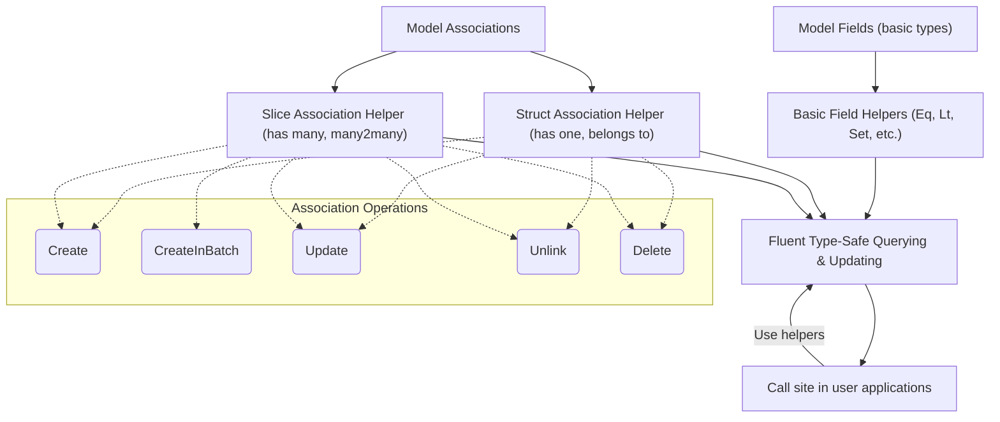

# Field Helpers & Associations

GORM CLI transforms your Go model structs into a rich, type-safe API that simplifies querying, updating, and managing associations in your GORM projects. This page dives deep into the *field helper generation* rules and logic — explaining how GORM CLI turns your model fields and relations into fluent, strongly typed helpers. These helpers empower you with compile-time safety and more expressive code for both simple fields and complex associations.

---

## Understanding Field Helper Generation

At the heart of GORM CLI's power is its ability to generate two complementary helpers for your models:

- **Basic Field Helpers:** Typed predicates and setters for primitive fields (ints, strings, booleans, times, etc.) to build query filters and updates.
- **Association Helpers:** Strongly typed helpers for managing `has one`, `has many`, `belongs to`, and `many2many` relations, supporting creation, update, unlinking, and deletion with safety.

This system provides a unified, discoverable, and fluent API tailored to your data schema, avoiding manual error-prone SQL strings and runtime mistakes.

### Basic Field Helpers: Predicates & Setters

For fundamental field types like integers, strings, boolean, timestamps, and nullable primitives (`sql.NullInt64`, `sql.NullTime`), the generator produces helpers that capture idiomatic query operations:

- **Predicates:** Equality (`Eq`), inequality (`Ne`), range comparisons (`Gt`, `Lt`, `Between`), pattern matching (`Like`), and null checks (`IsNull`).
- **Setters:** Assign values to fields in `Create` or `Update` calls including incrementing numeric fields (`Incr`) or setting expressions.


Example with a `User` model field helpers:

```go
generated.User.Name.Eq("jinzhu")         // WHERE name = 'jinzhu'
generated.User.Age.Between(18, 65)        // WHERE age BETWEEN 18 AND 65
generated.User.Score.IsNull()               // WHERE score IS NULL
```

You use these predicates with GORM queries like:

```go
gorm.G[User](db).
  Where(generated.User.Age.Gt(18)).
  Find(ctx)
```

Or to perform updates:

```go
gorm.G[User](db).
  Where(generated.User.Name.Eq("alice")).
  Set(
    generated.User.Name.Set("jinzhu"),
    generated.User.Age.Incr(1),
  ).
  Update(ctx)
```

### Custom Field Type Mappings

You can extend or replace the default mapping from Go types to field helpers using `genconfig.Config`. This mechanism allows:

- Mapping Go struct fields with specific struct tags, e.g., mapping a JSON column to a custom JSON-safe field helper.
- Replacing default helpers for certain types like `sql.NullTime` with more convenient types.

Example configuration snippet:

```go
var _ = genconfig.Config{
  FieldNameMap: map[string]any{
    "json": JSON{}, // map fields tagged with `gen:"json"` to custom JSON field helper
  },
}
```

This guarantees your generated code uses helpers tailored for complex data types.

---

## Association Helpers Generation

Beyond fields, associations declared in your GORM models reflect relationships to other tables — and GORM CLI turns those into *association helpers* for precise, safe relation management.

### Recognizing Associations

Field types that reference other structs or slices indicate associations:

| Association Type  | Model Field Type Example                   | Generated Helper Type          |
|-------------------|-------------------------------------------|-------------------------------|
| `has one`         | `Account` (single struct)                  | `field.Struct[Account]`        |
| `has many`        | `Pets []*Pet` (slice of pointers)         | `field.Slice[Pet]`             |
| `belongs to`      | `Company Company`                          | `field.Struct[Company]`        |
| `many2many`       | `Languages []Language` with `gorm:"many2many:UserSpeak"` | `field.Slice[Language]`        |
| polymorphic       | E.g., `Toys []Toy` with `gorm:"polymorphic:Owner"`       | `field.Slice[Toy]`             |

### Association Operations

Association helpers expose methods enabling common and complex relational operations. These methods are designed to be used within chaining GORM CLI calls via `Set(...).Update(ctx)` or `Set(...).Create(ctx)`. 

#### Supported Operations

| Operation     | Description                                                    | Usage Context                          |
|---------------|----------------------------------------------------------------|--------------------------------------|
| `Create`      | Create and link a related record for matched parents          | `Set(...).Create(...).Update(ctx)`    |
| `CreateInBatch`| Batch create/link multiple related records                    | `Set(...).CreateInBatch(records).Update(ctx)` |
| `Update`      | Update associated records matching optional conditions        | `Set(...).Where(...).Update(...).Update(ctx)` |
| `Unlink`      | Remove links without deleting related rows (nulls FKs or deletes join rows) | `Set(...).Unlink().Update(ctx)`      |
| `Delete`      | Delete associated records (for many2many deletes join rows only, no cascade on main row) | `Set(...).Delete().Update(ctx)`       |


### Example Usage of Association Helpers

Managing a user's pets (has many):

```go
// Create a new pet and associate with existing user
gorm.G[User](db).
  Where(generated.User.ID.Eq(1)).
  Set(
    generated.User.Pets.Create(generated.Pet.Name.Set("fido")),
  ).
  Update(ctx)

// Update pets named 'fido'
gorm.G[User](db).
  Where(generated.User.ID.Eq(1)).
  Set(
    generated.User.Pets.Where(generated.Pet.Name.Eq("fido")).Update(
      generated.Pet.Name.Set("rex"),
    ),
  ).
  Update(ctx)

// Unlink all pets (set foreign keys to NULL)
gorm.G[User](db).
  Where(generated.User.ID.Eq(1)).
  Set(generated.User.Pets.Unlink()).
  Update(ctx)

// Delete pets named 'old'
gorm.G[User](db).
  Where(generated.User.ID.Eq(1)).
  Set(generated.User.Pets.Where(generated.Pet.Name.Eq("old")).Delete()).
  Update(ctx)
```

For a `many2many` example with languages:

```go
// Create and link new languages
gorm.G[User](db).
  Where(generated.User.ID.Eq(1)).
  Set(
    generated.User.Languages.Create(
      generated.Language.Code.Set("EN"),
      generated.Language.Name.Set("English"),
    ),
  ).
  Update(ctx)

// Batch link existing languages
gorm.G[User](db).
  Where(generated.User.ID.Eq(1)).
  Set(generated.User.Languages.CreateInBatch([]models.Language{{Code: "FR"}, {Code: "ES"}})).
  Update(ctx)

// Unlink a language (removes join row)
gorm.G[User](db).
  Where(generated.User.ID.Eq(1)).
  Set(generated.User.Languages.Where(generated.Language.Code.Eq("EN")).Unlink()).
  Update(ctx)

// Delete join row only (language remains)
gorm.G[User](db).
  Where(generated.User.ID.Eq(1)).
  Set(generated.User.Languages.Where(generated.Language.Code.Eq("FR")).Delete()).
  Update(ctx)
```

### Association Semantics by Type

Understanding how operations affect your data model:

| Association  | Unlink Effect                         | Delete Effect                        |
|--------------|-------------------------------------|------------------------------------|
| belongs to   | Sets foreign key on parent to NULL  | Removes associated records          |
| has one / has many | Sets foreign key on child to NULL| Deletes child records               |
| many2many    | Removes join table rows only         | Removes join table rows only (main records remain) |

---

## Best Practices & Tips

- **Always use `Set(...).Update(ctx)` or `Set(...).Create(ctx)` workflow** to perform association operations to ensure consistent state changes.
- Use `Where` within associations to target specific child records to avoid unintentional bulk operations.
- Prefer `Unlink` when you want to dissociate related records without deleting them.
- Use `CreateInBatch` for efficiency when creating multiple records related to multiple parents.
- Polymorphic associations work consistently with the same helpers — just observe the proper naming conventions.

---

## Troubleshooting & Common Pitfalls

<AccordionGroup title="Troubleshooting Association Helpers">
<Accordion title="Generated Helper Missing or Incorrect">
Check your model struct for proper GORM tags and exported fields. Ensure the field types are correct and associations are well defined (e.g., properly tagged `gorm:"many2many"`). Make sure the generator has run successfully after any model changes.
</Accordion>
<Accordion title="Association Operation Does Not Affect Rows">
Verify your `Where` clause targeting associated records is precise. Misconstructed conditions may match zero records. Also confirm the primary query correctly identifies parent rows.
</Accordion>
<Accordion title="Foreign Key Nullification Fails on Unlink">
Ensure that your database schema allows nullable foreign keys where expected. Constraints preventing null FK values will cause unlinking to fail.
</Accordion>
<Accordion title="Batch Create Fails or Produces Unexpected Data">
Confirm that batch create input structs have valid field values. Avoid zero-id or non-initialized structs. Batch creates associate each new child with every matched parent.
</Accordion>
</AccordionGroup>

---

## Visual Overview: Field Helper Types and Associations


```

---

## Further Reading & Next Steps

- See [Managing Associations with Field Helpers](/guides/advanced-patterns/associations) for practical association management workflows.
- Understand the full [Model-Driven Field & Association Helpers Overview](/overview/features-quicktour/model-field-helpers) to connect concepts with feature demos.
- Customize generation with [Custom Field Mapping & JSON Helpers](/concepts/extensibility-configuration/custom-field-mapping).
- For complete usage, refer to the [Working with Generated APIs](/guides/core-workflows/using-generated-apis) guide.

---

## Summary

This page detailed the mechanics, rules, and logic behind GORM CLI's field helper generation, covering both basic field predicates/setters and the rich API for association management. You learned how fundamental Go types are mapped to typed helpers enabling fluent queries and updates, and how complex relations like has-one, has-many, belongs-to, and many2many are surfaced as strongly typed fields with operations for creating, updating, unlinking, and deleting associations safely.

With this understanding, you can confidently leverage generated field helpers to write safer, clearer, and maintainable GORM-based data access code.