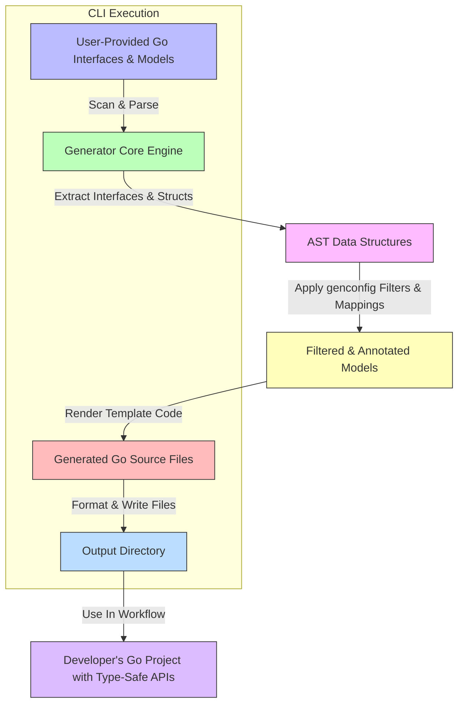

# System Overview

Welcome to the **System Overview** of GORM CLI, where you gain a comprehensive understanding of how this powerful code generation tool integrates into your Go development workflow. This page unpacks the key Command Line Interface (CLI) components, their roles, and the architecture underpinning the generation of type-safe query APIs and model-driven field helpers. By the end, you'll clearly see the operational flow from your source Go interfaces and models through the generator to the resulting code ready for seamless use with GORM.

---

## Understanding the Role of GORM CLI in Your Workflow

Imagine you're building a Go backend leveraging GORM for your data layer. GORM CLI acts as your dedicated assistant that reads your Go query interfaces and model structs annotated with SQL templates and then crafts custom, type-safe Go code that plugs directly into GORM's runtime. It bridges your schema and business logic with a fluent, compile-time safe API — eliminating guesswork and runtime errors.

Your workflow with GORM CLI involves three essential phases:

1. **Input Preparation:** You write Go interfaces with SQL templates and define your data models as Go structs — these form the blueprint.

2. **Code Generation:** Via the CLI, the generator processes your inputs, interpreting SQL templates, configs, and struct metadata to produce type-safe query APIs and field helpers.

3. **API Consumption:** You import and use the generated code in your projects, gaining discoverability, strong typing, and safe query construction.

## Main CLI Components and Their Responsibilities

Getting acquainted with the CLI components will help you understand how the generation process plays out:

### 1. CLI Entrypoint (`main.go`)
- Acts as the user-facing command executable.
- Sets up the root command and integrates the `gen` subcommand.
- Handles CLI commands, flags, and error reporting.

### 2. Generator Command (`internal/gen/gen.go`)
- Implements the `gen` CLI subcommand dedicated to code generation.
- Parses input flags such as `--input` (Go interface paths) and `--output` (destination directory).
- Coordinates the parsing and generation lifecycle by invoking core generator logic.

### 3. Core Generator Engine (`internal/gen/generator.go`)
- Processes Go source files or directories, recursively loading Go ASTs (Abstract Syntax Trees).
- Extracts interfaces with SQL templates and model structs.
- Applies configuration rules as specified in `genconfig.Config` declarations.
- Filters interfaces and structs by include/exclude patterns.
- Maps Go types and struct tags to specialized field helper types.
- Generates final source code files based on templated code snippets executing per interface and struct.
- Formats and writes generated Go files to the configured output directory.

### 4. Template Engine (`internal/gen/template.go`)
- Contains Go templates embedding the code structure for generated APIs and helpers.
- Ensures output code follows GORM runtime patterns and idiomatic Go style.

### 5. Test & Example Suite (`scripts/test_all.sh`, `examples/`)
- Provides tests and example usage showcasing real queries and generated code.
- Assists with validating the functionality and correctness of code generation.

---

## Architecture Behind Code Generation

Here we visualize the step-by-step architecture showing how your Go input leads to generated outputs.

---

## Key Operational Flow Details

### Input Scanning and Parsing

- The CLI reads your designated Go source: interfaces annotated with SQL templates and model structs.
- Internal AST parsing collects interface metadata, method signatures, and embedded SQL templates.
- Model structs are inspected for fields, types, struct tags, and annotations that influence field helper generation.

### Applying Configuration

- The system recognizes package-level `genconfig.Config` declarations to:
  - Define output directories.
  - Map Go types or struct tags to custom field helper types.
  - Include or exclude specific interfaces or structs via patterns.
  - Decide whether config applies file-wise or package-wise.

- These rules refine what and how code is generated, ensuring tailored outputs that fit your project.

### Code Generation via Templates

- For each filtered interface, the generator produces a corresponding Go file implementing:
  - Type-safe method implementations binding your SQL templates and Go parameters.
  - Automatic injection of `context.Context` where missing.
  - Methods returning the correct data structures and error handling.

- For structs, it generates:
  - Field helpers (`field.String`, `field.Time`, `field.Struct[T]`, etc.)
  - Association helper fields for related models.

- The generated code maintains idiomatic Go formatting and integrates smoothly with GORM APIs.

### Output and Usage

- Generated files are written to the configured output path preserving directory structures.
- You import these files in your application.
- Usage involves fluent, discoverable APIs that let you write safe SQL queries and data modifications without runtime surprises.

---

## Practical Tips and Best Practices

- **Always declare your interfaces and models in the same logical package or directory.** This simplifies configuration and generation.

- **Use `genconfig.Config` to control generation scope and output paths** rather than multiple CLI invocations.

- **Annotate your SQL with the dedicated DSL** to leverage safe parameter binding and dynamic SQL generation.

- **Write tests against generated code** using the provided examples to ensure your SQL semantics match expectations.

- **Beware of conflicting type mappings** — carefully map custom Go types to field helper types to avoid generation errors.

- **Use the CLI's `--input` and `--output` flags carefully** to match your project structure, enabling incremental code generation.

---

## Troubleshooting Common Issues

<AccordionGroup title="Common Troubleshooting Scenarios">
<Accordion title="Generated Code is Missing or Empty">
- Verify your input path points correctly to source files with Go interfaces.
- Ensure your interfaces have properly formatted SQL template comments.
- Confirm any `genconfig.Config` inclusion patterns do not exclude your interfaces.
</Accordion>

<Accordion title="Type Mismatch Errors in Generated Code">
- Check your field type mappings in `genconfig.Config`.
- Confirm custom fields or struct tags are correctly mapped.
- Make sure your models and query interfaces are in sync and properly annotated.
</Accordion>

<Accordion title="CLI Command Errors or Missing Flags">
- Use `gorm gen -h` to verify required flags.
- Ensure `--input` and `--output` are correctly set.
- Confirm Go 1.18+ is installed for generics support.
</Accordion>
</AccordionGroup>

---

For more details on writing query interfaces, advanced configuration, and using generated APIs effectively, explore the related guides on this site.

---

## Related Documentation

- [Core Concepts & Terminology](https://gorm.io/concepts/architecture-concepts/core-terminology)
- [System Architecture Diagram](https://gorm.io/overview/architecture-concepts/system-architecture)
- [Generating Type-Safe Query APIs](https://gorm.io/overview/features-quicktour/query-api-generation)
- [Model-Driven Field & Association Helpers](https://gorm.io/overview/features-quicktour/model-field-helpers)
- [Advanced Configuration with genconfig](https://gorm.io/guides/core-workflows/configuring-generation)
- [Writing Query Interfaces and Models](https://gorm.io/getting-started/project-bootstrapping/writing-query-interfaces)

---