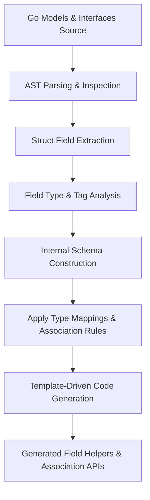

# Data Models and Code Generation Schema

Dive deep into how GORM CLI interprets your Go interfaces and struct models to create an internal schema representing fields, queries, associations, and their complex relationships. This page focuses exclusively on how the model struct types, like those in your Go code, are parsed, mapped, and transformed into generated field helpers and association schemas usable in your type-safe code.

---

## Understanding the Internal Schema Construction

The GORM CLI generator analyzes your Go model structs and interfaces to build an internal representation—an abstract schema—that captures key details about queries, fields, and associations. This schema serves as the blueprint for generating strongly typed field helpers and association management APIs.

### Core Goals for This Schema

- **Represent Struct Fields**: Basic columns like strings, integers, booleans, times.
- **Capture Associations**: Relationships such as has one, has many, belongs to, many-to-many, including polymorphic and single-table inheritance.
- **Connect Queries to Models**: Use query interfaces and their SQL templates referencing model fields.
- **Provide Mapping Rules**: Convert Go native types into corresponding field helper types.

This layer exists between your original Go code and the final output code, bridging user intent with code generation.

---

## Model Field Parsing & Mapping

When you define your Go structs, the GORM CLI scans each exported field and determines:

1. **Field Name and DB Column**: Uses struct field name and considers `gorm:"column:..."` tags or default naming.
2. **Go Type & Named Types**: Analyzes the Go native type (e.g., `string`, `int`, `time.Time`), plus tagged named types (e.g., `gen:"json"`).
3. **Field Helper Type Mapping**: Translates Go types to generator-friendly types such as:
   - `string` → `field.String`
   - `int` / `float` → `field.Number[int|float64]`
   - `bool` → `field.Bool`
   - `time.Time` → `field.Time`
   - Named types implementing `sql.Scanner`, `driver.Valuer` or GORM serializers are mapped to generic `field.Field[T]` or customized types from generator configuration.
4. **Associations**: Recognized if a field’s type is a struct or a slice of structs representing related models.

### Example

```go
// Partial User struct from examples/models/user.go
User struct {
  Name string
  Age  int
  Pets []*Pet           // Has many
  Toys []Toy `gorm:"polymorphic:Owner"` // Polymorphic has many
}
```

The generator maps field `Name` to `field.String`, `Age` to `field.Number[int]`, `Pets` to `field.Slice[Pet]`, and `Toys` to `field.Slice[Toy]` with polymorphic association metadata.

---

## Association Relationships & Helpers

GORM CLI decodes different relationship patterns represented in your struct fields to determine how to generate association helpers:

| Relation Type       | Go Field Type                        | GORM Tag Usage                       | Generated Helper Type             |
|---------------------|------------------------------------|------------------------------------|---------------------------------|
| Has One             | Struct                             | Default or explicit tags            | `field.Struct[T]`                |
| Has Many            | Slice of Struct or Pointer Slice   | Default or explicit tags            | `field.Slice[T]`                 |
| Belongs To          | Pointer to Struct                  | Foreign key tags or inferred       | `field.Struct[T]`                |
| Many To Many        | Slice or Pointer Slice             | `gorm:"many2many:<join_table>"` | `field.Slice[T]` with m2m support|
| Polymorphic Relations| Struct or Slice with `polymorphic` tag| `gorm:"polymorphic:<owner>"` | `field.Struct[T]` or `field.Slice[T]` polymorphic mode |

These generated helpers support core association operations:

- **Create**: Add and link associated records per matched parent.
- **Update**: Modify associated records conditionally.
- **Unlink**: Remove association link without deleting related entries.
- **Delete**: Remove associated records or join table rows.
- **CreateInBatch**: Bulk create multiple associated records for has many / many to many.

---

## Struct Embedding & Field Flattening

GORM CLI honors Go’s struct embedding by flattening embedded fields directly into the parent model’s field set during schema construction. This promotes seamless field referencing and simplifies generated APIs.

For example, if your struct embeds `gorm.Model`, the fields `ID`, `CreatedAt`, `UpdatedAt`, and `DeletedAt` appear as normal fields with proper type mappings.

---

## Field and Struct Tag Usage Impacting Code Generation

- **`gorm:"column:<name>"`**: Defines the exact DB column name used for this field in generated code.
- **`gen:"<mapped_type>"`**: Custom generator hint influencing the helper type, e.g., `gen:"json"` maps a string field to a JSON helper.

These allow precise control over how fields are represented in the generated code and help extend the system with special types.

---

## Code Template Integration with the Schema

The internal schema constructed from models and interfaces works with code templates driving final generation:

- Each **Struct** translates into a variable with all fields as typed members.
- Every **Field** has both type and a linked function (e.g., `WithColumn`, `WithName`) that configures generated predicates and setters.
- **Association fields** use specialized types (`field.Struct[T]`, `field.Slice[T]`) exposing association operations.
- Query interfaces can then reference these helpers in DSL-filter expressions.

The generator's internal Go templates read this schema to produce final Go code files reflecting:

- Strongly typed field helpers
- Association helpers with support for create/update/unlink/delete
- Struct variables containing all fields for easy access

---

## Practical Walkthrough: From Go Models to Generated Helpers

1. **Parse Go Structs**
   - E.g., from `examples/models/user.go`, the `User` struct and related models (`Account`, `Pet`, `Toy`, etc.)
2. **Analyze Fields**
   - Identify base types and associations
   - Determine DB column names
3. **Map Types**
   - Apply default and configured type mappings (`time.Time` → `field.Time`, tagged fields → custom helpers)
4. **Build Field Sets**
   - Generate field collections reflecting the struct fields with proper type wrappers
5. **Generate Association Helpers**
   - For slices or structs representing relationships
6. **Code Emit**
   - Templates (`internal/gen/template.go`) render Go code with field and association helpers

### Generated Code Example Snippet (from `examples/output/models/user.go`)

```go
var User = struct {
  ID        field.Number[uint]
  Name      field.String
  Age       field.Number[int]
  Pets      field.Slice[models.Pet]
  Toys      field.Slice[models.Toy]
  CompanyID field.Number[int]
  Company   field.Struct[models.Company]
  // ... other fields
}{
  ID:        field.Number[uint]{}.WithColumn("id"),
  Name:      field.String{}.WithColumn("name"),
  Age:       field.Number[int]{}.WithColumn("age"),
  Pets:      field.Slice[models.Pet]{}.WithName("Pets"),
  Toys:      field.Slice[models.Toy]{}.WithName("Toys"),
  CompanyID: field.Number[int]{}.WithColumn("company_id"),
  Company:   field.Struct[models.Company]{}.WithName("Company"),
}
```

---

## Best Practices for Defining Models for Effective Schema Generation

- Use clear and consistent association tags (e.g., `gorm:"many2many:<table>"` for many-to-many).
- Annotate fields that need custom helpers using `gen:"<type>"` tags.
- Avoid anonymous or unexported fields if they should not appear in generated helpers.
- Embed common bases like `gorm.Model` to auto-flatten common fields.

---

## Common Pitfalls & Troubleshooting

- **Missing exported fields**: Unexported fields do not appear in the generated schema.
- **Incorrect or missing GORM tags**: Can lead to improper association detection or wrong column names.
- **Custom field types without mapping**: Without explicit mapping in configuration, some custom types may default to generic field helpers.
- **Polymorphic associations require correct tags**: Mislabeling or missing the `polymorphic` tag can break the association schema.

Always verify your struct definitions and use package-level configuration to extend or override mappings.

---

## Visualizing Data Model to Code Generation Flow



---

## Summary

This page elucidates the crucial role of how GORM CLI interprets your Go model structs and query interfaces to build an intermediate schema. This schema fully describes fields, their types, their database mappings, and entity relationships, enabling the generation of clear, type-safe, and expressive field and association helpers for your application.

Understanding these underlying data models equips you to design your Go structs and annotations to maximize the power and correctness of generated code.

---

## Related Documentation

- [Field Helper & Association Helper Concepts](../../concepts/features-integration/field-helper-concepts) — Learn about the generated helpers in detail.
- [Working with Associations](../../guides/advanced-patterns/working-with-associations) — Practical usage of associations in generated code.
- [Customizing Code Generation](../../guides/advanced-patterns/customizing-generation-output) — How to configure mappings and generation behavior.
- [System Architecture Overview](../../overview/architecture-and-concepts/system-architecture) — Understand the whole system flow.


---

<Check>
Ensure your model structs are well-annotated and visible (exported) so that the generator can create accurate and useful field helpers.
</Check>

<Info>
Use package-level `genconfig.Config` to customize type mappings, including for special types such as JSON.
</Info>