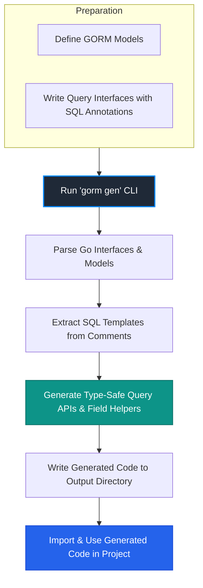

# System Overview & Generation Workflow

GORM CLI transforms your Go codebase by automatically generating type-safe query APIs and field helpers based on your defined model structs and query interfaces. This page provides a comprehensive, high-level view of this process — from the initial command you run to the final integration of generated code in your project.

## Understanding the Big Picture

Imagine starting with your domain models and interfaces describing how to query data — GORM CLI reads this, interprets your SQL templates, and outputs strongly typed Go code that can be used seamlessly with the GORM ORM. Rather than writing repetitive, error-prone SQL wrapper code manually, you let GORM CLI generate stable, maintainable, and reusable components.

This workflow ensures your queries stay synchronized with your model definitions and enhances development productivity with compiler-checked type safety.

---

## The Generation Workflow Step-by-Step

### 1. CLI Invocation: Running `gorm gen`

When you execute the command `gorm gen`, you start the process. Typically, you specify options such as input paths to your query interface files, output directories, and optional configuration settings.

```
gorm gen --source ./path/to/interfaces --out ./path/to/generated
```

This command kicks off the core pipeline that converts your plain Go interfaces with SQL template annotations into actual Go implementations.

---

### 2. File Parsing and Analysis

- **Interface Discovery:** The generator scans the provided directories to find Go source files containing interfaces annotated for generation (e.g., interfaces named with a `Query*` pattern).
- **Model Identification:** Your domain model structs — usually GORM models — are identified and loaded. These define the data schema and field types.
- **Annotation Extraction:** SQL template comments embedded above interface methods are parsed, extracting the query logic and any placeholders.

*Example:* An interface method such as:

```go
// SELECT * FROM @@table WHERE id=@id
GetByID(id int) (User, error)
```
gets analyzed to generate a method that executes a parameterized query safely.

---

### 3. Code Generation

- **Type Safety Enforcement:** The generator produces methods with proper Go types corresponding to your model fields, ensuring your queries are compile-time checked.
- **Field Helpers:** For model fields, helpers are generated (e.g., `field.Time` for date/time fields) providing expressive query capabilities like `.Eq()`, `.Gt()`, `.Between()`. This abstracts away raw SQL syntax.
- **Template Expansion:** SQL statement templates are expanded to full queries with GORM method chaining internally.

---

### 4. Output Writing

Generated code files are written out to your specified output directory, usually under a package named according to your configuration.

These files include:
- Query implementation structs
- Methods matching your interfaces
- Field helper types and functions

Usage is straightforward: simply import the generated package and call the methods with parameters.

---

## User-Centric Workflow in Practice

1. **Prepare your Models and Interfaces:** Define GORM models and Go interfaces with SQL comments reflecting the queries you need.
2. **Run `gorm gen`:** Generate the type-safe APIs and helpers.
3. **Use Generated APIs:** In your application, import and invoke your generated methods like `UserQuery.GetByID(ctx, id)`.
4. **Benefit from Safety & Productivity:** Error-prone manual query constructions are replaced by compiler-verified code.

---

## Practical Tips & Best Practices

- **Interface Naming Conventions:** Naming your query interfaces clearly (e.g., prefix with `Query`) helps selective and clean generation.
- **Use Template DSL Judiciously:** Embed complex SQL logic in interfaces but keep it readable and maintainable.
- **Leverage Field Helpers:** Use them to construct filters dynamically, improving safe query composition.
- **Organize Project Structure:** Keep models, interfaces, and generated code in well-defined directories for maintainability.

---

## Common Pitfalls & Troubleshooting

<AccordionGroup title="Common Issues During Generation">
<Accordion title="No Generated Files Created">
Check if your interfaces are correctly annotated and included by the generator's configuration. Also verify file discovery paths.
</Accordion>
<Accordion title="Generated Code Does Not Compile">
Ensure your models and interfaces are syntactically valid. Conflicts in Go type mappings or missing imports can cause build failures.
</Accordion>
<Accordion title="Runtime Errors in Queries">
Validate that your SQL templates and placeholder bindings are accurate. Test generated code with realistic data and conditions.
</Accordion>
</AccordionGroup>

---

## Visualizing the Workflow



This flowchart highlights how starting from your prepared models and interfaces, the `gorm gen` command drives parsing, code generation, and integration.

---

## Next Steps

To deepen your mastery, explore these related documentation pages:

- [Generating Type-Safe Query APIs](/guides/core-workflows/generating-type-safe-queries)
- [Using Field Helpers and Building Filters](/guides/core-workflows/field-helpers-and-filters)
- [Project Setup & Structure](/getting-started/first-steps-with-gorm-cli/project-setup)
- [Customizing Code Generation Output](/guides/advanced-patterns/customizing-generation-output)

This systematic understanding empowers you to harness GORM CLI effectively for robust type-safe database access.


---