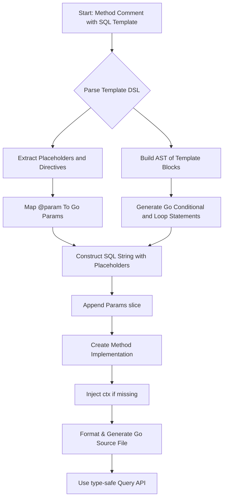

# Template DSL & Query Specification

Explore how GORM CLI leverages a custom SQL template domain-specific language (DSL) embedded within Go interface method comments to generate fully type-safe, context-aware query APIs. This page breaks down how parameter placeholders, conditional blocks, iteration, and comment-based method annotations transform your raw SQL into safe, executable Go code with seamless parameter binding and extensibility.

---

## Introduction to the Template DSL

At the heart of GORM CLI's powerful code generation is a specialized SQL template language that integrates closely with Go source code interfaces. Within your Go interface's method doc comments, you embed raw SQL statements augmented with special templating directives. These directives allow dynamic SQL construction, safe parameter binding, and contextual behavior that adapts SQL to method parameters automatically.

This setup enables you to define complex queries and update statements declaratively, while the CLI generates concrete, type-safe Go implementations that manage SQL execution behind the scenes.

### Why Use the Template DSL?
- **Type Safety:** Bind SQL parameters directly to Go method parameters, ensuring compile-time correctness.
- **Dynamic SQL:** Conditionally include SQL fragments and iterate over collections.
- **Context-Aware Safety:** The generator validates your usage of parameters and SQL placeholders.
- **Extensible:** Support custom placeholders, method comments, and advanced constructs.

---

## Core Placeholder Semantics

The Template DSL uses several distinct placeholder types and conventions to map SQL code with Go variables and context:

| Placeholder | Meaning                                  | Behavior & Example                                           |
|-------------|------------------------------------------|-------------------------------------------------------------|
| `@@table`   | Resolves to the current model's table    | Expands to the table name of the queried model (safe placeholder `?` with table param) |
| `@@column`  | Refers to a dynamic column by name       | Binds a Go string parameter as a column reference (wrapped in `clause.Column{Name: ...}`) |
| `@param`    | Binds a method parameter with the given name | Converts Go param to a `?` placeholder with corresponding param binding |
| `\@`       | Escapes a literal `@` symbol              | Needed to write literal `@` in SQL comments without binding |

### Example
```sql
-- SQL snippet with placeholders
SELECT * FROM @@table WHERE id=@id AND status=@status
```

The generator transforms this into Go code that builds the SQL string safely and binds the `id` and `status` method parameters automatically.

---

## Template Directives and Blocks

Beyond simple placeholders, the DSL supports several block constructs allowing conditional and iterative SQL generation.

### Conditional Blocks: `{{if}}`, `{{else if}}`, `{{else}}`, `{{end}}`

Use these to include SQL fragments only when conditions based on parameters or structures are met.

#### Example
```sql
SELECT * FROM @@table
{{if user.Name != ""}}
  WHERE name=@user.Name
{{else if user.ID > 0}}
  WHERE id=@user.ID
{{end}}
```

Here, the `WHERE` clause dynamically adjusts depending on the contents of the `user` parameter.

### Set and Where Blocks: `{{set}}...{{end}}`, `{{where}}...{{end}}`

These are specialized blocks that:

- Trim and assemble `SET` clauses with correct comma placement for updates.
- Build `WHERE` conditions, cleaning up dangling `AND`/`OR` connectives.

They internally generate temporary builders to accumulate and clean SQL strings before appending.

### Iterative Blocks: `{{for}} ... {{end}}`

Used to iterate over slices or arrays, generating repeated SQL fragments with proper binding.

#### Example
```sql
SELECT * FROM @@table
{{where}}
  {{for _, user := range users}}
    {{if user.Age > 18}}
      age > @user.Age OR
    {{end}}
  {{end}}
{{end}}
```
This builds a `WHERE` clause with multiple OR conditions for each user in the input slice.

---

## Transforming Interface Method Comments into Executable Code

GORM CLI parses method comments in your Go interfaces, extracting raw SQL and DSL directives to generate method implementations. Here’s how:

1. **Extraction:** The CLI reads the standard Go comment lines above each method.
2. **Parsing:** It scans content for `@@table`, `@param`, `{{...}}` directives and builds an Abstract Syntax Tree (AST) representing the SQL and control flow.
3. **Code Emission:** The AST nodes generate Go code which:
   - Constructs a SQL string with placeholders (`?`).
   - Accumulates ordered parameters matching these placeholders.
   - Handles conditional and loop control flow reflecting `if`, `for` directives.
4. **Method Signature Completion:**
   - The generator automatically prepends a `ctx context.Context` parameter if missing.
   - It matches Go parameter names with `@param` placeholders.
   - Validates return types to ensure error handling is present.

The resulting Go method efficiently executes the intended SQL statement via GORM’s methods.

### Example Method Comment & Generated Signature
```go
// SELECT * FROM @@table WHERE id=@id
GetByID(id int) (T, error)
```
Generates roughly:
```go
func (e QueryImpl[T]) GetByID(ctx context.Context, id int) (T, error) {
    var sb strings.Builder
    params := []any{clause.Table{Name: clause.CurrentTable}, id}
    sb.WriteString("SELECT * FROM ? WHERE id=?")
    return e.Exec(ctx, sb.String(), params...)
}
```

---

## Syntax Details and Best Practices

### Auto-injection of Context
If your interface method does not explicitly include `ctx context.Context`, the generator transparently inserts it, aligning to idiomatic Go practices.

### Parameter Binding
Each `@param` is linked directly to a Go method parameter by name. Use structural field accessors for bound variables (e.g., `@user.Name`).

### Escaping `@` Symbols
To insert literal `@` signs in your SQL (for example in email fields or documentation comments), prefix with a backslash: `\@`.

### Handling Complex Conditions
Use nested `{{if}}` and `{{else}}` directives to express fine-grained query logic based on input values.

### Iterations
Leverage `{{for}}` blocks to expand slice parameters into repeated SQL conditions, enabling dynamic filtering.

### SET and WHERE Blocks
Encapsulate `SET` clauses and complex `WHERE` conditions using specialized `{{set}}` and `{{where}}` blocks to simplify trimming and formatting.

---

## Complete Example

Consider this interface method from `examples/query.go`:

```go
// UPDATE @@table
//  {{set}}
//    {{if user.Name != ""}} name=@user.Name, {{end}}
//    {{if user.Age > 0}} age=@user.Age, {{end}}
//    {{if user.Age >= 18}} is_adult=1 {{else}} is_adult=0 {{end}}
//  {{end}}
// WHERE id=@id
UpdateInfo(user models.User, id int) error
```

### What Happens:
- The DSL dynamically builds the `SET` clause including only non-empty fields.
- Conditions control inclusion and alternate values (`is_adult` logic).
- Placeholders bind safely to fields of the `user` argument and the `id` parameter.
- The generator wraps this into an efficient Go method that constructs the full SQL and parameters.

### Generated Go snippet outline:
```go
var sb strings.Builder
params := []any{clause.Table{Name: clause.CurrentTable}}
// Build SET clause dynamically ...
sb.WriteString("UPDATE ?")
sb.WriteString(" SET ...")
sb.WriteString(" WHERE id=?")
params = append(params, id)
return e.Exec(ctx, sb.String(), params...)
```

---

## Extensibility & Custom Placeholder Support

You can extend the DSL and the generated API by:

- Defining custom placeholders (e.g., `@@json` mapping to JSON columns).
- Mapping struct fields with special tags (like `gen:"json"`) to custom field helpers.
- Writing sophisticated Go code for JSON, arrays, or other types following the JSON Field Mapping example.

This modular design allows complex, dialect-aware SQL generation through simple interface annotations.

---

## Troubleshooting Common Issues

<AccordionGroup title="Troubleshooting Template DSL Issues">
<Accordion title="Missing or Incorrect Parameter Bindings">
Ensure all `@param` placeholders match method parameter names exactly, respecting case.

Use structural names like `@user.Name` if your method takes struct parameters.

</Accordion>
<Accordion title="Unmatched {{if}} / {{end}} Blocks">
Every `{{if}}` directive must be properly closed with a matching `{{end}}`. Nested conditionals also require matching closures.

Use carefully indented comments for readability.
</Accordion>
<Accordion title="Incorrect Method Return Types">
For methods with raw SQL, ensure the last return type is `error`. Methods returning data should have up to two return types: a result and an `error`.

</Accordion>
<Accordion title="Escaping @ Symbols">
To use literal at-signs in SQL templates, always escape with a backslash `\@`.
</Accordion>
</AccordionGroup>

---

## Visualizing Code Generation Flow from Template to Go Code



This flow guides you from writing the SQL template in your interface comment to consuming the fully generated, safe Go API.

---

## Further Reading and Related Topics

- [Generating Type-Safe Query APIs](guides/core-workflows/generating-type-safe-queries) — Apply this DSL in real projects.
- [Field Helper & Association Helper Concepts](concepts/features-integration/field-helper-concepts) — Extend queries with generated field helpers.
- [Customizing Code Generation](guides/advanced-patterns/customizing-generation-output) — Leverage `genconfig.Config` for tailored output.
- [Extending Field Helpers for JSON](guides/advanced-patterns/extending-field-helpers-json) — Practical steps for custom DSL elements.

---

This page empowers you to master the GORM CLI Template DSL — your gateway to writing expressive, type-safe queries directly as SQL-inspired Go interface comments with seamless integration and powerful customization.