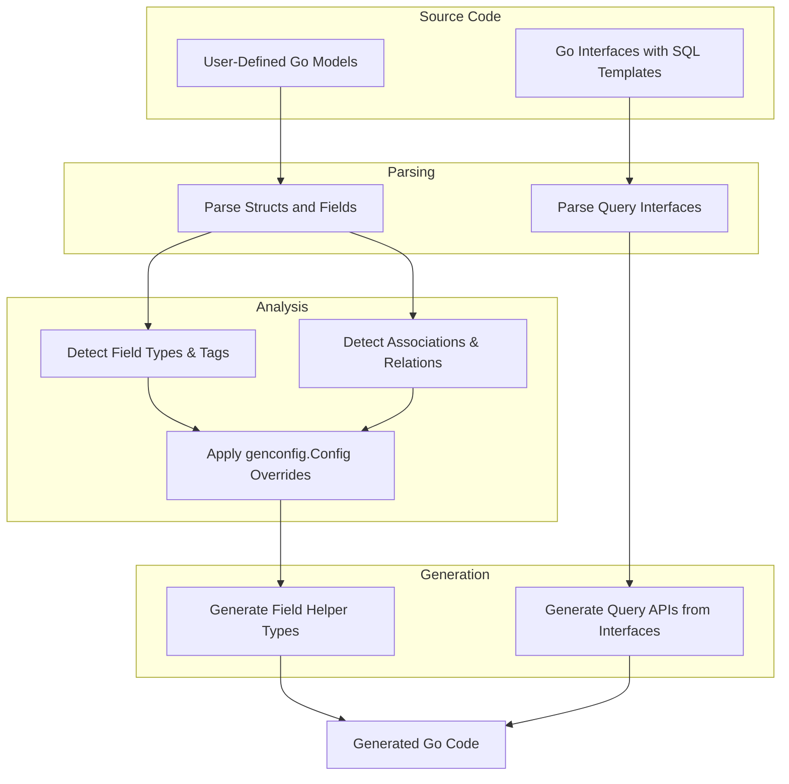

# Data Models and Schemas

This documentation details how GORM CLI analyzes your user-defined Go structs (models) and their associations to generate internal representations used during code generation. Understanding these concepts helps you predict and control how your source models translate into type-safe, discoverable APIs backed by schema mappings.

---

## Why Understanding Data Models Matters

Your input Go structs are more than just plain data containers—they form the foundation for generating model-driven field helpers and association helpers in your GORM CLI output. The generator extracts metadata like field types, database column names, and association relationships to create fluent, type-safe APIs that enforce compile-time correctness.

This page explains:

- How structs and their fields are parsed
- How database column names are derived from struct fields and tags
- How associations (has one, has many, belongs to, many-to-many) are detected
- How model fields translate to generated field helper types

By mastering these internal representations, you gain better predictability over generated code and can tailor your model definitions for optimal API usability.

---

## Parsing User-Defined Models

When you provide your Go model structs, GORM CLI performs a detailed AST (Abstract Syntax Tree) analysis to extract fields and their attributes.

### Core Field Extraction

- **Fields**: All exported struct fields are considered.
- **Field Names**: Names are taken as declared.
- **Database Column Names**: Derived from field names and `gorm` struct tags following GORM conventions.
- **Go Types**: Complete Go type strings are captured, including pointers and slices.
- **Named Types for Customization**: The `gen` struct tag is parsed to allow custom field helper override mappings.

### Anonymous Embedding

- Embedded structs and anonymous fields are recursively expanded.
- Embedded fields are flattened to appear as if part of the embedding struct.

This allows fields from embedded structs (like `gorm.Model`) to become accessible and generate helpers seamlessly.

### Example Model Extraction

Consider the following

```go
// User model snippet
User struct {
  gorm.Model
  Name      string
  Age       int
  Profile   string `gen:"json"`
  Pets      []*Pet
  ManagerID *uint
  Manager   *User
}
```

- `gorm.Model` is embedded, so `ID`, `CreatedAt`, `UpdatedAt`, `DeletedAt` fields are included.
- `Name` and `Age` map to basic scalar fields.
- `Profile` with the `gen:"json"` tag signals custom helper mapping.
- `Pets` is a slice of `*Pet`, recognized as a "has many" association.
- `Manager` and `ManagerID` represent a "belongs to" association.

---

## Translating Fields to Field Helper Types

Each field's Go type and configuration determine what kind of field helper is generated.

| Field Kind                                   | Generated Helper Type        | Description                               |
|----------------------------------------------|------------------------------|-------------------------------------------|
| Basic scalar types (string, int, bool, etc.)| Specialized helpers (e.g., `field.String`, `field.Number[int]`) | Provide type-safe predicates and setters |
| Nullable types (`sql.NullInt64`, pointers)  | Wrapped in generic `field.Field[T]`      | Handle nullability and zero-values        |
| Struct fields (e.g., `Account`)              | `field.Struct[Account]`       | Represent "has one" or "belongs to" associations |
| Slice fields (e.g., `[]Pet`)                  | `field.Slice[Pet]`            | Represent "has many" or "many to many" associations |

The generator also consults any configuration overrides from `genconfig.Config`:

- `FieldTypeMap` can remap specific Go types to other field helper types.
- `FieldNameMap` maps struct field name tags to custom helpers.

### Example from Generated Code

```go
var User = struct {
  Name    field.String
  Age     field.Number[int]
  Profile JSON
  Pets    field.Slice[Pet]
  Manager field.Struct[User]
} {
  Name:    field.String{}.WithColumn("name"),
  Age:     field.Number[int]{}.WithColumn("age"),
  Profile: JSON{}.WithColumn("profile"),
  Pets:    field.Slice[Pet]{}.WithName("Pets"),
  Manager: field.Struct[User]{}.WithName("Manager"),
}
```

In this snippet:
- Normal fields use column names (e.g., `name`, `age`).
- Associations use the Go struct or slice type and reference the Go field name.

---

## Recognizing Associations

GORM CLI detects associations based on the Go struct field types and GORM tags following these principles:

| Association Type | Field Signature Example                       | Description                          |
| ---------------- | -------------------------------------------- | ------------------------------------ |
| Has One          | Single struct field (e.g., `Account`)        | A one-to-one child entity            |
| Has Many         | Slice of structs (e.g., `Pets []Pet`)         | One-to-many relation                 |
| Belongs To       | Pointer or value struct for parent (e.g., `Manager *User`) plus FK field (`ManagerID`) | Many child referring to one parent  |
| Many-to-Many     | Slice with `gorm:"many2many:<join_table>"` | Association via join table           |
| Polymorphic      | Fields with `gorm:"polymorphic:<owner>"` tag | Polymorphic association (dynamic owner reference) |

### Handling Polymorphic Associations

Polymorphic associations allow multiple models to share related entities through a type and ID reference. The generator interprets these tags to generate correct field helpers that manage the polymorphic links.

---

## Schema Translation Principles

GORM CLI faithfully mirrors your Go model semantics into generated API components by:

- **Deterministic Naming**: Column names derive from struct fields and GORM tags, ensuring consistency with your database schema.
- **Type Safety**: Field helpers strictly reflect Go types, preserving nullability and embedded custom types.
- **Association Helpers**: Detected associations generate rich APIs supporting create, update, unlink, delete, and batch operations.
- **Customization Respect**: Configured field helper mappings (`genconfig.Config`) and tags (`gen:"json"`) influence generation to fit your domain needs.

These principles guarantee the generated APIs are both discoverable and safe, matching your source intent.

---

## Practical Tips and Best Practices

- **Use Explicit Tags for Custom Helpers**: Apply `gen:"<helper>"` in struct fields to control type helper generation, such as JSON.
- **Define Associations Clearly**: Annotate with GORM tags to ensure associations are detected correctly.
- **Embed `gorm.Model` for Common Fields**: Avoid repeating ID, timestamps, and soft delete fields.
- **Flatten Embedded Structs Wisely**: Anonymous embedded structs are unpacked into the field set.
- **Apply Configuration for Complex Types**: Use `FieldTypeMap` and `FieldNameMap` in `genconfig.Config` for advanced customization.

---

## Troubleshooting Common Issues

<AccordionGroup title="Common Pitfalls and Solutions">
<Accordion title="Missing Fields in Generated Helpers">
Check that your struct fields are exported and correctly tagged. Unexported fields or missing GORM tags will not appear in generated helpers.
</Accordion>
<Accordion title="Associations Not Recognized">
Verify that your associations follow GORM conventions, including appropriate foreign key and join table tags. Review relation types and ensure pointers or slices match GORM expectations.
</Accordion>
<Accordion title="Custom Field Helper Not Applied">
Confirm your `genconfig.Config` mappings are correct and placed at the package level. The `gen:"<name>"` tag must match keys in `FieldNameMap`.
</Accordion>
</AccordionGroup>

---

## Example Mermaid Diagram: Model Parsing and Generation Flow



---

## Next Steps

- Consult [Define Models & Query Interfaces](/getting-started/first-generation/define-models-interfaces) to learn how model struct design fits into overall generation.
- Explore [Feature Overview](/overview/quick-features/feature-summary) to see how generated helpers interact with your code.
- For advanced customization, see [Customizing Generation with genconfig.Config](/guides/customization-integration/genconfig-config-guide).

---

By mastering the internal model representation and schema translation in GORM CLI, you unlock the full power of generating concise, robust, and type-safe database APIs tailored to your Go applications.

---

## References

- [GORM CLI README](README.md) — Overview and quick start
- [examples/models/user.go](examples/models/user.go) — Sample model definitions
- [examples/output/models/user.go](examples/output/models/user.go) — Corresponding generated field helpers
- [Configuration Basics](/getting-started/setup-installation/configuration-basics)
- [Template SQL Generation](/guides/generation-patterns/template-sql-gen)

---