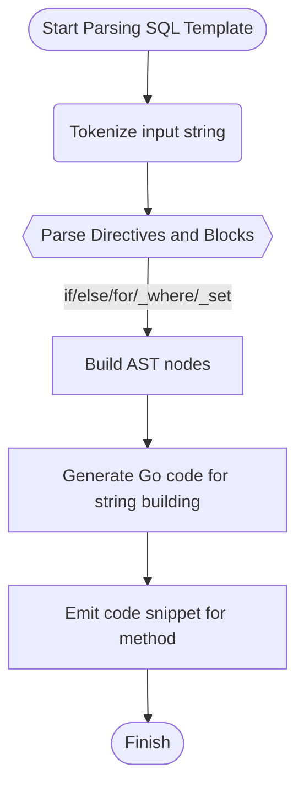

# Generation Pipeline and Template DSL

Dive into the heart of GORM CLI’s generation process where your Go interface comments and method signatures are transformed into powerful, type-safe SQL and Go code. This page unpacks the custom SQL Domain-Specific Language (DSL), the nuanced template resolution engine, parameter binding strategies, and how embedding conditional logic in SQL templates empowers you to craft expressive, dynamic queries easily.

---

## Understanding the Generation Pipeline

At the core of GORM CLI lies a seamless pipeline that converts annotated Go interfaces into fully functional, type-safe query APIs and field helpers. The process unfolds in stages:

1. **Parsing User Input**: Go source files containing your interfaces and models are parsed using Go's abstract syntax tree (AST).
2. **Extracting Interfaces and Methods**: The generator identifies interfaces with SQL template annotations embedded in method comments.
3. **Processing SQL Templates**: These templates are parsed using a specialized parser that understands GORM CLI’s custom SQL DSL.
4. **Generating Go Code**: The parsed SQL templates and method signatures produce concrete, type-safe Go methods that integrate seamlessly with GORM’s APIs.

This pipeline ensures your raw interface definitions result in frictionless querying capabilities without manual boilerplate code.

---

## The Custom SQL DSL Explained

GORM CLI introduces a focused SQL templating DSL that makes SQL in Go interfaces expressive and parameter-safe. This DSL allows:

- **Placeholders** for tables, columns, and parameters
- **Conditional blocks** for dynamic WHERE or SET clauses
- **Iteration constructs** for complex filters over collections

### Key DSL Constructs

| Directive | Purpose                                    | Example Usage                                      |
|-----------|--------------------------------------------|---------------------------------------------------|
| `@@table` | Resolves to the current model's table name | `SELECT * FROM @@table WHERE id=@id`               |
| `@@column`| Dynamic column binding                      | `SELECT * FROM @@table WHERE @@column=@value`      |
| `@param`  | Binds Go method parameters to SQL          | `WHERE name=@user.Name`                             |
| `{{where}}` | Conditional WHERE clause block              | `{{where}} age > 18 {{end}}`                        |
| `{{set}}` | Conditional SET clause (for UPDATE)         | `{{set}} name=@name {{end}}`                        |
| `{{if}}`  | Conditional fragments inside blocks          | `{{if age > 0}} AND age=@age {{end}}`               |
| `{{for}}` | Iteration over slices or maps                | `{{for _, tag := range tags}} ... {{end}}`          |

### Real-World Example

```go
// SELECT * FROM @@table WHERE id=@id AND name = "\@name"
GetByID(id int) (T, error)
```

This method query translates into a SQL snippet where:
- `@@table` dynamically resolves to the correct table
- `@id` binds to the `id` parameter safely
- The escaped `\@name` ensures a literal `@name` in SQL (no binding)

---

## Template Resolution and Code Emission

GORM CLI’s internal SQL template engine parses these templates, compiling them into Go code that builds SQL strings and parameter lists safely at runtime.

### How Template Processing Works

The template processor:

- Parses raw template strings into an Abstract Syntax Tree (AST) capturing text, directives, and control blocks.
- Handles nested conditionals (`if`, `else if`, `else`) and loops (`for`).
- Converts placeholders and bindings into Go code that appends to a SQL builder and parameters slice.

For example, a `{{where}}` block compiles into Go code emitting a trimmed and prefixed WHERE clause only if conditions inside evaluate to true.

---

## Parameter Binding Strategy

To eliminate SQL injection risks and ensure correct parameter mapping:

- Placeholders like `@param` translate to parameterized queries, adding the Go method parameter to the `params` slice.
- Complex expressions in `if` conditions ensure clauses only appear when meaningful.
- Table and column placeholders use `clause.Table{Name: clause.CurrentTable}` and `clause.Column{Name: columnName}` abstractions, ensuring GORM dialect compatibility.

This strategy produces robust, dialect-safe query generation without manual intervention.

---

## Examples of SQL Templates and Corresponding Generated Patterns

### Conditional WHERE Clause

```go
// SELECT * FROM @@table
// {{where}}
//   {{if !start.IsZero()}}
//     created_at > @start
//   {{end}}
//   {{if !end.IsZero()}}
//     AND created_at < @end
//   {{end}}
// {{end}}
FilterWithTime(start, end time.Time) ([]T, error)
```

**Outcome:** Generated Go code first checks whether `start` and `end` parameters are set and conditionally adds corresponding `created_at` constraints to the WHERE clause.

### Iteration Over Collections

```go
// SELECT * FROM @@table
// {{where}}
//   {{for _, user := range users}}
//     {{if user.Name != "" && user.Age > 0}}
//       (name = @user.Name AND age=@user.Age AND role LIKE concat("%",@user.Role,"%")) OR
//     {{end}}
//   {{end}}
// {{end}}
Filter(users []models.User) ([]T, error)
```

**Outcome:** The generator emits a WHERE clause dynamically building OR conditions for each non-empty user filter, safely binding parameters for all iterations.

---

## Tips and Best Practices for Writing SQL Templates

- Use `@param` carefully to bind only function parameters or loop variables to avoid compilation errors.
- Employ `{{where}}` and `{{set}}` blocks to encapsulate conditional fragments and prevent syntactic errors in SQL.
- Escape literal `@` signs using `\@` when needed.
- When looping with `{{for}}`, ensure loop variables are referenced correctly; avoid side-effects inside the loop.
- Keep templates readable by leveraging indentation and consistent comment alignment.

---

## Troubleshooting Common Issues

<AccordionGroup title="Common SQL Template Challenges and Solutions">
<Accordion title="Unclosed or mismatched template blocks">
Check that every `{{if}}`, `{{for}}`, and `{{where}}` block has a matching `{{end}}`. Missing `{{end}}` will cause parsing failures.
</Accordion>
<Accordion title="Unexpected parameter binding errors">
Ensure all `@param` placeholders correspond exactly to function arguments or declared loop variables. Typos or missing parameters cause generation errors.
</Accordion>
<Accordion title="Escaping issues with `@` character">
If you need a literal `@` in your SQL, prefix it with a backslash (`\@`) to avoid accidental parameter binding.
</Accordion>
<Accordion title="Complex conditional logic not evaluated as expected">
Remember that conditions inside `{{if}}` blocks use Go syntax evaluated at generation time; ensure logic matches parameter types and availability.
</Accordion>
</AccordionGroup>

---

## Internal Diagram: Template Rendering Flow



This flow represents how raw SQL templates transit from textual DSL to concrete Go code fragments embedded in generated methods.

---

## Summary

Understanding GORM CLI's generation pipeline and SQL template DSL unlocks powerful, expressive, and safe query generation. By embedding rich, conditional SQL templates in simple Go interfaces, you can leverage dynamic, type-checked queries while avoiding manual SQL string construction.

Explore related documentation on [Defining Models & Query Interfaces](../../getting-started/first-generation/define-models-interfaces) for building your first interfaces, and study the [Template-based Query Generation Guide](../../guides/generation-patterns/template-sql-gen) to deepen your mastery of the DSL.

---

## See Also

- [How GORM CLI Works (High-Level Architecture)](/overview/concepts-architecture/how-it-works-highlevel)
- [Quickstart Workflow](/overview/quick-features/quickstart)
- [Template-based Query Generation Guide](/guides/generation-patterns/template-sql-gen)
- [Defining Models & Query Interfaces](/getting-started/first-generation/define-models-interfaces)
- [Troubleshooting Common Issues](/getting-started/first-generation/troubleshooting-common-issues)

---

