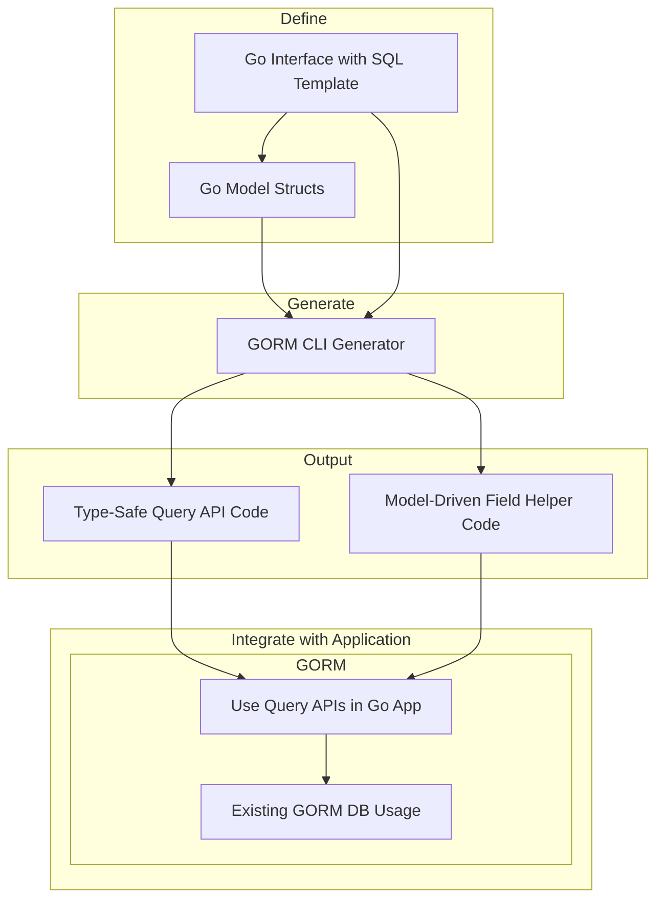

# Key Architectural Principles

GORM CLI is purpose-built to empower Go developers using GORM by generating **type-safe, interface-driven query APIs** and **model-driven field helpers**. This page unpacks the core design principles that drive this powerful tool, revealing how separation of concerns, static code analysis, and seamless integration make GORM CLI a robust and extensible companion for database workflows.

---

## Design Philosophy: Separation of Interface and Model-Driven Generation

At the heart of GORM CLI lies a clear **division of responsibilities**:

- **Interface-Driven Code Generation**: Users define Go interfaces annotated with SQL templates. The generator produces concrete, type-safe query implementations tailored from these interfaces.
  - *Why?* This isolates query logic in human-readable SQL templates while benefiting from Go's static typing.

- **Model-Driven Field Helper Generation**: From Go structs representing database models, the CLI generates strongly typed field helpers for predicates, setters, and association management.
  - *Why?* This provides fluent, discoverable APIs for building safe queries, updates, and relationship operations without boilerplate.

This split ensures each generation focus optimizes for different user intents — crafting queries vs. managing models — while together forming a comprehensive type-safe ORM extension.

<Info>
This design means you write your query interfaces and models naturally in Go, and GORM CLI produces strong, guided code that fits smoothly into your existing development flow.
</Info>

---

## Static Analysis & Compile-Time Type Safety

To deliver the compiler-assisted safety developers need, GORM CLI employs **static processing of Go source code**:

- **Parsing Go ASTs (Abstract Syntax Trees)** for interfaces and structs
- **Extracting SQL templates from method comments** attached to interfaces
- **Analyzing struct fields, tags, and type declarations** to build accurate field helpers

This approach produces **two complementary code outputs**:

- Fully type-checked **interface implementations** that compile SQL templates into Go query builders
- Rich **field helpers** reflecting exact Go schema types for filtering, updates, and associations

The benefit is eliminating manual runtime errors by catching incompatible types and mismatched queries during build — ensuring your database access layer is resilient and predictable.

<Check>
Always keep your model structs and interfaces in sync with your database schema to maximize static analysis reliability.
</Check>

---

## Integration Points with GORM

GORM CLI is designed as a natural extension to the popular GORM library, providing:

- **Generated query APIs** that adopt GORM’s `*gorm.DB` context seamlessly
- **Fluent use of generated field helpers** with GORM’s `Where`, `Set`, and association methods
- **Support for GORM data types and associations**, including polymorphic and many-to-many relations

This tight integration means generated code feels like idiomatic GORM usage, with added compile-time guarantees and developer ergonomics.

Example usage:

```go
// Query a user by ID with generated Query API
user, err := generated.Query[User](db).GetByID(ctx, 123)

// Use model-driven field helpers for filtering
users, err := gorm.G[User](db).Where(generated.User.Age.Gt(18)).Find(ctx)
```

This preserves GORM’s flexibility and power while adding safeguards and discoverability.

---

## Core Principles Enabling a Robust Workflow

### 1. Interface-Driven Query APIs

- Define **interfaces** with method signatures describing queries
- Annotate methods with **SQL templates** in comments using the DSL
- Generated code implements these interfaces with type-safe SQL execution

#### Benefits:
- Clear separation of query intent and mechanics
- Compile-time validation of parameters and return types
- Flexible SQL templating with placeholders and control flow

### 2. Model-Driven Field Helpers

- Inspect Go structs representing models
- Generate **predicate helpers** for filtering (e.g., `Eq`, `Gt`, `IsNull`)
- Generate **setter helpers** for updates and inserts
- Generate **association helpers** to manage relationships (create, update, unlink, delete)

#### Benefits:
- Fluent, type-safe query building
- Strongly typed updates with zero-value and expression support
- Easily manage complex relationships via generated APIs

### 3. Extensibility via Configuration

- Use `genconfig.Config` to customize:
  - Output directory
  - Included/excluded interfaces and structs
  - Field type and name mappings (e.g., JSON helpers)
- Configuration is discoverable and applies automatically during generation

This design allows tailoring generations to your project structure and coding patterns while maintaining core safety.

---

## Workflow Illustration



---

## Practical Value & Outcomes for Users

- **Catch errors early** with compile-time checked query parameters and model fields
- **Eliminate boilerplate** for predicates, updates, and association operations
- **Write expressive SQL** inline with familiar Go interfaces
- **Leverage flexible customization** through config for advanced scenarios
- **Maintain natural GORM usage** to preserve productivity and community support

---

## Common Pitfalls and Best Practices

- **Keep interfaces and models consistent:** Ensure field names and types match database schema
- **Use config for complex cases:** Map custom types like JSON via `FieldNameMap`
- **Write clear, maintainable SQL templates:** Use the DSL directives (`@@table`, `@param`, `{{where}}`) for readability
- **Regularly regenerate after model changes:** To prevent mismatches and stale code

<Tip>
GORM CLI is optimized for Go 1.18+ projects leveraging generics. Use the latest Go version for best compatibility.
</Tip>

---

## Summary

This page lays out the foundation of GORM CLI's architecture principles—separating interface definition from model-driven helpers, leveraging static analysis for type safety, and integrating tightly with GORM to deliver a powerful yet approachable developer experience. By understanding these principles, users can confidently adopt GORM CLI to build robust, maintainable database access layers.

---

## Related Documentation

- [System Architecture Overview](/overview/architecture-core-concepts/system-architecture): How components flow during code generation
- [Core Concepts & Terminology](/overview/architecture-core-concepts/core-concepts-terminology): Definitions and overarching ideas
- [Model-Driven Field Helpers](/concepts/data-models-and-abstractions/model-driven-field-helpers): Detailed helper types from models
- [Interface-Driven Query APIs](/concepts/data-models-and-abstractions/interface-driven-query-apis): Deep dive into generated interfaces
- [Customizing Generation Configuration](/concepts/customization-scalability/generation-configuration): Tailoring generation for your codebase
- [Using Generated APIs in Your Application](/guides/core-workflows/using-generated-apis): Practical application and workflows

---

## Next Steps

Explore the [Getting Started: Your First Code Generation](/getting-started/configuration-first-usage/first-generation-run) guide to apply these principles in your project. For advanced patterns, check out the best practices on [Working With Basic Fields](/guides/best-practices-patterns/working-with-basic-fields) and [Associations and Relations](/guides/best-practices-patterns/associations-and-relations).

<Check>
Before generating, ensure your environment meets Go 1.18+ requirements and that your models/interfaces are well defined for the best results.
</Check>
