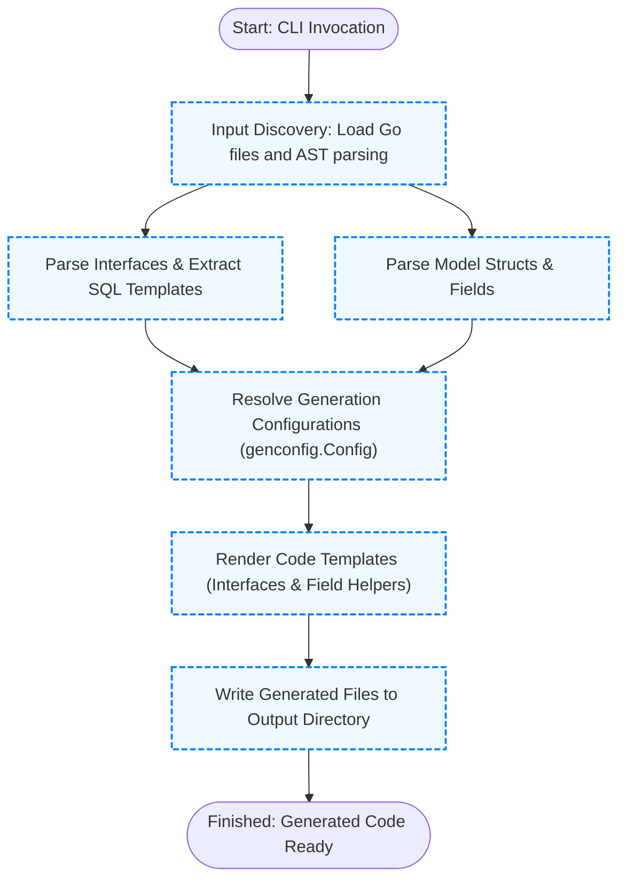

# Code Generation Lifecycle

Understanding the lifecycle of code generation in GORM CLI is key to harnessing its full power. This guide walks you through each phase—from discovering your user-defined Go models and query interfaces, parsing their SQL templates, to applying customizable templates and finally producing the generated type-safe code. By grasping this flow, you will know exactly where your input files and any custom configuration fit, enabling precise control over your code generation process.

---

## Overview: Journey from Input to Generated Code

The code generation lifecycle orchestrates several critical steps:

1. **Discovery of Inputs:** The generator begins by loading your Go files or directories containing interfaces with SQL template annotations and your model struct definitions.

2. **Parsing and Extraction:** It parses your code’s Abstract Syntax Tree (AST) to identify user interfaces, their methods, embedded SQL templates, and struct fields.

3. **Configuration Resolution:** The generator evaluates any package-level or file-level `genconfig.Config` declarations that influence generation behavior, such as output paths or field mappings.

4. **Template Rendering:** Parsed data is fed into templated Go source code generators that produce concrete, type-safe query interfaces and model-driven field helpers.

5. **Output Emission:** Finally, the generated code files are written to disk in the configured output directory, ready for immediate integration.

This flow ensures your annotated interfaces and models are transformed into powerful, compile-safe code extensions for your GORM-based data access layer.

---

## Step 1: Discovering User-Defined Models and Interfaces

The lifecycle starts when you invoke the CLI with an `-i` (input) path, pointing to your Go source files or directories containing your data model structs and query interfaces.

- The generator **walks directories recursively** if given a folder, processing every Go file, **excluding already generated code** to prevent duplication.
- It loads each file’s AST, uncovering:
  - **Interfaces** annotated with SQL templates in method comments.
  - **Structs** that define your database models.
  - Any **package-level generation configuration (`genconfig.Config`)** that may adjust later processing.

This phase is crucial because it builds the foundation of metadata required for correct code production.

<Check>
Always organize your query interfaces and model structs within a package/directory that is clearly designated for generation. This aids in predictable discovery.
</Check>

---

## Step 2: Parsing Interfaces and SQL Template Extraction

Once source code is loaded, methods within query interfaces are analyzed for SQL template comments using a specialized parser:

- SQL templates written inside method comment blocks (preceded by `//`) express SQL queries or statements with placeholders.
- The DSL supports directives like `@@table`, `@param`, `{{where}}`, and more to bind method parameters dynamically.
- This parsing extracts the raw SQL, segmented WHERE or SELECT clauses, and produces an intermediate representation for safe code generation.

Example method snippet with SQL template:

```go
// SELECT * FROM @@table WHERE id=@id
GetByID(id int) (T, error)
```

- The generator interprets the template and prepares a method implementation that executes this query with compile-time type safety.

<Tip>
Ensuring your SQL comments are properly formatted is critical. Comments without valid SQL templates result in chained query methods instead of finished execute calls.
</Tip>

---

## Step 3: Applying Generation Configuration

The lifecycle respects package- or file-level `genconfig.Config` declarations expressed as Go variables in your source:

```go
var _ = genconfig.Config{
  OutPath: "custom/output",
  FieldTypeMap: map[any]any{
    sql.NullTime{}: field.Time{},
  },
  IncludeInterfaces: []any{"Query*"},
  ExcludeStructs: []any{"*DTO"},
}
```

This configuration influences:

- **Output directory:** Overrides default output path for generated files.
- **Field mappings:** Alters which field helper types get generated for model fields, e.g., mapping JSON tags to a custom `JSON` field helper.
- **Interface and struct filters:** Includes or excludes types based on name patterns for granular control.
- **File-level vs. package-level scope:** Controls whether config applies only to the file or entire package hierarchy.

During processing, the generator merges applicable configs from parent directories and files, prioritizing more specific declarations.

<Note>
You can declare multiple configurations across packages and files. The generator aggregates these, allowing flexible control over large projects.
</Note>

---

## Step 4: Rendering Code with Templates

With all metadata assembled, code generation proceeds using Go text/template:

- Interfaces produce concrete types implementing query methods with embedded SQL execution logic.
- Structs produce strongly-typed field helpers that correspond to database columns, supporting filters, setters, and association helpers.
- The generator respects custom type mappings and generation filters from config.

Example partial rendered output for the interface method:

```go
func GetByID[T any](db *gorm.DB, opts ...clause.Expression) QueryInterface[T] {
  return QueryImpl[T]{
    Interface: gorm.G[T](db, opts...),
  }
}

func (e QueryImpl[T]) GetByID(ctx context.Context, id int) (T, error) {
  var sb strings.Builder
  params := []any{clause.Table{Name: clause.CurrentTable}, id}
  sb.WriteString("SELECT * FROM ? WHERE id=?")
  return e.Exec(ctx, sb.String(), params...)
}
```

<Tip>
Generated code is formatted and written atomically, ensuring valid Go syntax ready for immediate use.
</Tip>

---

## Step 5: Writing Generated Files and Output Structure

The last phase writes output to disk:

- The output path defaults to `./g` but can be overridden via CLI `-o` or `genconfig.Config.OutPath`.
- Generated files mirror relative directory structure of inputs to avoid conflicts.
- Files containing no relevant interfaces or structs (after filtering) are skipped.

Example CLI invocation:

```bash
gorm gen -i ./examples -o ./generated
```

Leaves your project in a state where generated type-safe query APIs and field helpers are available seamlessly.

<Check>
Integrate your generated code by importing the output packages and calling generated interfaces as demonstrated in usage guides.
</Check>

---

## Visualizing the Code Generation Lifecycle



---

## Practical Tips & Best Practices

- **Organize input files logically:** Keep models and query interfaces in clear packages/directories for easier targeting and configuration.
- **Document SQL carefully:** Use the supported DSL in comments strictly to avoid generation errors.
- **Leverage configuration files:** Utilize `genconfig.Config` to tune output directories, field helper mappings (e.g., JSON types), and include/exclude filters.
- **Test generated code:** After generation, confirm your code builds and runs with tests for your queries.
- **Iterate incrementally:** Start with minimal interfaces and add complexity while observing generation outcomes.

---

## Troubleshooting Common Lifecycle Issues

- **No methods generated:** Check your interfaces for valid SQL template comments and ensure inclusion filters are not overly restrictive.
- **Output files not found:** Verify the configured output directory is correct and CLI `-o` aligns with expectations.
- **Generated code formatting errors:** Ensure your input SQL templates are correct and escape sequences in comments are valid.
- **Configuration ignored:** Confirm your `genconfig.Config` declaration is package-level and that file-level scope is set appropriately.

If issues persist, consult the troubleshooting documentation sections or open an issue with reproduction steps.

---

## Summary

The Code Generation Lifecycle in GORM CLI empowers you to convert annotated Go interfaces and structs into robust, type-safe database access APIs. By understanding each processing step—from input discovery, configuration resolution, precise SQL template parsing, template-driven code rendering, through to clean output writing—you gain insights to customize and troubleshoot your code generation effectively, ensuring seamless maintenance and enhanced productivity in your GORM projects.


---

## Additional Resources

- [How Code Generation Works](/overview/integration-and-use/generation-workflow)
- [Customizing Code Generation with Config](/guides/advanced-usage/customizing-generation)
- [Template DSL Reference](/guides/advanced-usage/template-dsl)
- [Using the Generated Code](/getting-started/initial-usage/use-generated-code)
- [Type-Safe Queries with Interfaces](/guides/core-workflows/type-safe-queries)
- [Model-Driven Field Helpers](/guides/core-workflows/model-field-helpers)


---

_Source code references:_
- Generator CLI command setup: `internal/gen/gen.go`
- Interface and struct parsing: `internal/gen/generator.go`
- Template rendering logic: `internal/gen/template.go`
- SQL template parsing tests: `internal/gen/sqlparser_test.go`
- Full lifecycle unit tests: `internal/gen/generator_test.go`