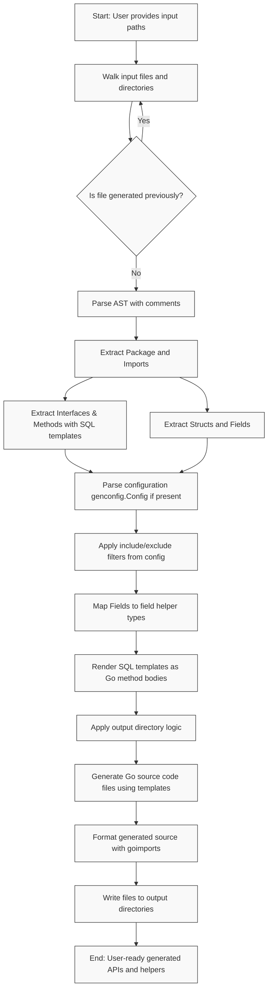

# The Code Generation Pipeline

The **Code Generation Pipeline** of GORM CLI transforms your Go source files—containing user-defined models and SQL-annotated interfaces—into robust, type-safe query APIs and model-driven field helpers. This process unfolds through distinct stages: parsing your input, analyzing Go AST nodes for model and interface metadata, processing SQL templates, mapping fields, and finally rendering clean, idiomatic Go code that integrates seamlessly with GORM.

Understanding this pipeline equips you to optimize your code generation, troubleshoot issues effectively, and customize outputs to fit your project's needs.

---

## 1. Input Parsing & File Processing

The pipeline starts by receiving an input path — this can be a single Go source file or a directory containing multiple files. The generator recursively walks the input directory structure, processing each `.go` file unless it detects a file was already generated by GORM CLI (identified by a specific generated-code header), which it skips to avoid regeneration loops.

Each input file is parsed into its Abstract Syntax Tree (AST) representation using Go's `parser.ParseFile` with comments retained. This AST serves as the foundation for extracting relevant information such as imports, package names, structs, interfaces, and configuration directives.

The generator also calculates relative paths of processed files to preserve directory layout in the output.

## 2. Extracting Interfaces and Methods

Within each file, the generator traverses the AST nodes to find:

- **Interfaces**: These define the methods for your SQL query APIs, annotated with SQL templates in method comments.
- **Methods**: Each interface method's comment is parsed for embedded SQL, which can be raw SQL, `where(...)`, or `select(...)` style directive.

For each method:

- Parameters and return types are parsed from the method signature.
- SQL templates are extracted and analyzed for templating directives.
- Validation ensures the method signatures comply with constraints (e.g., return values include error types appropriately).

The SQL templates support embedded Go template-like directives (`{{if}}`, `{{for}}`, etc.) for dynamic, parameter-bound SQL generation.

## 3. Extracting Structs and Fields

The pipeline also processes all structs, representing your database models, extracting:

- Field names and Go types.
- Database column names, derived via GORM's naming strategy or from explicit `gorm:"column"` tags.
- Field tags and special `gen:"name"` tags that map fields to custom field helpers.
- Embedded structs (anonymous embedding) are recursively flattened, pulling child fields into the parent.

Types are normalized to full import paths where applicable, ensuring precise type identification for downstream mapping.

## 4. Configuration & Filtering Application

If a package-level `genconfig.Config` exists, it's parsed and applied, allowing fine control over generation:

- Specify output paths per package or file.
- Include or exclude specific interfaces or structs using shell-style patterns or type literals.
- Map Go types and `gen` tags to custom field helper types.
- Choose file-level or package-level config scopes to tailor generation granularity.

When generating, these configurations filter the set of interfaces and structs so that only selected items produce output.

## 5. SQL Template Rendering

Embedded SQL template strings from method comments are parsed and compiled into Go code snippets that programmatically build SQL strings with bound parameters.

Using string builders and parameter append arrays, each template is transformed into Go code that implements the intended SQL logic with type safety and dynamic conditions.

Examples:

- Simple raw SQL with placeholders like `@@table`, `@param` are replaced by clauses referencing the current table or bound parameters.
- Conditional blocks (`{{if}}`) compile into Go `if` statements controlling SQL fragments.
- Iterations (`{{for}}`) turn into Go loops appending repeated conditions.

These code fragments become the method bodies for generated query API methods.

## 6. Field Type Mapping and Helper Selection

Each struct field is mapped to its appropriate **field helper type** reflecting its Go type and any configured overrides. This classification governs how predicates, setters, and ordering helpers are generated.

Mapping rules include:

- Basic scalar types like `string`, `bool`, `[]byte`, and `time.Time` are matched to standard helpers like `field.String`, `field.Bool`, `field.Bytes`, and `field.Time`.
- Numeric types with `int` or `float` get a generic `field.Number[T]` wrapper.
- Custom or named types implementing interfaces like `Scanner` or GORM `Valuer` become `field.Field[YourType]`.
- Struct relation fields and slices get `field.Struct[T]` and `field.Slice[T]` respectively.
- Configuration maps override field type or named tags to custom helpers, such as `JSON{}` for JSON columns.

This step ensures all generated code is idiomatic and leverages the correct helpers for safe and expressive SQL construction.

## 7. Code Generation & Output Formatting

After collating metadata, SQL method bodies, and field mappings, the pipeline renders Go code using predefined templates.

Templates generate:

- Interface implementations with generics for query APIs.
- Struct-level variables representing model fields as fully typed helpers.
- Import statements, package declarations, and method signatures.

The generation respects output path configurations to maintain project structure. Generated files start with a code-gen header indicating they are tool-produced.

The pipeline then applies Go code formatting (`goimports`) to produce clean, idiomatic, and ready-to-use source files.

## 8. Summary Flow Diagram

## Practical Tips for Working With the Pipeline

- **Define interfaces with embedded SQL templates accurately**: The parsing and generation rely on strict templating syntax to produce valid method bodies.
- **Use configuration files (`genconfig.Config`) to control scope**: For large projects, selectively include/exclude sets of interfaces or structs to reduce generation noise.
- **Leverage custom field type mappings for specialized data types**: Implement custom helpers like JSON fields by mapping `gen` tags to your helpers.
- **Keep model structs and query interfaces well-organized**: This maintains clarity for the generator and ensures predictable output destination and naming.
- **Validate generated output regularly**: Check generated files for correctness early to catch misconfigurations or template mistakes.

## Troubleshooting Common Pipeline Issues

<AccordionGroup title="Common Issues & Solutions">
<Accordion title="Missing Return Error in Method Signature">
Ensure that any interface method with SQL that returns data ends with an `error` type. For methods returning multiple values, the last return must always be `error`.
</Accordion>
<Accordion title="Unrecognized or Unsupported SQL Template Syntax">
The generator only supports specific templating constructs as documented. Avoid complex or unsupported Go template usages within SQL comments to prevent parsing errors.
</Accordion>
<Accordion title="No Output Files Generated">
Check if configuration filters exclude all interfaces and structs unintentionally. Also, verify the correct input path and that files are not mistakenly skipped due to existing generated headers.
</Accordion>
<Accordion title="Incorrect Field Helper Types Generated">
Review your `genconfig.Config` mappings for field types and named tags; incorrect or missing mappings may default to generic helpers.
</Accordion>
</AccordionGroup>

## Related Documentation

Refer to these pages to deepen your understanding and effectively utilize the code generation pipeline:

- [System Architecture & Data Flow](/overview/architecture-integration/system-architecture): for broader architecture context.
- [Interface-Driven Query APIs](/concepts/core-concepts/interface-driven-queries): on writing interfaces that generate query methods.
- [Model-Driven Field Helpers](/concepts/core-concepts/model-driven-field-helpers): for understanding field helper types.
- [Generation Configuration](/concepts/customization-configuration/generation-configuration): detailed usage of configuration options.
- [Template DSL and SQL Templating](/concepts/core-concepts/template-dsl): syntax and semantics for SQL templating.

---

By mastering the stages of GORM CLI's code generation pipeline, you unlock fluent, powerful, and safe database querying capabilities, tailored exactly to your Go models and queries.
