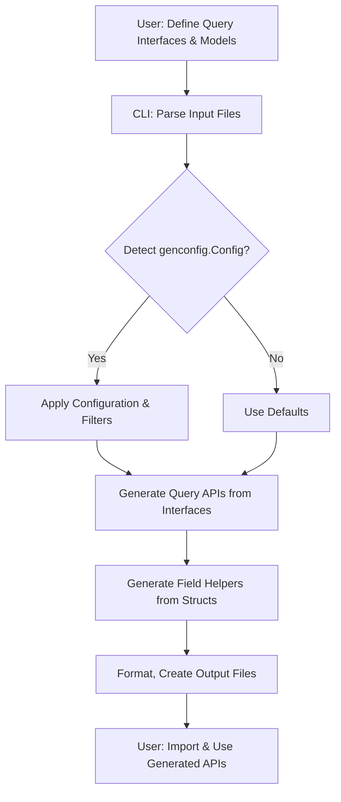

# Code Generation Workflow

Explore the end-to-end lifecycle of GORM CLI's code generation process. This guide walks you through how user-defined Go interfaces and model structs are parsed by the CLI, how configurations are applied, and how output code files are produced. Gain a clear understanding of the transformation from annotated source files (`examples/`, `field/`, `genconfig/`) to the generated type-safe APIs and field helper code under `examples/output/`.

---

## Overview of the Workflow

The GORM CLI generator converts your raw Go interfaces and model structs into safe, fluent, and discoverable code for interacting with your database. This involves key stages:

- **Parsing Input**: Reading Go source files containing query interfaces with embedded SQL templates and model struct definitions.
- **Applying Configuration**: Detecting optional generation configuration (`genconfig.Config`) to customize output paths, inclusion/exclusion rules, and field mappings.
- **Generating Code**: Translating parsed interfaces and structs into Go source files with generated query API implementations and type-safe field helpers.

This workflow is initiated via the CLI command `gorm gen -i <input_path> -o <output_path>`.


## Step 1: Parsing User Input

At the core, the CLI reads your annotated Go source files (files or directories) specified by the `-i` flag. Internally, it:

- Recursively walks directories or processes single files.
- Parses Go code with full AST (Abstract Syntax Tree) analysis, including comments.
- Extracts and records every interface and struct, focusing on:
  - Interfaces with methods documenting SQL template queries.
  - Structs that define your database models.
- Processes the comments above interface methods to extract SQL templates, directives, and parameter mappings.
- Reads any package-level `genconfig.Config` declarations to customize generation.

### User Intent

You provide:

- **Query Interfaces**: Go interfaces with methods annotated by raw SQL or templated SQL comments.
- **Models**: Structs defining the schema, including fields and tags.
- **Optional Config**: `genconfig.Config` objects to shape generation.

The CLI interprets these to build a rich internal representation used for code generation.


## Step 2: Applying Configuration

The generator respects configuration declared in your source files to tailor output:

- **OutPath**: Directory to place generated files. If not specified, `./g` is the default.
- **FieldTypeMap & FieldNameMap**: Map Go or struct field types and names to custom field helper types.
- **Include/Exclude Filters**: Control which interfaces and structs are included or excluded by name patterns or type literals.
- **FileLevel Flag**: Indicates if the config applies at file level or package level.

Configurations are discovered during parsing and merged hierarchically as the generator decides where to output files and which interfaces/structs to process.


## Step 3: Code Generation

Once parsing and configuration are complete, the generator produces output code files with the following key components:

### Query API Generation

- For each interface with SQL-annotated methods, it generates:
  - A typed interface `_<InterfaceName>Interface[T any]` with method signatures matching the original interface.
  - A concrete struct `_<InterfaceName>Impl[T any]` implementing generated methods.
  - Methods interpret and embed SQL templates as Go code that builds query builders dynamically.

Example generated snippet:

```go
func Query[T any](db *gorm.DB, opts ...clause.Expression) _QueryInterface[T] {
    return _QueryImpl[T]{
        Interface: gorm.G[T](db, opts...),
    }
}

func (e _QueryImpl[T]) GetByID(ctx context.Context, id int) (T, error) {
    var sb strings.Builder
    params := make([]any, 0, 2)
    sb.WriteString("SELECT * FROM ? WHERE id=?")
    params = append(params, clause.Table{Name: clause.CurrentTable}, id)
    return e.Exec(ctx, sb.String(), params...)
}
```

### Field Helper Generation

- For each struct, it generates strongly typed field helpers for every field:
  - Supports basic types (`int`, `string`, `time.Time`), custom mapped types, and associations.
  - Field helpers expose expressive predicates and setters (e.g., `.Eq()`, `.Set()`, `.Incr()`).

Example generated struct helper:

```go
var User = struct {
    ID   field.Number[int]
    Name field.String
    Age  field.Number[int]
}{
    ID:   field.Number[int]{}.WithColumn("id"),
    Name: field.String{}.WithColumn("name"),
    Age:  field.Number[int]{}.WithColumn("age"),
}
```

### Output Placement

- Generated files maintain the input directory structure relative to the output directory.
- Configurable `OutPath` namespaces outputs.
- Files are auto-formatted and imports managed.


## How the Process Maps Source to Output

| Source Location   | Content Type             | Generated Code                                   | Location in Output Folder                 |
|-------------------|--------------------------|-------------------------------------------------|------------------------------------------|
| `examples/query.go`| Query Interfaces         | Concrete typed query implementations             | `examples/output/query_gen.go`           |
| `examples/models/*.go`| Model Structs          | Field helpers for each struct                    | `examples/output/models_gen.go`          |
| `examples/genconfig.go` | Config declarations   | Influence output directory, field types, filters | Influences generation behavior globally or per file |


## Typical User Flow

<Steps>
<Step title="Define Models and Interfaces">
Write your Go structs representing your DB models and interfaces annotated with SQL templates.
</Step>
<Step title="(Optional) Configure Generation">
Add `genconfig.Config` variables to specify output directories, field mappings, or filtering.
</Step>
<Step title="Run the CLI Generator">
Execute `gorm gen -i ./examples -o ./examples/output` to parse and generate code based on your inputs.
</Step>
<Step title="Examine and Use Generated Code">
Explore generated query API implementations and field helpers; integrate them into your application.
</Step>
</Steps>


## Practical Tips and Best Practices

- **Keep your query interfaces and models in logically grouped packages or directories** to maintain clean output structure.
- **Leverage config maps** (`FieldTypeMap`, `FieldNameMap`) for complex or custom types, e.g., JSON or SQL scanner-backed types.
- **Use Include/Exclude filters** to control generation scope for large projects or temporary experimental code.
- **Avoid editing generated files manually** — they are overwritten on each run.
- **Annotate your interface methods thoroughly with SQL templates** for clear, maintainable code generation.


## Common Pitfalls & Troubleshooting

<AccordionGroup title="Troubleshooting Code Generation Issues">
<Accordion title="Empty Generated Output or Missing Methods">
Ensure that your interface methods have valid and non-empty SQL template comments. The generator requires SQL context to produce implementation.
</Accordion>
<Accordion title="Generation Targets Not Being Included">
Review your `genconfig.Config` include/exclude lists for interfaces or structs; overly broad exclusions can remove desired targets.
</Accordion>
<Accordion title="Output Files Not Placed Where Expected">
Check your `OutPath` settings and whether your config is set to file-level or package-level. Relative paths duplicate input folder structure.
</Accordion>
<Accordion title="Syntax or Import Errors in Generated Code">
Verify that dependencies such as GORM packages and standard library imports are present and up to date. The generator formats imports automatically.
</Accordion>
</AccordionGroup>


## Visualizing the Code Generation Flow




## Summary

This page provides the essential understanding of GORM CLI’s code generation lifecycle — transforming your annotated Go interfaces and models into powerful, type-safe database API code. With clear knowledge of parsing, configuration application, and output generation, users can confidently manage and customize their CLI code generation runs, streamline workflows, and integrate generated code seamlessly.


---

## Additional Resources

For deeper mastery, consult:

- [System Architecture Overview](/overview/architecture-workflows-integration/system-architecture) — High-level design context.
- [Prepare Your Project](/getting-started/first-usage-configuration/project-structure) — Best practices for project layout.
- [Generate Code: Your First Run](/getting-started/first-usage-configuration/run-generator) — Step-by-step generator usage.
- [Use the Generated APIs](/getting-started/first-usage-configuration/using-generated-code) — Practical usage of the generated code.
- [Customizing Generation](/guides/advanced-usage-best-practices/customizing-generation) — Advanced config techniques.


---

For source and implementation details, visit [GORM CLI GitHub Repository](https://github.com/go-gorm/cli).
