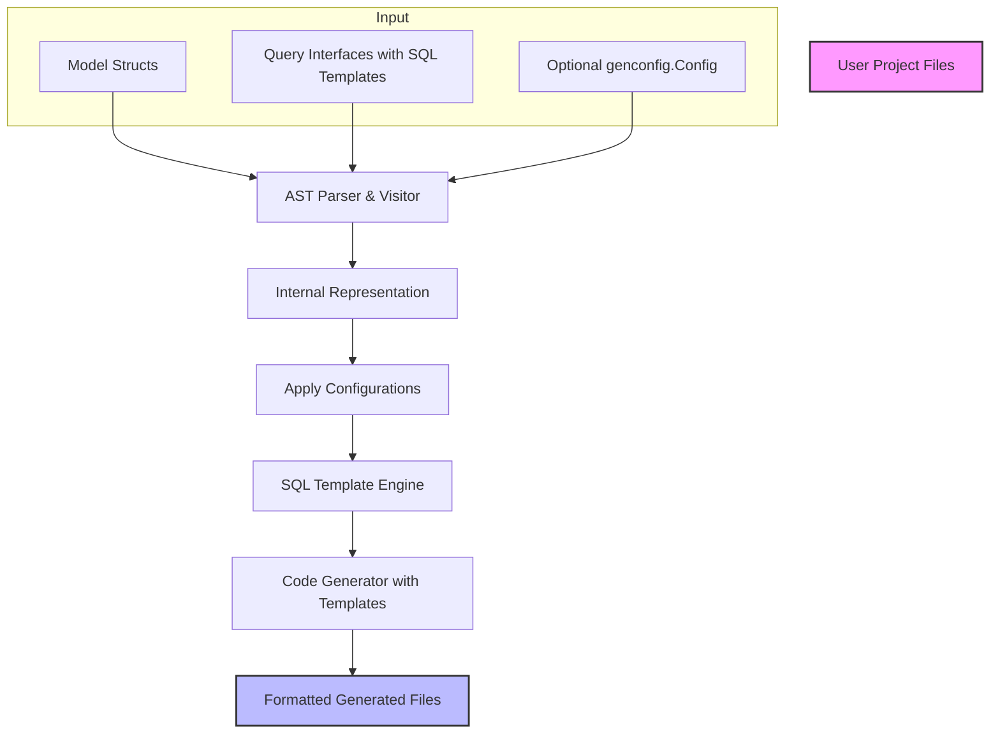

# Key Components and Workflow

Understand the major internal components of GORM CLI—including the code generator, template engine, and configuration system—and how they collaborate from input (models and interfaces) to output (type-safe query APIs and field helpers). This guide provides a high-level mental map for both end users and developers aiming to extend or integrate with the CLI.

---

## Introduction

GORM CLI operates as a sophisticated yet user-friendly command-line tool that transforms Go source code—comprising your GORM models and interface definitions—into robust, type-safe query APIs and field helpers. It orchestrates several critical internal components that collectively parse, analyze, and generate code that integrates seamlessly with GORM’s ORM capabilities.

This page demystifies this internal workflow by explaining each key component’s role and interaction within the overall generation lifecycle, focusing entirely on the flow from user inputs to generated outputs.

---

## Overview of the Generation Workflow

At its core, GORM CLI takes **two main inputs** you provide in your Go project:

- **Model structs** defining your database schema shapes and relationships.
- **Interface types** annotated by SQL template comments expressing query intent.

These inputs are processed through a pipeline involving parsing, configuration application, SQL template processing, and code generation, resulting in:

- Generated **interface-driven, type-safe query implementations** with fully compiled, safe SQL.
- Generated **model-driven field helpers** enabling fluent, compile-time safe usage for CRUD operations and association management.

---

## Major Components

### 1. Generator

The **Generator** is the CLI's command center responsible for processing input files, managing parsed data, and driving code generation.

- **Input Processing:** Accepts file or directory paths, recursively scans and parses Go source files.
- **AST Parsing:** Utilizes Go’s abstract syntax tree (AST) to find interfaces and structs.
- **Data Aggregation:** Organizes parsed interfaces, structs, and imports into internal structures.
- **Configuration Application:** Merges applicable generation configurations (from `genconfig.Config`) to filter and customize code output.
- **Code Rendering:** Applies Go `text/template` templates to render final code files.
- **Output Management:** Creates generated files preserving project directory structure and applies Go imports formatting.

### 2. File Representation

Each source Go file is represented internally as a **File** struct comprising:

- Package information
- Imports list
- Discovered interfaces (query interfaces)
- Discovered structs (models)
- Applicable configuration for filtering and customization
- Path metadata to determine output locations

This abstraction helps the generator treat every file as a unit of code generation with its own scope and config.

### 3. AST Visitor and Parsers

GORM CLI relies on an AST visitor pattern to traverse Go code nodes. This visitor:

- Extracts and records imports used.
- Identifies interface and struct declarations.
- Parses method signatures and their SQL template comments.
- Harvests configuration literals declared at the package level for generation options.

The parsing extends to types, supporting embedded structs and external packages, ensuring full understanding of field types and relations.

### 4. Configuration System (`genconfig.Config`)

The CLI supports optional, fine-grained configuration via the `genconfig.Config` struct declared at the package level in your source code.

- Configure output directories (`OutPath`) to control where files generate.
- Enable `FileLevel` mode for isolated file-based generation.
- Map Go types or named tags to custom field helpers.
- Include or exclude specific interfaces or structs by name or pattern.

The generator dynamically applies these configurations during processing, ensuring customized generation behavior without separate config files.

### 5. SQL Template Engine

Your query interface methods contain SQL template comments which the CLI parses with a custom SQL templating engine. This engine:

- Resolves special directives (e.g., `@@table`, `@@column`, `@param`).
- Interprets control structures (`{{if}}`, `{{for}}`, `{{where}}`, `{{set}}`).
- Transforms templates into Go code snippets for safe parameter binding.
- Generates method bodies that either execute SQL via GORM or chain query builders.

The engine’s output maintains user intent, producing code that is both reliable and optimized.

### 6. Code Generation Templates

Using Go’s standard `text/template` package, the CLI renders:

- **Query interface implementations:** Concrete types with methods corresponding to your interface signatures.
- **Model field helpers:** Per-struct generated variables with typed fields exposing methods for filtering, updating, and association management.

Templates incorporate all discovered information and config-driven customizations, resulting in idiomatic, readable generated code.

## Workflow Diagram

## How It Works Together: Detailed User Flow

### Step 1: Provide Source

- Place your **model structs** and **query interfaces** in your Go project.
- Optionally define a configuration variable using `genconfig.Config` within the package.

### Step 2: Run Generator

- Invoke `gorm gen -i <input-dir-or-file> -o <output-dir>`.
- The Generator scans all source files, skipping any already generated.

### Step 3: Parse and Analyze

- Each Go source file is parsed into an AST.
- Imports, interfaces, and structs are extracted.
- Method comments are scanned for SQL templates.
- Configurations are discovered and merged.

### Step 4: Apply Inclusion/Exclusion Filters

- Based on config filters, interfaces or structs may be included/excluded from generation.

### Step 5: Process SQL Templates

- SQL comments from methods are converted into Go code snippets that use GORM’s clause expression builders.

### Step 6: Generate Code

- Templates render all query interface implementations and model field helpers.
- Output files are saved with directory structure preserved.
- Code is automatically formatted and imports added.

### Step 7: Use in Project

- Generated code is now part of your project.
- You can consume the type-safe APIs and field helpers in your application's data layer for efficient, safe ORM usage.

---

## Practical Tips

- **Modularize your codebase:** Organize models and interfaces per package or directory to leverage config scoping effectively.
- **Use configs to control generation:** Include or exclude interfaces and structs as your project grows.
- **Write clear SQL templates:** Utilize the template DSL for flexible yet safe query expressions.
- **Iterate smoothly:** Make changes to your interfaces or models, then rerun generation to get updated type-safe APIs instantly.

---

## Common Pitfalls & Troubleshooting

- **Empty output files:** Check your `IncludeInterfaces` and `ExcludeInterfaces` filters; they may be too restrictive.
- **Unrecognized types:** Custom types may require explicit field mappings in `FieldTypeMap` or `FieldNameMap`.
- **Skipped files:** Generated files are skipped automatically; modify input sources, not generated files.
- **Parsing errors:** Make sure your interfaces and structs conform to Go syntax and the expected method signatures.

Consult the [Troubleshooting & Common Setup Issues](/getting-started/initial-usage/troubleshooting) page for detailed guidance.

---

## Summary

This conceptual documentation maps out the core components and workflow underpinning GORM CLI’s code generation engine. Understanding these internal roles will empower you to customize configurations sensibly, write effective input interfaces and models, and ensure smooth integration with the generated APIs.

---

## Additional Resources

- [Core Concepts & Terminology](/overview/architecture-and-concepts/core-concepts-glossary)
- [Code Generation Lifecycle](/concepts/architecture-overview/code-generation-lifecycle)
- [Integration with GORM](/concepts/architecture-overview/integration-with-gorm)
- [Customizing Generation with genconfig.Config](/concepts/configuration-and-extensibility/generation-config)
- [First Code Generation Walkthrough](/guides/getting-started/first-code-generation)
- [Using the Generated Code](/getting-started/initial-usage/use-generated-code)

---

## Next Steps

- Explore how to define query interfaces and models effectively.
- Learn to configure generation tailored to your project needs.
- Walk through generating your first APIs and field helpers.
- Start using generated code for safe, fluent GORM database access.

---

## Source

For a deep dive into the code generator source, visit the GORM CLI repository:

[Generator Implementation: internal/gen/generator.go](https://github.com/go-gorm/cli/blob/main/internal/gen/generator.go)

[Code Generation Template: internal/gen/template.go](https://github.com/go-gorm/cli/blob/main/internal/gen/template.go)

[Utility Helpers and Parsers: internal/gen/utils.go](https://github.com/go-gorm/cli/blob/main/internal/gen/utils.go)