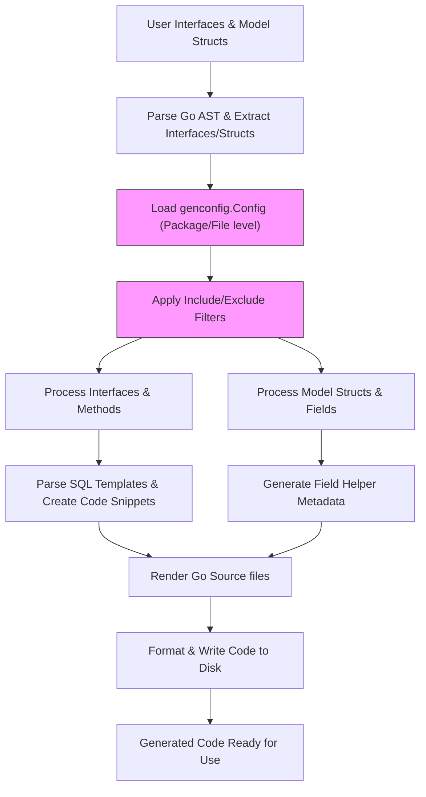

# Generation Data Flow

Understand how GORM CLI transforms your user-defined Go interfaces and model structs through a layered process of configuration parsing, template processing, and final code emission. This page unpacks the key stages where type information, SQL template annotations, and field helper logic evolve into strongly typed, fluent APIs and builders that you use in your application.

---

## Overview of Generation Flow

The GORM CLI code generation pipeline converts your annotated Go interfaces and structs into ready-to-use, type-safe query APIs and field helper constructs. This transformation unfolds in several key stages:

1. **Input Scanning and AST Parsing**: Your Go source files with query interfaces and model structs are parsed using the Go AST parser, extracting interfaces, methods, comments, and struct definitions.

2. **Configuration Collection and Application**: Package-level or file-level configurations (`genconfig.Config`) are located and applied. These influence output directories, field type mappings, and filtering of interfaces/structs.

3. **Interface and Method Extraction**: Interface declarations are processed to identify method signatures, including SQL template comments that specify queries or update statements.

4. **Struct Processing for Field Helpers**: Model structs are analyzed to extract fields, types, and tag info, enabling generation of strongly typed field helper constructs for predicates and updates.

5. **SQL Template Parsing and Code Generation**: Template SQL embedded in method comments is parsed, with placeholders resolved and transformed into Go code that builds queries with binding and dynamic conditional clauses.

6. **Generation of Typed APIs and Helpers**: Using templates, GORM CLI renders Go source files containing concrete implementations of query methods and fluent field helpers that respect your model and interface definitions.

7. **Output and Formatting**: Generated files are written to disk, respecting configured output paths and naming, and formatted using Go imports tooling to match standard conventions.

<Check>
This flow ensures that user intent expressed by raw SQL templates and Go types is faithfully transformed into compile-time safe, idiomatic GORM APIs.
</Check>

---

## Step-by-Step Walkthrough

### 1. User-Authored Interfaces and Structs

You start by defining Go interfaces with methods annotated by SQL templates in comments and model structs with fields representing database columns. For example:

```go
// Query interface with SQL templates
// SELECT * FROM @@table WHERE id=@id
GetByID(id int) (T, error)

// User model struct
// Fields carry `gen:"tag"` for custom field helper mapping
type User struct {
  ID   uint
  Name string
  Age  int
  Profile string `gen:"json"`
}
```

This input expresses core intent: what data operations are needed and how fields should be mapped.

### 2. Configuration Parsing

Package- or file-level variables typed as `genconfig.Config` provide customization such as:

- Output directory overrides
- Custom field type mappings (e.g., embedding `sql.NullTime` as `field.Time`)
- Inclusion or exclusion patterns for interfaces and structs
- File-scoped vs. package-scoped config application

Example config snippet:

```go
var _ = genconfig.Config{
  OutPath: "examples/output",
  FieldTypeMap: map[any]any{
    sql.NullTime{}: field.Time{},
  },
  FieldNameMap: map[string]any{
    "json": JSON{},
  },
  IncludeInterfaces: []any{"Query*"},
  ExcludeInterfaces: []any{"*Deprecated*"},
}
```

These settings guide subsequent filtering and generation rules.

### 3. Interface & Method Processing

The generator extracts detailed method info including parameters, return types, and crucially, SQL templates embedded in Go doc comments. It verifies method signatures for compliance and parses templates using the DSL:

- Bindings: `@param`, `@@table`, `@@column`
- Control flow: `{{where}}`, `{{set}}`, `{{if}}`, `{{for}}`

For example, a method signature and SQL template:

```go
// SELECT * FROM @@table WHERE @@column=@value
FilterWithColumn(column string, value string) (T, error)
```

The generator builds Go code that constructs this query with dynamic bindings and properly escapes parameters.

### 4. Struct and Field Helper Processing

Model structs are processed to extract:

- Field names, types, and DB column names (from tags or naming strategy)
- Custom field helper typing via `gen` struct tags
- Embedding/anonymously included fields resolved recursively
- Mapping Go types to field helpers (`field.String`, `field.Number[int]`, `field.Time`, `field.JSON` etc.)

This drives generation of strongly typed field accessors and predicates, enabling fluent query building.

### 5. Template Parsing to Code Emission

The core of query generation is translating the SQL templates into code that builds queries with dynamic parameters and conditional logic. The generator:

- Parses DSL directives and Go template control structures
- Converts placeholders into Go strings and parameter slices
- Handles conditional clauses like `{{if user.Name != ""}}`
- Iterates over collections with `{{for}}` generating OR/AND composite conditions

Resulting method bodies contain Go code assembling query strings and parameter lists safely.

### 6. Final Generated Source Files

Using the `pkgTmpl` Go text template, files are rendered that:

- Provide concrete implementations of your query interfaces, with methods returning data or query interfaces
- Define field helper variables with typed accessors for predicates and setters
- Include appropriate imports and package declarations

During generation:

- Configured output paths are honored
- Code is formatted and imports fixed
- Relationships between interfaces and structs yield cohesive, type-safe design

### 7. Usage in Client Code

The generated artifacts provide idiomatic, fluent APIs that integrate neatly with GORM:

```go
// Query user by ID with typed method
user, err := generated.Query[User](db).GetByID(ctx, 123)

// Build complex WHERE with field helpers
users, err := gorm.G[User](db).
  Where(generated.User.Name.Like("%jinzhu%"), generated.User.Age.Gt(18)).
  Find(ctx)
```

This workflow upgrades your raw interface and struct declarations into efficient, safe code.

---

## Key Concepts in Data Flow

| Stage                     | Input                               | Output                                              | Purpose                          |
|---------------------------|-----------------------------------|-----------------------------------------------------|---------------------------------|
| User Interfaces            | Go files with interface method docs | Parsed methods with SQL templates                    | Capture query intent             |
| Configuration Parsing     | Package vars (`genconfig.Config`) | Filtering settings, field mappings                  | Customize generation             |
| Struct Processing          | Go structs with field tags         | Field metadata with helper types                      | Prepare predicate/update helpers |
| Template Parsing           | SQL templates in comments          | Go code building queries dynamically                 | Embed conditional SQL logic      |
| Code Generation            | Parsed interfaces and structs      | Rendered Go source files                              | Produce final typed APIs         |
| File Output & Formatting   | Rendered code                      | Formatted Go files at configured output locations   | Deliver ready-to-use code        |

---

## Practical Tips & Best Practices

- **Annotate interfaces clearly:** Always provide SQL templates in method comments following the DSL for reliable generation.
- **Leverage configuration:** Use package-level `genconfig.Config` to map custom field types and control inclusion.
- **Name fields for mapping:** Use the `gen` struct tag to specify alternative field helper types like JSON.
- **Verify generated code:** Inspect generated files to understand output structure and ensure correctness.
- **Avoid unsupported method signatures:** Methods must return error as last value, and either a data object or the fluent interface.

## Common Pitfalls & Troubleshooting

- **Missing SQL templates:** Methods without SQL templates cannot generate concrete implementations and will cause panics.
- **Improper method return types:** Incorrect return signatures break generation, e.g., missing error return.
- **Config conflicts:** Conflicting include/exclude patterns can filter out needed interfaces or structs unexpectedly.
- **Unrecognized field types:** Without mapping, fields with custom types may generate unusable helpers.

Review logs and generated artifacts to resolve these issues.

---

## Visualizing the Generation Flow



---

## Related Documentation

- [Core System Components](../architecture-overview/system-components)
- [Configuring the Generator](../../concepts/customization-integration/generator-config-concept)
- [Mastering the SQL Template DSL](../../guides/real-world-examples/template-sql-dsl)
- [Working with Field Helpers](../../guides/real-world-examples/working-with-field-helpers)

---

This page equips you with a clear understanding of how your Go code transforms across multiple stages into type-safe, fluent APIs offered by GORM CLI. Use this knowledge to design clean interfaces and structs that capitalize on the generator's capabilities and configuration flexibility, enabling robust database access layers with minimal boilerplate.

For further mastery, explore guides on writing SQL templates, customizing field helpers, and advanced configuration patterns.