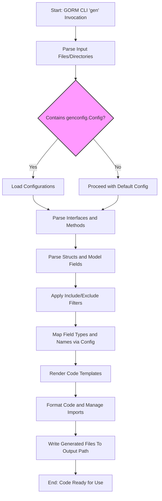

# Code Generation Workflow

Discover how GORM CLI processes your Go interface and model definitions to generate type-safe query APIs and field helpers. This guide walks you through the end-to-end flow, from parsing your source Go code with raw SQL templates, through rendering code via templates, to organizing output files according to your configuration. Understand how the generator respects custom mappings and configuration to produce customized, maintainable code for database operations.

---

## Overview

GORM CLI acts as a bridge transforming your Go interfaces annotated with SQL templates and your model struct definitions into fully typed, fluent query APIs and field helper utilities. This process involves several key stages:

- **Input Parsing**: Reading your Go source files or directories to extract interfaces and structs.
- **Configuration Aggregation**: Applying any `genconfig.Config` settings from your project to guide generation.
- **Template Rendering**: Using predefined Go templates to generate Go code reflecting your interfaces and models.
- **File Output Organization**: Writing generated files to configured directories, preserving your project structure and respecting include/exclude rules.

By following this workflow, GORM CLI ensures your generated code integrates flawlessly with GORM, enabling compile-time safety and fluent database interactions.

---

## 1. Input Parsing and AST Analysis

The generator begins by parsing the Go source code you provide (either a single file or directory). It leverages Go’s abstract syntax tree (AST) parsing capabilities to analyze:

- **Interfaces** with method comments containing raw SQL and template DSL for query definitions.
- **Structs** representing your models, including embedded anonymous fields.
- **Configuration variables**, such as package-level `genconfig.Config` declarations.

During parsing, the generator extracts method signatures, associated SQL template annotations, and model fields with their tags and Go types. It also builds an internal representation capturing relationships between interfaces and models.

> **User Intent Focus:** This step identifies exactly which queries and models you want generated code for, linking SQL templates with Go types based on your source definitions.

---

## 2. Configuration Handling

GORM CLI supports flexible generation configuration through the `genconfig.Config` struct. This configuration can be declared per package or at file scope (via the `FileLevel` flag), allowing you to:

- Override output directories (`OutPath`) for generated files.
- Customize mappings from Go types or struct field tags to specific field helper types.
- Include or exclude specific interfaces or structs by exact name or pattern.

The generator collects all applicable configurations for every file based on its path and scope, merging these settings to determine the final behavior for:

- Which interfaces and structs to generate for.
- Where to place generated output.
- How to map types to helpers (e.g., mapping `sql.NullTime` to `field.Time`).

This granular control ensures the generated code matches your project conventions and preferences seamlessly.

---

## 3. Template Rendering and Code Generation

Once all interfaces, structs, and configurations are processed, GORM CLI renders the final Go code using internal templates defined to produce:

- **Type-safe Query API Implementations**: For each interface, a corresponding generic interface and struct implementation providing methods with the SQL templates replaced by safe, parameterized GORM calls.

- **Model Field Helper Definitions**: For each struct, a strongly typed helper struct providing predicates, setters, and association helpers to build fluent queries and updates.

### Key Points:

- The generator injects `context.Context` automatically if missing in method signatures.
- SQL templates in comments are parsed into a DSL and expanded to Go code using helper functions.
- The generator ensures correct import statements, package naming, and Go code formatting.

Example snippet from generated query API:

```go
func Query[T any](db *gorm.DB, opts ...clause.Expression) _QueryInterface[T] {
    return _QueryImpl[T]{
        Interface: gorm.G[T](db, opts...),
    }
}

func (e _QueryImpl[T]) GetByID(ctx context.Context, id int) (T, error) {
    // generate SQL and parameter binding for: SELECT * FROM @@table WHERE id=@id
    return e.Exec(ctx, sb.String(), params...)
}
```

### Model-driven field helpers example:

```go
var User = struct {
    ID field.Number[uint]
    Name field.String
    Age field.Number[int]
}{
    ID: field.Number[uint]{}.WithColumn("id"),
    Name: field.String{}.WithColumn("name"),
    Age: field.Number[int]{}.WithColumn("age"),
}
```

---

## 4. Output File Organization and Writing

The generator respects the following when outputting files:

- **Directory Structure Preservation:** Generated files mirror your input directory structure within the configured `OutPath`.
- **Configurable Output Paths:** If an `OutPath` is defined in user configuration, it overrides the CLI output path.
- **File and Package Filtering:** Includes/excludes interfaces and structs based on patterns or explicit names.
- **Imports and Formatting:** All generated files include necessary imports and are formatted using Go’s `imports` tool.

Every invocation prints informative messages to indicate which files are being generated and where they are saved.

---

## 5. Method and SQL Template Processing

Each method defined in your interfaces is parsed to extract raw SQL or template directives embedded in comments. The generator:

- Uses specialized parsing to render dynamic SQL templates with placeholders like `@@table`, `@@column`, `@param`, and directives like `{{where}}`, `{{set}}`, conditionals, and loops.
- Generates Go method bodies that bind parameters safely and produce fluent query code or execute updates.
- Enforces method return signature rules ensuring error-first or error-only patterns for safety.

This tight coupling of SQL templates and method signatures empowers you to define your SQL queries richly while guaranteeing type safety and correctness at compile time.

---

## 6. Practical Tips & Best Practices

- **Organize your code with matching packages for models and interfaces** to simplify relative pathing and code generation.
- **Leverage `genconfig.Config` for custom mappings** especially to handle special types like JSON or nullable time.
- **Write clear SQL templates in comments** with placeholders to express conditional queries flexibly.
- **Use include/exclude filters in config** to control generation scopes precisely in large projects.
- **Always specify input path explicitly** when running `gorm gen -i` to avoid unexpected file exclusion.

---

## 7. Troubleshooting Common Issues

<AccordionGroup title="Troubleshooting Code Generation">
<Accordion title="No Generated Files Found">
Ensure input path points correctly to your Go files with relevant interfaces and models. Check if `IncludeInterfaces` or `IncludeStructs` patterns in your configuration accidentally exclude all targets.
</Accordion>
<Accordion title="Errors Parsing SQL Templates">
Verify your SQL template comments strictly follow the DSL syntax, including direct placeholders like `@@table`, and that method parameters align properly with your template variables.
</Accordion>
<Accordion title="Output Files Not Appearing in Expected Directory">
Check your `OutPath` settings in configuration and CLI flags. Relative paths from input directories are retained, so confirm directory structure matches your expectations.
</Accordion>
</AccordionGroup>

---

## Mermaid Diagram: Code Generation Flow



---

## Additional References
- [Generating Type-Safe Query APIs](https://gorm.io/cli#type-safe-query-apis)
- [Model-Driven Field Helpers Concepts](https://gorm.io/cli#field-helpers)
- [Configuring Generation with genconfig.Config](https://gorm.io/cli#configuration)
- [Template SQL Query Syntax and Examples](https://gorm.io/cli#template-sql-dsl)
- [Working with Associations and Relationships](https://gorm.io/cli#associations)

Consult these for deeper insights into each generation aspect and to master advanced customization.

---

## Summary
This guide elucidates the detailed steps GORM CLI follows from parsing your annotated Go source code through configuration processing and template rendering, to generate maintainable, type-safe query APIs and field helpers that integrate seamlessly with GORM. It empowers developers to understand the generation pipeline, configure it flexibly, and resolve common issues effectively, accelerating reliable database access code creation.

---

For hands-on use, combine your knowledge here with the [Quick Setup & First Generation](../guides/getting-started-workflows/quick-setup) and [Using Type-Safe Query APIs](../guides/getting-started-workflows/using-type-safe-queries) guides.


---