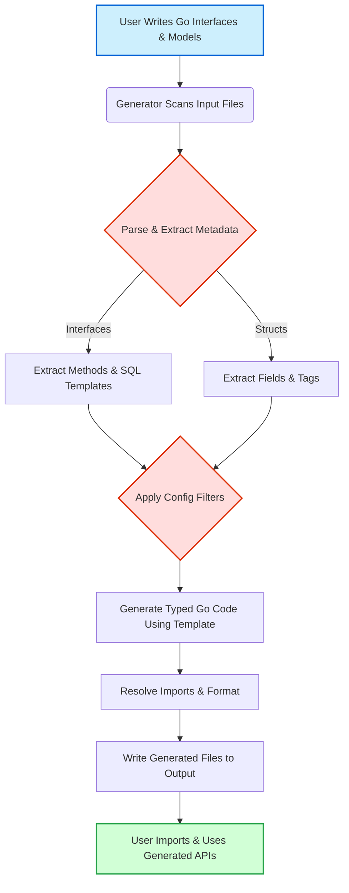

# Code Generation Workflow

Explore how GORM CLI transforms your raw Go interfaces and model structs into powerful, type-safe query APIs and helper fields. This guide walks you through each stage—from detecting your source code to generating polished output for seamless integration with GORM.

---

## 1. Overview

GORM CLI automates the tedious process of writing database access layers by interpreting your Go source files containing annotated interfaces and models. It generates two complementary outputs:

- **Query APIs:** Typed interfaces and implementations that map your SQL templates to Go methods.
- **Field Helpers:** Strongly typed field wrappers based on model structs for filters, updates, and associations.

This workflow improves developer productivity by ensuring compile-time safety, reducing runtime errors, and providing a fluent API for complex queries.

---

## 2. Input Detection & Parsing

### 2.1. Source Identification

You start by running the command:

```bash
gorm gen -i ./path/to/your/interfaces -o ./generated
```

- `-i` specifies the Go source interface file or folder.
- `-o` defines the output directory for generated code (default: `./g`).

GORM CLI recursively scans your specified input path for Go source files.

### 2.2. Parsing Go Files

Internally, each Go file is parsed using Go's `parser` and `ast` packages:

- The tool extracts the package name, imports, interface declarations, and struct definitions.
- It specifically looks for **interface types** annotated with SQL templates inside method doc comments.
- It also detects **package-level generator configuration** defined as `genconfig.Config` literals.

### 2.3. Example Extracted Elements

```go
var _ = genconfig.Config{
    OutPath: "examples/output",
    FieldTypeMap: map[any]any{
        sql.NullTime{}: field.Time{},
    },
    IncludeStructs: []any{"User"},
    ExcludeInterfaces: []any{"*Deprecated*"},
}
```

This config influences the code generation behavior for files in the package.

---

## 3. Transformation & Filtering

### 3.1 Applying Configuration

- Configurations from any `genconfig.Config` discovered are collected.
- Filters such as `IncludeInterfaces`, `ExcludeInterfaces`, `IncludeStructs`, and `ExcludeStructs` refine which types are processed.
- File-level or package-level configs determine applicable output folder overrides.

### 3.2 Interface Method Processing

Each interface method undergoes:

- Extraction of SQL template directives, e.g., `SELECT`, `WHERE`, `UPDATE` clauses, and placeholders using the templating DSL.
- Parameter and return type extraction ensuring compliance with rules:
  - Finish methods with SQL must have at least one return value (data and error).
  - Maximum of two returns allowed.
  - The last return value must be of type `error`.

### 3.3 Model Struct Processing

- Structs are parsed field-by-field capturing names, database column names, Go types, and any `gen` tags.
- Anonymous embeddings are automatically flattened to include embedded fields.
- Superfluous or excluded structs are ignored based on config.

---

## 4. Code Generation

### 4.1 Template Rendering

- The generator uses a Go `text/template` containing the structure of the generated Go files.
- For each processed input, a corresponding output Go file is rendered.
- The output contains:
  - Typed interfaces with method signatures matching your SQL annotations.
  - Concrete method implementations that build SQL calls dynamically using GORM's query builder.
  - Generated field helper variables and types for strongly typed query construction.

### 4.2 Output Directory Structure

- The `-o` option or `OutPath` config controls where generated files are saved.
- Relative directory structure from input is preserved.

### 4.3 Example Generated Method

```go
func (e _QueryInterface[T]) GetByID(ctx context.Context, id int) (T, error) {
  // Generated SQL snippet combining the annotated template
  // Executes query and scans result into typed struct
  return e.Exec(ctx, sb.String(), params...)
}
```

### 4.4 Import Management & Formatting

- Imports are merged and resolved automatically to ensure the generated code builds correctly.
- Output files are formatted using Go's import processing tools.

### 4.5 Generation Diagnostics

The CLI prints progress messages to confirm code generation per file and folder.

---

## 5. User Workflow Integration

### 5.1 Preparing Source Files

- Write Go interfaces with SQL template comments describing your queries.
- Define Go structs representing models with optional `gen` tags for custom field handling.
- Optionally, include a package-level `genconfig.Config` to customize behavior.

### 5.2 Running the Generator

- Invoke the CLI with appropriate input paths.
- Observe the generated files in the output folder.

### 5.3 Using Generated Code

- Import generated packages in your application.
- Call the generated typed query methods for compile-time validated queries.
- Use field helpers for building fluent queries and updates.

Example:

```go
user, err := generated.Query[User](db).GetByID(ctx, 123)
if err != nil {
    // Handle error
}
```

---

## 6. Common Pitfalls & Tips

- **Ensure all interfaces have properly annotated SQL comments.** Missing or malformed templates will cause generation errors.
- **Methods that perform final SQL executions must return an error or result + error.** Otherwise, the generator panics.
- **Use configuration carefully:** file-level configs override package-level ones for output paths.
- **Avoid recursive dependencies in embedding.** Infinite embedding loops will disrupt generation.
- **Verify generated code syntax** if your IDE or CI flags errors.

---

## 7. Diagram of Code Generation Workflow



---

## 8. Related Documentation

- [Preparing Models & Query Interfaces](../../getting-started/first-codegen-workflow/prepare-models-interfaces)
- [Running the Code Generator](../../getting-started/first-codegen-workflow/generate-code)
- [Using the Generated APIs](../../getting-started/first-codegen-workflow/using-generated-code)
- [Basic Configuration Options](../../getting-started/first-codegen-workflow/basic-configuration-options)
- [Mastering the SQL Template DSL](../../guides/advanced-patterns/templating-dsl)

---

## 9. Summary

This page detailed the entire **code generation workflow** behind GORM CLI, empowering users to understand the journey from source files to fully generated, type-safe APIs and field helpers. Starting with source scanning and AST parsing, through configuration filtering and templated code rendering, the process ensures strong typing and seamless integration with GORM for safer, more productive database interaction.

Following these concepts, you can confidently prepare your codebase, customize generation, and harness the power of GORM CLI in your Go projects.

---

<Check>
Always keep your Go interfaces well annotated and test your generated code for correctness. Leverage the configuration system when customizing outputs or filtering generation scope.
</Check>

---