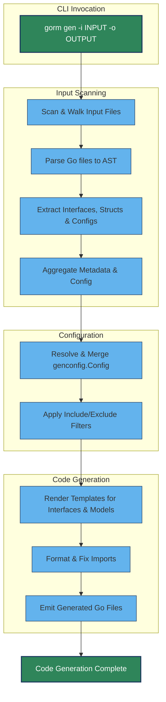

# Code Generation Workflow

The **Code Generation Workflow** page details the complete process through which GORM CLI transforms user-defined Go interfaces and model structs into type-safe, convenient query APIs and field helpers. This guide walks you step-by-step through the core phases such as input scanning, configuration resolution, template rendering, and file emission, providing a transparent view of how your source code is interpreted and expanded into generated helper code. You will also learn about the important extensibility points where you can customize or extend this workflow to tailor generation to your project's unique requirements.

---

## 1. Overview of the Code Generation Process

At its core, GORM CLI’s generator receives Go source files or directories containing your raw SQL-annotated interfaces and model definitions. It then parses these sources into an Abstract Syntax Tree (AST), extracts relevant metadata for interfaces and structs, applies your generation configuration, and finally renders code templates into output files.

This pipeline ensures your generated code is always synchronized with your source models and query definitions, enabling a seamless developer experience with complete type safety and fluent API support.

### Typical User Flow

- You prepare your Go interface files with embedded SQL template comments defining your queries.
- You define Go struct models in the same package or folder.
- You optionally add a package-level `genconfig.Config` to customize output paths, field mappings, or filtering.
- You run the GORM CLI command to trigger the generator.
- The tool scans inputs, applies configs, resolves templates, and writes generated Go source files to your designated output.
- You import and use the generated code in your application for type-safe queries and model operations.

## 2. Input Scanning & AST Parsing

GORM CLI begins by accepting a file or directory input path through the CLI flag `-i`. The generator recursively walks the directory tree if a directory is provided, processing each `.go` file.

For each source file:

- It parses the Go file into an AST using Go’s standard parsing tools.
- It collects imports and package information essential for later code generation and import resolution.
- It visits AST nodes to extract:
  - Interfaces with method signatures and embedded SQL template comments.
  - Structs and their fields to build model metadata.
  - Any `genconfig.Config` declarations for configuration overrides.

### Practical Tips

- **File Skipping:** Generated files from previous runs are automatically skipped to avoid redundant processing.
- **Relative Paths:** The generator keeps track of relative paths from the scanned root folder for output directory structure preservation.

## 3. Configuration Resolution & Filtering

Before generating code, GORM CLI merges all discovered `genconfig.Config` objects from the scanned files to influence the output.

This configuration can:

- Override output paths per package or file.
- Map Go types or `gen` tags to customized field helper types.
- Whitelist or blacklist interfaces and structs using shell-style patterns or type expressions.
- Control whether configurations apply at file or package level.

### Application of Configuration

- When multiple configs are applicable to a file, their Include/Exclude filters combine logically.
- If `IncludeInterfaces` or `IncludeStructs` are set, only matching types generate code.
- Otherwise, `ExcludeInterfaces` and `ExcludeStructs` remove matching types.

### Best Practices

- Use explicit include filters to focus generation on specific interfaces or models.
- Use type literal syntax (e.g., `models.User{}`) in config for precise control.
- Override output paths when organizing generated files into dedicated folders.

## 4. Template Resolution and Code Emission

GORM CLI uses Go’s `text/template` package to render source code files. The templates incorporate extracted metadata:

- Interface method signatures are transformed into type-safe functions with concrete SQL execution logic.
- Model structs generate strongly typed field helpers reflecting your schema.
- Import statements are merged and deduplicated to ensure compilable output.

### Emission Details

- The generator writes generated files to the configured output directory, preserving relative package paths.
- Output directories are created on demand.
- The generator applies imports formatting and source code style imports fixes via the `golang.org/x/tools/imports` package.
- Progress messages indicate which source file corresponds to each generated output.

### Error Handling

- The workflow stops on parsing or template execution errors to avoid emitting incomplete code.
- Errors include informative messages indicating the file and stage for quick troubleshooting.

## 5. Extensibility Points & Advanced Configuration

The workflow exposes important extension hooks that you can leverage to customize generation:

- **Field Type Mapping:** Through `FieldTypeMap` and `FieldNameMap` in `genconfig.Config`, map specialized Go types or struct tags to custom field helpers beyond the defaults.
- **Selective Generation:** Use the Include/Exclude filters to generate code only for relevant subsets of your codebase, improving performance and manageability.
- **File vs Package Level Config:** Control if the configuration applies to the whole package or just the current file for fine-tuned per-file overrides.

### Example Scenario

Imagine you have a custom JSON field helper and want all fields tagged `gen:"json"` to use it. Defining this mapping in `genconfig.Config` causes the generator to substitute standard field helpers with your custom types, ensuring generated queries use the desired behavior.

## 6. Troubleshooting Common Issues

- **No Generated Code:** Verify your interfaces and structs are not excluded by filters.
- **Parsing Errors:** Check for valid Go syntax and proper use of query interface comments.
- **Import Resolution Warnings:** Confirm your source files have correct imports for any custom types referenced.
- **Output Path Not Applied:** Ensure the `OutPath` is correctly set in `genconfig.Config` and no conflicting overrides exist.

### Tips to Diagnose Problems

- Run the CLI with verbose output to trace processing steps.
- Inspect generated code locations and file contents.
- Use minimal interfaces initially to isolate parsing issues.

---

## Mermaid Diagram: Code Generation Workflow

---

## Summary

This page demystifies how GORM CLI takes your raw Go code with SQL templates and outputs rich, type-safe query APIs and field helpers. By understanding this workflow, you can better configure, extend, and troubleshoot code generation, unlocking the full power of GORM CLI.

---

## Additional Resources

- [Configuring Generation with genconfig.Config](https://docs.gorm.io/guides/advanced-usage/configuring-generation.html)
- [Defining Query Interfaces & SQL Templates](https://docs.gorm.io/guides/core-workflows/query-apis-and-templates.html)
- [Using Generated Field Helpers for Filtering and Updates](https://docs.gorm.io/guides/core-workflows/using-generated-field-helpers.html)
- [Custom Field Mapping & JSON Columns](https://docs.gorm.io/concepts/data-models-schemas/custom-field-mapping.html)
- [Quickstart Workflow](https://docs.gorm.io/overview/feature-highlights-getting-started/quickstart-workflow.html)

---

## Next Steps

To harness this knowledge:

1. Prepare your query interfaces and models with embedded SQL comments.
2. Customize generation with `genconfig.Config` based on your project needs.
3. Run the `gorm gen` command and observe generated outputs.
4. Explore advanced usage by creating custom field helpers or filtering generation.
5. Consult detailed guides on SQL Template DSL and association handling to maximize productivity.

---