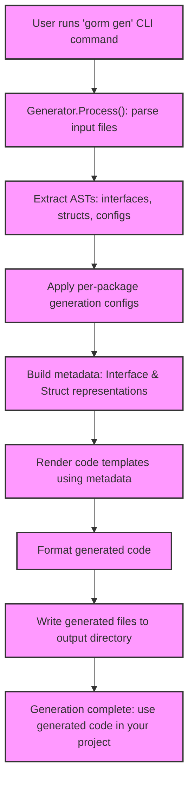

# Generator Workflow & System Components

GORM CLI empowers Go developers with type-safe, expressive database APIs by converting user-defined interfaces and models into fully generated, idiomatic Go code. This guide takes you through the end-to-end lifecycle of the `gorm gen` CLI command, detailing how it orchestrates parsing, configuration, template rendering, and output generation. You'll understand how your interface definitions, SQL annotations, and model structs feed into the generator components, culminating in compiled, ready-to-use query APIs and field helpers.

---

## 1. From CLI Invocation to Code Generation: Overview

The lifecycle begins the moment you invoke the `gorm gen` command. At a high level, the process flows as follows:

1. **User runs CLI command:** specify input source and output path.
2. **Generator parses input:** processes Go source files recursively, extracting interfaces and structs.
3. **Configuration application:** generator discovers and applies per-package generation configs.
4. **Interface and Struct analysis:** builds internal metadata models, linking SQL templates and struct fields.
5. **Template engine rendering:** generates Go source files with typed query methods and field helpers.
6. **Source formatting and output:** formats generated code and writes to user-defined directories.

This workflow enables transforming static Go types and annotated comments into safe, fluent, type-safe query interfaces and helper fields without manual coding.

---

## 2. CLI Invocation and Options

The CLI command you use is:

```shell
gorm gen -i ./path/to/interfaces -o ./generated/output
```

- `-i, --input` (required): Path to the Go interface file or directory containing your SQL-annotated interfaces.
- `-o, --output` (optional): Directory in which generated code files will be placed. Defaults to `./g`.

The CLI implementation (see `internal/gen/gen.go`) wraps this flow into a Cobra command:

- It instantiates a `Generator` struct.
- Calls `Process()` on the input path to analyze files.
- Calls `Gen()` to render and write files.

If any error occurs during processing or generation, the CLI surfaces a detailed message and exits.

---

## 3. Parsing and Processing Input Files

The Generator starts by walking the input file(s):

- If input is a directory, it recursively scans for Go files.
- Each Go file is parsed into an abstract syntax tree (AST).
- The `File` structure collects the file package name, imports, interfaces, structs, and discovered configs.

### Extracting Interfaces and Methods

For each interface:

- The methods are read, including their signatures.
- SQL annotations are extracted from method comments.
- Method parameters and returns are parsed, enforcing:
  - Return values must include `error`.
  - Max two return values (data + error) are allowed.
  - Context parameter (`context.Context`) is injected if missing.

### Processing Structs

For each struct type:

- Exported fields are collected with their Go types and DB column names.
- Embedded structs are expanded inline.
- `gen` struct tags and config-based mappings influence field type inference.

---

## 4. Applying Generator Configuration

The generator automatically picks up package-level `genconfig.Config` literals to customize generation:

- Override output directories (`OutPath`).
- Map Go types or field tags to specialized field helper wrappers (e.g., `sql.NullTime` → `field.Time`).
- Filter which interfaces and struct types to include/exclude.
- Control config scope at file or package level.

This layered configuration is applied per file, and interfaces/structs not matching filter rules are excluded from generation.

Example config snippet:

```go
var _ = genconfig.Config{
  OutPath: "examples/output",
  FieldTypeMap: map[any]any{
    sql.NullTime{}: field.Time{},
  },
  IncludeInterfaces: []any{"Query*"},
}
```

---

## 5. Internal Representation and Metadata

The generator builds rich metadata structures representing your source code:

- **Files:** contain package info, imports, interfaces, structs, config.
- **Interfaces:** name, alias, documentation, and methods.
- **Methods:** method name, parameter list, return types, extracted SQL template.
- **Structs and Fields:** field names, DB column names, Go types, tag-based helpers.

All these are used by templates for generating strongly-typed, idiomatic Go code.

---

## 6. Template Rendering and Code Generation

Using a comprehensive Go `text/template`, the generator produces:

- Query interface implementations with typed methods reflecting the SQL templates.
- Model-driven field helpers for predicates, setters, and associations.

The generator:

- Injects `context.Context` param automatically if missing.
- Generates method bodies based on SQL directive parsing (e.g., handling `SELECT`, `WHERE`, `UPDATE`).
- Maps struct fields to helpers respecting configuration.

After rendering, generated code is formatted with `golang.org/x/tools/imports` to adhere to Go style.

---

## 7. Generated Code Output and Use

Generated files are written preserving directory structure relative to input, in the output path.

The code includes hints:

```go
// Code generated by 'gorm.io/cli/gorm'. DO NOT EDIT.
```

You can then use the generated files to call type-safe query methods and leverage model field helpers like:

```go
user, err := generated.Query[User](db).GetByID(ctx, 123)
users, err := gorm.G[User](db).Where(generated.User.Name.Eq("alice")).Find(ctx)
```

This streamlines database operations with compile-time safety and discoverability.

---

## 8. Practical Tips & Best Practices

- **Always supply the `-i` flag** with your interface source path.
- Use per-package `genconfig.Config` to fine-tune output paths or field mappings.
- Annotate interface methods with clear SQL templates in comments for accurate code generation.
- Keep input interfaces and structs in the same or related packages/directories for automatic config association.
- Use naming conventions to include/exclude interfaces or structs via config filters.

---

## 9. Troubleshooting Common Issues

- **No generated files?** Check if interfaces or structs are filtered out by config.
- **Parsing errors?** Ensure your interfaces and SQL templates comply with expected syntax.
- **Runtime errors in generated code?** Verify your SQL template parameters match method signatures.
- **Field helpers not mapping correctly?** Confirm your `genconfig.Config` mappings and struct tags.

Refer to the [Troubleshooting Setup Issues guide](/getting-started/first-use-validation/troubleshooting-common-issues) for detailed examples.

---

## 10. Visualizing the Generator Workflow



---

For more details, explore related concepts in [Model-Driven Field Helpers & Interface Query APIs](/concepts/architecture-overview/model-and-query-api-generation) and [Customizing Code Generation with Configurations](/guides/advanced-usage-patterns/customizing-generation).

---

## References

- Source code: [github.com/go-gorm/cli](https://github.com/go-gorm/cli)
- CLI entrypoint: `main.go`
- Generator core: `internal/gen/generator.go`, `internal/gen/gen.go` and `internal/gen/template.go`
- Example interface and model definitions: `examples/query.go`
- Configuration model: `genconfig.Config`

---

This guide positions you to harness GORM CLI effectively by understanding its workflow from invocation to code generation, ensuring you can diagnose, customize, and optimize your generation process smoothly.
