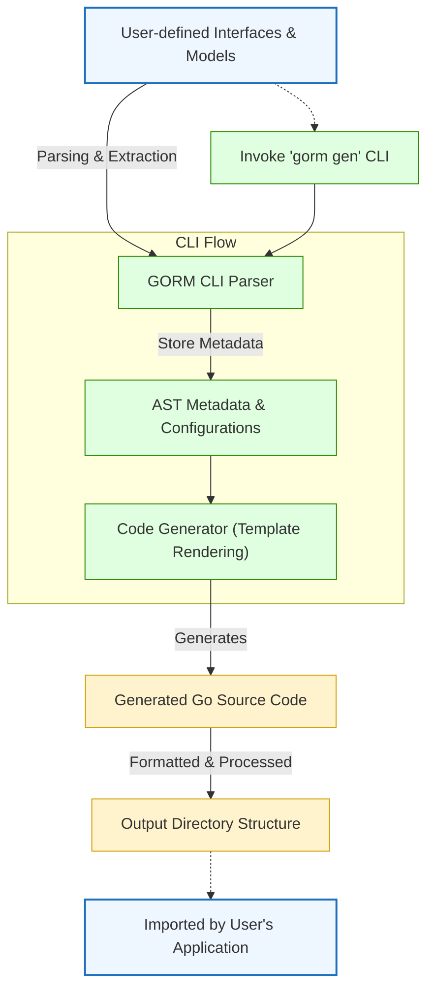

# System Design and Components

Explore the big-picture structure of GORM CLI, focusing on its main components: interface-driven query generators, model-driven field helpers, and the pivotal role of code generation. This guide breaks down how user-written interfaces and models serve as inputs, how templates steer generated code, and how the CLI orchestrates the entire process to deliver type-safe APIs.

---

## Introduction

At its core, GORM CLI transforms user-defined Go code into powerful, type-safe query APIs to improve developer productivity and guarantee compile-time safety. By generating two complementary sets of code—type-safe query interfaces from annotated Go interfaces, and field helpers from model structs—GORM CLI creates a fluent, discoverable API that minimizes runtime errors and accelerates database interaction.

Users write their own interfaces annotated with raw SQL or template SQL comments, alongside their data models, then invoke the CLI to generate reliable, idiomatic Go query code.

---

## Key Components

### 1. User-Provided Inputs
- **Query Interfaces:** These are Go interfaces defined by users that declare methods corresponding to database operations. SQL templates or raw SQL statements live in the method comments. The CLI reads these interfaces, parsing both the method signatures and embedded SQL, to generate concrete implementations.

- **Model Structs:** User structs representing database tables. They carry field information used to generate field helpers, such as predicates and setters for filtering, updating, and association management.

### 2. Interface-Driven Query Generators

- **Parsing Interfaces:** The generator scans user interfaces, extracting method signatures and SQL template strings enclosed in comments.

- **SQL Template Processing:** Embedded SQL uses special directives (e.g., `@@table`, `@param`, `{{where}}`) that the generator translates into concrete SQL embedded with Go bindings.

- **Code Generation:** For each interface, the generator produces a Go struct implementing the declared methods, returning type-safe query builders or executing the SQL with parameters.

### 3. Model-Driven Field Helpers

- **Field Helper Types:** From structs, the generator creates helpers for each field automatically, mapping Go types to appropriate helper types (`field.String`, `field.Number[int]`, `field.Time`, etc.). These helpers offer fluent predicates (e.g., `Eq`, `Like`, `Between`) and setters (`Set`, `Incr`, `SetExpr`).

- **Association Helpers:** Relationships declared in models (`has one`, `belongs to`, `has many`, `many2many`) map to association helpers that support operations like create, update, unlink, delete, and batch creation with compile-time safety.

### 4. Templates and Code Output

- **Templates:** Central to GORM CLI is a Go `text/template` that renders the Go source code for query interfaces and field helpers. It uses parsed metadata about interfaces, methods, models, and fields.

- **Output Path Handling:** The CLI supports optional user configuration to specify output directories and filtering rules for which interfaces or models to include/exclude in generation.

### 5. The CLI Orchestration

- **CLI Command Structure:** The `gorm gen` command drives the entire generation flow. It accepts inputs like the interface file or directory and an output directory.

- **Process Workflow:** The CLI walks user source files, parses ASTs to discover interfaces and structs, applies user configurations, then generates code files structured according to the input project's package layout.

- **Code Formatting:** After generation, the CLI applies Go formatting and import optimization to the output files, ensuring idiomatic and maintainable code.

---

## How the Pieces Work Together

Users start by defining an interface with methods annotated by SQL templates and one or more model structs representing their tables. When running `gorm gen`:

1. The CLI recursively parses input files to build an internal representation of interfaces and structs, reading methods, parameters, and model fields.
2. It applies filtering if configured (e.g., include/exclude certain interfaces).
3. For interfaces, it renders Go code implementing the interface with concrete SQL execution, parameter binding, and result scanning.
4. For structs, it generates a namespaced set of field helpers keyed by the model name, exposing methods for filtering, updating, and association manipulation.
5. The generator writes output files to the designated directories, preserving package structure.
6. The user imports and uses the generated code in their application codebase, benefiting from type safety and discoverability.

---

## Practical Example

Imagine you have the following interface and model:

```go
// Query interface with SQL template annotations
 type Query[T any] interface {
   // SELECT * FROM @@table WHERE id=@id
   GetByID(id int) (T, error)

   // where("name=@name AND age=@age")
   FilterByNameAndAge(name string, age int)
 }

// User model struct
 type User struct {
   ID   uint
   Name string
   Age  int
 }
```

Running `gorm gen -i ./examples -o ./generated` results in:

- A concrete implementation of `Query[User]` with type-safe `GetByID` and `FilterByNameAndAge` methods.
- A `User` struct field helper set, where fields like `User.Name` provide methods like `Eq` or `Like` to build filter predicates.

This means you can write queries like:

```go
u, err := generated.Query[User](db).GetByID(ctx, 123)
users, err := gorm.G[User](db).Where(generated.User.Age.Gt(18)).Find(ctx)
```

Achieving safety and fluency backed by generated code.

---

## Diagram: High-Level System Architecture



---

## Best Practices & Tips

- **Define Interfaces and Models Closely:** Keep your query interfaces and models in the same or adjacent packages for simpler import resolution.
- **Use Template SQL Wisely:** Leverage template DSL for conditional SQL to handle dynamic queries elegantly.
- **Leverage Configuration:** Use `genconfig.Config` to tailor generation for your project structure, filtering interfaces or structs as needed.
- **Separate Generation Output:** Keep generated code outside of your main source directories to avoid conflicts with manual edits.
- **Update Generated Code Regularly:** Run generation whenever you modify query interfaces or models to keep code in sync.

---

## Common Pitfalls & Troubleshooting

- **Missing Output Files:** Ensure the `-i` input path points correctly to the source files containing your interfaces and models.
- **No Generated Methods:** Verify SQL comments follow the expected format with directives like `@@table` and `@param` bindings.
- **Incorrect Field Helper Types:** Check your Go types for fields and consider using `genconfig.Config` mappings for custom or nullable types.
- **Conflicts with Existing Code:** Generated files overwrite the same output path; avoid manual changes and use configuration to manage output.

---

## Summary

This page detailed the system design and main components of GORM CLI, emphasizing how user interfaces and models are the foundation of the generation process. It covered the flow from user input, through parsing and template-driven code generation, to final output used in applications. Understanding this structure empowers developers to create safer, more maintainable data access layers with minimal manual boilerplate.

---

## Related Documentation

- [What is GORM CLI?](../../overview/intro-product-value-core-concepts/what-is-gorm-cli) — Understand the tool's purpose and value.
- [Core Concepts & Terminology](../../overview/intro-product-value-core-concepts/core-terminology-and-concepts) — Learn about query interfaces, field helpers, and associations.
- [Code Generation Workflow](../code-generation-workflow) — Deep dive into how generation steps work.
- [Use the Generated APIs](../../getting-started/first-usage-configuration/using-generated-code) — Practical guide on consuming generated code.
- [Prepare Your Project](../../getting-started/first-usage-configuration/project-structure) — Best practices for organizing your codebase pre-generation.

---

## Next Steps

- Define your query interfaces and models according to your project needs.
- Explore the SQL templating DSL for dynamic queries.
- Run `gorm gen` with appropriate inputs to generate code.
- Integrate generated code into your application and iterate.

For more on using generated APIs and customizing generation, see the corresponding guides in this documentation.
