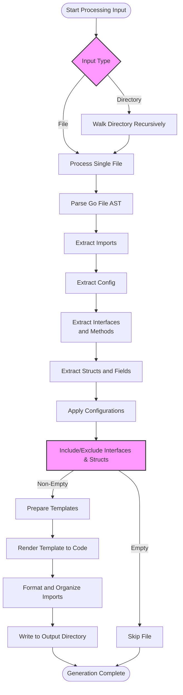

# How GORM CLI Works

Discover the end-to-end lifecycle of GORM CLI’s code generation process—from parsing your source Go files containing models and query interfaces, through template-driven code emission, to the generation of type-safe, fluent APIs that seamlessly integrate with your GORM projects. This guide walks you through the entire orchestration of file analysis, configuration application, SQL template rendering, and output creation, emphasizing how extensibility and customization are embedded at every stage.

---

## Overview of the GORM CLI Generation Flow

Using GORM CLI begins with pointing the CLI tool at your Go source files containing:

- **Model structs** that define your data schema
- **Query interfaces** annotated with SQL templates

The CLI parses these inputs into an Abstract Syntax Tree (AST), extracts metadata about interfaces, structs, methods, and their SQL annotations, applies customizable configurations, and finally generates strongly typed query APIs and model field helpers through templated code generation.

This flow ensures that your generated code is:

- **Type-Safety Enforced:** Method signatures and generated helpers enforce compile-time correctness
- **Fluent and Discoverable:** APIs model actual database operations with clear Go method signatures
- **Extensible:** Supports configuration overrides, custom type mappings, and selective generation by interface or struct

## Step 1: Processing Input Files and AST Parsing

The starting point is the `Process` method of the `Generator` struct. Users specify either files or directories, and GORM CLI recursively walks the directory tree to parse all relevant Go source files.

- Each file is parsed into an AST using Go’s native `go/parser`.
- It ignores generated code files to prevent re-processing.
- The file’s relative path is recorded to preserve directory structure in output.
- An AST visitor extracts:
  - **Imports:** External dependencies and alias resolutions
  - **Configuration:** Package-level generation options declared as `genconfig.Config` composites
  - **Interfaces:** Parsed with methods referencing SQL templates embedded in method comments
  - **Structs:** Model structs with annotated field information including tags and Go types

This structured metadata lays the foundation for correct code generation.

<Tip>
The processor transparently injects the current package import paths into the import list, ensuring generated code resolves package references consistently.
</Tip>

## Step 2: Detailed Interface and Method Extraction

Each interface discovered undergoes detailed method analysis:

- **Method signatures** are parsed to produce parameter and return value lists, automatically injecting `context.Context` if missing.
- **SQL templates** embedded in the method’s doc comments are extracted using directive parsing to identify raw SQL, conditional clauses, selects, and where fragments.
- **Validation** ensures methods meet expected form:
  - Finish methods returning data have at least one return value plus an error
  - Chain methods return fluent interfaces for query building

This step builds a complete representation of your interface-driven query API.

## Step 3: Struct and Field Processing

Model structs are parsed to extract field metadata:

- Exported fields are included, unfolding anonymous embedded structs recursively.
- Field names are mapped to database column names based on struct tags.
- The Go type of each field is determined fully qualified with package prefixes.
- Customization hooks via `genconfig.Config` allow mapping Go types and named field tags to specialized field helper types (e.g., mapping `sql.NullTime` to a time helper).

Associations are inferred by field types (e.g., slice fields become `field.Slice` helpers).

<Note>
Anonymous struct embedding flattens fields into the parent struct’s field list, ensuring all relevant fields participate in generation.
</Note>

## Step 4: Configuration Application

The generator applies any discovered `genconfig.Config` values found in files or packages automatically to influence generation:

- Overrides output directory (`OutPath`) per package or file
- Toggles FileLevel mode to limit config scope
- Includes or excludes specific interfaces or structs by pattern or type literal
- Maps custom field names and types to helper implementations

Configurations cascade hierarchically, and any applicable config is merged into each processed file’s generation plan.

<Warning>
Be sure your `genconfig.Config` declarations are located in the package scope and conform to expected struct literal forms, or the generator will ignore them.
</Warning>

## Step 5: Template-Driven Code Generation

At the core of the generation is a template engine that consumes the AST-extracted data and outputs Go code files:

- A master template (`pkgTmpl`) defines the structure of generated query APIs and field helper models.
- For each interface, a corresponding Go type is generated with:
  - A connector function to create a query instance
  - Interface definition including all annotated methods
  - Implementation struct with method bodies
- Method bodies render the SQL templates embedded in comments into Go code that executes dynamically generated SQL with proper parameter binding
- For structs, strongly typed field helper variables are generated exposing predicates, setters, and association helpers

After generation, files are formatted using Go’s import processor to clean up imports and syntax.

## Step 6: Writing Output Files and Maintaining Directory Structure

Generated code is written to disk respecting the input directory structure by:

- Constructing each output file path based on configured `OutPath` and relative input path
- Creating directories as needed with appropriate permissions
- Writing generated source files
- Applying `imports.Process` to format code and organize imports before final write

The generator logs output file generation progress for user visibility.

<Check>
Ensure your output directory has write permissions and that existing files are not read-only to avoid generation errors.
</Check>

---

## Practical Example: Running the Generator

```bash
gorm gen -i ./examples -o ./generated
```

- `-i` points to your source directory containing models and query interfaces
- `-o` specifies the output directory for generated files

The generator processes all Go files in `./examples`, applies any `genconfig.Config` present, and produces Go source code files in `./generated` maintaining subdirectory structure.


## Troubleshooting Common Scenarios

<AccordionGroup title="Generator Troubleshooting">
<Accordion title="No Methods Found in Interface">
Double-check that your interface methods have SQL annotation comments and correctly formed signatures. Empty or missing SQL directives cause the generator to skip methods.
</Accordion>
<Accordion title="Output Files Not Generated">
Verify your `OutPath` configuration or confirm no inclusion/exclusion filters are eliminating all targets. The CLI logs skipped files if no interfaces or structs remain after filtering.
</Accordion>
<Accordion title="Syntax Errors in Generated Code">
If templated SQL contains syntax errors, template processing will fail. Validate your SQL templates and use the documented template DSL directives carefully.
</Accordion>
</AccordionGroup>

---

## Summary Flow Diagram



---

## Best Practices for Using GORM CLI Generator

- **Keep your query interfaces clean and well-commented** with SQL templates to leverage full code generation power.
- **Leverage `genconfig.Config`** to customize output paths and adapt generation at package or file level.
- **Use custom field mappings** to handle non-standard types (e.g., JSON fields).
- **Keep generated code directory separate** from source files to avoid recursive processing.
- **Regularly validate generated code** using the quick-validation guide to catch integration issues early.

---

## Related Documentation

- [Integration with GORM & Configuration](https://gorm.io/docs/overview/architecture-integration/integration-and-configuration)
- [Generation Configuration](https://gorm.io/docs/guides/advanced-features/generation-configuration)
- [Template DSL and SQL Templating](https://gorm.io/docs/concepts/core-concepts/template-dsl)
- [Building Type-Safe Queries with Interfaces](https://gorm.io/docs/guides/core-workflows/interface-driven-queries)
- [Validate Your First Generated Code](https://gorm.io/docs/getting-started/first-run/quick-validation)

For full references and code examples, visit the [GORM CLI GitHub repository](https://github.com/go-gorm/cli).
