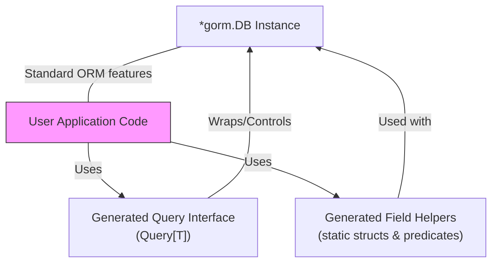

# GORM Integration Patterns

GORM CLI is meticulously designed to integrate seamlessly with the core GORM ORM library, enabling developers to leverage the full power of GORM while gaining additional type safety, discoverability, and productivity benefits through generated APIs. This page explains how the generated code connects with and enhances standard GORM workflows, emphasizing fluent query building, updates, and associations.

---

## Overview

GORM CLI generates two complementary layers of code:

- **Interface-driven Query APIs:** Auto-generated concrete implementations of user-defined Go interfaces with embedded SQL templates, producing type-safe and efficient query methods.
- **Model-driven Field Helpers:** Strongly typed field and association helpers derived from your Go model structs, offering fluent and expressive predicates and setters.

Together, these layers plug directly into GORM’s native API, preserving familiar usage patterns while making code safer and clearer.

> With this design, developers do not trade familiarity for safety. Instead, they gain stronger compile-time guarantees and more expressive query building without rewriting how they use GORM.

---

## How Generated Code Connects With GORM

### Type-Safe Query Interfaces

Users define Go interfaces with method signatures and SQL templates (in method comments). GORM CLI generates concrete implementations that wrap GORM's `*gorm.DB` internally, exposing methods like `GetByID`, `FilterWithColumn`, `UpdateInfo`, and others.

A typical user flow:

1. Instantiate the query interface, passing your `*gorm.DB`:

   ```go
   query := generated.Query[models.User](db)
   ```

2. Call generated methods:

   ```go
   user, err := query.GetByID(ctx, 123)
   users, err := query.FilterWithColumn(ctx, "role", "admin")
   err = query.UpdateInfo(ctx, models.User{Name: "alice", Age: 30}, 123)
   ```

3. Internally, these methods use GORM’s query builder and context ensuring seamless integration with transactions, logging, and middleware.


### Model-Derived Field Helpers

These are static structs with fields like `generated.User.Name`, `generated.User.Age`, or associations like `generated.User.Pets`. Each field helper provides methods for building predicates and setters with type safety. For example:

- **Filter with predicates:**

  ```go
  db.Where(generated.User.Age.Gt(18)).Find(ctx)
  ```

- **Update with setters:**

  ```go
  db.Set(generated.User.Name.Set("alice"), generated.User.Age.Incr(1)).Update(ctx)
  ```

The field helpers fully embrace GORM’s chainable API style. You can combine them with standard GORM queries, conditions, and method calls.

---

## Fluent Workflow with Generated APIs

By design, the generated APIs do not replace nor abstract away GORM; they enhance it. Here is a common developer workflow:

<Steps>
<Step title="Obtain a GORM DB instance">
Acquire a `*gorm.DB` connected to your database, configured with logging, transactions, and middleware as needed.
</Step>

<Step title="Instantiate Generated Query API">
Call the generated function to get a typed query interface:

```go
query := generated.Query[models.User](db)
```
</Step>

<Step title="Build and execute queries">
Use generated methods to run queries that return model instances:

```go
user, err := query.GetByID(ctx, 123)
users, err := query.FilterWithColumn(ctx, "role", "admin")
```

These methods generate and run SQL based on embedded templates, enforcing safe param binding.
</Step>

<Step title="Use Field Helpers for filtering or updates">
You can also write custom queries using generated field helpers directly with GORM:

```go
// Filter users by age > 18
var adults []models.User
err := db.Where(generated.User.Age.Gt(18)).Find(ctx).Error

// Update a user’s role
err = db.Where(generated.User.ID.Eq(123)).Set(generated.User.Role.Set("admin")).Update(ctx).Error
```
</Step>
</Steps>

<Tip>
Because generated code integrates directly with `*gorm.DB`, you retain the full richness of GORM’s APIs including scopes, transactions, eager loading, and hooks.
</Tip>

---

## Handling Associations

Generated association helpers mirror your model’s GORM relationships and provide expressive methods for creating, updating, unlinking, deleting, and batch operations. These helpers generate SQL and GORM expressions compatible with association patterns.

For example:

- **Create and associate:**

  ```go
  err := gorm.G[models.User](db).
    Set(
      generated.User.Name.Set("alice"),
      generated.User.Pets.Create(generated.Pet.Name.Set("fido")),
    ).
    Create(ctx)
  ```

- **Unlink or Delete associations:**

  ```go
  // Unlink pets where name = "old"
  err = gorm.G[models.User](db).
    Where(generated.User.ID.Eq(1)).
    Set(generated.User.Pets.Where(generated.Pet.Name.Eq("old")).Unlink()).
    Update(ctx)
  ```

The generated code respects GORM’s association semantics and allows complex multi-level operations with full type safety.

---

## Benefits of Native GORM Integration

- **Familiarity:** Use the same `*gorm.DB` with generated APIs—no need to learn a new framework.
- **Type Safety & Discoverability:** Generated interfaces and helpers express your domain contracts clearly, eliminating runtime errors from typos.
- **Composable:** Combine generated predicates/setters with your custom GORM scopes and middleware.
- **Context-aware:** Queries and updates automatically include context, supporting cancellation, tracing, and deadlines.
- **Full ORM Power:** Run raw SQL, manage transactions, eager loading, preloading, and hooks alongside generated helpers.

---

## Practical Example

```go
func ListActiveUsers(ctx context.Context, db *gorm.DB) ([]models.User, error) {
  query := generated.Query[models.User](db)

  // Use generated method
  users, err := query.FilterWithTime(ctx, startDate, endDate)
  if err != nil {
    return nil, err
  }

  // Further filter using field helpers
  err = db.Where(generated.User.Role.Eq("active")).Find(&users).Error
  if err != nil {
    return nil, err
  }

  return users, nil
}
```

Here, generated query interfaces and field helpers combine smoothly with custom graph traversal and logic.

---

## Troubleshooting Common Integration Issues

<AccordionGroup title="Common Problems When Combining Generated APIs and GORM">
<Accordion title="Context Missing or Misused">
Ensure all generated query methods receive a valid `context.Context`. The generator automatically injects context if missing, but avoid manually omitting it when calling.
</Accordion>

<Accordion title="Query Not Returning Expected Data">
Double-check parameter binding in your SQL templates and that your model struct tags match database columns correctly, so GORM can correctly load data.
</Accordion>

<Accordion title="Association Helpers Not Working as Expected">
Verify association definitions in your models follow GORM’s conventions, including foreign keys and tags. The generated association helpers rely on this metadata.
</Accordion>
</AccordionGroup>

---

## Summary

GORM CLI-generated APIs offer a powerful extension to the GORM ORM by generating type-safe, fluent query and update methods directly integrated with GORM’s core `*gorm.DB` usage patterns. This native integration maximizes developer productivity and code safety while preserving the rich ORM capabilities developers expect.

By embracing the core GORM DSL enhanced with strongly typed helpers and interface-driven queries, your Go projects achieve safer, more maintainable, and expressive database access.

---

## See Also

- [Field Helpers: Filters and Updates](../guides/using-generated-apis/field-helpers-basics)
- [Working with Associations](../guides/using-generated-apis/working-with-associations)
- [Template-Driven Queries & SQL Templates](../guides/using-generated-apis/template-based-queries)
- [Core Concepts & Terminology](../../overview/intro-product-value-core-concepts/core-terminology-and-concepts)
- [Prepare Your Project](../../getting-started/first-usage-configuration/project-structure)

---

## Mermaid Diagram: Integration Flow



This diagram shows that the user application uses both generated query interfaces and field helpers, which in turn wrap or cooperate with the core `*gorm.DB` instance, maintaining full access to GORM’s features.
