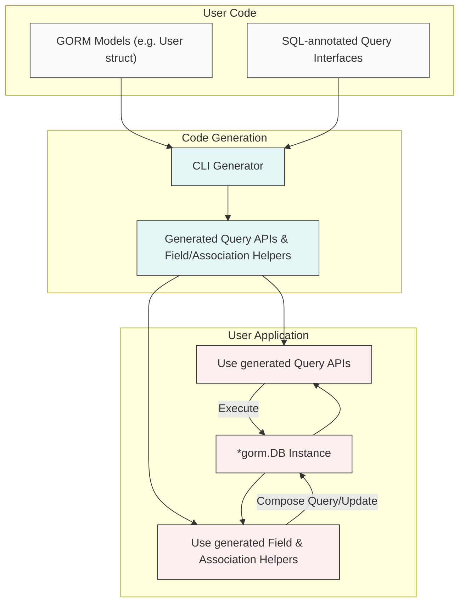

# Integration with GORM

Explore how GORM CLI’s generated APIs seamlessly integrate with GORM’s native ORM abstractions to provide a smooth, type-safe, and productive workflow for database queries, updates, and managing associations. This documentation clarifies how generated helpers complement GORM’s own API, explains context usage, and highlights how the CLI extends GORM with expressive, compile-time-safe constructs.

---

## Overview

GORM CLI enhances the developer experience by producing code that composes naturally with GORM’s `*gorm.DB` APIs. Instead of replacing GORM, the generated code works *with* it, enabling fluent queries, updates, and association handling on your existing GORM models.

The integration is designed so that:

- Generated query interfaces accept a GORM `*gorm.DB` or `*gorm.DB`-compatible context, leveraging GORM's connection management and lifecycle.
- Field helpers let you build rich conditional clauses easily.
- Association helpers provide typed, intuitive operations for related data.
- The CLI generation extends GORM’s native API use with type safety and discoverability.

This synergy allows you to write idiomatic Go code with assurance of correctness before running your program.

---

## How Generated APIs Compose with GORM

### 1. Entry Point: `gorm.G[T]` and Generated Query APIs

GORM CLI exports generic functions and interfaces tailored to your models, for example `gorm.G[User](db)` that wraps a `*gorm.DB` instance.

This pattern lets you:

- Begin with your existing GORM database handler.
- Fluently chain conditions with generated field helpers.
- Invoke generated query methods implementing your SQL templates.

Example:

```go
// Select a user with ID = 123
user, err := generated.Query[User](db).GetByID(ctx, 123)

// Query users older than 18
users, err := gorm.G[User](db).
  Where(generated.User.Age.Gt(18)).
  Find(ctx)
```

Here `db` is your `*gorm.DB` instance, meaning the generator builds on top of your existing setup.

### 2. Context Passing and Method Signatures

All generated query methods include `context.Context` as their first argument, ensuring proper propagation for timeouts, cancellations, and tracing.

If you omit `ctx` in your interface, the generator transparently injects it, saving you from manual boilerplate but preserving natural Go idioms.

### 3. Using Field Helpers to Build Queries

Generated model-based field helpers encapsulate columns with expressive predicates and setters.

For example:

```go
// Generated field predicate and update usage
whereClause := generated.User.Name.Like("%alice%")          // WHERE name LIKE '%alice%'
updateSet := generated.User.IsAdult.Set(true)                 // SET is_adult = true

err := gorm.G[User](db).
  Where(whereClause).
  Set(updateSet).
  Update(ctx)
```

This declarative approach enables safer queries and updates with compile-time correctness.

### 4. Managing Associations

The integration shines with associations. Using generated helpers, the following operations become both type-safe and readable:

- **Create** and link related rows
- **Update** related rows with filtering
- **Unlink** associations (clears foreign keys or removes join table entries)
- **Delete** associated rows or join table entries
- **Batch create/link** for many-to-many or has-many

Examples:

```go
// Creating a User with a Pet and linking languages
err := gorm.G[User](db).
  Set(
    generated.User.Name.Set("alice"),
    generated.User.Pets.Create(generated.Pet.Name.Set("fido")),
    generated.User.Languages.CreateInBatch([]models.Language{{Code: "EN"}, {Code: "FR"}}),
  ).
  Create(ctx)

// Updating a user's pet name where old name is 'fido'
err := gorm.G[User](db).
  Where(generated.User.ID.Eq(1)).
  Set(
    generated.User.Pets.Where(generated.Pet.Name.Eq("fido")).Update(generated.Pet.Name.Set("rex")),
  ).
  Update(ctx)

// Unlinking (detaching) pets from a user without deletion
err := gorm.G[User](db).
  Where(generated.User.ID.Eq(1)).
  Set(generated.User.Pets.Unlink()).
  Update(ctx)

// Deleting join table entries for languages (many2many)
err := gorm.G[User](db).
  Where(generated.User.ID.Eq(1)).
  Set(generated.User.Languages.Delete()).
  Update(ctx)
```

### 5. Semantics by Association Type

| Association Type  | Unlink Semantics               | Delete Semantics                        |
|-------------------|-------------------------------|---------------------------------------|
| belongs to        | Set parent foreign key to NULL | Remove parent rows                    |
| has one / has many | Set child foreign keys to NULL | Remove child rows                     |
| many to many      | Remove join table rows only     | Remove join table rows only           |

Understanding these semantics helps you choose whether to unlink or delete depending on the intended side effects.

---

## Extending GORM’s Native API with the CLI

GORM’s native API is powerful but sometimes lacks strong typing or compile-time safety for dynamic filters and complex associations.

GORM CLI bridges this gap by:

- **Generating type-safe query interfaces** that take advantage of SQL annotations
- **Creating fluent, strongly typed field and association helpers** that replace string-based column references
- **Introducing a SQL templating DSL** for flexible query and update definitions with Go parameter binding

This extension layer complements GORM rather than overrides it, enabling you to adopt as much or as little generated code as you want.

If you’re building a CRUD-heavy app or API, the generated code replaces much of the manual effort and error-prone string manipulation with fluent, discoverable API calls.

---

## Practical Tips & Best Practices

- **Start with your existing `*gorm.DB` instance:** Pass your existing DB connection or transaction context to generated APIs to maintain correct lifecycle.

- **Use generated field helpers for conditions:** This avoids bugs caused by mistyped column names and enhances code readability.

- **Leverage association helpers to manage relations:** To maintain foreign key integrity and correctly link/unlink data, prefer the generated helpers over raw GORM association methods.

- **Use batch operations for many2many:** CreateInBatch optimizes insertion and linking efficiency.

- **Keep your interfaces and models in the same package:** This simplifies scanner and generator input, yielding coherent helpers.

- **Pass `context.Context` for cancellation and tracing:** The CLI adds context to generated methods, encouraging modern Go best practices.

- **Handle nil or zero foreign keys explicitly:** When unlinking associations, be mindful that foreign key fields may become NULL.

---

## Troubleshooting Common Issues

<AccordionGroup title="Common Integration Troubleshooting">
<Accordion title="Context Missing in Calls">
If you forget to pass `context.Context` in calls, the generator adds it automatically. But if you face compile errors, ensure your calling code supplies `ctx`.
</Accordion>
<Accordion title="Foreign Key Constraints Preventing Unlink">
Unlink operations set foreign keys to NULL. If your DB has NOT NULL constraints, unlinking will fail. Either relax constraints or use Delete operations instead.
</Accordion>
<Accordion title="Association Updates Not Applying">
Make sure you are using the generated association helpers with filters when updating related models. E.g., filter pets by name before updating.
</Accordion>
<Accordion title="Batch Create Fails with Large Slices">
Large CreateInBatch operations may hit DB max packet size or timeout. Split into smaller batches if needed.
</Accordion>
</AccordionGroup>

---

## Underpinning Model Example

The integration layer relies on your GORM model structs. Here’s a snippet demonstrating diverse associations for the `User` struct:

```go
// User model with various associations
type User struct {
  gorm.Model
  Name      string
  Age       int
  Birthday  *time.Time
  Score     sql.NullInt64
  LastLogin sql.NullTime

  Account   Account       // Has One
  Pets      []*Pet        // Has Many
  Toys      []Toy         `gorm:"polymorphic:Owner"`  // Has Many (polymorphic)
  CompanyID *int
  Company   Company       // Belongs To

  ManagerID *uint
  Manager   *User         // Belongs To (single-table)
  Team      []User        `gorm:"foreignkey:ManagerID"` // Has Many

  Languages []Language    `gorm:"many2many:UserSpeak"` // Many to Many
  Friends   []*User       `gorm:"many2many:user_friends"` // Many to Many

  Role      string
  IsAdult   bool          `gorm:"column:is_adult"`
  Profile   string        `gen:"json"`
}
```

This rich model schema allows the generated code to offer comprehensive helpers covering all association types inherent to GORM.

---

## Summary Diagram: Integration Workflow



This diagram summarizes how your models and interfaces feed the CLI generator, producing code that you invoke with GORM’s DB instance for safe, efficient data access.

---

## Additional Resources

- [GORM CLI README](https://github.com/go-gorm/cli#readme) — comprehensive examples and setup
- Guides:
  - [Working with Associations](https://docs.example.com/guides/advanced-patterns/association-helpers)
  - [Using the Generated Code](https://docs.example.com/guides/core-workflows/using-generated-code)
  - [Mastering the SQL Template DSL](https://docs.example.com/guides/advanced-patterns/templating-dsl)
- Model example: `examples/models/user.go` in the GORM CLI repo
- CLI usage and generation configs to customize behavior

---

By mastering the integration between GORM CLI generated APIs and GORM’s native ORM, you unlock a powerful, type-safe workflow that accelerates development while reducing runtime errors in your Go applications.