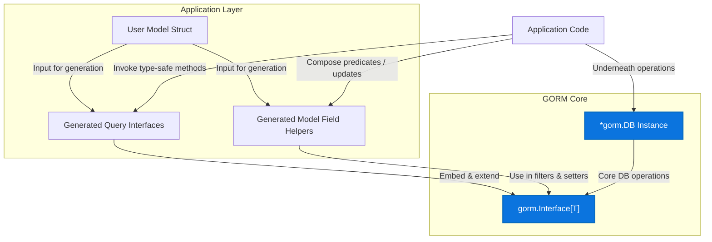

# Integration with GORM

Explore how the generated code from GORM CLI fits seamlessly into the GORM ecosystem. This page explains the design patterns, fluent APIs, and compile-time safety mechanisms that enable a smooth adoption experience, enriching your GORM workflows while leveraging its existing abstractions.

---

## Overview

GORM CLI generates code that extends the core `gorm.io/gorm` library by producing two complementary elements:

- **Interface-driven, type-safe query APIs**: Generated from Go interfaces annotated with SQL templates, these APIs provide strongly typed database queries with fluent chaining.
- **Model-driven field helpers**: Generated from Go model structs, these helpers provide typed filters, setters, and association operations for your fields.

Together, these elements embed directly within the idiomatic GORM patterns allowing you to use your existing GORM `*gorm.DB` instances and augment them with generated, safer, and discoverable query methods.

## Design Integration Patterns

### Embedding and Extending GORM Interfaces

The generated query interfaces follow a clear pattern: they embed the base `gorm.Interface[T]` generic type within customized interface definitions and their implementations. This ensures that all the underlying GORM methods are natively accessible, while you get added type safety and specialized methods from the generated APIs.

For example, for an interface `Query[T]`, GORM CLI generates:

- `QueryInterface[T]` that embeds `gorm.Interface[T]`.
- `QueryImpl[T]` that implements the interface and directly wraps a `gorm.Interface[T]` instance.

This allows seamless chaining and interaction with GORM’s fluent API style:

```go
func Query[T any](db *gorm.DB, opts ...clause.Expression) QueryInterface[T] {
    return QueryImpl[T]{
        Interface: gorm.G[T](db, opts...),
    }
}

// Usage example:
u, err := Query[User](db).GetByID(ctx, 123)
users, err := Query[User](db).FilterByNameAndAge("jinzhu", 25).Find(ctx)
```

This pattern ensures a consistent developer experience without departing from GORM idioms.

### Fluent Chaining and Extensibility

Generated methods that represent filters or query modifiers (e.g., `FilterByNameAndAge`) chain fluent calls on the embedded `gorm.Interface[T]`. This makes it easy to gradually build complex queries while preserving type correctness.

When a method executes a full query (such as fetching or updating rows), it terminates the chain by executing the composed SQL with proper parameter bindings, returning typed results or errors.

### Model-Driven Field Helpers

Field helpers are generated from your model structs to represent each column and association as typed predicates and setters. These helpers enable:

- **Type-safe filtering** (e.g., `generated.User.Age.Gt(18)` for age > 18)
- **Update setters** including increments and raw expressions
- **Association operations** like creating related rows or unlinking associations with compile-time safety

Example usage:

```go
// Filter users older than 18
users, err := gorm.G[User](db).
  Where(generated.User.Age.Gt(18)).
  Find(ctx)

// Create user and associate a pet
gorm.G[User](db).
  Set(
    generated.User.Name.Set("alice"),
    generated.User.Pets.Create(generated.Pet.Name.Set("fido")),
  ).
  Create(ctx)
```

This pattern keeps your database operation code concise, fluent, and less error-prone.

## Compile-Time Safety

By generating concrete Go code that includes both the query interface methods and field helpers:

- **Strongly typed method signatures guarantee correct parameter usage and result handling.**
- **SQL templates are verified and rendered into type-safe Go implementations.**
- **Association operations reflect correct foreign key and relation semantics, reducing runtime errors.**

Together, these ensure that common mistakes such as mismatched types, missing parameters, or invalid association manipulations are caught during compilation rather than at runtime.

## Configuration & Integration Considerations

The generator is configurable via package-level `genconfig.Config` variables allowing you to:

- Customize output directories for generated code
- Filter which interfaces and structs to include or exclude during generation
- Map custom Go types or struct tags to specialized field helpers (for example, JSON type mappings)

Because the generated code lives alongside your models and queries, the integration feels natural and intuitive, supporting gradual adoption.

## Example Walkthrough

Suppose you have a `User` model:

```go
// User model with associations and custom tag
type User struct {
  gorm.Model
  Name string
  Age  int
  Pets []Pet
  Profile string `gen:"json"`
}
```

And an interface-driven query:

```go
type Query[T any] interface {
  // SELECT * FROM @@table WHERE id=@id
  GetByID(id int) (T, error)

  // where("name=@name AND age=@age")
  FilterByNameAndAge(name string, age int)
}
```

Using GORM CLI, you generate code that produces:

- `generated.Query[User](db)` returning a `QueryInterface[User]` allowing calls like `GetByID` or `FilterByNameAndAge`.
- `generated.User` field helper with `Name`, `Age`, and association `Pets` fields supporting predicates and setters.

Your application code can then fluently query:

```go
// Retrieve a user by ID
u, err := generated.Query[User](db).GetByID(ctx, 123)

// List users filtered by name and age
users, err := generated.Query[User](db).
  FilterByNameAndAge("jinzhu", 30).
  Find(ctx)

// Create a user and a pet together
gorm.G[User](db).
  Set(
    generated.User.Name.Set("alice"),
    generated.User.Pets.Create(generated.Pet.Name.Set("rex")),
  ).
  Create(ctx)
```

## Visualizing the Integration



## Best Practices & Tips

- **Leverage field helpers for expressive and safe query and update definitions.** Use predicates like `Eq()`, `Gt()`, and setters like `Set()` or `Incr()` to clearly state intent.
- **Use interface-driven queries to encapsulate common database operations with SQL templates** for maintainability.
- **Configure generation carefully to include only relevant interfaces and structs**, avoiding unnecessary output and improving compile times.
- **Implement association operations using the provided helpers** to enforce foreign key integrity and maintain clean relational code.
- **Run validations on generated code early in your CI process** to catch any issues stemming from template or model changes.

## Troubleshooting

<AccordionGroup title="Common Integration Issues">
<Accordion title="Generated Code Not Found or Not Imported">
Verify your output directory matches your import paths and that you run the generator after changes. Check your `genconfig.Config` for output overrides.
</Accordion>
<Accordion title="Compilation Errors on Generated Methods">
Check that your Go interfaces follow the required method signature rules. All methods with SQL templates must have appropriate return types (error or typed results).
</Accordion>
<Accordion title="Type Mismatches in Queries or Updates">
Ensure your model structs and field tags align with your query interface and generation config especially if using custom field helpers.
</Accordion>
</AccordionGroup>

---

For a deeper dive into setting up your project, visit [Configuration and Customization](../getting-started/first-run/configuration-setup) and explore examples in the [Quick Start Guide](../getting-started/first-run/quickstart-sample).

