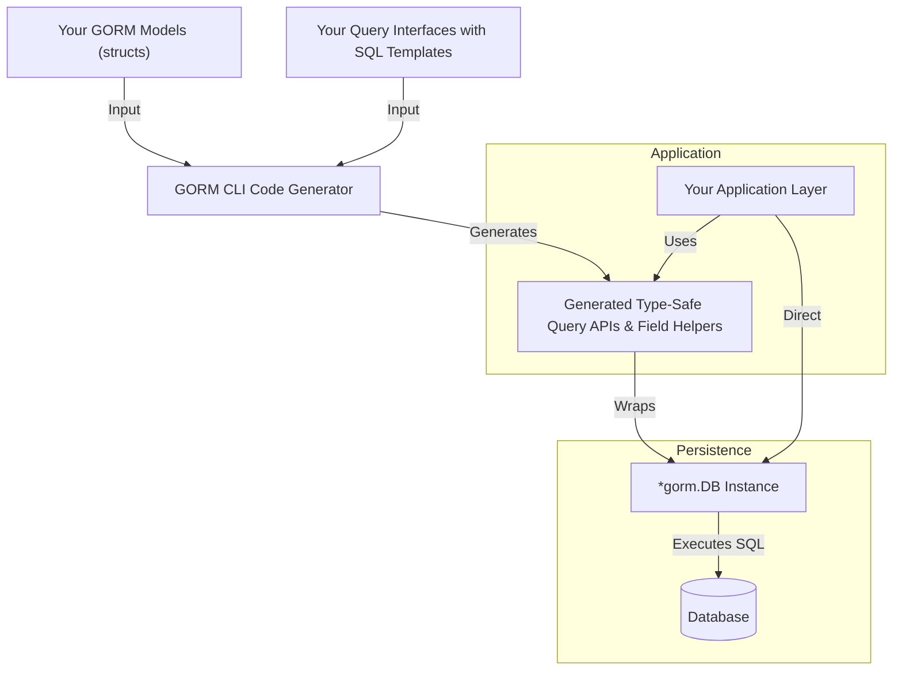

# Integration with GORM

The generated code by GORM CLI is purpose-built to fit seamlessly within the GORM ecosystem, acting as a powerful extension layer that enhances your data access experience without disrupting your existing models or workflow. This page explains how the generated APIs interact with GORM’s native features, how they wrap and extend GORM DB objects, and where they fit in your application's persistence layer.

---

## How Generated APIs Fit into GORM

When you run GORM CLI, it generates two main kinds of code:

- **Interface-driven type-safe query APIs:** These provide methods corresponding to your custom SQL templated Go interfaces.
- **Model-driven field helpers:** These give you fluently discoverable, strongly typed helpers to build powerful, type-safe query predicates, updates, and association operations.

Together, these generated constructs wrap GORM’s native `*gorm.DB` instance, exposing and extending GORM’s core querying, updating, and association APIs while adding compile-time safety and discoverability.

### Wrapping the GORM DB Object

Each generated query interface receives and extends a `*gorm.DB` object under the hood. When you invoke methods like:

```go
query := generated.Query[User](db)
user, err := query.GetByID(ctx, 123)
```

…the underlying call translates into a GORM query executed via the provided `db` instance, enriched with typed SQL fragments as defined in your interface’s SQL templates.

Similarly, the model-driven field helpers generate predicates and setters like:

```go
gorm.G[User](db).
  Where(generated.User.Age.Gt(18)).
  Set(generated.User.Name.Set("Alice"))
  .Update(ctx)
```

…which directly augment GORM’s query builder with precise column names and strongly typed condition and update expressions. The generated helpers reduce errors and surface context-aware code completion.

<Info>
This tight integration means your existing GORM setup, database connections, transactions, and context usage remain intact—it’s an additive experience rather than a replacement.
</Info>

---

## Using Generated Interfaces and Field Helpers

### Making Type-Safe Queries

- **Instantiate Query Interfaces:** Use the generated interface constructor, passing your `*gorm.DB` instance.

- **Invoke Methods:** Each method corresponds to a custom SQL template-powered query or mutation.

- **Context Support:** Methods require a `context.Context`, allowing cancellation and deadline control in your application.

Example:

```go
query := generated.Query[User](db)
user, err := query.GetByID(ctx, 123)
```

This executes a safe, type-aware query behind the scenes using your model’s table and fields.

### Constructing Queries with Field Helpers

Use generated fields to build conditions without guessing column names or risking SQL injection:

```go
users, err := gorm.G[User](db).
  Where(generated.User.Name.Like("%jinzhu%"), generated.User.Age.Between(18, 65)).
  Find(ctx)
```

### Performing Updates with Fluent Setters

Apply zero-value and expression-based updates safely:

```go
gorm.G[User](db).
  Where(generated.User.ID.Eq(1)).
  Set(
    generated.User.Name.Set("jinzhu"),
    generated.User.Age.Incr(1),
  ).
  Update(ctx)
```

### Managing Associations

Generated helpers enable fluent association operations with strong typing:

```go
gorm.G[User](db).
  Set(
    generated.User.Pets.Create(generated.Pet.Name.Set("fido")),
  ).
  Update(ctx)
```

This creates and associates a pet record for the user.

---

## Boundaries between Generated Code, Your Models, and GORM

| Layer                  | Responsibility                                       |
|------------------------|---------------------------------------------------|
| **Your GORM Models**   | Define database schema via structs, annotations; used throughout your app.
|
| **Generated Code**     | Provides type-safe query interfaces, field helpers, and association APIs built from your models and query interfaces.
|
| **GORM Library**       | Core ORM handling DB connections, transactions, query execution, migrations, and callbacks.


### Why This Separation Matters

- **Models remain pure:** You continue to define your domain models naturally with GORM tags.
- **Generated code remains replaceable:** You can regenerate or update it without manual edits.
- **GORM stays authoritative:** The actual querying and DB operations run on native GORM objects.

<Note>
Avoid directly modifying generated code since it is auto-generated and overwritten during code generation cycles.
</Note>

---

## Best Practices for Integration

### Maintain Context Propagation

Always pass `context.Context` to generated query and update methods to benefit from cancellation and timeout signals.

### Use Your Own GORM DB Instance

Pass your configured `*gorm.DB` (with logger, encryption, or plugins) to generated queries to ensure consistent behavior.

### Regenerate After Model Changes

Keep your generated code in sync by re-running code generation when you change model structs or query interfaces.

### Leverage Configuration for Custom Types

Use `genconfig.Config` to map custom model field types (e.g., JSON helpers) for consistent integration.

### Combine Generated APIs and Native GORM

When needed, mix generated code with raw GORM queries for operations not covered by generated methods or for advanced queries.

---

## Common Integration Patterns

### Creating a New Record Alongside Associations

```go
gorm.G[User](db).
  Set(
    generated.User.Name.Set("alice"),
    generated.User.Pets.Create(generated.Pet.Name.Set("fido")),
  ).
  Create(ctx)
```

Creates a user with a pet in a single call.

### Updating Associations Conditioned on Fields

```go
gorm.G[User](db).
  Where(generated.User.ID.Eq(1)).
  Set(generated.User.Pets.Where(generated.Pet.Name.Eq("fido")).Update(generated.Pet.Name.Set("rex"))).
  Update(ctx)
```

Updates the pet named "fido" to "rex" for user ID 1.

### Filtering Using Generated Field Helpers

```go
users, err := gorm.G[User](db).
  Where(generated.User.Role.Eq("active"), generated.User.IsAdult.Eq(true)).
  Find(ctx)
```

Filters adult users with active roles.

---

## Troubleshooting Integration Issues

<AccordionGroup title="Common Integration Issues">
<Accordion title="Generated Code Not Found or Import Errors">
Check your `OutPath` matches your import paths. Ensure `go.mod` includes the generated package.
</Accordion>
<Accordion title="Type Mismatches Between Models and Generated Helpers">
Regenerate after any model changes, and verify custom field mappings via `genconfig.Config`.
</Accordion>
<Accordion title="Queries Return Unexpected Results or Errors">
Double-check context propagation and that SQL template placeholders match method parameters.
Ensure your DB is properly configured and connected.
</Accordion>
<Accordion title="Associations Not Created or Updated Correctly">
Verify association sequences in `Set()` calls and that foreign keys are correctly mapped in your models.
</Accordion>
</AccordionGroup>

---

## Visualization: Integration Flow



This diagram illustrates how your models and interfaces are inputs to the code generator, which produces code that wraps and extends GORM's native `*gorm.DB`. Your application consumes generated APIs on top of GORM, which interacts directly with the database.

---

## Summary

Integrating GORM CLI-generated code into your GORM projects elevates your data access layer by providing type-safe, discoverable APIs that work harmoniously with GORM’s core functionalities. Generated query interfaces and field helpers act as rich, compile-time safe wrappers around `*gorm.DB`, enhancing productivity and reducing runtime errors.

Ensure your application passes the GORM DB instances and context correctly, regenerate code after model/interface changes, and leverage configuration to handle custom field types. The blend of generated code and native GORM gives you the best of both worlds: power, safety, and flexibility.

For examples, troubleshooting tips, and deeper understanding, consult these related resources in the documentation.

---

## Related Documentation

- [Using the Generated Code](../../getting-started/initial-usage/use-generated-code) — How to call generated interfaces from your application
- [Code Generation Workflow](../../overview/integration-and-use/generation-workflow) — How code is generated from your interfaces and models
- [Association Operation Concepts](../../concepts/data-models-apis/association-models) — Understanding generated helpers for relationships
- [Customizing Generation with Config](../../concepts/configuration-and-extensibility/generation-config) — Tailoring generation for custom types
- [Type-Safe Queries Guide](../../guides/core-workflows/type-safe-queries) — Defining and leveraging SQL template interfaces

---

Explore deeper integration, advanced usage, and best practices in the broader GORM CLI documentation to unlock the full potential of this tool in your GORM-powered applications.
