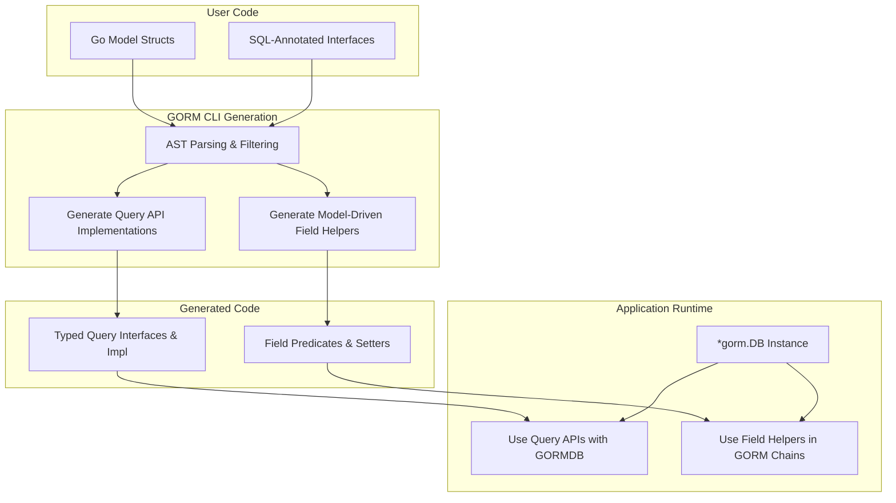

# Integration with GORM

This guide helps you understand how GORM CLI's generated APIs and model-driven field helpers integrate directly and seamlessly with the popular [gorm.io/gorm](https://gorm.io/) ORM library. It covers supported integration patterns, the mechanics of fluent API creation, and how the GORM CLI enhances the expressiveness and type safety of your standard GORM workflows.

---

## The Value of Integration

GORM CLI is designed as a natural extension of your existing GORM codebase. By generating type-safe query interfaces and field helpers from your Go models and annotated SQL interfaces, it allows you to write database queries and updates with:

- **Compile-time safety** eliminating common runtime errors
- **Fluent, discoverable APIs** that integrate naturally into GORM's existing `*gorm.DB` chain
- **Clear separation** between query logic (via interfaces) and data manipulation (via model-based helpers)

The generated APIs and helpers become idiomatic parts of your GORM application, improving developer confidence and productivity.

---

## How Generated APIs Work with GORM

### Query Interfaces as GORM Extensions

Your Go interfaces annotated with SQL templates produce concrete implementations with strongly typed methods. These generators produce methods accepting a standard GORM `*gorm.DB` instance, returning results or managing updates.

For example:

```go
query := generated.Query[models.User](db)
user, err := query.GetByID(ctx, 123)
```

Here, `generated.Query[models.User]` is a constructor wrapping `*gorm.DB` inside a type-safe query API for the `User` model. All generated methods accept a `context.Context` for cancellation and deadlines.

### Fluent Use Within GORM Chains

The generated query implementations embed GORM's `Interface` type, letting you chain additional conditions or clauses using standard GORM methods, seamlessly integrating generated functionality into your existing GORM workflows.

For example:

```go
users, err := generated.Query[models.User](db).Where(generated.User.Age.Gt(18)).Find(ctx)
```

Here you use both the generated query interface and field helpers together, leveraging GORM's powerful chaining.

---

## Model-Driven Field Helpers

GORM CLI generates field helper variables for every model, representing fields, relations, and columns with strongly typed predicates, setters, and association helpers.

### Field Helpers Overview

- Basic columns like `int`, `string`, `bool`, `time.Time` get predicate and update methods.
- Nullable fields get helpers corresponding to their SQL representations.
- Associations (has one, has many, belongs to, many2many) generate structs with operations to create, update, unlink, delete, and batch associate related entities.

Example of generated field helpers for a `User` model:

```go
var User = struct {
    ID        field.Number[uint]
    Name      field.String
    Age       field.Number[int]
    Role      field.String
    IsAdult   field.Bool
    Pets      field.Slice[models.Pet]
    Company   field.Struct[models.Company]
}{
    ID:   field.Number[uint]{}.WithColumn("id"),
    Name: field.String{}.WithColumn("name"),
    // ...
}
```

Use these helpers for safer queries and updates:

```go
// Query for users older than 18
db.Where(generated.User.Age.Gt(18)).Find(ctx)

// Update user's role
gorm.G[models.User](db).
  Where(generated.User.ID.Eq(1)).
  Set(generated.User.Role.Set("admin")).
  Update(ctx)
```

### Association Helpers

Associations like `Pets` and `Company` appear as typed helpers with methods such as:

- `Create()` and `CreateInBatch()` to create and link
- `Update()` to update related entries
- `Unlink()` to clear relationships
- `Delete()` to remove related rows

```go
gorm.G[models.User](db).
  Where(generated.User.ID.Eq(1)).
  Set(generated.User.Pets.Create(generated.Pet.Name.Set("fido"))).
  Update(ctx)
```

### Semantics in Action

- For a `belongs to` relation, `Unlink()` clears the foreign key
- For `has many` or `has one`, `Unlink()` nullifies child FKs
- For `many2many`, `Unlink()` deletes join rows only

---

## Fluent API Creation Mechanics

### Generated Constructors

The primary entry points are generated functions like `Query[T any](db *gorm.DB)`, created per interface with SQL templates.

They wrap GORM's generic API (`gorm.G[T](db)`) and expose additional typed operations defined in your interfaces.

### Context Auto-Injection

GORM CLI methods automatically include `context.Context` in their signatures, supporting cancellation and passing GORM's context through your queries and updates.

### Combining Predicates and Updates

Field helpers can be combined to build expressive queries and updates. For example:

```go
// Update user filtering by Role
err := gorm.G[models.User](db).
  Where(generated.User.Role.Eq("active")),
  Set(
    generated.User.IsAdult.Set(true),
    generated.User.Age.Incr(1),
  ).
  Update(ctx)
```

---

## Using GORM CLI in Practice

### Example Use Cases

See this example usage demonstrating queries and updates, leveraging generated code with GORM:

```go
query := generated.Query[models.User](db)

// Retrieve user by ID with additional hardcoded filters
user, err := query.GetByID(ctx, 123)

// Filter users by dynamic column
filteredUser, err := query.FilterWithColumn(ctx, "role", "special")

// Update user information safely
err = query.UpdateInfo(ctx, models.User{Name: "dan", Age: 40}, 123)
```

Full example test coverage is available in the project’s `examples/output/query_test.go` demonstrating robust real-world scenarios.

---

## How the GORM CLI CLI Enhances Expressiveness and Safety

### Integration with the GORM Generator

Generated helpers build on `gorm.G[T]` — GORM's own generic data access API — enabling zero-friction adoption using your existing database connections and transactions.

### Complementary Code Generation

- **Query APIs:** Typed interfaces with concrete implementations for SQL queries
- **Field helpers:** Model-driven helpers for precise filtering, updates, and association management

Their union reduces boilerplate, enforces correctness, and empowers custom SQL with strong guarantees.

---

## Best Practices and Tips

- Use generated query interfaces as the first-class approach to complex queries.
- Leverage field helpers within GORM method chains for filtering and updates.
- Use association helpers for safe, maintainable relational data manipulation.
- Define your SQL templates thoughtfully, embedding conditional logic to keep queries efficient.
- Rely on context propagation to enable observability and cancellation.
- Consult **Working With Basic Fields** and **Working With Associations** guides for deeper patterns and idiomatic examples.

---

## Troubleshooting Common Integration Issues

- **Generated types not recognized:** Verify your generated code output directory is correctly referenced.
- **Queries return unexpected results:** Check your SQL templates and parameter binding carefully.
- **Context mismatches:** Ensure you pass context from HTTP handlers or services into query/update methods.
- **Association operations fail silently:** Confirm that `Set` operations on associations are used correctly and the FK constraints are respected.

Refer to the [Validating Setup & Next Steps](getting-started/configuration-first-usage/validation-next-steps) guide for diagnosis steps.

---

## Summary

This page detailed how GORM CLI unlocks powerful, type-safe integration with GORM, transforming your Go models and SQL interfaces into a fluent, compile-time-safe data access layer. Mastering these integration patterns leads to safer, more maintainable, and expressive GORM applications.

---

## References & Next Steps

- [Using Generated APIs in Your Application](guides/core-workflows/using-generated-apis)
- [Working With Basic Fields](guides/best-practices-patterns/working-with-basic-fields)
- [Working With Associations](guides/best-practices-patterns/associations-and-relations)
- [Template-Based Queries](guides/best-practices-patterns/template-based-queries)
- [Validating Setup & Next Steps](getting-started/configuration-first-usage/validation-next-steps)

---

## Diagram: Integration Flow between GORM CLI Generated Code and GORM


