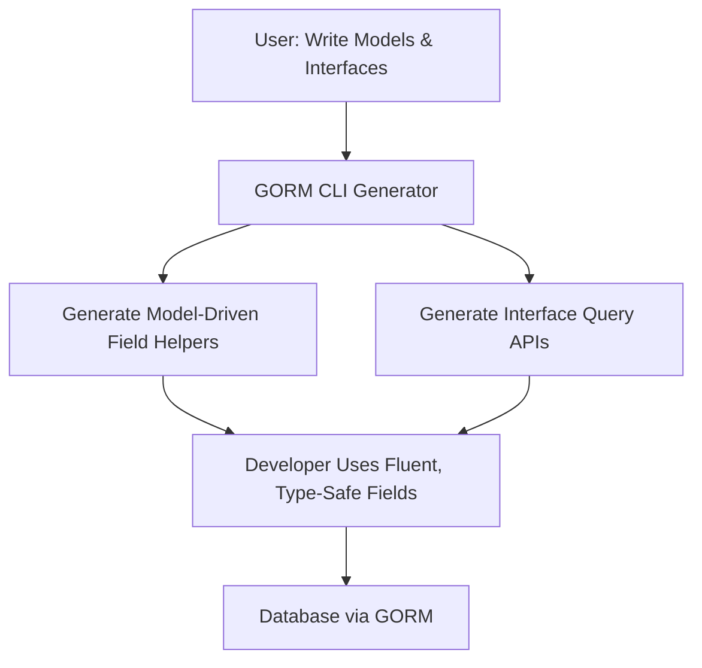

# Model-Driven Field Helpers & Interface Query APIs

Explore the foundational dual-generation approach that powers GORM CLI: model-driven field helpers and interface-based SQL template query APIs. This guide unpacks how each mechanism works, the mental models behind them, and how they combine to deliver compile-time safety, fluent, expressive APIs, and robust developer productivity.

---

## Introduction

GORM CLI generates two core types of code artifacts from your Go source:

- **Model-Driven Field Helpers:** Strongly-typed helpers generated directly from your Go model structs. These fields support building richly typed filters, updates, and association operations with idiomatic Go semantics.

- **Interface Query APIs:** From Go interfaces annotated with SQL templates, the generator produces concrete, type-safe query implementations that provide flexible yet safe SQL execution driven by declarative templates.

Together, these complementary outputs empower you to write safer, cleaner, and more maintainable database logic with compile-time validation and discoverable APIs.

---

## 1. Model-Driven Field Helpers: Fluent, Type-Safe Field APIs

### Core Concept

The model-driven field helper generation analyzes your Go struct definitions, producing strongly-typed field variables and helpers that reflect the field’s Go type, database column, and relationships.

This creates a fluent API for building query expressions, updates, and association operations tailored precisely to your domain models.

### How It Works

- Each basic field (e.g., int, string, bool, time.Time, sql.NullInt64) maps to a corresponding field helper type (e.g., `field.Number[int]`, `field.String`, `field.Bool`, `field.Time`).
- The generator also detects and maps named Go types or implements interfaces like Scanner/Valuer or GORM Serializer.
- Association fields (relationships like has one, has many, belongs to, many2many, polymorphic) generate `field.Struct[T]` or `field.Slice[T]` helpers that encapsulate the association semantics and enable operations like create, update, unlink, and delete.

### Example: Basic Field Helpers

```go
// Access generated field helpers on your model as variables
generated.User.ID.Eq(1)          // id = 1
generated.User.Name.Like("%jinzhu%")  // name LIKE '%jinzhu%'
generated.User.Score.IsNull()    // SQL IS NULL check

// Use in a query
gorm.G[User](db).
  Where(generated.User.Age.Gt(18)).
  Find(ctx)
```

### Example: Association Helpers

```go
// Create and link a new associated Pet when creating User
gorm.G[User](db).
  Set(
    generated.User.Name.Set("alice"),
    generated.User.Pets.Create(generated.Pet.Name.Set("fido")),
  ).
  Create(ctx)

// Update pets linked to a user with conditional filter
gorm.G[User](db).
  Where(generated.User.ID.Eq(1)).
  Set(
    generated.User.Pets.Where(generated.Pet.Name.Eq("fido")).Update(generated.Pet.Name.Set("rex")),
  ).
  Update(ctx)

// Unlink and delete semantics differ based on association type
generated.User.Pets.Unlink()  // Clears child foreign keys
generated.User.Pets.Delete()  // Deletes child rows
```

### Key User Value

- **Compile-time safety:** You cannot construct invalid or untyped queries across fields.
- **Expressiveness:** Availability of rich common predicates (`Eq`, `Like`, `Between`, `IsNull`) and update operations (`Set`, `Incr`, `SetExpr`).
- **Discoverability:** IDE autocomplete and Go type checking guide you.

### Best Practices

- Define your models with clear relationships; the generator captures these for comprehensive association helpers.
- Use the generated helpers to avoid stringly typed queries or error-prone manual SQL.
- Combine with custom field mappings and `gen:"json"` tags for specialized handling (e.g., JSON fields).

---

## 2. Interface Query APIs: Declarative, Template-Driven Query Methods

### Core Concept

You declare Go interfaces with generic type parameters and SQL template annotations in method comments. GORM CLI generates concrete implementations with type-safe query methods matching your SQL templates.

This empowers you to write flexible, template-driven queries and updates that are:

- Type-safe and checked at compile time
- Auto-bind parameters with seamless Go integration
- Support conditional clauses, dynamic columns, iteration, and update sets

### Example Interface

```go
type Query[T any] interface {
  // SELECT * FROM @@table WHERE id=@id
  GetByID(id int) (T, error)

  // SELECT * FROM @@table WHERE @@column=@value
  FilterWithColumn(column string, value string) (T, error)

  // UPDATE @@table
  // {{set}}
  //   {{if user.Name != ""}} name=@user.Name, {{end}}
  //   {{if user.Age > 0}} age=@user.Age, {{end}}
  // {{end}}
  // WHERE id=@id
  UpdateInfo(user User, id int) error
}
```

### Automated Generation

Running `gorm gen -i ./path/to/interfaces` generates concrete query types with methods like:

```go
generated.Query[User](db).GetByID(ctx, 123)
generated.Query[User](db).UpdateInfo(ctx, user, 123)
```

These methods construct parameterized, safe SQL queries per your templates.

### Template DSL Overview

GORM CLI supports directives and expressions inside method comments to control SQL generation:

| Directive | Description | Example |
| --------- | ----------- | ------- |
| `@@table` | Model table name | `SELECT * FROM @@table WHERE id=@id` |
| `@@column`| Dynamic column | `@@column=@value` |
| `@param`  | Bind Go method param | `WHERE name=@name` |
| `{{where}}`| Conditional WHERE block | `{{where}} age > 18 {{end}}` |
| `{{set}}` | Conditional SET block in UPDATE | `{{set}} name=@name {{end}}` |
| `{{if}}`  | Conditionals | `{{if age>0}} ... {{end}}` |
| `{{for}}` | Iteration over slices | `{{for _, t := range tags}} ... {{end}}` |

### Value to Users

- Write declarative, readable SQL directly in Go interfaces.
- Achieve compile-time validation combined with templated flexibility.
- Avoid writing manual query implementation boilerplate.

### Tips

- Use context parameter implicitly added if omitted for better integration.
- Map columns dynamically for reusable queries.
- Use conditional blocks for optional filtering based on input.

---

## 3. How the Two Modes Interact

Though conceptually distinct, the model-driven field helpers and the interface query API complement one another:

- Field helpers provide a fluent, type-safe API to build filters and updates programmatically.
- Interface query APIs give precise control with templated SQL for queries or updates that may be cumbersome to model via fluent field APIs.

Use field helpers when:

- You want to construct queries or updates dynamically in Go code.
- You need association operations with safety and clarity.

Use interface query APIs when:

- Your logic requires complex SQL that benefits from explicit templates.
- You want pre-defined query methods combining SQL and Go parameters.

Together, they cover a broad spectrum of data access patterns with robust compile-time assurances.

---

## 4. Workflow Recap

1. **Write Your Models:** Define Go structs with GORM annotations describing fields and relationships.
2. **Define Interfaces with SQL:** Write generic Go interfaces with method SQL templates in comments.
3. **Optional Configuration:** Configure generation with `genconfig.Config` to customize output paths, field mappings, inclusion/exclusion filters.
4. **Run Code Generator:** Use `gorm gen -i` specifying input to generate both field helpers and query APIs.
5. **Use Generated Code:** Import and consume generated APIs in your app for queries, updates, and association operations.

---

## 5. Common Pitfalls & Troubleshooting

<AccordionGroup title="Common Issues and Solutions">
<Accordion title="Missing Context in Interface Methods">
If your interface methods do not explicitly include `ctx context.Context`, the generator adds it automatically. Avoid errors by acknowledging this injection when calling methods.
</Accordion>
<Accordion title="Field Mapping Doesn’t Match Custom Types">
Use `genconfig.Config` with `FieldTypeMap` and `FieldNameMap` to map custom Go types or struct tags (e.g., `json`) to your own field helpers.
</Accordion>
<Accordion title="Association Operations Fail or Are Missing">
Ensure your model associations are correctly declared with GORM tags (`has many`, `belongs to`) for the generator to produce full helpers.
</Accordion>
<Accordion title="Generated Code Not Found at Runtime">
Verify output directory and import paths match your project structure. Use `OutPath` in `genconfig.Config` if needed to organize generated files.
</Accordion>
<Accordion title="SQL Template Parsing Errors">
Check syntax carefully in interface method comments, especially for correct directive matching and parameter binding syntax.
</Accordion>
</AccordionGroup>

---

## 6. Visualizing the Generation Flow



---

## 7. Next Steps

To deepen mastery:

- Explore [Generating Model-Driven Field Helpers](../guides/core-workflows/generate-field-helpers) to understand model struct analysis.
- Learn [Generating Type-Safe Query APIs](../guides/core-workflows/generate-type-safe-queries) for advanced templated SQL.
- Customize generation with [genconfig.Config](../guides/advanced-usage-patterns/customizing-generation).
- Review association helpers in [Working with Associations](../concepts/core-data-models-features/association-helpers).

Harness these layered features to maximize type safety, expressiveness, and maintainability in your GORM applications.

---

# Summary

This documentation provides an in-depth look at GORM CLI’s dual generation modes: model-driven field helpers for strong typing and fluent field operations, plus interface-driven SQL template query APIs that produce concrete, type-safe method implementations. Users learn how to map their models and interfaces to generated code that enhances developer productivity and reliability.

---

# References & Further Reading

- [Type-Safe Query API Generation Guide](../guides/core-workflows/generate-type-safe-queries)
- [Model-Driven Field Helpers Guide](../guides/core-workflows/generate-field-helpers)
- [SQL Template DSL Concepts](../concepts/core-data-models-features/template-dsl)
- [Configuring Code Generation](../guides/advanced-usage-patterns/customizing-generation)
- [Working with Associations](../concepts/core-data-models-features/association-helpers)
- [Quickstart Workflow](../overview/features-workflows/quickstart-workflow)
- [Validating Generated Code](../getting-started/first-use-validation/validate-generated-code)
