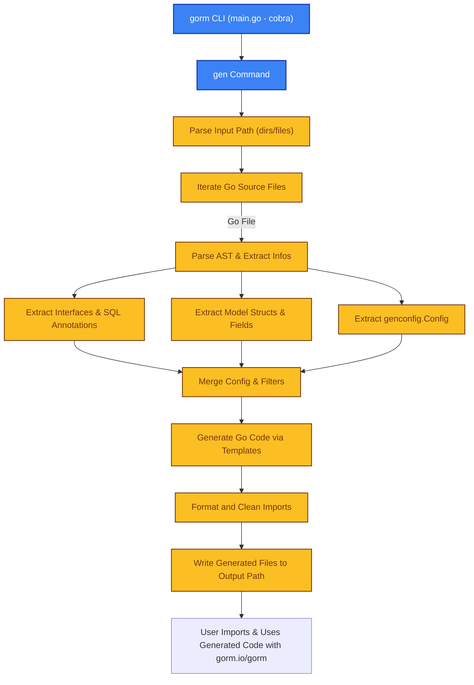

# System Architecture

Explore the fundamental structure that powers GORM CLI, focusing on how the tool orchestrates code generation from your Go interfaces and model structs, its command-line entry points, and integration points within the GORM ecosystem. This documentation guides you through the stages in the generation pipeline, the relationship between components, and the boundaries of the CLI workflow.

---

## Introduction

GORM CLI automates the generation of type-safe, fluent query APIs and model-driven field helpers for Go projects utilizing GORM. The core strength of the CLI lies in translating annotated Go interfaces (with embedded SQL templates) and model structs into strongly-typed, ergonomic Go code that integrates seamlessly with `gorm.io/gorm`.

This page focuses on the overall architecture and command-line structure that makes this possible, helping you understand the steps from your input source files to the generated output and how the tool fits in your development workflow.

---

## High-Level Architecture Overview

The GORM CLI architecture is composed of several key elements working in harmony:

- **Command-Line Entry Point**
- **Source Code Parsing & AST Analysis**
- **Extraction of Interfaces, Methods, and Models**
- **SQL Template Processing**
- **Code Generation via Templating**
- **Output File Management & Formatting**

<br />

### Command-Line Entry Point

The CLI is started by the `main` executable, which uses the `cobra` library for structured command parsing. The primary command of interest is `gen`, which triggers the code generation process.

```go
package main

func main() {
  rootCmd := &cobra.Command{
    Use: "gorm",
    Short: "GORM CLI Tool",
  }
  rootCmd.AddCommand(gen.New())
  _ = rootCmd.Execute()
}
```

The `gen` command accepts flags for specifying input files (interfaces and models) and output directories where the generated code should be placed.

---

### Source Code Parsing & Abstract Syntax Tree (AST) Walk

At its core, the CLI uses Go's `go/ast` and `go/parser` packages to parse your Go source files. It walks through all files in the specified input path, selectively processing:

- Go interfaces with SQL annotations in method comments.
- Model structs with exported fields to generate field helpers.
- Package-level generation configuration values (`genconfig.Config`).

During this stage, the parser builds a detailed representation of interfaces, methods, and struct fields, including types, documentation comments, and SQL templates.

### Interface and Method Extraction

Each Go interface is inspected to identify methods that have SQL template annotations. The tool validates method signatures for correctness (return types, presence of `error`, and context parameters) and extracts:

- Method names
- Parameters
- Return values
- SQL templates or raw SQL snippets embedded in comments

### Model and Field Extraction

For each struct, fields are analyzed to create model-driven field helpers. Named Go types and tag annotations (`gen` tags) influence the generation of specialized helpers (e.g., `JSON`, `Time` helpers).

The system also supports anonymous field embedding, flattening such embedded fields into the parent struct to preserve the field helper structure.

---

## Code Generation Pipeline

After analysis, the core generation process unfolds in these distinct phases:

1. **Configuration Merging and Filtering:**
   The tool extracts any generation configuration provided in the source code, such as output paths, inclusion/exclusion rules, and custom type mappings. These configurations can apply globally (per package) or per file.

2. **Template Execution:**
   The generator applies a text/template-driven code generation step, populating:

   - Interface implementations with type-safe method bodies
   - Strongly typed field helper constants
   
3. **Imports and Package Management:**
   Import paths required by the generated code are carefully collected and merged to avoid redundancies.

4. **Output Writing and Code Formatting:**
   Generated files are written to the configured output path, preserving directory structure relative to inputs. The Go code is formatted using `golang.org/x/tools/imports` to ensure idiomatic style, import cleanup, and correctness.

### Typical Output Contents

- Concrete implementations of your query interfaces with embedded SQL execution logic
- Field helper structures and constants per model type

---

## Integration Boundaries and Ecosystem Interaction

GORM CLI operates in a clearly defined space to give you maximum control and integration comfort:

- **Input:** Your existing Go interfaces describing query methods and your model structs
- **Output:** Type-safe Go code that integrates with `gorm.io/gorm` to allow fluent, compile-time checked queries and updates
- **Seamless Usage:** The generated code fits directly into your Go projects with no extra runtime dependencies other than GORM itself

Because GORM CLI works entirely at code generation time without runtime reflection or magic, you get the dual benefit of powerful abstractions plus straightforward debugging and code understanding.

---

## Visualization of the Architecture



---

## Practical User Flow

1. **Define your Go interfaces with SQL templates** inside method comments, describing your queries and updates.
2. **Define your model structs** with exported fields and optional generation annotations.
3. **Run the CLI `gorm gen` command**, specifying input directory and output path.
4. **Generated code appears** in your output folder, offering:
   - Type-safe query API implementations
   - Model-driven field helpers for filters, setters, and association management
5. **Use the generated code directly** in your application to build confident, maintainable database operations with GORM.

---

## Troubleshooting & Best Practices

- Ensure your Go source files compile and are free of errors before generation.
- Include `genconfig.Config` where you need custom output paths, filtering, or type mappings.
- Validate method signatures in your interfaces, especially return types including error.
- Use a consistent package structure to avoid complex imports in the generated code.
- Check CLI output messages for skipped files, filtering information, and code generation success.

---

## Additional Resources

For deeper understanding and next steps, consult these relevant guides:

- [Core Concepts & Terminology](../core-concepts-and-terminology) — Understand foundational ideas behind model-driven and interface-driven generation
- [From Definitions to Generated Code: Developer Workflow](../../features-and-workflow-overview/from-definition-to-codegen) — Detail on the end-to-end developer experience
- [Integration with GORM and Go Projects](../integration-with-gorm-and-go) — See how generated code fits your Go projects seamlessly
- [Quick Feature Overview](../../features-and-workflow-overview/quick-feature-overview) — Summary of CLI key capabilities and benefits

---

By mastering the system architecture and workflow outlined here, you will confidently wield the GORM CLI for robust, maintainable, and type-safe data access in your Go applications.

---

## Source and References

The architectural concepts have been distilled from inspecting the GORM CLI source files, including:

- `main.go` for CLI entry
- `internal/gen/gen.go` for the `gen` command implementation
- `internal/gen/generator.go` for parsing and code generation logic
- `internal/gen/template.go` for the generation templating system

Explore the project repository at [https://github.com/go-gorm/cli](https://github.com/go-gorm/cli) for hands-on code inspection and contribution.

---
